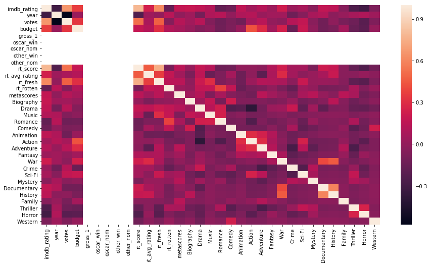
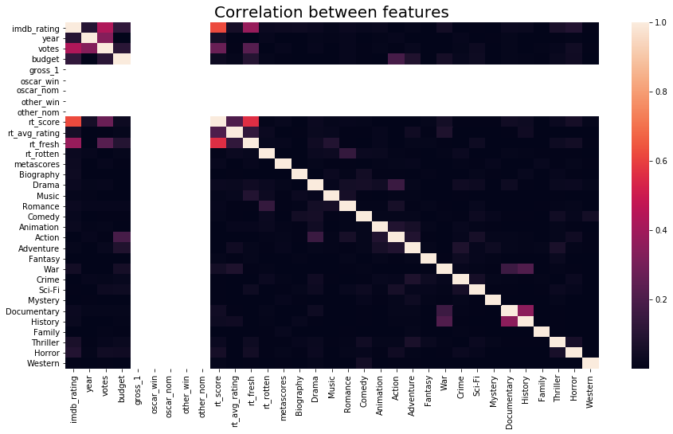
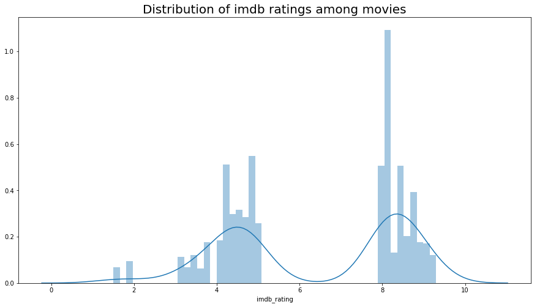
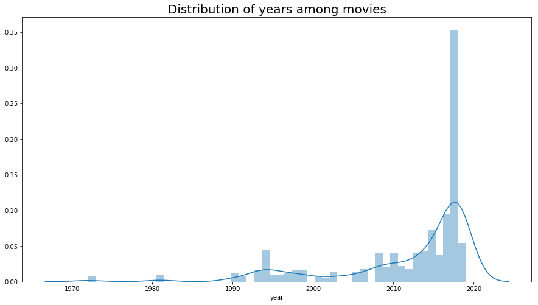
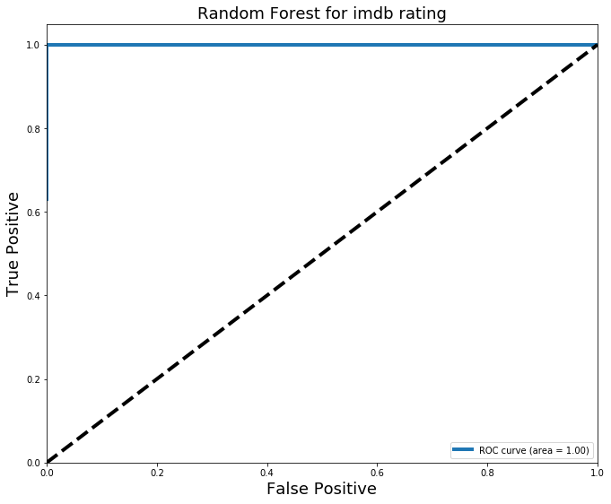
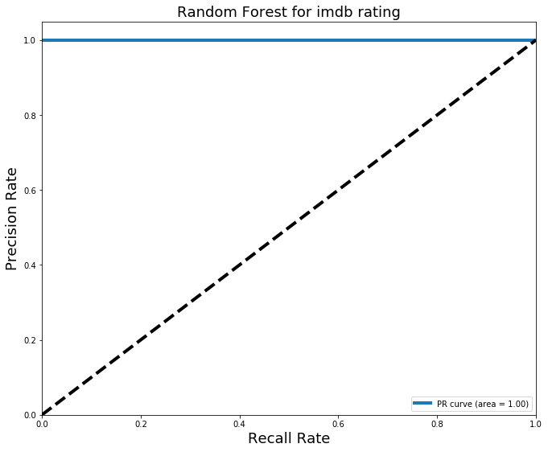

<a name="introduction"></a>

In this project, I am going to start learning how to do web scraping. I am planning to web scrape iMDB and Rotten Tomato to get info about each movie.  My aim is to collect as much data as possible. This will be a continuous project with the implementation of machine learning and NLP. We will start with machine learning section and try to predict the movie score based on all the info we collect from those two websites. Let's get started. 

# Objectives
- [Introduction](#introduction)
- [Import necessary modules](#modules)
- [Imdb_webscraping_part#1](#imdb1)
- [Imdb_webscraping_part#2](#imdb2)
- [Rotten tomato webscraping](#Rotten tomato webscraping)
- [Cleaning All datasets(This is the starting point of this project after collecting all the data)](#cleaning_data_sets)
- [Visualization](#visualization)
- [Feature Engineering](#feature_engineering)
- [Train-test split](#train_test_split)
- [Creating models](#creating_models)
- [Result metrics](#result_metrics)
- [Feature Importance](#feature_importance)
- [ROC/AUC curve](#roc_auc_curve)
- [Wrapping Up](#wrapping_up)
- [Next](#next)

#### Importing all the necessary modules
<a name="#modules"></a>


We are start out by importing a bunch of libraries that will help us with the task.  


```python
## Importing necessary modules
import pandas as pd
import requests ## requests is used to do web scraping. 
import numpy as np ## Helps to do most of the linear algebra work. 
import time ## Time the code. 
import re ## Regular Expression. 
import csv ## Working with CSV. 
from bs4 import BeautifulSoup ## Library that printed html object nicely. 
pd.set_option('display.max_columns', 500) ## to see all the columns,
pd.set_option('display.max_rows', 500) ## To see all the rows. 
```

#### Imdb webscraping part #1
<a name="imdb1"></a>


```python
%%time
## Creating some empty list that will be used to collect info. 
title_id = []
title = []
runtime =[]
genre = []
certificate = []
imdb_rating = []
gross = []
year = []
votes = []
director_actor=[]
metascore=[]
## Looping through each page of the IMDB website which consists of 50
##movies in each page, picking movies only with more than 1000 votes 
#and a rating higher than 9 and lower than 5


## Whenever we use "nested for loops" it exponentially increase our executing time. 
## I wrote these codes when I started out learning python and it was an amazing time. 
## Hopefully I have come a long way from then, but these codes haven't. However, these codes 
## gets the needed job done, with the expense of resources and time. I am hoping to relapce these codes 
## very soon. Until then. Enjoy!! 


## a is doing 30 iterations to get 1500 movies
for a in range(30): 
    ## b is doing 2 iterations to switch r value
    for b in range(2): 
        
        # r with rating above 8
        r = requests.get("http://www.imdb.com/search/title?num_votes=1000,&title_type=feature,tv_movie,documentary,\
                          short&user_rating=8.0,&page="+str(a)+"&ref_=adv_nxt")
       
        ## altering the value of r, in order to scrape movies with rating lower than 5.
        if b == 1:
         
            # r with rating below 5
            r = requests.get("http://www.imdb.com/search/title?num_votes=1000,&title_type=feature,tv_movie,documentary,\
                              short&user_rating=,5.0&page="+str(a)+"&ref_=adv_nxt")
       
        ## use BeautifulSoup based on either r
        soup = BeautifulSoup(r.content, "lxml")
        
        for i in soup.findAll(class_='lister-item-content'):
            
            # Getting title_id
            title_id.append(re.findall(r'tt.+\d', str(i.find("a"))))
            
            # Getting title
            title.append(i.find('a').text.strip())
            
            # Gerring genre
            try:
                genre.append(i.find('span', class_ = "genre").text.strip())
            except:
                genre.append(None)
            
            # Getting runtime
            try:
                # runtime.append(re.findall(r'\d+', i.find('span', class_ = "runtime").text)[0])
                runtime.append(re.findall(r'\d+', i.find('span', class_ = "runtime").text))
            except:
                runtime.append(None)
            
            # Getting certificate    
            try:
                certificate.append(i.find("span", class_ ="certificate").text)
            except:
                certificate.append(None)
            
            # Getting imdb_rating
            imdb_rating.append(float(i.find("strong").text))
            
            # Getting year
            year.append(i.find("span", class_="lister-item-year text-muted unbold").text)
            
            # Getting votes
            votes.append((i.find("span", attrs={"name":"nv"}).text).replace(",",""))
            
            # Getting gross
            try:
                #gross.append(i.find("span", attrs={"name":"nv"}).find_next_sibling("span", attrs={"name":"nv"}).get_text())
                gross.append(re.findall(r'\d.+\d', i.find("span", attrs={"name":"nv"}).find_next_sibling("span", \
                attrs={"name":"nv"}).get_text()))
            except:
                gross.append(None)
            
            ## Getting director and actors
            try:
                director_actor.append(i.find("p", class_="text-muted").find_next_sibling("p", class_="").text.strip())
            except:
                director.append(None)
            
            ## Getting metascore
            try:
                metascore.append(int(i.find("span",  class_="metascore favorable").text.strip()))
            except:
                metascore.append(None)
```

    CPU times: user 14.6 s, sys: 154 ms, total: 14.7 s
    Wall time: 1min 7s


```python
%%time
## checking the length of each features
print (len(title_id))
print (len(title))
print (len(runtime))
print (len(genre))
print (len(certificate))
print (len(imdb_rating))
print (len(gross))  ## there seems to be a problem with the gross, will look into that. 
print (len(year))
print (len(votes))
print (len(director_actor))
print (len(metascore))
```

    3000
    3000
    3000
    3000
    3000
    3000
    3000
    3000
    3000
    3000
    3000
    CPU times: user 196 µs, sys: 105 µs, total: 301 µs
    Wall time: 213 µs


```python
## Fix title_id since its picking up some extra characters we do not want. 
a = []
for i in title_id:
    for j in i:
        a.append(j.split("/")[0])
title_id = a
```


```python
data_list = [title_id, title, runtime, genre, certificate, imdb_rating, gross, year, votes, director_actor, metascore]
```


```python
df = pd.DataFrame(data_list)
```


```python
df = df.T
```


```python
header =["title_id", "title", "runtime", "genre", "certificate", "imdb_rating", "gross", "year", "votes", "director_actor", "metascore"] 
```


```python
df.columns = header
```


```python
df.head()
```


<div>
<style scoped>
    .dataframe tbody tr th:only-of-type {
        vertical-align: middle;
    }

    .dataframe tbody tr th {
        vertical-align: top;
    }

    .dataframe thead th {
        text-align: right;
    }
</style>
<table border="1" class="dataframe">
  <thead>
    <tr style="text-align: right;">
      <th></th>
      <th>title_id</th>
      <th>title</th>
      <th>runtime</th>
      <th>genre</th>
      <th>certificate</th>
      <th>imdb_rating</th>
      <th>gross</th>
      <th>year</th>
      <th>votes</th>
      <th>director_actor</th>
      <th>metascore</th>
    </tr>
  </thead>
  <tbody>
    <tr>
      <th>0</th>
      <td>tt1727824</td>
      <td>Bohemian Rhapsody</td>
      <td>[134]</td>
      <td>Biography, Drama, Music</td>
      <td>PG-13</td>
      <td>8.2</td>
      <td>[206.74]</td>
      <td>(2018)</td>
      <td>220348</td>
      <td>Director:\nBryan Singer\n| \n    Stars:\nRami ...</td>
      <td>None</td>
    </tr>
    <tr>
      <th>1</th>
      <td>tt6155172</td>
      <td>Roma</td>
      <td>[135]</td>
      <td>Drama</td>
      <td>R</td>
      <td>8</td>
      <td>None</td>
      <td>(2018)</td>
      <td>64331</td>
      <td>Director:\nAlfonso Cuarón\n| \n    Stars:\nYal...</td>
      <td>96</td>
    </tr>
    <tr>
      <th>2</th>
      <td>tt1517451</td>
      <td>A Star Is Born</td>
      <td>[136]</td>
      <td>Drama, Music, Romance</td>
      <td>R</td>
      <td>8</td>
      <td>[206.91]</td>
      <td>(2018)</td>
      <td>161418</td>
      <td>Director:\nBradley Cooper\n| \n    Stars:\nLad...</td>
      <td>88</td>
    </tr>
    <tr>
      <th>3</th>
      <td>tt6966692</td>
      <td>Green Book</td>
      <td>[130]</td>
      <td>Biography, Comedy, Drama</td>
      <td>PG-13</td>
      <td>8.3</td>
      <td>[51.50]</td>
      <td>(2018)</td>
      <td>41587</td>
      <td>Director:\nPeter Farrelly\n| \n    Stars:\nVig...</td>
      <td>70</td>
    </tr>
    <tr>
      <th>4</th>
      <td>tt4633694</td>
      <td>Spider-Man: Into the Spider-Verse</td>
      <td>[117]</td>
      <td>Animation, Action, Adventure</td>
      <td>PG</td>
      <td>8.7</td>
      <td>[170.88]</td>
      <td>(2018)</td>
      <td>89749</td>
      <td>Directors:\nBob Persichetti, \nPeter Ramsey, \...</td>
      <td>87</td>
    </tr>
  </tbody>
</table>
</div>


```python
## The code above ran in AWS and once the web scrapig was completed, the data was stored as a csv file in EC2. 
df.to_csv('imdb_1.csv', encoding="utf-8")
```

<a name="imdb2"></a>
#### Imdb webscarping part #2


```python
%%time

import sys
sys.stdout = open('/dev/stdout', 'w') ## this is just for me to print out "w" in the termin and make sure that My code is working

user_review =[]
critic_review = []
writer = []
language = []
country = []
budget = []
gross_1 = []
opening_week=[]
oscar_win = []
oscar_nom = []
other_win = []
other_nom = []
count = 0
for i in title_id:
    
    sys.stdout.write(i + '\n')## this is just for me to print out "w" in the termin and make sure that My code is working
    
    r = requests.get("http://www.imdb.com/title/"+str(i)+"/?ref_=nv_sr_1")
    soup = BeautifulSoup(r.content, "lxml")
    
    # Getting User_review_no
    try:
        user_review.append(re.findall(r'.+\d', soup.find('span', attrs={'itemprop':"reviewCount"}).text))
    except:
        user_review.append(None)
    # Getting Critic_no
    try:
        critic_review.append(re.findall(r'.+\d',soup.find('span', attrs={'itemprop':"reviewCount"}).find_next_sibling().text))
    except:
        critic_review.append(None)
        
    """try:
        won.append(soup.find("span", itemprop="awards").text.strip())
    except:
        won.append(None)"""
    # Getting Writer
    try:
        writer.append(soup.find('span', attrs={'itemprop':"creator"}).text)
    except:
        writer.append(None)
    """for i in soup.find_all('h4',class_ = "inline"):
        if i.text.strip() == "Writers:" or i.text.strip() =="Writer":
            writer.append(i.find_next().text.strip())"""
    
    # Getting Language
    a = 0
    try:
        for i in soup.find_all("h4", class_ = 'inline'):
            if i.text.strip() == "Language:":
                a = i.find_next().text
                #language.append(i.find_next().text)
    except:
        a = None
    language.append(a)
        
    # Getting Country
    a = 0
    try:
        for i in soup.find_all('h4',class_ = "inline"):
            if i.text.strip() == "Country:":
                a = i.find_next().text.strip()
                #country.append(i.find_next().text.strip())
    except:
        a = None
    country.append(a)
            
    # Getting Budget
    a = 0
    try:
        for i in soup.find_all("h4", class_ = "inline"):
            if i.text.strip() == "Budget:":
                a = (i.next_sibling.strip()).replace(",","")
               # budget.append((i.next_sibling.strip()).replace(",",""))
    except:
        a = None
    budget.append(a)
            
    # Getting Gross
    a = 0
    try:
        for i in soup.find_all("h4", class_ = "inline"):
            if i.text.strip() == "Gross:":    
                a = (i.next_sibling.strip()).replace(",","")
                #gross_1.append((i.next_sibling.strip()).replace(",",""))
    except:
        a = None
    gross_1.append(a)
        
    # Getting Opening Weekend
    a = 0
    try:
        for i in soup.find_all("h4", class_ = "inline"):
            if i.text.strip() == "Opening Weekend:":
                a = (i.next_sibling.strip()).replace(",","")
                #opening_week.append((i.next_sibling.strip()).replace(",",""))
    except:
        a = None
    opening_week.append(a)
    
    
    # Getting Oscar, Oscar_nomination, Other_awards, Other_nomminations
    # getting oscar
    while soup.find_all("span", attrs={"itemprop":"awards"}):
        for i in soup.find_all("span", attrs={"itemprop":"awards"}):
            if "Won" in i.text and ("Oscar." in i.text or "Oscars." in i.text):
                oscar_win.append(re.findall(r'\d+', i.text.strip("")))
                break
            else:
                oscar_win.append(None)
                break
        break
    else:
        oscar_win.append(None)
        
    # find nominations for oscar
    while soup.find_all("span", attrs={"itemprop":"awards"}):
        for i in soup.find_all("span", attrs={"itemprop":"awards"}):
            if "Nominated" in i.text and ("Oscar." in i.text or "Oscars." in i.text):
                oscar_nom.append(re.findall(r'\d+', i.text.strip("")))
                break
            else:
                oscar_nom.append(None)
                break
        break
    else:
        oscar_nom.append(None)
    
    # Getting other wins
    try:
        for i in soup.find_all("span", attrs={"itemprop":"awards"}):
            #print i.text
            if ("wins" in i.text or "win" in i.text) and ("nominations" in i.text or "nomination." in i.text):
                a = re.findall(r'\d+', i.text.strip(""))[0]
            elif ("wins" in i.text or "win" in i.text) and ("nominations" not in i.text or "nomination." not in i.text):
                a = re.findall(r'\d+', i.text.strip(""))[0]
            elif ("wins" not in i.text or "win" not in i.text) and ("nominations" in i.text or "nomination." in i.text):
                a = None
    except:
        a = None
    other_win.append(a)
        
        
    # Getting other nominations
    try:
        for i in soup.find_all("span", attrs={"itemprop":"awards"}):
            #print i.text
            if ("wins" in i.text or "win" in i.text) and ("nominations" in i.text or "nomination." in i.text):
                #other_nom.append(re.findall(r'\d+', i.text.strip(""))[1])
                a = re.findall(r'\d+', i.text.strip(""))[1]
            elif ("wins" in i.text or "win" in i.text) and ("nominations" not in i.text or "nomination." not in i.text):
                a = None
            elif ("wins" not in i.text or "win" not in i.text) and ("nominations" in i.text or "nomination." in i.text):
                a = re.findall(r'\d+', i.text.strip(""))[0]
    except:
        a = None
    other_nom.append(a)
    count += 1
    

```


```python
# checking the length of each features

print (len(user_review))
print (len(critic_review))
print (len(writer))
print (len(language))
print (len(country))
print (len(budget))
print (len(gross_1))
print (len(opening_week))
print (len(oscar_win))
print (len(oscar_nom))
print (len(other_win))
print (len(other_nom))


```


```python
## creating a second list with all the scraped features
data_list_2 = [user_review, critic_review, writer, language, country, budget, gross_1, opening_week, oscar_win, oscar_nom, other_win, other_nom]
```


```python

df2 = pd.DataFrame(data_list_2)
```


```python
df2 = df2.T
```


```python

header2 = ["user_review", "critic_review", "writer", "language", "country", "budget", "gross_1", "opening_week", "oscar_win", "oscar_nom", "other_win", "other_nom"]
```


```python
df2.columns = header2
```


```python
## The code above ran in AWS and once the scrapig was completed, the scraped data stored as a csv file in EC2. 
df2.to_csv('imdb_2.csv', encoding="utf-8")
```


```python
df2.shape
```


    (3000, 12)


```python
## Getting all the titles in order to run through rotten tomato. 
df2["title"] = title
```


```python
title = df2["title"]
```


```python
df2.head()
```


<div>
<style scoped>
    .dataframe tbody tr th:only-of-type {
        vertical-align: middle;
    }

    .dataframe tbody tr th {
        vertical-align: top;
    }

    .dataframe thead th {
        text-align: right;
    }
</style>
<table border="1" class="dataframe">
  <thead>
    <tr style="text-align: right;">
      <th></th>
      <th>user_review</th>
      <th>critic_review</th>
      <th>writer</th>
      <th>language</th>
      <th>country</th>
      <th>budget</th>
      <th>gross_1</th>
      <th>opening_week</th>
      <th>oscar_win</th>
      <th>oscar_nom</th>
      <th>other_win</th>
      <th>other_nom</th>
      <th>title</th>
    </tr>
  </thead>
  <tbody>
    <tr>
      <th>0</th>
      <td>[2,392]</td>
      <td>[378]</td>
      <td>None</td>
      <td>English</td>
      <td>UK</td>
      <td>$52000000</td>
      <td>0</td>
      <td>0</td>
      <td>None</td>
      <td>None</td>
      <td>0</td>
      <td>0</td>
      <td>Bohemian Rhapsody</td>
    </tr>
    <tr>
      <th>1</th>
      <td>[624]</td>
      <td>[311]</td>
      <td>None</td>
      <td>Spanish</td>
      <td>Mexico</td>
      <td>0</td>
      <td>0</td>
      <td>0</td>
      <td>None</td>
      <td>None</td>
      <td>0</td>
      <td>0</td>
      <td>Roma</td>
    </tr>
    <tr>
      <th>2</th>
      <td>[1,893]</td>
      <td>[395]</td>
      <td>None</td>
      <td>English</td>
      <td>USA</td>
      <td>$36000000</td>
      <td>0</td>
      <td>0</td>
      <td>None</td>
      <td>None</td>
      <td>0</td>
      <td>0</td>
      <td>A Star Is Born</td>
    </tr>
    <tr>
      <th>3</th>
      <td>[418]</td>
      <td>[250]</td>
      <td>None</td>
      <td>English</td>
      <td>USA</td>
      <td>$23000000</td>
      <td>0</td>
      <td>0</td>
      <td>None</td>
      <td>None</td>
      <td>0</td>
      <td>0</td>
      <td>Green Book</td>
    </tr>
    <tr>
      <th>4</th>
      <td>[892]</td>
      <td>[323]</td>
      <td>None</td>
      <td>English</td>
      <td>USA</td>
      <td>$90000000</td>
      <td>0</td>
      <td>0</td>
      <td>None</td>
      <td>None</td>
      <td>0</td>
      <td>0</td>
      <td>Spider-Man: Into the Spider-Verse</td>
    </tr>
  </tbody>
</table>
</div>


```python
## making necessary changes in order to fit the rotten tomato urls. 
title = title.apply(lambda x:x.replace(" ", "_"))
title = title.apply(lambda x:x.replace(".", ""))
title = title.apply(lambda x:x.replace(":", ""))
title = title.apply(lambda x:x.replace("-", ""))
title = title.apply(lambda x:x.replace(",", ""))
title = title.apply(lambda x:x.replace("'", ""))
title = title.apply(lambda x:x.replace("__", "_"))

## changes that name of the spoted movies to fit the url. 
title = title.apply(lambda x:x.replace("Logan", "logan_2017"))
title = title.apply(lambda x:x.replace("Lion", "lion_2016"))
title = title.apply(lambda x:x.replace("Bahubali_The_Beginning", "Baahubali_The_Beginning"))
title = title.apply(lambda x:x.replace("Star_Wars_Episode_V__The_Empire_Strikes_Back", "empire_strikes_back"))
title = title.apply(lambda x:x.replace("Kavkazskaya_plennitsa_ili_Novye_priklyucheniya_Shurika", "kavkazskaya_plennitsa_ili_novye_priklyucheniya_shurika_kidnapping_caucassian_style"))
title = title.apply(lambda x:x.replace("Star_Wars_Episode_IV_A_New_Hope", "star_wars"))
title = title.apply(lambda x:x.replace("Tom_Petty_and_the_Heartbreakers_Runnin_Down_a_Dream", "runnin_down_a_dream_tom_petty_and_the_heartbreakers"))
title = title.apply(lambda x:x.replace("The_Incredibly_Strange_Creatures_Who_Stopped_Living_and_Became_MixedUp_Zombies!!?", "the_incredibly_strange_creatures"))
```

#### Rotten_tomato webscraping
<a name="Rotten tomato webscraping"></a>


```python
%%time

import sys
sys.stdout = open('/dev/stdout', 'w')

rt_score = []
rt_avg_rating = []
rt_audience_score = []
rt_user_rating = []
rt_avg_aud_rating = []
rt_fresh = []
rt_rotten = []

for i in title:
    
    sys.stdout.write(i + '\n')
    
    r = requests.get("https://www.rottentomatoes.com/m/"+str(i))
    soup = BeautifulSoup(r.content, "lxml")
    
    # Getting tomato meter score.
    a = 0
    for i in soup.find_all("h3", class_ ="scoreTitle superPageFontColor"):
        if i.text.strip() == "TOMATOMETER":
            try:
                a = i.find_next("span", class_="meter-value superPageFontColor").text
            except:
                a = None
    rt_score.append(a)
    
    # Getting average_rating from tomatometer 
    a = 0
    for i in soup.find_all("div", attrs= {"id":"all-critics-numbers"}):
        try:
            a = re.findall(r'./.\d', i.text.strip())[0]
        except:
            a = None
    rt_avg_rating.append(a)
    
    # Getting audience score meter score.
    a = 0
    for i in soup.find_all("h3", class_ ="scoreTitle superPageFontColor"):
        if i.text.strip() == "AUDIENCE SCORE":
            try:
                a = i.find_next("span" ,class_ ="superPageFontColor").text
            except:
                a = None
    rt_audience_score.append(a)
    
    # Getting user rating from Rotten Tomato
    a = 0
    for i in soup.find_all("span" ,class_ ="subtle superPageFontColor"):
        if i.text == "User Ratings:":
            try:
                a = i.next_sibling.strip()
            except:
                a = None
    rt_user_rating.append(a)
    
    # Getting Average rating from Rotten Tomato(Audience score)
    a = 0
    for i in soup.find_all("span" ,class_ ="subtle superPageFontColor"):
        if i.text == "Average Rating:":
            try:
                a = i.next_sibling.strip()
            except:
                a = None
    rt_avg_aud_rating.append(a)
    
    # finding fresh for all critic
    a = 0
    for i in soup.find_all("span" ,class_ ="subtle superPageFontColor audience-info"):
        if i.text.strip() == "Fresh:":
            a = int(i.find_next().text)
            break
    rt_fresh.append(a)
    
    # finding rotten for all critic
    a = 0
    for i in soup.find_all("span" ,class_ ="subtle superPageFontColor audience-info"):
        if i.text.strip() == "Rotten:":
            a = int(i.find_next().text)
            break
    rt_rotten.append(a)
```


```python
## creating a third list with all the scraped features
data_list_3 = [rt_score, rt_avg_rating, rt_audience_score, rt_user_rating, rt_avg_aud_rating, rt_fresh, rt_rotten ]
```


```python
for i in data_list_3:
    print (len(i))
```


```python

df3 = pd.DataFrame(data_list_3)
```


```python
df3 = df3.T
```


```python

header3 = ["rt_score", "rt_avg_rating", "rt_audience_score", "rt_user_rating", "rt_avg_aud_rating", "rt_fresh", "rt_rotten"]
```


```python
df3.columns = header3
```


```python
## The code above ran in AWS and once the scrapig was completed, the scraped data stored as a csv file in EC2. 
df3.to_csv('rt.csv', encoding="utf-8")
```


```python
## re-ran the code for meta score. 
mt_score = []

for i in title_id:
    sys.stdout.write(i + '\n')
    r = requests.get("http://www.imdb.com/title/"+str(i)+"/?ref_=nv_sr_2")
    soup = BeautifulSoup(r.content, "lxml")
    a = 0
    try:
        a = soup.find("a", attrs={"href":"criticreviews?ref_=tt_ov_rt"}).text.strip()
    except:
        a =  None
    print (a)
    mt_score.append(a)
```


```python
header = ["metascores"]
```


```python
df_mt.to_csv("meta.csv", encoding="utf-8")
```


    ---------------------------------------------------------------------------

    NameError                                 Traceback (most recent call last)

    <ipython-input-49-329d050a53c4> in <module>()
    ----> 1 df_mt.to_csv("meta.csv", encoding="utf-8")
    

    NameError: name 'df_mt' is not defined


# Cleaning all the datasets
<a name ="cleaning_data_sets"></a>


```python
## This can be the socend part of this project, from here on, I dont have to worry web scraping and all 
## the scraped data was saved in a csv file and imported fresh with the following codes
import pandas as pd
import requests
import numpy as np
import re
import csv
from bs4 import BeautifulSoup
from sklearn.metrics import roc_curve, auc, precision_recall_curve
```


```python
## getting the scraped csv files. 
df1 = pd.read_csv('imdb_1.csv')
df2 = pd.read_csv('imdb_2.csv')
df3 = pd.read_csv('rt.csv')
df4 = pd.read_csv('meta.csv')
```


```python
#Dropping the first columns of each datasets
df1.drop(df1.columns[0], axis=1, inplace=True)
df2.drop(df2.columns[0], axis=1, inplace=True)
df3.drop(df3.columns[0], axis=1, inplace=True)
df4.drop(df4.columns[0], axis=1, inplace=True)
```


```python
## Assigning header for df4
header = ["metascores"]
df4.columns = header
```


```python
df1.head()
```


<div>
<style scoped>
    .dataframe tbody tr th:only-of-type {
        vertical-align: middle;
    }

    .dataframe tbody tr th {
        vertical-align: top;
    }

    .dataframe thead th {
        text-align: right;
    }
</style>
<table border="1" class="dataframe">
  <thead>
    <tr style="text-align: right;">
      <th></th>
      <th>title_id</th>
      <th>title</th>
      <th>runtime</th>
      <th>genre</th>
      <th>certificate</th>
      <th>imdb_rating</th>
      <th>gross</th>
      <th>year</th>
      <th>votes</th>
      <th>director_actor</th>
      <th>metascore</th>
    </tr>
  </thead>
  <tbody>
    <tr>
      <th>0</th>
      <td>tt1727824</td>
      <td>Bohemian Rhapsody</td>
      <td>['134']</td>
      <td>Biography, Drama, Music</td>
      <td>PG-13</td>
      <td>8.2</td>
      <td>['206.74']</td>
      <td>(2018)</td>
      <td>220348</td>
      <td>Director:\nBryan Singer\n| \n    Stars:\nRami ...</td>
      <td>NaN</td>
    </tr>
    <tr>
      <th>1</th>
      <td>tt6155172</td>
      <td>Roma</td>
      <td>['135']</td>
      <td>Drama</td>
      <td>R</td>
      <td>8.0</td>
      <td>NaN</td>
      <td>(2018)</td>
      <td>64331</td>
      <td>Director:\nAlfonso Cuarón\n| \n    Stars:\nYal...</td>
      <td>96.0</td>
    </tr>
    <tr>
      <th>2</th>
      <td>tt1517451</td>
      <td>A Star Is Born</td>
      <td>['136']</td>
      <td>Drama, Music, Romance</td>
      <td>R</td>
      <td>8.0</td>
      <td>['206.91']</td>
      <td>(2018)</td>
      <td>161418</td>
      <td>Director:\nBradley Cooper\n| \n    Stars:\nLad...</td>
      <td>88.0</td>
    </tr>
    <tr>
      <th>3</th>
      <td>tt6966692</td>
      <td>Green Book</td>
      <td>['130']</td>
      <td>Biography, Comedy, Drama</td>
      <td>PG-13</td>
      <td>8.3</td>
      <td>['51.50']</td>
      <td>(2018)</td>
      <td>41587</td>
      <td>Director:\nPeter Farrelly\n| \n    Stars:\nVig...</td>
      <td>70.0</td>
    </tr>
    <tr>
      <th>4</th>
      <td>tt4633694</td>
      <td>Spider-Man: Into the Spider-Verse</td>
      <td>['117']</td>
      <td>Animation, Action, Adventure</td>
      <td>PG</td>
      <td>8.7</td>
      <td>['170.88']</td>
      <td>(2018)</td>
      <td>89749</td>
      <td>Directors:\nBob Persichetti, \nPeter Ramsey, \...</td>
      <td>87.0</td>
    </tr>
  </tbody>
</table>
</div>


```python
df1.columns
```


    Index(['title_id', 'title', 'runtime', 'genre', 'certificate', 'imdb_rating',
           'gross', 'year', 'votes', 'director_actor', 'metascore'],
          dtype='object')


```python
## Adding all the colummns together. 
df = pd.concat([df1, df2, df3, df4], axis = 1)
```


```python
df.head()
```


<div>
<style scoped>
    .dataframe tbody tr th:only-of-type {
        vertical-align: middle;
    }

    .dataframe tbody tr th {
        vertical-align: top;
    }

    .dataframe thead th {
        text-align: right;
    }
</style>
<table border="1" class="dataframe">
  <thead>
    <tr style="text-align: right;">
      <th></th>
      <th>title_id</th>
      <th>title</th>
      <th>runtime</th>
      <th>genre</th>
      <th>certificate</th>
      <th>imdb_rating</th>
      <th>gross</th>
      <th>year</th>
      <th>votes</th>
      <th>director_actor</th>
      <th>metascore</th>
      <th>user_review</th>
      <th>critic_review</th>
      <th>writer</th>
      <th>language</th>
      <th>country</th>
      <th>budget</th>
      <th>gross_1</th>
      <th>opening_week</th>
      <th>oscar_win</th>
      <th>oscar_nom</th>
      <th>other_win</th>
      <th>other_nom</th>
      <th>rt_score</th>
      <th>rt_avg_rating</th>
      <th>rt_audience_score</th>
      <th>rt_user_rating</th>
      <th>rt_avg_aud_rating</th>
      <th>rt_fresh</th>
      <th>rt_rotten</th>
      <th>metascores</th>
    </tr>
  </thead>
  <tbody>
    <tr>
      <th>0</th>
      <td>tt1727824</td>
      <td>Bohemian Rhapsody</td>
      <td>['134']</td>
      <td>Biography, Drama, Music</td>
      <td>PG-13</td>
      <td>8.2</td>
      <td>['206.74']</td>
      <td>(2018)</td>
      <td>220348</td>
      <td>Director:\nBryan Singer\n| \n    Stars:\nRami ...</td>
      <td>NaN</td>
      <td>['2,392']</td>
      <td>['378']</td>
      <td>NaN</td>
      <td>English</td>
      <td>UK</td>
      <td>$52000000</td>
      <td>0</td>
      <td>0</td>
      <td>NaN</td>
      <td>NaN</td>
      <td>0</td>
      <td>0</td>
      <td>62%</td>
      <td>1/10</td>
      <td>89%</td>
      <td>17,860</td>
      <td>4.4/5</td>
      <td>213</td>
      <td>133</td>
      <td>67.0</td>
    </tr>
    <tr>
      <th>1</th>
      <td>tt6155172</td>
      <td>Roma</td>
      <td>['135']</td>
      <td>Drama</td>
      <td>R</td>
      <td>8.0</td>
      <td>NaN</td>
      <td>(2018)</td>
      <td>64331</td>
      <td>Director:\nAlfonso Cuarón\n| \n    Stars:\nYal...</td>
      <td>96.0</td>
      <td>['624']</td>
      <td>['311']</td>
      <td>NaN</td>
      <td>Spanish</td>
      <td>Mexico</td>
      <td>0</td>
      <td>0</td>
      <td>0</td>
      <td>NaN</td>
      <td>NaN</td>
      <td>0</td>
      <td>0</td>
      <td>96%</td>
      <td>9/10</td>
      <td>76%</td>
      <td>3,435</td>
      <td>3.9/5</td>
      <td>315</td>
      <td>14</td>
      <td>NaN</td>
    </tr>
    <tr>
      <th>2</th>
      <td>tt1517451</td>
      <td>A Star Is Born</td>
      <td>['136']</td>
      <td>Drama, Music, Romance</td>
      <td>R</td>
      <td>8.0</td>
      <td>['206.91']</td>
      <td>(2018)</td>
      <td>161418</td>
      <td>Director:\nBradley Cooper\n| \n    Stars:\nLad...</td>
      <td>88.0</td>
      <td>['1,893']</td>
      <td>['395']</td>
      <td>NaN</td>
      <td>English</td>
      <td>USA</td>
      <td>$36000000</td>
      <td>0</td>
      <td>0</td>
      <td>NaN</td>
      <td>NaN</td>
      <td>0</td>
      <td>0</td>
      <td>90%</td>
      <td>1/10</td>
      <td>80%</td>
      <td>15,993</td>
      <td>4.1/5</td>
      <td>403</td>
      <td>45</td>
      <td>84.0</td>
    </tr>
    <tr>
      <th>3</th>
      <td>tt6966692</td>
      <td>Green Book</td>
      <td>['130']</td>
      <td>Biography, Comedy, Drama</td>
      <td>PG-13</td>
      <td>8.3</td>
      <td>['51.50']</td>
      <td>(2018)</td>
      <td>41587</td>
      <td>Director:\nPeter Farrelly\n| \n    Stars:\nVig...</td>
      <td>70.0</td>
      <td>['418']</td>
      <td>['250']</td>
      <td>NaN</td>
      <td>English</td>
      <td>USA</td>
      <td>$23000000</td>
      <td>0</td>
      <td>0</td>
      <td>NaN</td>
      <td>NaN</td>
      <td>0</td>
      <td>0</td>
      <td>81%</td>
      <td>4/10</td>
      <td>95%</td>
      <td>3,723</td>
      <td>4.4/5</td>
      <td>215</td>
      <td>52</td>
      <td>76.0</td>
    </tr>
    <tr>
      <th>4</th>
      <td>tt4633694</td>
      <td>Spider-Man: Into the Spider-Verse</td>
      <td>['117']</td>
      <td>Animation, Action, Adventure</td>
      <td>PG</td>
      <td>8.7</td>
      <td>['170.88']</td>
      <td>(2018)</td>
      <td>89749</td>
      <td>Directors:\nBob Persichetti, \nPeter Ramsey, \...</td>
      <td>87.0</td>
      <td>['892']</td>
      <td>['323']</td>
      <td>NaN</td>
      <td>English</td>
      <td>USA</td>
      <td>$90000000</td>
      <td>0</td>
      <td>0</td>
      <td>NaN</td>
      <td>NaN</td>
      <td>0</td>
      <td>0</td>
      <td>0</td>
      <td>0</td>
      <td>0</td>
      <td>0</td>
      <td>0</td>
      <td>0</td>
      <td>0</td>
      <td>NaN</td>
    </tr>
  </tbody>
</table>
</div>


```python
df.isnull().sum()
```


    title_id                0
    title                   0
    runtime                 0
    genre                   0
    certificate            60
    imdb_rating             0
    gross                 810
    year                    0
    votes                   0
    director_actor          0
    metascore            1620
    user_review             0
    critic_review          30
    writer               3000
    language                0
    country                 0
    budget                  0
    gross_1                 0
    opening_week            0
    oscar_win            3000
    oscar_nom            3000
    other_win               0
    other_nom               0
    rt_score              210
    rt_avg_rating         210
    rt_audience_score       0
    rt_user_rating          0
    rt_avg_aud_rating      30
    rt_fresh                0
    rt_rotten               0
    metascores           2022
    dtype: int64


```python
df = df.replace('N/A',np.nan)
```


```python
# Dropping duplicates 
df.drop_duplicates(inplace = True)
```


```python
len(df)
```


    1014


```python
## dropping gross column, since I already have another column for gross with less NaN values
df.drop("gross",inplace = True,axis = 1)
```


```python
df.info()
```


```python
df.head()
```


<div>
<style scoped>
    .dataframe tbody tr th:only-of-type {
        vertical-align: middle;
    }

    .dataframe tbody tr th {
        vertical-align: top;
    }

    .dataframe thead th {
        text-align: right;
    }
</style>
<table border="1" class="dataframe">
  <thead>
    <tr style="text-align: right;">
      <th></th>
      <th>title_id</th>
      <th>title</th>
      <th>runtime</th>
      <th>genre</th>
      <th>certificate</th>
      <th>imdb_rating</th>
      <th>year</th>
      <th>votes</th>
      <th>director_actor</th>
      <th>metascore</th>
      <th>user_review</th>
      <th>critic_review</th>
      <th>writer</th>
      <th>language</th>
      <th>country</th>
      <th>budget</th>
      <th>gross_1</th>
      <th>opening_week</th>
      <th>oscar_win</th>
      <th>oscar_nom</th>
      <th>other_win</th>
      <th>other_nom</th>
      <th>rt_score</th>
      <th>rt_avg_rating</th>
      <th>rt_audience_score</th>
      <th>rt_user_rating</th>
      <th>rt_avg_aud_rating</th>
      <th>rt_fresh</th>
      <th>rt_rotten</th>
      <th>metascores</th>
    </tr>
  </thead>
  <tbody>
    <tr>
      <th>0</th>
      <td>tt1727824</td>
      <td>Bohemian Rhapsody</td>
      <td>['134']</td>
      <td>Biography, Drama, Music</td>
      <td>PG-13</td>
      <td>8.2</td>
      <td>(2018)</td>
      <td>220348</td>
      <td>Director:\nBryan Singer\n| \n    Stars:\nRami ...</td>
      <td>NaN</td>
      <td>['2,392']</td>
      <td>['378']</td>
      <td>NaN</td>
      <td>English</td>
      <td>UK</td>
      <td>$52000000</td>
      <td>0</td>
      <td>0</td>
      <td>NaN</td>
      <td>NaN</td>
      <td>0</td>
      <td>0</td>
      <td>62%</td>
      <td>1/10</td>
      <td>89%</td>
      <td>17,860</td>
      <td>4.4/5</td>
      <td>213</td>
      <td>133</td>
      <td>67.0</td>
    </tr>
    <tr>
      <th>1</th>
      <td>tt6155172</td>
      <td>Roma</td>
      <td>['135']</td>
      <td>Drama</td>
      <td>R</td>
      <td>8.0</td>
      <td>(2018)</td>
      <td>64331</td>
      <td>Director:\nAlfonso Cuarón\n| \n    Stars:\nYal...</td>
      <td>96.0</td>
      <td>['624']</td>
      <td>['311']</td>
      <td>NaN</td>
      <td>Spanish</td>
      <td>Mexico</td>
      <td>0</td>
      <td>0</td>
      <td>0</td>
      <td>NaN</td>
      <td>NaN</td>
      <td>0</td>
      <td>0</td>
      <td>96%</td>
      <td>9/10</td>
      <td>76%</td>
      <td>3,435</td>
      <td>3.9/5</td>
      <td>315</td>
      <td>14</td>
      <td>NaN</td>
    </tr>
    <tr>
      <th>2</th>
      <td>tt1517451</td>
      <td>A Star Is Born</td>
      <td>['136']</td>
      <td>Drama, Music, Romance</td>
      <td>R</td>
      <td>8.0</td>
      <td>(2018)</td>
      <td>161418</td>
      <td>Director:\nBradley Cooper\n| \n    Stars:\nLad...</td>
      <td>88.0</td>
      <td>['1,893']</td>
      <td>['395']</td>
      <td>NaN</td>
      <td>English</td>
      <td>USA</td>
      <td>$36000000</td>
      <td>0</td>
      <td>0</td>
      <td>NaN</td>
      <td>NaN</td>
      <td>0</td>
      <td>0</td>
      <td>90%</td>
      <td>1/10</td>
      <td>80%</td>
      <td>15,993</td>
      <td>4.1/5</td>
      <td>403</td>
      <td>45</td>
      <td>84.0</td>
    </tr>
    <tr>
      <th>3</th>
      <td>tt6966692</td>
      <td>Green Book</td>
      <td>['130']</td>
      <td>Biography, Comedy, Drama</td>
      <td>PG-13</td>
      <td>8.3</td>
      <td>(2018)</td>
      <td>41587</td>
      <td>Director:\nPeter Farrelly\n| \n    Stars:\nVig...</td>
      <td>70.0</td>
      <td>['418']</td>
      <td>['250']</td>
      <td>NaN</td>
      <td>English</td>
      <td>USA</td>
      <td>$23000000</td>
      <td>0</td>
      <td>0</td>
      <td>NaN</td>
      <td>NaN</td>
      <td>0</td>
      <td>0</td>
      <td>81%</td>
      <td>4/10</td>
      <td>95%</td>
      <td>3,723</td>
      <td>4.4/5</td>
      <td>215</td>
      <td>52</td>
      <td>76.0</td>
    </tr>
    <tr>
      <th>4</th>
      <td>tt4633694</td>
      <td>Spider-Man: Into the Spider-Verse</td>
      <td>['117']</td>
      <td>Animation, Action, Adventure</td>
      <td>PG</td>
      <td>8.7</td>
      <td>(2018)</td>
      <td>89749</td>
      <td>Directors:\nBob Persichetti, \nPeter Ramsey, \...</td>
      <td>87.0</td>
      <td>['892']</td>
      <td>['323']</td>
      <td>NaN</td>
      <td>English</td>
      <td>USA</td>
      <td>$90000000</td>
      <td>0</td>
      <td>0</td>
      <td>NaN</td>
      <td>NaN</td>
      <td>0</td>
      <td>0</td>
      <td>0</td>
      <td>0</td>
      <td>0</td>
      <td>0</td>
      <td>0</td>
      <td>0</td>
      <td>0</td>
      <td>NaN</td>
    </tr>
  </tbody>
</table>
</div>


##### Cleaning runtime. 
<a name = "cleaning_runtime"></a>


```python
df["runtime"] = df['runtime'].str.extract(r'(\d+)')
```


```python
#df["runtime"] = df["runtime"].apply(lambda x: None if x is None else int(re.findall(r'\d+',i)[0]))
```


```python
df[df.runtime.isnull()]
```


<div>
<style scoped>
    .dataframe tbody tr th:only-of-type {
        vertical-align: middle;
    }

    .dataframe tbody tr th {
        vertical-align: top;
    }

    .dataframe thead th {
        text-align: right;
    }
</style>
<table border="1" class="dataframe">
  <thead>
    <tr style="text-align: right;">
      <th></th>
      <th>title_id</th>
      <th>title</th>
      <th>runtime</th>
      <th>genre</th>
      <th>certificate</th>
      <th>imdb_rating</th>
      <th>year</th>
      <th>votes</th>
      <th>director_actor</th>
      <th>metascore</th>
      <th>user_review</th>
      <th>critic_review</th>
      <th>writer</th>
      <th>language</th>
      <th>country</th>
      <th>budget</th>
      <th>gross_1</th>
      <th>opening_week</th>
      <th>oscar_win</th>
      <th>oscar_nom</th>
      <th>other_win</th>
      <th>other_nom</th>
      <th>rt_score</th>
      <th>rt_avg_rating</th>
      <th>rt_audience_score</th>
      <th>rt_user_rating</th>
      <th>rt_avg_aud_rating</th>
      <th>rt_fresh</th>
      <th>rt_rotten</th>
      <th>metascores</th>
    </tr>
  </thead>
  <tbody>
  </tbody>
</table>
</div>


```python
# fill the 4 missing values with the average. 
df.runtime.fillna(106, inplace=True)
```


```python
df.runtime.isnull().sum()
```


    0


##### Cleaning Award rows


```python
df.oscar_win = df.oscar_win.str.extract(r'(\d+)')
df.oscar_nom = df.oscar_nom.str.extract(r'(\d+)')
df.oscar_win.fillna(0, inplace=True)
df.oscar_nom.fillna(0, inplace=True)
df.other_win.fillna(0, inplace=True)
df.other_nom.fillna(0, inplace=True)


```


    ---------------------------------------------------------------------------

    AttributeError                            Traceback (most recent call last)

    <ipython-input-70-0853166f72ba> in <module>()
    ----> 1 df.oscar_win = df.oscar_win.str.extract(r'(\d+)')
          2 df.oscar_nom = df.oscar_nom.str.extract(r'(\d+)')
          3 df.oscar_win.fillna(0, inplace=True)
          4 df.oscar_nom.fillna(0, inplace=True)
          5 df.other_win.fillna(0, inplace=True)


    ~/anaconda3/lib/python3.6/site-packages/pandas/core/generic.py in __getattr__(self, name)
       4366         if (name in self._internal_names_set or name in self._metadata or
       4367                 name in self._accessors):
    -> 4368             return object.__getattribute__(self, name)
       4369         else:
       4370             if self._info_axis._can_hold_identifiers_and_holds_name(name):


    ~/anaconda3/lib/python3.6/site-packages/pandas/core/accessor.py in __get__(self, obj, cls)
        130             # we're accessing the attribute of the class, i.e., Dataset.geo
        131             return self._accessor
    --> 132         accessor_obj = self._accessor(obj)
        133         # Replace the property with the accessor object. Inspired by:
        134         # http://www.pydanny.com/cached-property.html


    ~/anaconda3/lib/python3.6/site-packages/pandas/core/strings.py in __init__(self, data)
       1893 
       1894     def __init__(self, data):
    -> 1895         self._validate(data)
       1896         self._is_categorical = is_categorical_dtype(data)
       1897 


    ~/anaconda3/lib/python3.6/site-packages/pandas/core/strings.py in _validate(data)
       1915             # (instead of test for object dtype), but that isn't practical for
       1916             # performance reasons until we have a str dtype (GH 9343)
    -> 1917             raise AttributeError("Can only use .str accessor with string "
       1918                                  "values, which use np.object_ dtype in "
       1919                                  "pandas")


    AttributeError: Can only use .str accessor with string values, which use np.object_ dtype in pandas


```python
other_win = []
for i in df.other_win:
    a = 0
    try:
        a = int(i)
    except:
        a = 0
    other_win.append(a)
    
df.other_win = other_win
```


```python
other_nom = []
for i in df.other_nom:
    a = 0
    try:
        a = int(i)
    except:
        a = 0
    other_nom.append(a)
    
df.other_nom = other_nom
```

##### Cleaning Genre and Creating columns for each genre


```python
df.genre.isnull().sum()
```


    0


```python
df[df.genre.isnull()]
```


<div>
<style scoped>
    .dataframe tbody tr th:only-of-type {
        vertical-align: middle;
    }

    .dataframe tbody tr th {
        vertical-align: top;
    }

    .dataframe thead th {
        text-align: right;
    }
</style>
<table border="1" class="dataframe">
  <thead>
    <tr style="text-align: right;">
      <th></th>
      <th>title_id</th>
      <th>title</th>
      <th>runtime</th>
      <th>genre</th>
      <th>certificate</th>
      <th>imdb_rating</th>
      <th>year</th>
      <th>votes</th>
      <th>director_actor</th>
      <th>metascore</th>
      <th>user_review</th>
      <th>critic_review</th>
      <th>writer</th>
      <th>language</th>
      <th>country</th>
      <th>budget</th>
      <th>gross_1</th>
      <th>opening_week</th>
      <th>oscar_win</th>
      <th>oscar_nom</th>
      <th>other_win</th>
      <th>other_nom</th>
      <th>rt_score</th>
      <th>rt_avg_rating</th>
      <th>rt_audience_score</th>
      <th>rt_user_rating</th>
      <th>rt_avg_aud_rating</th>
      <th>rt_fresh</th>
      <th>rt_rotten</th>
      <th>metascores</th>
    </tr>
  </thead>
  <tbody>
  </tbody>
</table>
</div>


```python
## filled the 3 missing genre rows with "Drama"
df.genre.fillna("Drama", inplace=True)
```


```python
# Create a unique list for genre.
unique_genre = []
for i in df.genre:
    a = i.split(",")
    for b in a:
        if b.strip() not in unique_genre:
            unique_genre.append(b.strip())
```


```python
## create a cleaned list of lists where each list is a row from each row of the dataFrame. 
cleaned_genre = []
for i in df.genre:
    a = i.split(",")
    c =[]
    for b in a:
        c.append(b.strip())
    cleaned_genre.append(c)
```


```python
## Creating new columns in the dataFrame and based on unique genre list, pluging in 1 or 0
for i in unique_genre:
    df[i] = [1 if i in x else 0 for x in cleaned_genre]
```


```python
df.head(3)
```


<div>
<style scoped>
    .dataframe tbody tr th:only-of-type {
        vertical-align: middle;
    }

    .dataframe tbody tr th {
        vertical-align: top;
    }

    .dataframe thead th {
        text-align: right;
    }
</style>
<table border="1" class="dataframe">
  <thead>
    <tr style="text-align: right;">
      <th></th>
      <th>title_id</th>
      <th>title</th>
      <th>runtime</th>
      <th>genre</th>
      <th>certificate</th>
      <th>imdb_rating</th>
      <th>year</th>
      <th>votes</th>
      <th>director_actor</th>
      <th>metascore</th>
      <th>user_review</th>
      <th>critic_review</th>
      <th>writer</th>
      <th>language</th>
      <th>country</th>
      <th>budget</th>
      <th>gross_1</th>
      <th>opening_week</th>
      <th>oscar_win</th>
      <th>oscar_nom</th>
      <th>other_win</th>
      <th>other_nom</th>
      <th>rt_score</th>
      <th>rt_avg_rating</th>
      <th>rt_audience_score</th>
      <th>rt_user_rating</th>
      <th>rt_avg_aud_rating</th>
      <th>rt_fresh</th>
      <th>rt_rotten</th>
      <th>metascores</th>
      <th>Biography</th>
      <th>Drama</th>
      <th>Music</th>
      <th>Romance</th>
      <th>Comedy</th>
      <th>Animation</th>
      <th>Action</th>
      <th>Adventure</th>
      <th>Fantasy</th>
      <th>War</th>
      <th>Crime</th>
      <th>Sci-Fi</th>
      <th>Mystery</th>
      <th>Documentary</th>
      <th>History</th>
      <th>Family</th>
      <th>Thriller</th>
      <th>Horror</th>
      <th>Western</th>
    </tr>
  </thead>
  <tbody>
    <tr>
      <th>0</th>
      <td>tt1727824</td>
      <td>Bohemian Rhapsody</td>
      <td>134</td>
      <td>Biography, Drama, Music</td>
      <td>PG-13</td>
      <td>8.2</td>
      <td>(2018)</td>
      <td>220348</td>
      <td>Director:\nBryan Singer\n| \n    Stars:\nRami ...</td>
      <td>NaN</td>
      <td>['2,392']</td>
      <td>['378']</td>
      <td>NaN</td>
      <td>English</td>
      <td>UK</td>
      <td>$52000000</td>
      <td>0</td>
      <td>0</td>
      <td>NaN</td>
      <td>NaN</td>
      <td>0</td>
      <td>0</td>
      <td>62%</td>
      <td>1/10</td>
      <td>89%</td>
      <td>17,860</td>
      <td>4.4/5</td>
      <td>213</td>
      <td>133</td>
      <td>67.0</td>
      <td>1</td>
      <td>1</td>
      <td>1</td>
      <td>0</td>
      <td>0</td>
      <td>0</td>
      <td>0</td>
      <td>0</td>
      <td>0</td>
      <td>0</td>
      <td>0</td>
      <td>0</td>
      <td>0</td>
      <td>0</td>
      <td>0</td>
      <td>0</td>
      <td>0</td>
      <td>0</td>
      <td>0</td>
    </tr>
    <tr>
      <th>1</th>
      <td>tt6155172</td>
      <td>Roma</td>
      <td>135</td>
      <td>Drama</td>
      <td>R</td>
      <td>8.0</td>
      <td>(2018)</td>
      <td>64331</td>
      <td>Director:\nAlfonso Cuarón\n| \n    Stars:\nYal...</td>
      <td>96.0</td>
      <td>['624']</td>
      <td>['311']</td>
      <td>NaN</td>
      <td>Spanish</td>
      <td>Mexico</td>
      <td>0</td>
      <td>0</td>
      <td>0</td>
      <td>NaN</td>
      <td>NaN</td>
      <td>0</td>
      <td>0</td>
      <td>96%</td>
      <td>9/10</td>
      <td>76%</td>
      <td>3,435</td>
      <td>3.9/5</td>
      <td>315</td>
      <td>14</td>
      <td>NaN</td>
      <td>0</td>
      <td>1</td>
      <td>0</td>
      <td>0</td>
      <td>0</td>
      <td>0</td>
      <td>0</td>
      <td>0</td>
      <td>0</td>
      <td>0</td>
      <td>0</td>
      <td>0</td>
      <td>0</td>
      <td>0</td>
      <td>0</td>
      <td>0</td>
      <td>0</td>
      <td>0</td>
      <td>0</td>
    </tr>
    <tr>
      <th>2</th>
      <td>tt1517451</td>
      <td>A Star Is Born</td>
      <td>136</td>
      <td>Drama, Music, Romance</td>
      <td>R</td>
      <td>8.0</td>
      <td>(2018)</td>
      <td>161418</td>
      <td>Director:\nBradley Cooper\n| \n    Stars:\nLad...</td>
      <td>88.0</td>
      <td>['1,893']</td>
      <td>['395']</td>
      <td>NaN</td>
      <td>English</td>
      <td>USA</td>
      <td>$36000000</td>
      <td>0</td>
      <td>0</td>
      <td>NaN</td>
      <td>NaN</td>
      <td>0</td>
      <td>0</td>
      <td>90%</td>
      <td>1/10</td>
      <td>80%</td>
      <td>15,993</td>
      <td>4.1/5</td>
      <td>403</td>
      <td>45</td>
      <td>84.0</td>
      <td>0</td>
      <td>1</td>
      <td>1</td>
      <td>1</td>
      <td>0</td>
      <td>0</td>
      <td>0</td>
      <td>0</td>
      <td>0</td>
      <td>0</td>
      <td>0</td>
      <td>0</td>
      <td>0</td>
      <td>0</td>
      <td>0</td>
      <td>0</td>
      <td>0</td>
      <td>0</td>
      <td>0</td>
    </tr>
  </tbody>
</table>
</div>


```python
# Dropping genre and opening_week columns 
df.drop("genre", axis=1, inplace=True)
df.drop("opening_week",axis=1, inplace=True)


```


```python
df.head(3)
```


<div>
<style scoped>
    .dataframe tbody tr th:only-of-type {
        vertical-align: middle;
    }

    .dataframe tbody tr th {
        vertical-align: top;
    }

    .dataframe thead th {
        text-align: right;
    }
</style>
<table border="1" class="dataframe">
  <thead>
    <tr style="text-align: right;">
      <th></th>
      <th>title_id</th>
      <th>title</th>
      <th>runtime</th>
      <th>certificate</th>
      <th>imdb_rating</th>
      <th>year</th>
      <th>votes</th>
      <th>director_actor</th>
      <th>metascore</th>
      <th>user_review</th>
      <th>critic_review</th>
      <th>writer</th>
      <th>language</th>
      <th>country</th>
      <th>budget</th>
      <th>gross_1</th>
      <th>oscar_win</th>
      <th>oscar_nom</th>
      <th>other_win</th>
      <th>other_nom</th>
      <th>rt_score</th>
      <th>rt_avg_rating</th>
      <th>rt_audience_score</th>
      <th>rt_user_rating</th>
      <th>rt_avg_aud_rating</th>
      <th>rt_fresh</th>
      <th>rt_rotten</th>
      <th>metascores</th>
      <th>Biography</th>
      <th>Drama</th>
      <th>Music</th>
      <th>Romance</th>
      <th>Comedy</th>
      <th>Animation</th>
      <th>Action</th>
      <th>Adventure</th>
      <th>Fantasy</th>
      <th>War</th>
      <th>Crime</th>
      <th>Sci-Fi</th>
      <th>Mystery</th>
      <th>Documentary</th>
      <th>History</th>
      <th>Family</th>
      <th>Thriller</th>
      <th>Horror</th>
      <th>Western</th>
    </tr>
  </thead>
  <tbody>
    <tr>
      <th>0</th>
      <td>tt1727824</td>
      <td>Bohemian Rhapsody</td>
      <td>134</td>
      <td>PG-13</td>
      <td>8.2</td>
      <td>(2018)</td>
      <td>220348</td>
      <td>Director:\nBryan Singer\n| \n    Stars:\nRami ...</td>
      <td>NaN</td>
      <td>['2,392']</td>
      <td>['378']</td>
      <td>NaN</td>
      <td>English</td>
      <td>UK</td>
      <td>$52000000</td>
      <td>0</td>
      <td>NaN</td>
      <td>NaN</td>
      <td>0</td>
      <td>0</td>
      <td>62%</td>
      <td>1/10</td>
      <td>89%</td>
      <td>17,860</td>
      <td>4.4/5</td>
      <td>213</td>
      <td>133</td>
      <td>67.0</td>
      <td>1</td>
      <td>1</td>
      <td>1</td>
      <td>0</td>
      <td>0</td>
      <td>0</td>
      <td>0</td>
      <td>0</td>
      <td>0</td>
      <td>0</td>
      <td>0</td>
      <td>0</td>
      <td>0</td>
      <td>0</td>
      <td>0</td>
      <td>0</td>
      <td>0</td>
      <td>0</td>
      <td>0</td>
    </tr>
    <tr>
      <th>1</th>
      <td>tt6155172</td>
      <td>Roma</td>
      <td>135</td>
      <td>R</td>
      <td>8.0</td>
      <td>(2018)</td>
      <td>64331</td>
      <td>Director:\nAlfonso Cuarón\n| \n    Stars:\nYal...</td>
      <td>96.0</td>
      <td>['624']</td>
      <td>['311']</td>
      <td>NaN</td>
      <td>Spanish</td>
      <td>Mexico</td>
      <td>0</td>
      <td>0</td>
      <td>NaN</td>
      <td>NaN</td>
      <td>0</td>
      <td>0</td>
      <td>96%</td>
      <td>9/10</td>
      <td>76%</td>
      <td>3,435</td>
      <td>3.9/5</td>
      <td>315</td>
      <td>14</td>
      <td>NaN</td>
      <td>0</td>
      <td>1</td>
      <td>0</td>
      <td>0</td>
      <td>0</td>
      <td>0</td>
      <td>0</td>
      <td>0</td>
      <td>0</td>
      <td>0</td>
      <td>0</td>
      <td>0</td>
      <td>0</td>
      <td>0</td>
      <td>0</td>
      <td>0</td>
      <td>0</td>
      <td>0</td>
      <td>0</td>
    </tr>
    <tr>
      <th>2</th>
      <td>tt1517451</td>
      <td>A Star Is Born</td>
      <td>136</td>
      <td>R</td>
      <td>8.0</td>
      <td>(2018)</td>
      <td>161418</td>
      <td>Director:\nBradley Cooper\n| \n    Stars:\nLad...</td>
      <td>88.0</td>
      <td>['1,893']</td>
      <td>['395']</td>
      <td>NaN</td>
      <td>English</td>
      <td>USA</td>
      <td>$36000000</td>
      <td>0</td>
      <td>NaN</td>
      <td>NaN</td>
      <td>0</td>
      <td>0</td>
      <td>90%</td>
      <td>1/10</td>
      <td>80%</td>
      <td>15,993</td>
      <td>4.1/5</td>
      <td>403</td>
      <td>45</td>
      <td>84.0</td>
      <td>0</td>
      <td>1</td>
      <td>1</td>
      <td>1</td>
      <td>0</td>
      <td>0</td>
      <td>0</td>
      <td>0</td>
      <td>0</td>
      <td>0</td>
      <td>0</td>
      <td>0</td>
      <td>0</td>
      <td>0</td>
      <td>0</td>
      <td>0</td>
      <td>0</td>
      <td>0</td>
      <td>0</td>
    </tr>
  </tbody>
</table>
</div>


##### Meta Score


```python
df.drop("metascore", axis=1, inplace=True) ## dropped the previous meta score code. 
```


```python
df.metascores.value_counts(dropna=False).head()
```


    NaN      117
     33.0     20
     27.0     20
     85.0     20
     34.0     19
    Name: metascores, dtype: int64


```python
#df.metascores.fillna(np.nanmean(df.metascores), inplace=True)
```


```python
#df.metascores = df.metascores.apply(lambda x: int(x))
```

##### Munging Language, Country and year column. 


```python
df.language.replace('0', "English", inplace=True)
df.country.replace('0', "USA", inplace=True)
df.year = df.year.apply(lambda x : int(re.findall(r"\D(\d{4})\D", x)[0]))
```

##### User_review and critic review


```python
df.user_review.replace(",", "", inplace=True)
```


```python
df.user_review = df.user_review.apply(lambda x: x.replace(",", ""))
```


```python
df.user_review = df.user_review.str.extract(r'(\d+)')
```


```python
df.user_review.isnull().sum()
```


    0


```python
#df.user_review.fillna(0, inplace=True)
```


```python
df.critic_review = df.critic_review.str.extract(r'(\d+)')
```


```python
df.critic_review.isnull().sum()
```


    11


```python
#df.critic_review.fillna(0, inplace=True)
```

##### budget and gross


```python
df.budget = df.budget.str.extract(r'(\d+)')
df.budget = df.budget.apply(lambda x: int(x))
df.budget.replace("0", None, inplace=True)
```


```python
df.gross_1 = df.gross_1.str.extract(r'(\d+)')
df.gross_1 = df.gross_1.apply(lambda x: int(x))
df.gross_1.replace("0",None, inplace=True)
```


    ---------------------------------------------------------------------------

    AttributeError                            Traceback (most recent call last)

    <ipython-input-96-45dbf5eb6cc0> in <module>()
    ----> 1 df.gross_1 = df.gross_1.str.extract(r'(\d+)')
          2 df.gross_1 = df.gross_1.apply(lambda x: int(x))
          3 df.gross_1.replace("0",None, inplace=True)


    ~/anaconda3/lib/python3.6/site-packages/pandas/core/generic.py in __getattr__(self, name)
       4366         if (name in self._internal_names_set or name in self._metadata or
       4367                 name in self._accessors):
    -> 4368             return object.__getattribute__(self, name)
       4369         else:
       4370             if self._info_axis._can_hold_identifiers_and_holds_name(name):


    ~/anaconda3/lib/python3.6/site-packages/pandas/core/accessor.py in __get__(self, obj, cls)
        130             # we're accessing the attribute of the class, i.e., Dataset.geo
        131             return self._accessor
    --> 132         accessor_obj = self._accessor(obj)
        133         # Replace the property with the accessor object. Inspired by:
        134         # http://www.pydanny.com/cached-property.html


    ~/anaconda3/lib/python3.6/site-packages/pandas/core/strings.py in __init__(self, data)
       1893 
       1894     def __init__(self, data):
    -> 1895         self._validate(data)
       1896         self._is_categorical = is_categorical_dtype(data)
       1897 


    ~/anaconda3/lib/python3.6/site-packages/pandas/core/strings.py in _validate(data)
       1915             # (instead of test for object dtype), but that isn't practical for
       1916             # performance reasons until we have a str dtype (GH 9343)
    -> 1917             raise AttributeError("Can only use .str accessor with string "
       1918                                  "values, which use np.object_ dtype in "
       1919                                  "pandas")


    AttributeError: Can only use .str accessor with string values, which use np.object_ dtype in pandas


##### Rotten Tomato scores


```python
df.rt_score = df.rt_score.str.extract(r'(\d+)')
```


```python
df.rt_score = [None if type(x) is float else int(x) for x in df.rt_score]
```


```python
df.rt_avg_rating = [None if type(x) is float else x.split("/")[0] for x in df.rt_avg_rating]

```


```python
df.rt_avg_rating = [int(x) if x else None for x in df.rt_avg_rating]
```


```python
df.rt_audience_score = df.rt_audience_score.str.extract(r'(\d+)')
```


```python
df.rt_avg_aud_rating = [None if type(x) is float else x.split("/")[0] for x in df.rt_avg_aud_rating]
```


```python
df.rt_user_rating = [i.replace(',',"") for i in df.rt_user_rating]
```

##### Getting Writers.


```python
writer = []
for x in df.writer:
    try:
        a = x.split("(")[0].strip()
        a = a.strip(",")
        a = a.replace(" ", "_")
    except:
        a = None
    writer.append(a)
df.writer = writer
```


```python
unique_writer = []
for i in df.writer:
    if i not in unique_writer:
        unique_writer.append(i)
len(unique_writer)
```


    1


```python
## Dropping writer since there are too many unique values. 
df.drop("writer", axis=1, inplace=True)
```

##### Getting Directors.


```python
## Creating a new column with only Directors name. 
director = []
for x in df.director_actor:
    try:
        if "Director:" in x:
            a = x
    except:
        a = None
    director.append(a)
df["director"] = director
```


```python
## Getting rid of 
director_1 = []
for i in df.director:
    try:
        a = i.split("|")[0]
        a = a.split(":")[1]
        a = a.strip()
        a = a.replace(" ", "_")
    except:
        a = None
    director_1.append(a)
df["director"] = director_1
```


```python
df.director.isnull().sum()
```


    0


```python
#df[df.director.isnull()].director = "Don Hertzfeldt" ## was trying to manually import one missing value.
## getting rid of that one missing value
df.director.dropna(inplace=True)
```


```python
u_director = []
for i in df.director:
    if i not in u_director:
        u_director.append(i)
len(u_director)
```


    71


```python
## Dropping "director" columns since there are too many unique values. 
df.drop("director", axis=1, inplace=True)
```

##### Getting Actors. 


```python
## Creating a new column with only Directors name. 
actor = []
for x in df.director_actor:
    try:
        if "Stars:" in x:
            a = x
    except:
        a = None
    actor.append(a)
df["actors"] = actor
```


```python
## Getting rid of 
actor = []
for i in df.actors:
    try:
        a = i.split("|")[1]
        a = a.split(":")[1]
        a = a.strip("\n")
        a = a.strip(",")
        a = a.split(",")
        #a = a.replace(" ", "_")
    except:
        a = None
    actor.append(a)
df["actors"] = actor
```


```python
df.actors[0]
```


    ['Rami Malek', ' \nLucy Boynton', ' \nGwilym Lee', ' \nBen Hardy']


```python
b = []
for i in df.actors:
    try:
        a = []
        for j in i:
            c = j.strip()
            c = c.replace(" ","_")
            a.append(c)
    except:
        a = None
    b.append(a)
df.actors = b
        
```


```python
df.actors[1]
```


    ['Yalitza_Aparicio',
     'Marina_de_Tavira',
     'Diego_Cortina_Autrey',
     'Carlos_Peralta']


```python
# Dropping director_actor columns since its not needed anymore.
df.drop("director_actor", axis=1,inplace=True)
```


```python
# Create a unique list for directors, writers.
```


```python
## Dropping the actors for now but will look into it in the future. 
df.drop("actors",axis = 1, inplace=True)
```

##### Certificate


```python
df.certificate.replace("Not Rated", "Unrated", inplace=True)
df.certificate.replace(np.nan, "Unrated", inplace=True)
```


```python
df.certificate.value_counts(dropna=False)
```


    R          464
    PG-13      269
    TV-MA       94
    PG          88
    TV-14       49
    Unrated     33
    NC-17       10
    G            7
    Name: certificate, dtype: int64


## Visualization
<a name="visualization"></a>


```python
import matplotlib.pyplot as plt
import seaborn as sns
% matplotlib inline
```


```python
fig, ax = plt.subplots(figsize = (15,8))
sns.heatmap(df.corr());
```





```python
fig, ax = plt.subplots(figsize = (15,8))
sns.heatmap(df.corr()**2);
plt.title("Correlation between features", size = 20);
```





```python
fig, ax = plt.subplots(figsize = (15,8))
sns.distplot(df.imdb_rating,bins = 50);
plt.title("Distribution of imdb ratings among movies", size = 20);
```

    /Users/masumrumi/anaconda3/lib/python3.6/site-packages/matplotlib/axes/_axes.py:6462: UserWarning: The 'normed' kwarg is deprecated, and has been replaced by the 'density' kwarg.
      warnings.warn("The 'normed' kwarg is deprecated, and has been "





The distribution of the imdb_rating clearly shows how I have chosen two sets of movies. This could give me a result with better r scores. However, it is important to keep in mind that in the real work the distribution do not act similarly. Often you get data sets 


```python
fig, ax = plt.subplots(figsize = (15,8))
sns.distplot(df.year,bins = 50);
plt.title("Distribution of years among movies", size = 20);
```

    /Users/masumrumi/anaconda3/lib/python3.6/site-packages/matplotlib/axes/_axes.py:6462: UserWarning: The 'normed' kwarg is deprecated, and has been replaced by the 'density' kwarg.
      warnings.warn("The 'normed' kwarg is deprecated, and has been "





Most of the movies are pretty recent.


```python
df
```


<div>
<style scoped>
    .dataframe tbody tr th:only-of-type {
        vertical-align: middle;
    }

    .dataframe tbody tr th {
        vertical-align: top;
    }

    .dataframe thead th {
        text-align: right;
    }
</style>
<table border="1" class="dataframe">
  <thead>
    <tr style="text-align: right;">
      <th></th>
      <th>title_id</th>
      <th>title</th>
      <th>runtime</th>
      <th>certificate</th>
      <th>imdb_rating</th>
      <th>year</th>
      <th>votes</th>
      <th>user_review</th>
      <th>critic_review</th>
      <th>language</th>
      <th>country</th>
      <th>budget</th>
      <th>gross_1</th>
      <th>oscar_win</th>
      <th>oscar_nom</th>
      <th>other_win</th>
      <th>other_nom</th>
      <th>rt_score</th>
      <th>rt_avg_rating</th>
      <th>rt_audience_score</th>
      <th>rt_user_rating</th>
      <th>rt_avg_aud_rating</th>
      <th>rt_fresh</th>
      <th>rt_rotten</th>
      <th>metascores</th>
      <th>Biography</th>
      <th>Drama</th>
      <th>Music</th>
      <th>Romance</th>
      <th>Comedy</th>
      <th>Animation</th>
      <th>Action</th>
      <th>Adventure</th>
      <th>Fantasy</th>
      <th>War</th>
      <th>Crime</th>
      <th>Sci-Fi</th>
      <th>Mystery</th>
      <th>Documentary</th>
      <th>History</th>
      <th>Family</th>
      <th>Thriller</th>
      <th>Horror</th>
      <th>Western</th>
    </tr>
  </thead>
  <tbody>
    <tr>
      <th>0</th>
      <td>tt1727824</td>
      <td>Bohemian Rhapsody</td>
      <td>134</td>
      <td>PG-13</td>
      <td>8.2</td>
      <td>2018</td>
      <td>220348</td>
      <td>2392</td>
      <td>378</td>
      <td>English</td>
      <td>UK</td>
      <td>52000000</td>
      <td>0</td>
      <td>NaN</td>
      <td>NaN</td>
      <td>0</td>
      <td>0</td>
      <td>62.0</td>
      <td>1.0</td>
      <td>89</td>
      <td>17860</td>
      <td>4.4</td>
      <td>213</td>
      <td>133</td>
      <td>67.0</td>
      <td>1</td>
      <td>1</td>
      <td>1</td>
      <td>0</td>
      <td>0</td>
      <td>0</td>
      <td>0</td>
      <td>0</td>
      <td>0</td>
      <td>0</td>
      <td>0</td>
      <td>0</td>
      <td>0</td>
      <td>0</td>
      <td>0</td>
      <td>0</td>
      <td>0</td>
      <td>0</td>
      <td>0</td>
    </tr>
    <tr>
      <th>1</th>
      <td>tt6155172</td>
      <td>Roma</td>
      <td>135</td>
      <td>R</td>
      <td>8.0</td>
      <td>2018</td>
      <td>64331</td>
      <td>624</td>
      <td>311</td>
      <td>Spanish</td>
      <td>Mexico</td>
      <td>0</td>
      <td>0</td>
      <td>NaN</td>
      <td>NaN</td>
      <td>0</td>
      <td>0</td>
      <td>96.0</td>
      <td>9.0</td>
      <td>76</td>
      <td>3435</td>
      <td>3.9</td>
      <td>315</td>
      <td>14</td>
      <td>NaN</td>
      <td>0</td>
      <td>1</td>
      <td>0</td>
      <td>0</td>
      <td>0</td>
      <td>0</td>
      <td>0</td>
      <td>0</td>
      <td>0</td>
      <td>0</td>
      <td>0</td>
      <td>0</td>
      <td>0</td>
      <td>0</td>
      <td>0</td>
      <td>0</td>
      <td>0</td>
      <td>0</td>
      <td>0</td>
    </tr>
    <tr>
      <th>2</th>
      <td>tt1517451</td>
      <td>A Star Is Born</td>
      <td>136</td>
      <td>R</td>
      <td>8.0</td>
      <td>2018</td>
      <td>161418</td>
      <td>1893</td>
      <td>395</td>
      <td>English</td>
      <td>USA</td>
      <td>36000000</td>
      <td>0</td>
      <td>NaN</td>
      <td>NaN</td>
      <td>0</td>
      <td>0</td>
      <td>90.0</td>
      <td>1.0</td>
      <td>80</td>
      <td>15993</td>
      <td>4.1</td>
      <td>403</td>
      <td>45</td>
      <td>84.0</td>
      <td>0</td>
      <td>1</td>
      <td>1</td>
      <td>1</td>
      <td>0</td>
      <td>0</td>
      <td>0</td>
      <td>0</td>
      <td>0</td>
      <td>0</td>
      <td>0</td>
      <td>0</td>
      <td>0</td>
      <td>0</td>
      <td>0</td>
      <td>0</td>
      <td>0</td>
      <td>0</td>
      <td>0</td>
    </tr>
    <tr>
      <th>3</th>
      <td>tt6966692</td>
      <td>Green Book</td>
      <td>130</td>
      <td>PG-13</td>
      <td>8.3</td>
      <td>2018</td>
      <td>41587</td>
      <td>418</td>
      <td>250</td>
      <td>English</td>
      <td>USA</td>
      <td>23000000</td>
      <td>0</td>
      <td>NaN</td>
      <td>NaN</td>
      <td>0</td>
      <td>0</td>
      <td>81.0</td>
      <td>4.0</td>
      <td>95</td>
      <td>3723</td>
      <td>4.4</td>
      <td>215</td>
      <td>52</td>
      <td>76.0</td>
      <td>1</td>
      <td>1</td>
      <td>0</td>
      <td>0</td>
      <td>1</td>
      <td>0</td>
      <td>0</td>
      <td>0</td>
      <td>0</td>
      <td>0</td>
      <td>0</td>
      <td>0</td>
      <td>0</td>
      <td>0</td>
      <td>0</td>
      <td>0</td>
      <td>0</td>
      <td>0</td>
      <td>0</td>
    </tr>
    <tr>
      <th>4</th>
      <td>tt4633694</td>
      <td>Spider-Man: Into the Spider-Verse</td>
      <td>117</td>
      <td>PG</td>
      <td>8.7</td>
      <td>2018</td>
      <td>89749</td>
      <td>892</td>
      <td>323</td>
      <td>English</td>
      <td>USA</td>
      <td>90000000</td>
      <td>0</td>
      <td>NaN</td>
      <td>NaN</td>
      <td>0</td>
      <td>0</td>
      <td>0.0</td>
      <td>0.0</td>
      <td>0</td>
      <td>0</td>
      <td>0</td>
      <td>0</td>
      <td>0</td>
      <td>NaN</td>
      <td>0</td>
      <td>0</td>
      <td>0</td>
      <td>0</td>
      <td>0</td>
      <td>1</td>
      <td>1</td>
      <td>1</td>
      <td>0</td>
      <td>0</td>
      <td>0</td>
      <td>0</td>
      <td>0</td>
      <td>0</td>
      <td>0</td>
      <td>0</td>
      <td>0</td>
      <td>0</td>
      <td>0</td>
    </tr>
    <tr>
      <th>5</th>
      <td>tt7961060</td>
      <td>Dragon Ball Super: Broly</td>
      <td>100</td>
      <td>PG</td>
      <td>8.4</td>
      <td>2018</td>
      <td>9263</td>
      <td>202</td>
      <td>39</td>
      <td>Japanese</td>
      <td>Japan</td>
      <td>8500000</td>
      <td>0</td>
      <td>NaN</td>
      <td>NaN</td>
      <td>0</td>
      <td>0</td>
      <td>81.0</td>
      <td>7.0</td>
      <td>94</td>
      <td>2267</td>
      <td>4.6</td>
      <td>40</td>
      <td>9</td>
      <td>77.0</td>
      <td>0</td>
      <td>0</td>
      <td>0</td>
      <td>0</td>
      <td>0</td>
      <td>1</td>
      <td>1</td>
      <td>0</td>
      <td>1</td>
      <td>0</td>
      <td>0</td>
      <td>0</td>
      <td>0</td>
      <td>0</td>
      <td>0</td>
      <td>0</td>
      <td>0</td>
      <td>0</td>
      <td>0</td>
    </tr>
    <tr>
      <th>6</th>
      <td>tt4154756</td>
      <td>Avengers: Infinity War</td>
      <td>149</td>
      <td>PG-13</td>
      <td>8.5</td>
      <td>2018</td>
      <td>578010</td>
      <td>3723</td>
      <td>556</td>
      <td>English</td>
      <td>USA</td>
      <td>321000000</td>
      <td>0</td>
      <td>NaN</td>
      <td>NaN</td>
      <td>0</td>
      <td>0</td>
      <td>85.0</td>
      <td>6.0</td>
      <td>91</td>
      <td>51037</td>
      <td>4.5</td>
      <td>349</td>
      <td>63</td>
      <td>93.0</td>
      <td>0</td>
      <td>0</td>
      <td>0</td>
      <td>0</td>
      <td>0</td>
      <td>0</td>
      <td>1</td>
      <td>1</td>
      <td>1</td>
      <td>0</td>
      <td>0</td>
      <td>0</td>
      <td>0</td>
      <td>0</td>
      <td>0</td>
      <td>0</td>
      <td>0</td>
      <td>0</td>
      <td>0</td>
    </tr>
    <tr>
      <th>7</th>
      <td>tt2386490</td>
      <td>How to Train Your Dragon: The Hidden World</td>
      <td>104</td>
      <td>PG</td>
      <td>8.1</td>
      <td>2019</td>
      <td>5475</td>
      <td>110</td>
      <td>61</td>
      <td>English</td>
      <td>USA</td>
      <td>129000000</td>
      <td>0</td>
      <td>NaN</td>
      <td>NaN</td>
      <td>0</td>
      <td>0</td>
      <td>98.0</td>
      <td>2.0</td>
      <td>0</td>
      <td>47367</td>
      <td>0</td>
      <td>50</td>
      <td>1</td>
      <td>NaN</td>
      <td>0</td>
      <td>0</td>
      <td>0</td>
      <td>0</td>
      <td>0</td>
      <td>1</td>
      <td>1</td>
      <td>1</td>
      <td>0</td>
      <td>0</td>
      <td>0</td>
      <td>0</td>
      <td>0</td>
      <td>0</td>
      <td>0</td>
      <td>0</td>
      <td>0</td>
      <td>0</td>
      <td>0</td>
    </tr>
    <tr>
      <th>8</th>
      <td>tt8291224</td>
      <td>Uri: The Surgical Strike</td>
      <td>138</td>
      <td>Unrated</td>
      <td>9.1</td>
      <td>2019</td>
      <td>15818</td>
      <td>633</td>
      <td>12</td>
      <td>Hindi</td>
      <td>India</td>
      <td>450000000</td>
      <td>0</td>
      <td>NaN</td>
      <td>NaN</td>
      <td>0</td>
      <td>0</td>
      <td>70.0</td>
      <td>9.0</td>
      <td>95</td>
      <td>322</td>
      <td>4.7</td>
      <td>7</td>
      <td>3</td>
      <td>69.0</td>
      <td>0</td>
      <td>1</td>
      <td>0</td>
      <td>0</td>
      <td>0</td>
      <td>0</td>
      <td>1</td>
      <td>0</td>
      <td>0</td>
      <td>1</td>
      <td>0</td>
      <td>0</td>
      <td>0</td>
      <td>0</td>
      <td>0</td>
      <td>0</td>
      <td>0</td>
      <td>0</td>
      <td>0</td>
    </tr>
    <tr>
      <th>9</th>
      <td>tt0468569</td>
      <td>The Dark Knight</td>
      <td>152</td>
      <td>PG-13</td>
      <td>9.0</td>
      <td>2008</td>
      <td>2015091</td>
      <td>5713</td>
      <td>407</td>
      <td>English</td>
      <td>USA</td>
      <td>185000000</td>
      <td>0</td>
      <td>NaN</td>
      <td>NaN</td>
      <td>0</td>
      <td>0</td>
      <td>94.0</td>
      <td>6.0</td>
      <td>94</td>
      <td>1830714</td>
      <td>4.4</td>
      <td>312</td>
      <td>20</td>
      <td>87.0</td>
      <td>0</td>
      <td>1</td>
      <td>0</td>
      <td>0</td>
      <td>0</td>
      <td>0</td>
      <td>1</td>
      <td>0</td>
      <td>0</td>
      <td>0</td>
      <td>1</td>
      <td>0</td>
      <td>0</td>
      <td>0</td>
      <td>0</td>
      <td>0</td>
      <td>0</td>
      <td>0</td>
      <td>0</td>
    </tr>
    <tr>
      <th>10</th>
      <td>tt0111161</td>
      <td>The Shawshank Redemption</td>
      <td>142</td>
      <td>R</td>
      <td>9.3</td>
      <td>1994</td>
      <td>2047826</td>
      <td>6053</td>
      <td>211</td>
      <td>English</td>
      <td>USA</td>
      <td>25000000</td>
      <td>0</td>
      <td>NaN</td>
      <td>NaN</td>
      <td>0</td>
      <td>0</td>
      <td>91.0</td>
      <td>2.0</td>
      <td>98</td>
      <td>884696</td>
      <td>4.4</td>
      <td>61</td>
      <td>6</td>
      <td>71.0</td>
      <td>0</td>
      <td>1</td>
      <td>0</td>
      <td>0</td>
      <td>0</td>
      <td>0</td>
      <td>0</td>
      <td>0</td>
      <td>0</td>
      <td>0</td>
      <td>0</td>
      <td>0</td>
      <td>0</td>
      <td>0</td>
      <td>0</td>
      <td>0</td>
      <td>0</td>
      <td>0</td>
      <td>0</td>
    </tr>
    <tr>
      <th>11</th>
      <td>tt0816692</td>
      <td>Interstellar</td>
      <td>169</td>
      <td>PG-13</td>
      <td>8.6</td>
      <td>2014</td>
      <td>1255406</td>
      <td>3254</td>
      <td>604</td>
      <td>English</td>
      <td>USA</td>
      <td>165000000</td>
      <td>0</td>
      <td>NaN</td>
      <td>NaN</td>
      <td>0</td>
      <td>0</td>
      <td>71.0</td>
      <td>7.0</td>
      <td>85</td>
      <td>173373</td>
      <td>4.1</td>
      <td>243</td>
      <td>97</td>
      <td>75.0</td>
      <td>0</td>
      <td>1</td>
      <td>0</td>
      <td>0</td>
      <td>0</td>
      <td>0</td>
      <td>0</td>
      <td>1</td>
      <td>0</td>
      <td>0</td>
      <td>0</td>
      <td>1</td>
      <td>0</td>
      <td>0</td>
      <td>0</td>
      <td>0</td>
      <td>0</td>
      <td>0</td>
      <td>0</td>
    </tr>
    <tr>
      <th>12</th>
      <td>tt5027774</td>
      <td>Three Billboards Outside Ebbing, Missouri</td>
      <td>115</td>
      <td>R</td>
      <td>8.2</td>
      <td>2017</td>
      <td>317883</td>
      <td>989</td>
      <td>548</td>
      <td>English</td>
      <td>UK</td>
      <td>15000000</td>
      <td>0</td>
      <td>NaN</td>
      <td>NaN</td>
      <td>0</td>
      <td>0</td>
      <td>91.0</td>
      <td>4.0</td>
      <td>86</td>
      <td>21574</td>
      <td>4.2</td>
      <td>333</td>
      <td>33</td>
      <td>100.0</td>
      <td>0</td>
      <td>1</td>
      <td>0</td>
      <td>0</td>
      <td>1</td>
      <td>0</td>
      <td>0</td>
      <td>0</td>
      <td>0</td>
      <td>0</td>
      <td>1</td>
      <td>0</td>
      <td>0</td>
      <td>0</td>
      <td>0</td>
      <td>0</td>
      <td>0</td>
      <td>0</td>
      <td>0</td>
    </tr>
    <tr>
      <th>13</th>
      <td>tt1375666</td>
      <td>Inception</td>
      <td>148</td>
      <td>PG-13</td>
      <td>8.8</td>
      <td>2010</td>
      <td>1794365</td>
      <td>3211</td>
      <td>449</td>
      <td>English</td>
      <td>USA</td>
      <td>160000000</td>
      <td>0</td>
      <td>NaN</td>
      <td>NaN</td>
      <td>0</td>
      <td>0</td>
      <td>86.0</td>
      <td>1.0</td>
      <td>91</td>
      <td>569017</td>
      <td>4.2</td>
      <td>298</td>
      <td>47</td>
      <td>81.0</td>
      <td>0</td>
      <td>0</td>
      <td>0</td>
      <td>0</td>
      <td>0</td>
      <td>0</td>
      <td>1</td>
      <td>1</td>
      <td>0</td>
      <td>0</td>
      <td>0</td>
      <td>1</td>
      <td>0</td>
      <td>0</td>
      <td>0</td>
      <td>0</td>
      <td>0</td>
      <td>0</td>
      <td>0</td>
    </tr>
    <tr>
      <th>14</th>
      <td>tt0110912</td>
      <td>Pulp Fiction</td>
      <td>154</td>
      <td>R</td>
      <td>8.9</td>
      <td>1994</td>
      <td>1600155</td>
      <td>2551</td>
      <td>243</td>
      <td>English</td>
      <td>USA</td>
      <td>8000000</td>
      <td>0</td>
      <td>NaN</td>
      <td>NaN</td>
      <td>0</td>
      <td>0</td>
      <td>94.0</td>
      <td>1.0</td>
      <td>96</td>
      <td>1125719</td>
      <td>4.2</td>
      <td>78</td>
      <td>5</td>
      <td>74.0</td>
      <td>0</td>
      <td>1</td>
      <td>0</td>
      <td>0</td>
      <td>0</td>
      <td>0</td>
      <td>0</td>
      <td>0</td>
      <td>0</td>
      <td>0</td>
      <td>1</td>
      <td>0</td>
      <td>0</td>
      <td>0</td>
      <td>0</td>
      <td>0</td>
      <td>0</td>
      <td>0</td>
      <td>0</td>
    </tr>
    <tr>
      <th>15</th>
      <td>tt1663202</td>
      <td>The Revenant</td>
      <td>156</td>
      <td>R</td>
      <td>8.0</td>
      <td>2015</td>
      <td>599670</td>
      <td>1407</td>
      <td>614</td>
      <td>English</td>
      <td>USA</td>
      <td>135000000</td>
      <td>0</td>
      <td>NaN</td>
      <td>NaN</td>
      <td>0</td>
      <td>0</td>
      <td>0.0</td>
      <td>0.0</td>
      <td>0</td>
      <td>0</td>
      <td>0</td>
      <td>0</td>
      <td>0</td>
      <td>81.0</td>
      <td>1</td>
      <td>0</td>
      <td>0</td>
      <td>0</td>
      <td>0</td>
      <td>0</td>
      <td>1</td>
      <td>1</td>
      <td>0</td>
      <td>0</td>
      <td>0</td>
      <td>0</td>
      <td>0</td>
      <td>0</td>
      <td>0</td>
      <td>0</td>
      <td>0</td>
      <td>0</td>
      <td>0</td>
    </tr>
    <tr>
      <th>16</th>
      <td>tt2267998</td>
      <td>Gone Girl</td>
      <td>149</td>
      <td>R</td>
      <td>8.1</td>
      <td>2014</td>
      <td>742228</td>
      <td>1262</td>
      <td>610</td>
      <td>English</td>
      <td>USA</td>
      <td>61000000</td>
      <td>0</td>
      <td>NaN</td>
      <td>NaN</td>
      <td>0</td>
      <td>0</td>
      <td>88.0</td>
      <td>8.0</td>
      <td>87</td>
      <td>127446</td>
      <td>4.1</td>
      <td>295</td>
      <td>42</td>
      <td>83.0</td>
      <td>0</td>
      <td>1</td>
      <td>0</td>
      <td>0</td>
      <td>0</td>
      <td>0</td>
      <td>0</td>
      <td>0</td>
      <td>0</td>
      <td>0</td>
      <td>1</td>
      <td>0</td>
      <td>1</td>
      <td>0</td>
      <td>0</td>
      <td>0</td>
      <td>0</td>
      <td>0</td>
      <td>0</td>
    </tr>
    <tr>
      <th>17</th>
      <td>tt0118715</td>
      <td>The Big Lebowski</td>
      <td>117</td>
      <td>R</td>
      <td>8.1</td>
      <td>1998</td>
      <td>649446</td>
      <td>1115</td>
      <td>282</td>
      <td>English</td>
      <td>USA</td>
      <td>15000000</td>
      <td>0</td>
      <td>NaN</td>
      <td>NaN</td>
      <td>0</td>
      <td>0</td>
      <td>82.0</td>
      <td>4.0</td>
      <td>94</td>
      <td>355343</td>
      <td>4</td>
      <td>79</td>
      <td>17</td>
      <td>92.0</td>
      <td>0</td>
      <td>0</td>
      <td>0</td>
      <td>0</td>
      <td>1</td>
      <td>0</td>
      <td>0</td>
      <td>0</td>
      <td>0</td>
      <td>0</td>
      <td>1</td>
      <td>0</td>
      <td>0</td>
      <td>0</td>
      <td>0</td>
      <td>0</td>
      <td>0</td>
      <td>0</td>
      <td>0</td>
    </tr>
    <tr>
      <th>18</th>
      <td>tt0068646</td>
      <td>The Godfather</td>
      <td>175</td>
      <td>R</td>
      <td>9.2</td>
      <td>1972</td>
      <td>1404559</td>
      <td>2942</td>
      <td>233</td>
      <td>English</td>
      <td>USA</td>
      <td>6000000</td>
      <td>0</td>
      <td>NaN</td>
      <td>NaN</td>
      <td>0</td>
      <td>0</td>
      <td>98.0</td>
      <td>3.0</td>
      <td>98</td>
      <td>732022</td>
      <td>4.4</td>
      <td>86</td>
      <td>2</td>
      <td>65.0</td>
      <td>0</td>
      <td>1</td>
      <td>0</td>
      <td>0</td>
      <td>0</td>
      <td>0</td>
      <td>0</td>
      <td>0</td>
      <td>0</td>
      <td>0</td>
      <td>1</td>
      <td>0</td>
      <td>0</td>
      <td>0</td>
      <td>0</td>
      <td>0</td>
      <td>0</td>
      <td>0</td>
      <td>0</td>
    </tr>
    <tr>
      <th>19</th>
      <td>tt7905466</td>
      <td>They Shall Not Grow Old</td>
      <td>99</td>
      <td>R</td>
      <td>8.5</td>
      <td>2018</td>
      <td>7905</td>
      <td>148</td>
      <td>65</td>
      <td>English</td>
      <td>UK</td>
      <td>0</td>
      <td>0</td>
      <td>NaN</td>
      <td>NaN</td>
      <td>0</td>
      <td>0</td>
      <td>98.0</td>
      <td>7.0</td>
      <td>92</td>
      <td>987</td>
      <td>4.5</td>
      <td>106</td>
      <td>2</td>
      <td>66.0</td>
      <td>0</td>
      <td>0</td>
      <td>0</td>
      <td>0</td>
      <td>0</td>
      <td>0</td>
      <td>0</td>
      <td>0</td>
      <td>0</td>
      <td>1</td>
      <td>0</td>
      <td>0</td>
      <td>0</td>
      <td>1</td>
      <td>1</td>
      <td>0</td>
      <td>0</td>
      <td>0</td>
      <td>0</td>
    </tr>
    <tr>
      <th>20</th>
      <td>tt0109830</td>
      <td>Forrest Gump</td>
      <td>142</td>
      <td>PG-13</td>
      <td>8.8</td>
      <td>1994</td>
      <td>1566163</td>
      <td>1808</td>
      <td>155</td>
      <td>English</td>
      <td>USA</td>
      <td>55000000</td>
      <td>0</td>
      <td>NaN</td>
      <td>NaN</td>
      <td>0</td>
      <td>0</td>
      <td>72.0</td>
      <td>2.0</td>
      <td>95</td>
      <td>1243857</td>
      <td>4.1</td>
      <td>66</td>
      <td>26</td>
      <td>80.0</td>
      <td>0</td>
      <td>1</td>
      <td>0</td>
      <td>1</td>
      <td>0</td>
      <td>0</td>
      <td>0</td>
      <td>0</td>
      <td>0</td>
      <td>0</td>
      <td>0</td>
      <td>0</td>
      <td>0</td>
      <td>0</td>
      <td>0</td>
      <td>0</td>
      <td>0</td>
      <td>0</td>
      <td>0</td>
    </tr>
    <tr>
      <th>21</th>
      <td>tt0082971</td>
      <td>Raiders of the Lost Ark</td>
      <td>115</td>
      <td>PG</td>
      <td>8.5</td>
      <td>1981</td>
      <td>793744</td>
      <td>822</td>
      <td>240</td>
      <td>English</td>
      <td>USA</td>
      <td>18000000</td>
      <td>0</td>
      <td>NaN</td>
      <td>NaN</td>
      <td>0</td>
      <td>0</td>
      <td>95.0</td>
      <td>2.0</td>
      <td>96</td>
      <td>825430</td>
      <td>4.1</td>
      <td>71</td>
      <td>4</td>
      <td>81.0</td>
      <td>0</td>
      <td>0</td>
      <td>0</td>
      <td>0</td>
      <td>0</td>
      <td>0</td>
      <td>1</td>
      <td>1</td>
      <td>0</td>
      <td>0</td>
      <td>0</td>
      <td>0</td>
      <td>0</td>
      <td>0</td>
      <td>0</td>
      <td>0</td>
      <td>0</td>
      <td>0</td>
      <td>0</td>
    </tr>
    <tr>
      <th>22</th>
      <td>tt0120737</td>
      <td>The Lord of the Rings: The Fellowship of the Ring</td>
      <td>178</td>
      <td>PG-13</td>
      <td>8.8</td>
      <td>2001</td>
      <td>1474925</td>
      <td>5111</td>
      <td>323</td>
      <td>English</td>
      <td>New Zealand</td>
      <td>93000000</td>
      <td>0</td>
      <td>NaN</td>
      <td>NaN</td>
      <td>0</td>
      <td>0</td>
      <td>91.0</td>
      <td>2.0</td>
      <td>95</td>
      <td>1355431</td>
      <td>4.1</td>
      <td>208</td>
      <td>20</td>
      <td>93.0</td>
      <td>0</td>
      <td>1</td>
      <td>0</td>
      <td>0</td>
      <td>0</td>
      <td>0</td>
      <td>0</td>
      <td>1</td>
      <td>1</td>
      <td>0</td>
      <td>0</td>
      <td>0</td>
      <td>0</td>
      <td>0</td>
      <td>0</td>
      <td>0</td>
      <td>0</td>
      <td>0</td>
      <td>0</td>
    </tr>
    <tr>
      <th>23</th>
      <td>tt1856101</td>
      <td>Blade Runner 2049</td>
      <td>164</td>
      <td>R</td>
      <td>8.0</td>
      <td>2017</td>
      <td>359611</td>
      <td>1971</td>
      <td>601</td>
      <td>English</td>
      <td>USA</td>
      <td>150000000</td>
      <td>0</td>
      <td>NaN</td>
      <td>NaN</td>
      <td>0</td>
      <td>0</td>
      <td>87.0</td>
      <td>2.0</td>
      <td>81</td>
      <td>58211</td>
      <td>4.1</td>
      <td>344</td>
      <td>51</td>
      <td>82.0</td>
      <td>0</td>
      <td>1</td>
      <td>0</td>
      <td>0</td>
      <td>0</td>
      <td>0</td>
      <td>0</td>
      <td>0</td>
      <td>0</td>
      <td>0</td>
      <td>0</td>
      <td>1</td>
      <td>1</td>
      <td>0</td>
      <td>0</td>
      <td>0</td>
      <td>0</td>
      <td>0</td>
      <td>0</td>
    </tr>
    <tr>
      <th>24</th>
      <td>tt2543472</td>
      <td>Wonder</td>
      <td>113</td>
      <td>PG</td>
      <td>8.0</td>
      <td>2017</td>
      <td>104041</td>
      <td>345</td>
      <td>215</td>
      <td>English</td>
      <td>USA</td>
      <td>20000000</td>
      <td>0</td>
      <td>NaN</td>
      <td>NaN</td>
      <td>0</td>
      <td>0</td>
      <td>84.0</td>
      <td>7.0</td>
      <td>88</td>
      <td>18357</td>
      <td>4.2</td>
      <td>144</td>
      <td>27</td>
      <td>90.0</td>
      <td>0</td>
      <td>1</td>
      <td>0</td>
      <td>0</td>
      <td>0</td>
      <td>0</td>
      <td>0</td>
      <td>0</td>
      <td>0</td>
      <td>0</td>
      <td>0</td>
      <td>0</td>
      <td>0</td>
      <td>0</td>
      <td>0</td>
      <td>1</td>
      <td>0</td>
      <td>0</td>
      <td>0</td>
    </tr>
    <tr>
      <th>25</th>
      <td>tt8075192</td>
      <td>Shoplifters</td>
      <td>121</td>
      <td>R</td>
      <td>8.1</td>
      <td>2018</td>
      <td>12583</td>
      <td>46</td>
      <td>202</td>
      <td>Japanese</td>
      <td>Japan</td>
      <td>0</td>
      <td>0</td>
      <td>NaN</td>
      <td>NaN</td>
      <td>0</td>
      <td>0</td>
      <td>99.0</td>
      <td>8.0</td>
      <td>90</td>
      <td>1149</td>
      <td>4.3</td>
      <td>177</td>
      <td>2</td>
      <td>87.0</td>
      <td>0</td>
      <td>1</td>
      <td>0</td>
      <td>0</td>
      <td>0</td>
      <td>0</td>
      <td>0</td>
      <td>0</td>
      <td>0</td>
      <td>0</td>
      <td>1</td>
      <td>0</td>
      <td>0</td>
      <td>0</td>
      <td>0</td>
      <td>0</td>
      <td>0</td>
      <td>0</td>
      <td>0</td>
    </tr>
    <tr>
      <th>26</th>
      <td>tt0167404</td>
      <td>The Sixth Sense</td>
      <td>107</td>
      <td>PG-13</td>
      <td>8.1</td>
      <td>1999</td>
      <td>829790</td>
      <td>2117</td>
      <td>253</td>
      <td>English</td>
      <td>USA</td>
      <td>40000000</td>
      <td>0</td>
      <td>NaN</td>
      <td>NaN</td>
      <td>0</td>
      <td>0</td>
      <td>0.0</td>
      <td>0.0</td>
      <td>0</td>
      <td>0</td>
      <td>0</td>
      <td>0</td>
      <td>0</td>
      <td>78.0</td>
      <td>0</td>
      <td>1</td>
      <td>0</td>
      <td>0</td>
      <td>0</td>
      <td>0</td>
      <td>0</td>
      <td>0</td>
      <td>0</td>
      <td>0</td>
      <td>0</td>
      <td>0</td>
      <td>1</td>
      <td>0</td>
      <td>0</td>
      <td>0</td>
      <td>1</td>
      <td>0</td>
      <td>0</td>
    </tr>
    <tr>
      <th>27</th>
      <td>tt0993846</td>
      <td>The Wolf of Wall Street</td>
      <td>180</td>
      <td>R</td>
      <td>8.2</td>
      <td>2013</td>
      <td>1006522</td>
      <td>1235</td>
      <td>632</td>
      <td>English</td>
      <td>USA</td>
      <td>100000000</td>
      <td>0</td>
      <td>NaN</td>
      <td>NaN</td>
      <td>0</td>
      <td>0</td>
      <td>0.0</td>
      <td>0.0</td>
      <td>0</td>
      <td>0</td>
      <td>0</td>
      <td>0</td>
      <td>0</td>
      <td>79.0</td>
      <td>1</td>
      <td>0</td>
      <td>0</td>
      <td>0</td>
      <td>1</td>
      <td>0</td>
      <td>0</td>
      <td>0</td>
      <td>0</td>
      <td>0</td>
      <td>1</td>
      <td>0</td>
      <td>0</td>
      <td>0</td>
      <td>0</td>
      <td>0</td>
      <td>0</td>
      <td>0</td>
      <td>0</td>
    </tr>
    <tr>
      <th>28</th>
      <td>tt1201607</td>
      <td>Harry Potter and the Deathly Hallows: Part 2</td>
      <td>130</td>
      <td>PG-13</td>
      <td>8.1</td>
      <td>2011</td>
      <td>676393</td>
      <td>874</td>
      <td>475</td>
      <td>English</td>
      <td>USA</td>
      <td>125000000</td>
      <td>0</td>
      <td>NaN</td>
      <td>NaN</td>
      <td>0</td>
      <td>0</td>
      <td>96.0</td>
      <td>3.0</td>
      <td>89</td>
      <td>390605</td>
      <td>4.3</td>
      <td>307</td>
      <td>13</td>
      <td>79.0</td>
      <td>0</td>
      <td>1</td>
      <td>0</td>
      <td>0</td>
      <td>0</td>
      <td>0</td>
      <td>0</td>
      <td>1</td>
      <td>1</td>
      <td>0</td>
      <td>0</td>
      <td>0</td>
      <td>0</td>
      <td>0</td>
      <td>0</td>
      <td>0</td>
      <td>0</td>
      <td>0</td>
      <td>0</td>
    </tr>
    <tr>
      <th>29</th>
      <td>tt1345836</td>
      <td>The Dark Knight Rises</td>
      <td>164</td>
      <td>PG-13</td>
      <td>8.4</td>
      <td>2012</td>
      <td>1358650</td>
      <td>2804</td>
      <td>831</td>
      <td>English</td>
      <td>UK</td>
      <td>250000000</td>
      <td>0</td>
      <td>NaN</td>
      <td>NaN</td>
      <td>0</td>
      <td>0</td>
      <td>87.0</td>
      <td>8.0</td>
      <td>90</td>
      <td>1210158</td>
      <td>4.3</td>
      <td>307</td>
      <td>47</td>
      <td>74.0</td>
      <td>0</td>
      <td>0</td>
      <td>0</td>
      <td>0</td>
      <td>0</td>
      <td>0</td>
      <td>1</td>
      <td>0</td>
      <td>0</td>
      <td>0</td>
      <td>0</td>
      <td>0</td>
      <td>0</td>
      <td>0</td>
      <td>0</td>
      <td>0</td>
      <td>1</td>
      <td>0</td>
      <td>0</td>
    </tr>
    <tr>
      <th>30</th>
      <td>tt7775622</td>
      <td>Free Solo</td>
      <td>100</td>
      <td>PG-13</td>
      <td>8.6</td>
      <td>2018</td>
      <td>4345</td>
      <td>66</td>
      <td>59</td>
      <td>English</td>
      <td>USA</td>
      <td>0</td>
      <td>0</td>
      <td>NaN</td>
      <td>NaN</td>
      <td>0</td>
      <td>0</td>
      <td>98.0</td>
      <td>3.0</td>
      <td>95</td>
      <td>1304</td>
      <td>4.7</td>
      <td>112</td>
      <td>2</td>
      <td>82.0</td>
      <td>0</td>
      <td>0</td>
      <td>0</td>
      <td>0</td>
      <td>0</td>
      <td>0</td>
      <td>0</td>
      <td>0</td>
      <td>0</td>
      <td>0</td>
      <td>0</td>
      <td>0</td>
      <td>0</td>
      <td>1</td>
      <td>0</td>
      <td>0</td>
      <td>0</td>
      <td>0</td>
      <td>0</td>
    </tr>
    <tr>
      <th>31</th>
      <td>tt0133093</td>
      <td>The Matrix</td>
      <td>136</td>
      <td>R</td>
      <td>8.7</td>
      <td>1999</td>
      <td>1470351</td>
      <td>3918</td>
      <td>334</td>
      <td>English</td>
      <td>USA</td>
      <td>63000000</td>
      <td>0</td>
      <td>NaN</td>
      <td>NaN</td>
      <td>0</td>
      <td>0</td>
      <td>88.0</td>
      <td>6.0</td>
      <td>85</td>
      <td>33323891</td>
      <td>3.6</td>
      <td>126</td>
      <td>18</td>
      <td>63.0</td>
      <td>0</td>
      <td>0</td>
      <td>0</td>
      <td>0</td>
      <td>0</td>
      <td>0</td>
      <td>1</td>
      <td>0</td>
      <td>0</td>
      <td>0</td>
      <td>0</td>
      <td>1</td>
      <td>0</td>
      <td>0</td>
      <td>0</td>
      <td>0</td>
      <td>0</td>
      <td>0</td>
      <td>0</td>
    </tr>
    <tr>
      <th>32</th>
      <td>tt1675434</td>
      <td>The Intouchables</td>
      <td>112</td>
      <td>R</td>
      <td>8.5</td>
      <td>2011</td>
      <td>656339</td>
      <td>492</td>
      <td>315</td>
      <td>French</td>
      <td>France</td>
      <td>9500000</td>
      <td>0</td>
      <td>NaN</td>
      <td>NaN</td>
      <td>0</td>
      <td>0</td>
      <td>75.0</td>
      <td>7.0</td>
      <td>93</td>
      <td>45065</td>
      <td>4.3</td>
      <td>91</td>
      <td>31</td>
      <td>NaN</td>
      <td>1</td>
      <td>1</td>
      <td>0</td>
      <td>0</td>
      <td>1</td>
      <td>0</td>
      <td>0</td>
      <td>0</td>
      <td>0</td>
      <td>0</td>
      <td>0</td>
      <td>0</td>
      <td>0</td>
      <td>0</td>
      <td>0</td>
      <td>0</td>
      <td>0</td>
      <td>0</td>
      <td>0</td>
    </tr>
    <tr>
      <th>33</th>
      <td>tt0110357</td>
      <td>The Lion King</td>
      <td>88</td>
      <td>G</td>
      <td>8.5</td>
      <td>1994</td>
      <td>811899</td>
      <td>802</td>
      <td>209</td>
      <td>English</td>
      <td>USA</td>
      <td>45000000</td>
      <td>0</td>
      <td>NaN</td>
      <td>NaN</td>
      <td>0</td>
      <td>0</td>
      <td>0.0</td>
      <td>0.0</td>
      <td>0</td>
      <td>0</td>
      <td>0</td>
      <td>0</td>
      <td>0</td>
      <td>53.0</td>
      <td>0</td>
      <td>1</td>
      <td>0</td>
      <td>0</td>
      <td>0</td>
      <td>1</td>
      <td>0</td>
      <td>1</td>
      <td>0</td>
      <td>0</td>
      <td>0</td>
      <td>0</td>
      <td>0</td>
      <td>0</td>
      <td>0</td>
      <td>0</td>
      <td>0</td>
      <td>0</td>
      <td>0</td>
    </tr>
    <tr>
      <th>34</th>
      <td>tt0108052</td>
      <td>Schindler's List</td>
      <td>195</td>
      <td>R</td>
      <td>8.9</td>
      <td>1993</td>
      <td>1060055</td>
      <td>1522</td>
      <td>212</td>
      <td>English</td>
      <td>USA</td>
      <td>22000000</td>
      <td>0</td>
      <td>NaN</td>
      <td>NaN</td>
      <td>0</td>
      <td>0</td>
      <td>97.0</td>
      <td>9.0</td>
      <td>97</td>
      <td>410783</td>
      <td>4.3</td>
      <td>90</td>
      <td>3</td>
      <td>75.0</td>
      <td>1</td>
      <td>1</td>
      <td>0</td>
      <td>0</td>
      <td>0</td>
      <td>0</td>
      <td>0</td>
      <td>0</td>
      <td>0</td>
      <td>0</td>
      <td>0</td>
      <td>0</td>
      <td>0</td>
      <td>0</td>
      <td>1</td>
      <td>0</td>
      <td>0</td>
      <td>0</td>
      <td>0</td>
    </tr>
    <tr>
      <th>35</th>
      <td>tt0407887</td>
      <td>The Departed</td>
      <td>151</td>
      <td>R</td>
      <td>8.5</td>
      <td>2006</td>
      <td>1052215</td>
      <td>2154</td>
      <td>354</td>
      <td>English</td>
      <td>USA</td>
      <td>90000000</td>
      <td>0</td>
      <td>NaN</td>
      <td>NaN</td>
      <td>0</td>
      <td>0</td>
      <td>91.0</td>
      <td>2.0</td>
      <td>94</td>
      <td>736787</td>
      <td>4.1</td>
      <td>249</td>
      <td>26</td>
      <td>84.0</td>
      <td>0</td>
      <td>1</td>
      <td>0</td>
      <td>0</td>
      <td>0</td>
      <td>0</td>
      <td>0</td>
      <td>0</td>
      <td>0</td>
      <td>0</td>
      <td>1</td>
      <td>0</td>
      <td>0</td>
      <td>0</td>
      <td>0</td>
      <td>0</td>
      <td>1</td>
      <td>0</td>
      <td>0</td>
    </tr>
    <tr>
      <th>36</th>
      <td>tt0361748</td>
      <td>Inglourious Basterds</td>
      <td>153</td>
      <td>R</td>
      <td>8.3</td>
      <td>2009</td>
      <td>1092378</td>
      <td>1630</td>
      <td>505</td>
      <td>English</td>
      <td>Germany</td>
      <td>75000000</td>
      <td>0</td>
      <td>NaN</td>
      <td>NaN</td>
      <td>0</td>
      <td>0</td>
      <td>88.0</td>
      <td>8.0</td>
      <td>87</td>
      <td>774411</td>
      <td>4</td>
      <td>279</td>
      <td>37</td>
      <td>74.0</td>
      <td>0</td>
      <td>1</td>
      <td>0</td>
      <td>0</td>
      <td>0</td>
      <td>0</td>
      <td>0</td>
      <td>1</td>
      <td>0</td>
      <td>1</td>
      <td>0</td>
      <td>0</td>
      <td>0</td>
      <td>0</td>
      <td>0</td>
      <td>0</td>
      <td>0</td>
      <td>0</td>
      <td>0</td>
    </tr>
    <tr>
      <th>37</th>
      <td>tt2015381</td>
      <td>Guardians of the Galaxy</td>
      <td>121</td>
      <td>PG-13</td>
      <td>8.1</td>
      <td>2014</td>
      <td>906063</td>
      <td>1243</td>
      <td>694</td>
      <td>English</td>
      <td>USA</td>
      <td>170000000</td>
      <td>0</td>
      <td>NaN</td>
      <td>NaN</td>
      <td>0</td>
      <td>0</td>
      <td>91.0</td>
      <td>8.0</td>
      <td>92</td>
      <td>253206</td>
      <td>4.4</td>
      <td>279</td>
      <td>27</td>
      <td>94.0</td>
      <td>0</td>
      <td>0</td>
      <td>0</td>
      <td>0</td>
      <td>1</td>
      <td>0</td>
      <td>1</td>
      <td>1</td>
      <td>0</td>
      <td>0</td>
      <td>0</td>
      <td>0</td>
      <td>0</td>
      <td>0</td>
      <td>0</td>
      <td>0</td>
      <td>0</td>
      <td>0</td>
      <td>0</td>
    </tr>
    <tr>
      <th>38</th>
      <td>tt8267604</td>
      <td>Capharnaüm</td>
      <td>126</td>
      <td>R</td>
      <td>8.2</td>
      <td>2018</td>
      <td>3675</td>
      <td>60</td>
      <td>81</td>
      <td>Arabic</td>
      <td>Lebanon</td>
      <td>4000000</td>
      <td>0</td>
      <td>NaN</td>
      <td>NaN</td>
      <td>0</td>
      <td>0</td>
      <td>0.0</td>
      <td>0.0</td>
      <td>0</td>
      <td>0</td>
      <td>0</td>
      <td>0</td>
      <td>0</td>
      <td>69.0</td>
      <td>0</td>
      <td>1</td>
      <td>0</td>
      <td>0</td>
      <td>0</td>
      <td>0</td>
      <td>0</td>
      <td>0</td>
      <td>0</td>
      <td>0</td>
      <td>0</td>
      <td>0</td>
      <td>0</td>
      <td>0</td>
      <td>0</td>
      <td>0</td>
      <td>0</td>
      <td>0</td>
      <td>0</td>
    </tr>
    <tr>
      <th>39</th>
      <td>tt0107290</td>
      <td>Jurassic Park</td>
      <td>127</td>
      <td>PG-13</td>
      <td>8.1</td>
      <td>1993</td>
      <td>765215</td>
      <td>998</td>
      <td>342</td>
      <td>English</td>
      <td>USA</td>
      <td>63000000</td>
      <td>0</td>
      <td>NaN</td>
      <td>NaN</td>
      <td>0</td>
      <td>0</td>
      <td>91.0</td>
      <td>3.0</td>
      <td>91</td>
      <td>1069586</td>
      <td>3.6</td>
      <td>112</td>
      <td>11</td>
      <td>66.0</td>
      <td>0</td>
      <td>0</td>
      <td>0</td>
      <td>0</td>
      <td>0</td>
      <td>0</td>
      <td>0</td>
      <td>1</td>
      <td>0</td>
      <td>0</td>
      <td>0</td>
      <td>1</td>
      <td>0</td>
      <td>0</td>
      <td>0</td>
      <td>0</td>
      <td>1</td>
      <td>0</td>
      <td>0</td>
    </tr>
    <tr>
      <th>40</th>
      <td>tt3315342</td>
      <td>Logan</td>
      <td>137</td>
      <td>R</td>
      <td>8.1</td>
      <td>2017</td>
      <td>533831</td>
      <td>1389</td>
      <td>608</td>
      <td>English</td>
      <td>USA</td>
      <td>97000000</td>
      <td>0</td>
      <td>NaN</td>
      <td>NaN</td>
      <td>0</td>
      <td>0</td>
      <td>93.0</td>
      <td>9.0</td>
      <td>90</td>
      <td>90900</td>
      <td>4.3</td>
      <td>350</td>
      <td>26</td>
      <td>84.0</td>
      <td>0</td>
      <td>1</td>
      <td>0</td>
      <td>0</td>
      <td>0</td>
      <td>0</td>
      <td>1</td>
      <td>0</td>
      <td>0</td>
      <td>0</td>
      <td>0</td>
      <td>1</td>
      <td>0</td>
      <td>0</td>
      <td>0</td>
      <td>0</td>
      <td>0</td>
      <td>0</td>
      <td>0</td>
    </tr>
    <tr>
      <th>41</th>
      <td>tt0167260</td>
      <td>The Lord of the Rings: The Return of the King</td>
      <td>201</td>
      <td>PG-13</td>
      <td>8.9</td>
      <td>2003</td>
      <td>1458289</td>
      <td>3368</td>
      <td>343</td>
      <td>English</td>
      <td>New Zealand</td>
      <td>94000000</td>
      <td>0</td>
      <td>NaN</td>
      <td>NaN</td>
      <td>0</td>
      <td>0</td>
      <td>93.0</td>
      <td>7.0</td>
      <td>86</td>
      <td>34679279</td>
      <td>3.7</td>
      <td>252</td>
      <td>18</td>
      <td>68.0</td>
      <td>0</td>
      <td>1</td>
      <td>0</td>
      <td>0</td>
      <td>0</td>
      <td>0</td>
      <td>0</td>
      <td>1</td>
      <td>1</td>
      <td>0</td>
      <td>0</td>
      <td>0</td>
      <td>0</td>
      <td>0</td>
      <td>0</td>
      <td>0</td>
      <td>0</td>
      <td>0</td>
      <td>0</td>
    </tr>
    <tr>
      <th>42</th>
      <td>tt0102926</td>
      <td>The Silence of the Lambs</td>
      <td>118</td>
      <td>R</td>
      <td>8.6</td>
      <td>1991</td>
      <td>1102644</td>
      <td>1039</td>
      <td>212</td>
      <td>English</td>
      <td>USA</td>
      <td>19000000</td>
      <td>0</td>
      <td>NaN</td>
      <td>NaN</td>
      <td>0</td>
      <td>0</td>
      <td>96.0</td>
      <td>7.0</td>
      <td>95</td>
      <td>845930</td>
      <td>4.1</td>
      <td>85</td>
      <td>4</td>
      <td>NaN</td>
      <td>0</td>
      <td>1</td>
      <td>0</td>
      <td>0</td>
      <td>0</td>
      <td>0</td>
      <td>0</td>
      <td>0</td>
      <td>0</td>
      <td>0</td>
      <td>1</td>
      <td>0</td>
      <td>0</td>
      <td>0</td>
      <td>0</td>
      <td>0</td>
      <td>1</td>
      <td>0</td>
      <td>0</td>
    </tr>
    <tr>
      <th>43</th>
      <td>tt0848228</td>
      <td>The Avengers</td>
      <td>143</td>
      <td>PG-13</td>
      <td>8.1</td>
      <td>2012</td>
      <td>1147228</td>
      <td>1774</td>
      <td>725</td>
      <td>English</td>
      <td>USA</td>
      <td>220000000</td>
      <td>0</td>
      <td>NaN</td>
      <td>NaN</td>
      <td>0</td>
      <td>0</td>
      <td>0.0</td>
      <td>0.0</td>
      <td>0</td>
      <td>0</td>
      <td>0</td>
      <td>0</td>
      <td>0</td>
      <td>80.0</td>
      <td>0</td>
      <td>0</td>
      <td>0</td>
      <td>0</td>
      <td>0</td>
      <td>0</td>
      <td>1</td>
      <td>1</td>
      <td>0</td>
      <td>0</td>
      <td>0</td>
      <td>1</td>
      <td>0</td>
      <td>0</td>
      <td>0</td>
      <td>0</td>
      <td>0</td>
      <td>0</td>
      <td>0</td>
    </tr>
    <tr>
      <th>44</th>
      <td>tt0457430</td>
      <td>Pan's Labyrinth</td>
      <td>118</td>
      <td>R</td>
      <td>8.2</td>
      <td>2006</td>
      <td>561738</td>
      <td>1178</td>
      <td>434</td>
      <td>Spanish</td>
      <td>Spain</td>
      <td>13500000</td>
      <td>0</td>
      <td>NaN</td>
      <td>NaN</td>
      <td>0</td>
      <td>0</td>
      <td>95.0</td>
      <td>6.0</td>
      <td>91</td>
      <td>635858</td>
      <td>4.1</td>
      <td>217</td>
      <td>12</td>
      <td>69.0</td>
      <td>0</td>
      <td>1</td>
      <td>0</td>
      <td>0</td>
      <td>0</td>
      <td>0</td>
      <td>0</td>
      <td>0</td>
      <td>1</td>
      <td>1</td>
      <td>0</td>
      <td>0</td>
      <td>0</td>
      <td>0</td>
      <td>0</td>
      <td>0</td>
      <td>0</td>
      <td>0</td>
      <td>0</td>
    </tr>
    <tr>
      <th>45</th>
      <td>tt1392190</td>
      <td>Mad Max: Fury Road</td>
      <td>120</td>
      <td>R</td>
      <td>8.1</td>
      <td>2015</td>
      <td>759184</td>
      <td>1788</td>
      <td>799</td>
      <td>English</td>
      <td>Australia</td>
      <td>0</td>
      <td>0</td>
      <td>NaN</td>
      <td>NaN</td>
      <td>0</td>
      <td>0</td>
      <td>97.0</td>
      <td>6.0</td>
      <td>85</td>
      <td>126497</td>
      <td>4.2</td>
      <td>382</td>
      <td>13</td>
      <td>92.0</td>
      <td>0</td>
      <td>0</td>
      <td>0</td>
      <td>0</td>
      <td>0</td>
      <td>0</td>
      <td>1</td>
      <td>1</td>
      <td>0</td>
      <td>0</td>
      <td>0</td>
      <td>1</td>
      <td>0</td>
      <td>0</td>
      <td>0</td>
      <td>0</td>
      <td>0</td>
      <td>0</td>
      <td>0</td>
    </tr>
    <tr>
      <th>46</th>
      <td>tt1431045</td>
      <td>Deadpool</td>
      <td>108</td>
      <td>R</td>
      <td>8.0</td>
      <td>2016</td>
      <td>793551</td>
      <td>1342</td>
      <td>644</td>
      <td>English</td>
      <td>USA</td>
      <td>58000000</td>
      <td>0</td>
      <td>NaN</td>
      <td>NaN</td>
      <td>0</td>
      <td>0</td>
      <td>84.0</td>
      <td>7.0</td>
      <td>90</td>
      <td>186128</td>
      <td>4.3</td>
      <td>267</td>
      <td>52</td>
      <td>69.0</td>
      <td>0</td>
      <td>0</td>
      <td>0</td>
      <td>0</td>
      <td>1</td>
      <td>0</td>
      <td>1</td>
      <td>1</td>
      <td>0</td>
      <td>0</td>
      <td>0</td>
      <td>0</td>
      <td>0</td>
      <td>0</td>
      <td>0</td>
      <td>0</td>
      <td>0</td>
      <td>0</td>
      <td>0</td>
    </tr>
    <tr>
      <th>47</th>
      <td>tt3659388</td>
      <td>The Martian</td>
      <td>144</td>
      <td>PG-13</td>
      <td>8.0</td>
      <td>2015</td>
      <td>658703</td>
      <td>1168</td>
      <td>611</td>
      <td>English</td>
      <td>UK</td>
      <td>108000000</td>
      <td>0</td>
      <td>NaN</td>
      <td>NaN</td>
      <td>0</td>
      <td>0</td>
      <td>91.0</td>
      <td>8.0</td>
      <td>91</td>
      <td>130662</td>
      <td>4.3</td>
      <td>318</td>
      <td>31</td>
      <td>78.0</td>
      <td>0</td>
      <td>1</td>
      <td>0</td>
      <td>0</td>
      <td>0</td>
      <td>0</td>
      <td>0</td>
      <td>1</td>
      <td>0</td>
      <td>0</td>
      <td>0</td>
      <td>1</td>
      <td>0</td>
      <td>0</td>
      <td>0</td>
      <td>0</td>
      <td>0</td>
      <td>0</td>
      <td>0</td>
    </tr>
    <tr>
      <th>48</th>
      <td>tt0099685</td>
      <td>Goodfellas</td>
      <td>146</td>
      <td>R</td>
      <td>8.7</td>
      <td>1990</td>
      <td>883555</td>
      <td>1097</td>
      <td>221</td>
      <td>English</td>
      <td>USA</td>
      <td>25000000</td>
      <td>0</td>
      <td>NaN</td>
      <td>NaN</td>
      <td>0</td>
      <td>0</td>
      <td>96.0</td>
      <td>9.0</td>
      <td>97</td>
      <td>428343</td>
      <td>4.3</td>
      <td>87</td>
      <td>4</td>
      <td>78.0</td>
      <td>0</td>
      <td>1</td>
      <td>0</td>
      <td>0</td>
      <td>0</td>
      <td>0</td>
      <td>0</td>
      <td>0</td>
      <td>0</td>
      <td>0</td>
      <td>1</td>
      <td>0</td>
      <td>0</td>
      <td>0</td>
      <td>0</td>
      <td>0</td>
      <td>0</td>
      <td>0</td>
      <td>0</td>
    </tr>
    <tr>
      <th>49</th>
      <td>tt1392214</td>
      <td>Prisoners</td>
      <td>153</td>
      <td>R</td>
      <td>8.1</td>
      <td>2013</td>
      <td>512682</td>
      <td>732</td>
      <td>480</td>
      <td>English</td>
      <td>USA</td>
      <td>46000000</td>
      <td>0</td>
      <td>NaN</td>
      <td>NaN</td>
      <td>0</td>
      <td>0</td>
      <td>NaN</td>
      <td>NaN</td>
      <td>87</td>
      <td>113</td>
      <td>4.1</td>
      <td>0</td>
      <td>0</td>
      <td>74.0</td>
      <td>0</td>
      <td>1</td>
      <td>0</td>
      <td>0</td>
      <td>0</td>
      <td>0</td>
      <td>0</td>
      <td>0</td>
      <td>0</td>
      <td>0</td>
      <td>1</td>
      <td>0</td>
      <td>1</td>
      <td>0</td>
      <td>0</td>
      <td>0</td>
      <td>0</td>
      <td>0</td>
      <td>0</td>
    </tr>
    <tr>
      <th>50</th>
      <td>tt3256226</td>
      <td>Io</td>
      <td>96</td>
      <td>TV-14</td>
      <td>4.7</td>
      <td>2019</td>
      <td>15026</td>
      <td>544</td>
      <td>33</td>
      <td>English</td>
      <td>USA</td>
      <td>0</td>
      <td>0</td>
      <td>NaN</td>
      <td>NaN</td>
      <td>0</td>
      <td>0</td>
      <td>30.0</td>
      <td>2.0</td>
      <td>NaN</td>
      <td>591</td>
      <td>None</td>
      <td>6</td>
      <td>14</td>
      <td>33.0</td>
      <td>0</td>
      <td>1</td>
      <td>0</td>
      <td>1</td>
      <td>0</td>
      <td>0</td>
      <td>0</td>
      <td>1</td>
      <td>0</td>
      <td>0</td>
      <td>0</td>
      <td>0</td>
      <td>0</td>
      <td>0</td>
      <td>0</td>
      <td>0</td>
      <td>0</td>
      <td>0</td>
      <td>0</td>
    </tr>
    <tr>
      <th>51</th>
      <td>tt1255919</td>
      <td>Holmes &amp; Watson</td>
      <td>90</td>
      <td>PG-13</td>
      <td>3.4</td>
      <td>2018</td>
      <td>7603</td>
      <td>459</td>
      <td>62</td>
      <td>English</td>
      <td>USA</td>
      <td>42000000</td>
      <td>0</td>
      <td>NaN</td>
      <td>NaN</td>
      <td>0</td>
      <td>0</td>
      <td>0.0</td>
      <td>0.0</td>
      <td>0</td>
      <td>0</td>
      <td>0</td>
      <td>0</td>
      <td>0</td>
      <td>25.0</td>
      <td>0</td>
      <td>0</td>
      <td>0</td>
      <td>0</td>
      <td>1</td>
      <td>0</td>
      <td>0</td>
      <td>1</td>
      <td>0</td>
      <td>0</td>
      <td>1</td>
      <td>0</td>
      <td>0</td>
      <td>0</td>
      <td>0</td>
      <td>0</td>
      <td>0</td>
      <td>0</td>
      <td>0</td>
    </tr>
    <tr>
      <th>52</th>
      <td>tt2322441</td>
      <td>Fifty Shades of Grey</td>
      <td>125</td>
      <td>R</td>
      <td>4.1</td>
      <td>2015</td>
      <td>273800</td>
      <td>1465</td>
      <td>392</td>
      <td>English</td>
      <td>USA</td>
      <td>40000000</td>
      <td>0</td>
      <td>NaN</td>
      <td>NaN</td>
      <td>0</td>
      <td>0</td>
      <td>25.0</td>
      <td>2.0</td>
      <td>41</td>
      <td>83492</td>
      <td>2.9</td>
      <td>67</td>
      <td>199</td>
      <td>47.0</td>
      <td>0</td>
      <td>1</td>
      <td>0</td>
      <td>1</td>
      <td>0</td>
      <td>0</td>
      <td>0</td>
      <td>0</td>
      <td>0</td>
      <td>0</td>
      <td>0</td>
      <td>0</td>
      <td>0</td>
      <td>0</td>
      <td>0</td>
      <td>0</td>
      <td>1</td>
      <td>0</td>
      <td>0</td>
    </tr>
    <tr>
      <th>53</th>
      <td>tt1801552</td>
      <td>Gotti</td>
      <td>112</td>
      <td>R</td>
      <td>4.8</td>
      <td>2018</td>
      <td>8342</td>
      <td>201</td>
      <td>54</td>
      <td>English</td>
      <td>Canada</td>
      <td>10000000</td>
      <td>0</td>
      <td>NaN</td>
      <td>NaN</td>
      <td>0</td>
      <td>0</td>
      <td>60.0</td>
      <td>2.0</td>
      <td>82</td>
      <td>6797</td>
      <td>3.6</td>
      <td>3</td>
      <td>2</td>
      <td>45.0</td>
      <td>1</td>
      <td>1</td>
      <td>0</td>
      <td>0</td>
      <td>0</td>
      <td>0</td>
      <td>0</td>
      <td>0</td>
      <td>0</td>
      <td>0</td>
      <td>1</td>
      <td>0</td>
      <td>0</td>
      <td>0</td>
      <td>0</td>
      <td>0</td>
      <td>0</td>
      <td>0</td>
      <td>0</td>
    </tr>
    <tr>
      <th>54</th>
      <td>tt5246700</td>
      <td>How It Ends</td>
      <td>113</td>
      <td>TV-MA</td>
      <td>5.0</td>
      <td>2018</td>
      <td>33321</td>
      <td>1389</td>
      <td>48</td>
      <td>English</td>
      <td>USA</td>
      <td>20000000</td>
      <td>0</td>
      <td>NaN</td>
      <td>NaN</td>
      <td>0</td>
      <td>0</td>
      <td>20.0</td>
      <td>2.0</td>
      <td>17</td>
      <td>1241</td>
      <td>1.8</td>
      <td>3</td>
      <td>12</td>
      <td>NaN</td>
      <td>0</td>
      <td>1</td>
      <td>0</td>
      <td>0</td>
      <td>0</td>
      <td>0</td>
      <td>1</td>
      <td>1</td>
      <td>0</td>
      <td>0</td>
      <td>0</td>
      <td>0</td>
      <td>0</td>
      <td>0</td>
      <td>0</td>
      <td>0</td>
      <td>0</td>
      <td>0</td>
      <td>0</td>
    </tr>
    <tr>
      <th>55</th>
      <td>tt0949731</td>
      <td>The Happening</td>
      <td>91</td>
      <td>R</td>
      <td>5.0</td>
      <td>2008</td>
      <td>183987</td>
      <td>1318</td>
      <td>336</td>
      <td>English</td>
      <td>USA</td>
      <td>48000000</td>
      <td>0</td>
      <td>NaN</td>
      <td>NaN</td>
      <td>0</td>
      <td>0</td>
      <td>0.0</td>
      <td>0.0</td>
      <td>0</td>
      <td>0</td>
      <td>0</td>
      <td>0</td>
      <td>0</td>
      <td>31.0</td>
      <td>0</td>
      <td>0</td>
      <td>0</td>
      <td>0</td>
      <td>0</td>
      <td>0</td>
      <td>0</td>
      <td>0</td>
      <td>0</td>
      <td>0</td>
      <td>0</td>
      <td>1</td>
      <td>1</td>
      <td>0</td>
      <td>0</td>
      <td>0</td>
      <td>1</td>
      <td>0</td>
      <td>0</td>
    </tr>
    <tr>
      <th>56</th>
      <td>tt6699860</td>
      <td>Solo</td>
      <td>91</td>
      <td>TV-MA</td>
      <td>4.9</td>
      <td>2018</td>
      <td>1001</td>
      <td>10</td>
      <td>11</td>
      <td>Spanish</td>
      <td>Spain</td>
      <td>2900000</td>
      <td>0</td>
      <td>NaN</td>
      <td>NaN</td>
      <td>0</td>
      <td>0</td>
      <td>6.0</td>
      <td>4.0</td>
      <td>26</td>
      <td>6229</td>
      <td>2.3</td>
      <td>2</td>
      <td>33</td>
      <td>46.0</td>
      <td>0</td>
      <td>1</td>
      <td>0</td>
      <td>1</td>
      <td>0</td>
      <td>0</td>
      <td>0</td>
      <td>1</td>
      <td>0</td>
      <td>0</td>
      <td>0</td>
      <td>0</td>
      <td>0</td>
      <td>0</td>
      <td>0</td>
      <td>0</td>
      <td>0</td>
      <td>0</td>
      <td>0</td>
    </tr>
    <tr>
      <th>57</th>
      <td>tt4477536</td>
      <td>Fifty Shades Freed</td>
      <td>105</td>
      <td>R</td>
      <td>4.5</td>
      <td>2018</td>
      <td>40367</td>
      <td>212</td>
      <td>176</td>
      <td>English</td>
      <td>USA</td>
      <td>55000000</td>
      <td>0</td>
      <td>NaN</td>
      <td>NaN</td>
      <td>0</td>
      <td>0</td>
      <td>12.0</td>
      <td>1.0</td>
      <td>37</td>
      <td>5434</td>
      <td>2.6</td>
      <td>21</td>
      <td>151</td>
      <td>37.0</td>
      <td>0</td>
      <td>1</td>
      <td>0</td>
      <td>1</td>
      <td>0</td>
      <td>0</td>
      <td>0</td>
      <td>0</td>
      <td>0</td>
      <td>0</td>
      <td>0</td>
      <td>0</td>
      <td>0</td>
      <td>0</td>
      <td>0</td>
      <td>0</td>
      <td>1</td>
      <td>0</td>
      <td>0</td>
    </tr>
    <tr>
      <th>58</th>
      <td>tt0938283</td>
      <td>The Last Airbender</td>
      <td>103</td>
      <td>PG</td>
      <td>4.1</td>
      <td>2010</td>
      <td>135627</td>
      <td>1436</td>
      <td>282</td>
      <td>English</td>
      <td>USA</td>
      <td>150000000</td>
      <td>0</td>
      <td>NaN</td>
      <td>NaN</td>
      <td>0</td>
      <td>0</td>
      <td>0.0</td>
      <td>0.0</td>
      <td>0</td>
      <td>0</td>
      <td>0</td>
      <td>0</td>
      <td>0</td>
      <td>35.0</td>
      <td>0</td>
      <td>0</td>
      <td>0</td>
      <td>0</td>
      <td>0</td>
      <td>0</td>
      <td>1</td>
      <td>1</td>
      <td>0</td>
      <td>0</td>
      <td>0</td>
      <td>0</td>
      <td>0</td>
      <td>0</td>
      <td>0</td>
      <td>1</td>
      <td>0</td>
      <td>0</td>
      <td>0</td>
    </tr>
    <tr>
      <th>59</th>
      <td>tt5159414</td>
      <td>Escape Room</td>
      <td>81</td>
      <td>R</td>
      <td>4.2</td>
      <td>2017</td>
      <td>4536</td>
      <td>79</td>
      <td>23</td>
      <td>English</td>
      <td>USA</td>
      <td>0</td>
      <td>0</td>
      <td>NaN</td>
      <td>NaN</td>
      <td>0</td>
      <td>0</td>
      <td>NaN</td>
      <td>NaN</td>
      <td>28</td>
      <td>160</td>
      <td>2.2</td>
      <td>0</td>
      <td>0</td>
      <td>NaN</td>
      <td>0</td>
      <td>0</td>
      <td>0</td>
      <td>0</td>
      <td>0</td>
      <td>0</td>
      <td>0</td>
      <td>0</td>
      <td>0</td>
      <td>0</td>
      <td>0</td>
      <td>0</td>
      <td>0</td>
      <td>0</td>
      <td>0</td>
      <td>0</td>
      <td>1</td>
      <td>1</td>
      <td>0</td>
    </tr>
    <tr>
      <th>60</th>
      <td>tt0267913</td>
      <td>Scooby-Doo</td>
      <td>86</td>
      <td>PG</td>
      <td>5.0</td>
      <td>2002</td>
      <td>85406</td>
      <td>522</td>
      <td>136</td>
      <td>English</td>
      <td>USA</td>
      <td>84000000</td>
      <td>0</td>
      <td>NaN</td>
      <td>NaN</td>
      <td>0</td>
      <td>0</td>
      <td>0.0</td>
      <td>0.0</td>
      <td>0</td>
      <td>0</td>
      <td>0</td>
      <td>0</td>
      <td>0</td>
      <td>NaN</td>
      <td>0</td>
      <td>0</td>
      <td>0</td>
      <td>0</td>
      <td>1</td>
      <td>0</td>
      <td>0</td>
      <td>1</td>
      <td>0</td>
      <td>0</td>
      <td>0</td>
      <td>0</td>
      <td>0</td>
      <td>0</td>
      <td>0</td>
      <td>1</td>
      <td>0</td>
      <td>0</td>
      <td>0</td>
    </tr>
    <tr>
      <th>61</th>
      <td>tt5493944</td>
      <td>The Little Mermaid</td>
      <td>85</td>
      <td>PG</td>
      <td>4.2</td>
      <td>2018</td>
      <td>5103</td>
      <td>234</td>
      <td>10</td>
      <td>English</td>
      <td>USA</td>
      <td>0</td>
      <td>0</td>
      <td>NaN</td>
      <td>NaN</td>
      <td>0</td>
      <td>0</td>
      <td>0.0</td>
      <td>0.0</td>
      <td>0</td>
      <td>0</td>
      <td>0</td>
      <td>0</td>
      <td>0</td>
      <td>53.0</td>
      <td>0</td>
      <td>1</td>
      <td>0</td>
      <td>0</td>
      <td>0</td>
      <td>0</td>
      <td>0</td>
      <td>1</td>
      <td>1</td>
      <td>0</td>
      <td>0</td>
      <td>0</td>
      <td>0</td>
      <td>0</td>
      <td>0</td>
      <td>0</td>
      <td>0</td>
      <td>0</td>
      <td>0</td>
    </tr>
    <tr>
      <th>62</th>
      <td>tt4465564</td>
      <td>Fifty Shades Darker</td>
      <td>118</td>
      <td>R</td>
      <td>4.6</td>
      <td>2017</td>
      <td>78519</td>
      <td>279</td>
      <td>239</td>
      <td>English</td>
      <td>USA</td>
      <td>55000000</td>
      <td>0</td>
      <td>NaN</td>
      <td>NaN</td>
      <td>0</td>
      <td>0</td>
      <td>11.0</td>
      <td>3.0</td>
      <td>48</td>
      <td>27376</td>
      <td>3</td>
      <td>21</td>
      <td>165</td>
      <td>NaN</td>
      <td>0</td>
      <td>1</td>
      <td>0</td>
      <td>1</td>
      <td>0</td>
      <td>0</td>
      <td>0</td>
      <td>0</td>
      <td>0</td>
      <td>0</td>
      <td>0</td>
      <td>0</td>
      <td>0</td>
      <td>0</td>
      <td>0</td>
      <td>0</td>
      <td>0</td>
      <td>0</td>
      <td>0</td>
    </tr>
    <tr>
      <th>63</th>
      <td>tt1261945</td>
      <td>Sex and the City 2</td>
      <td>146</td>
      <td>R</td>
      <td>4.4</td>
      <td>2010</td>
      <td>67979</td>
      <td>305</td>
      <td>220</td>
      <td>English</td>
      <td>USA</td>
      <td>100000000</td>
      <td>0</td>
      <td>NaN</td>
      <td>NaN</td>
      <td>0</td>
      <td>0</td>
      <td>15.0</td>
      <td>7.0</td>
      <td>43</td>
      <td>324383</td>
      <td>3.1</td>
      <td>32</td>
      <td>176</td>
      <td>20.0</td>
      <td>0</td>
      <td>1</td>
      <td>0</td>
      <td>1</td>
      <td>1</td>
      <td>0</td>
      <td>0</td>
      <td>0</td>
      <td>0</td>
      <td>0</td>
      <td>0</td>
      <td>0</td>
      <td>0</td>
      <td>0</td>
      <td>0</td>
      <td>0</td>
      <td>0</td>
      <td>0</td>
      <td>0</td>
    </tr>
    <tr>
      <th>64</th>
      <td>tt0368226</td>
      <td>The Room</td>
      <td>99</td>
      <td>R</td>
      <td>3.7</td>
      <td>2003</td>
      <td>69469</td>
      <td>521</td>
      <td>105</td>
      <td>English</td>
      <td>USA</td>
      <td>6000000</td>
      <td>0</td>
      <td>NaN</td>
      <td>NaN</td>
      <td>0</td>
      <td>0</td>
      <td>0.0</td>
      <td>0.0</td>
      <td>0</td>
      <td>0</td>
      <td>0</td>
      <td>0</td>
      <td>0</td>
      <td>NaN</td>
      <td>0</td>
      <td>1</td>
      <td>0</td>
      <td>0</td>
      <td>0</td>
      <td>0</td>
      <td>0</td>
      <td>0</td>
      <td>0</td>
      <td>0</td>
      <td>0</td>
      <td>0</td>
      <td>0</td>
      <td>0</td>
      <td>0</td>
      <td>0</td>
      <td>0</td>
      <td>0</td>
      <td>0</td>
    </tr>
    <tr>
      <th>65</th>
      <td>tt1620680</td>
      <td>A Wrinkle in Time</td>
      <td>109</td>
      <td>PG</td>
      <td>4.2</td>
      <td>2018</td>
      <td>32229</td>
      <td>774</td>
      <td>255</td>
      <td>English</td>
      <td>USA</td>
      <td>100000000</td>
      <td>0</td>
      <td>NaN</td>
      <td>NaN</td>
      <td>0</td>
      <td>0</td>
      <td>NaN</td>
      <td>NaN</td>
      <td>42</td>
      <td>7512</td>
      <td>3.1</td>
      <td>0</td>
      <td>0</td>
      <td>NaN</td>
      <td>0</td>
      <td>0</td>
      <td>0</td>
      <td>0</td>
      <td>0</td>
      <td>0</td>
      <td>0</td>
      <td>1</td>
      <td>1</td>
      <td>0</td>
      <td>0</td>
      <td>0</td>
      <td>0</td>
      <td>0</td>
      <td>0</td>
      <td>1</td>
      <td>0</td>
      <td>0</td>
      <td>0</td>
    </tr>
    <tr>
      <th>66</th>
      <td>tt3605418</td>
      <td>Knock Knock</td>
      <td>99</td>
      <td>R</td>
      <td>4.9</td>
      <td>2015</td>
      <td>66354</td>
      <td>555</td>
      <td>203</td>
      <td>English</td>
      <td>USA</td>
      <td>2500000</td>
      <td>0</td>
      <td>NaN</td>
      <td>NaN</td>
      <td>0</td>
      <td>0</td>
      <td>NaN</td>
      <td>NaN</td>
      <td>24</td>
      <td>403</td>
      <td>2.3</td>
      <td>0</td>
      <td>0</td>
      <td>35.0</td>
      <td>0</td>
      <td>1</td>
      <td>0</td>
      <td>0</td>
      <td>0</td>
      <td>0</td>
      <td>0</td>
      <td>0</td>
      <td>0</td>
      <td>0</td>
      <td>0</td>
      <td>0</td>
      <td>0</td>
      <td>0</td>
      <td>0</td>
      <td>0</td>
      <td>1</td>
      <td>0</td>
      <td>0</td>
    </tr>
    <tr>
      <th>67</th>
      <td>tt5690360</td>
      <td>Slender Man</td>
      <td>93</td>
      <td>PG-13</td>
      <td>3.2</td>
      <td>2018</td>
      <td>16036</td>
      <td>474</td>
      <td>119</td>
      <td>English</td>
      <td>USA</td>
      <td>10000000</td>
      <td>0</td>
      <td>NaN</td>
      <td>NaN</td>
      <td>0</td>
      <td>0</td>
      <td>7.0</td>
      <td>2.0</td>
      <td>20</td>
      <td>2124</td>
      <td>1.7</td>
      <td>5</td>
      <td>66</td>
      <td>18.0</td>
      <td>0</td>
      <td>0</td>
      <td>0</td>
      <td>0</td>
      <td>0</td>
      <td>0</td>
      <td>0</td>
      <td>0</td>
      <td>0</td>
      <td>0</td>
      <td>0</td>
      <td>0</td>
      <td>1</td>
      <td>0</td>
      <td>0</td>
      <td>0</td>
      <td>1</td>
      <td>1</td>
      <td>0</td>
    </tr>
    <tr>
      <th>68</th>
      <td>tt7690670</td>
      <td>SuperFly</td>
      <td>116</td>
      <td>R</td>
      <td>5.0</td>
      <td>2018</td>
      <td>3966</td>
      <td>99</td>
      <td>56</td>
      <td>English</td>
      <td>USA</td>
      <td>16000000</td>
      <td>0</td>
      <td>NaN</td>
      <td>NaN</td>
      <td>0</td>
      <td>0</td>
      <td>92.0</td>
      <td>3.0</td>
      <td>69</td>
      <td>5542</td>
      <td>3.5</td>
      <td>23</td>
      <td>2</td>
      <td>34.0</td>
      <td>0</td>
      <td>0</td>
      <td>0</td>
      <td>0</td>
      <td>0</td>
      <td>0</td>
      <td>1</td>
      <td>0</td>
      <td>0</td>
      <td>0</td>
      <td>1</td>
      <td>0</td>
      <td>0</td>
      <td>0</td>
      <td>0</td>
      <td>0</td>
      <td>1</td>
      <td>0</td>
      <td>0</td>
    </tr>
    <tr>
      <th>69</th>
      <td>tt6749318</td>
      <td>Speed Kills</td>
      <td>102</td>
      <td>R</td>
      <td>4.0</td>
      <td>2018</td>
      <td>1063</td>
      <td>25</td>
      <td>12</td>
      <td>English</td>
      <td>Puerto Rico</td>
      <td>15000000</td>
      <td>0</td>
      <td>NaN</td>
      <td>NaN</td>
      <td>0</td>
      <td>0</td>
      <td>0.0</td>
      <td>6.0</td>
      <td>50</td>
      <td>45</td>
      <td>2.9</td>
      <td>0</td>
      <td>16</td>
      <td>34.0</td>
      <td>0</td>
      <td>1</td>
      <td>0</td>
      <td>0</td>
      <td>0</td>
      <td>0</td>
      <td>1</td>
      <td>0</td>
      <td>0</td>
      <td>0</td>
      <td>1</td>
      <td>0</td>
      <td>0</td>
      <td>0</td>
      <td>0</td>
      <td>0</td>
      <td>0</td>
      <td>0</td>
      <td>0</td>
    </tr>
    <tr>
      <th>70</th>
      <td>tt4986098</td>
      <td>The Titan</td>
      <td>97</td>
      <td>TV-MA</td>
      <td>4.8</td>
      <td>2018</td>
      <td>22369</td>
      <td>481</td>
      <td>53</td>
      <td>English</td>
      <td>UK</td>
      <td>0</td>
      <td>0</td>
      <td>NaN</td>
      <td>NaN</td>
      <td>0</td>
      <td>0</td>
      <td>19.0</td>
      <td>7.0</td>
      <td>16</td>
      <td>698</td>
      <td>1.9</td>
      <td>5</td>
      <td>22</td>
      <td>34.0</td>
      <td>0</td>
      <td>1</td>
      <td>0</td>
      <td>1</td>
      <td>0</td>
      <td>0</td>
      <td>0</td>
      <td>0</td>
      <td>0</td>
      <td>0</td>
      <td>0</td>
      <td>0</td>
      <td>1</td>
      <td>0</td>
      <td>0</td>
      <td>0</td>
      <td>0</td>
      <td>0</td>
      <td>0</td>
    </tr>
    <tr>
      <th>71</th>
      <td>tt1815862</td>
      <td>After Earth</td>
      <td>100</td>
      <td>PG-13</td>
      <td>4.8</td>
      <td>2013</td>
      <td>179382</td>
      <td>798</td>
      <td>354</td>
      <td>English</td>
      <td>USA</td>
      <td>130000000</td>
      <td>0</td>
      <td>NaN</td>
      <td>NaN</td>
      <td>0</td>
      <td>0</td>
      <td>11.0</td>
      <td>8.0</td>
      <td>36</td>
      <td>121711</td>
      <td>2.8</td>
      <td>23</td>
      <td>179</td>
      <td>28.0</td>
      <td>0</td>
      <td>0</td>
      <td>0</td>
      <td>0</td>
      <td>0</td>
      <td>0</td>
      <td>1</td>
      <td>1</td>
      <td>0</td>
      <td>0</td>
      <td>0</td>
      <td>1</td>
      <td>0</td>
      <td>0</td>
      <td>0</td>
      <td>0</td>
      <td>0</td>
      <td>0</td>
      <td>0</td>
    </tr>
    <tr>
      <th>72</th>
      <td>tt6494418</td>
      <td>Siberia</td>
      <td>104</td>
      <td>R</td>
      <td>4.3</td>
      <td>2018</td>
      <td>7224</td>
      <td>198</td>
      <td>58</td>
      <td>English</td>
      <td>USA</td>
      <td>0</td>
      <td>0</td>
      <td>NaN</td>
      <td>NaN</td>
      <td>0</td>
      <td>0</td>
      <td>11.0</td>
      <td>4.0</td>
      <td>16</td>
      <td>274</td>
      <td>1.9</td>
      <td>5</td>
      <td>40</td>
      <td>56.0</td>
      <td>0</td>
      <td>0</td>
      <td>0</td>
      <td>1</td>
      <td>0</td>
      <td>0</td>
      <td>0</td>
      <td>0</td>
      <td>0</td>
      <td>0</td>
      <td>1</td>
      <td>0</td>
      <td>0</td>
      <td>0</td>
      <td>0</td>
      <td>0</td>
      <td>1</td>
      <td>0</td>
      <td>0</td>
    </tr>
    <tr>
      <th>73</th>
      <td>tt1333125</td>
      <td>Movie 43</td>
      <td>94</td>
      <td>R</td>
      <td>4.3</td>
      <td>2013</td>
      <td>90883</td>
      <td>405</td>
      <td>184</td>
      <td>English</td>
      <td>USA</td>
      <td>6000000</td>
      <td>0</td>
      <td>NaN</td>
      <td>NaN</td>
      <td>0</td>
      <td>0</td>
      <td>4.0</td>
      <td>2.0</td>
      <td>24</td>
      <td>35457</td>
      <td>2.1</td>
      <td>3</td>
      <td>80</td>
      <td>27.0</td>
      <td>0</td>
      <td>0</td>
      <td>0</td>
      <td>0</td>
      <td>1</td>
      <td>0</td>
      <td>0</td>
      <td>0</td>
      <td>0</td>
      <td>0</td>
      <td>0</td>
      <td>0</td>
      <td>0</td>
      <td>0</td>
      <td>0</td>
      <td>0</td>
      <td>0</td>
      <td>0</td>
      <td>0</td>
    </tr>
    <tr>
      <th>74</th>
      <td>tt7476438</td>
      <td>14 Cameras</td>
      <td>90</td>
      <td>TV-MA</td>
      <td>4.5</td>
      <td>2018</td>
      <td>1306</td>
      <td>38</td>
      <td>10</td>
      <td>English</td>
      <td>USA</td>
      <td>0</td>
      <td>0</td>
      <td>NaN</td>
      <td>NaN</td>
      <td>0</td>
      <td>0</td>
      <td>13.0</td>
      <td>7.0</td>
      <td>29</td>
      <td>81</td>
      <td>2.7</td>
      <td>1</td>
      <td>7</td>
      <td>NaN</td>
      <td>0</td>
      <td>0</td>
      <td>0</td>
      <td>0</td>
      <td>0</td>
      <td>0</td>
      <td>0</td>
      <td>0</td>
      <td>0</td>
      <td>0</td>
      <td>0</td>
      <td>0</td>
      <td>0</td>
      <td>0</td>
      <td>0</td>
      <td>0</td>
      <td>1</td>
      <td>1</td>
      <td>0</td>
    </tr>
    <tr>
      <th>75</th>
      <td>tt9364684</td>
      <td>Borç Harç</td>
      <td>90</td>
      <td>Unrated</td>
      <td>1.5</td>
      <td>2019</td>
      <td>3011</td>
      <td>39</td>
      <td>NaN</td>
      <td>Turkish</td>
      <td>Turkey</td>
      <td>0</td>
      <td>0</td>
      <td>NaN</td>
      <td>NaN</td>
      <td>0</td>
      <td>0</td>
      <td>0.0</td>
      <td>0.0</td>
      <td>0</td>
      <td>0</td>
      <td>0</td>
      <td>0</td>
      <td>0</td>
      <td>18.0</td>
      <td>0</td>
      <td>0</td>
      <td>0</td>
      <td>0</td>
      <td>1</td>
      <td>0</td>
      <td>0</td>
      <td>0</td>
      <td>0</td>
      <td>0</td>
      <td>0</td>
      <td>0</td>
      <td>0</td>
      <td>0</td>
      <td>0</td>
      <td>0</td>
      <td>0</td>
      <td>0</td>
      <td>0</td>
    </tr>
    <tr>
      <th>76</th>
      <td>tt0118688</td>
      <td>Batman &amp; Robin</td>
      <td>125</td>
      <td>PG-13</td>
      <td>3.7</td>
      <td>1997</td>
      <td>214710</td>
      <td>1057</td>
      <td>202</td>
      <td>English</td>
      <td>USA</td>
      <td>125000000</td>
      <td>0</td>
      <td>NaN</td>
      <td>NaN</td>
      <td>0</td>
      <td>0</td>
      <td>0.0</td>
      <td>0.0</td>
      <td>0</td>
      <td>0</td>
      <td>0</td>
      <td>0</td>
      <td>0</td>
      <td>29.0</td>
      <td>0</td>
      <td>0</td>
      <td>0</td>
      <td>0</td>
      <td>0</td>
      <td>0</td>
      <td>1</td>
      <td>0</td>
      <td>0</td>
      <td>0</td>
      <td>0</td>
      <td>1</td>
      <td>0</td>
      <td>0</td>
      <td>0</td>
      <td>0</td>
      <td>0</td>
      <td>0</td>
      <td>0</td>
    </tr>
    <tr>
      <th>77</th>
      <td>tt6513656</td>
      <td>Escape Plan 2: Hades</td>
      <td>96</td>
      <td>R</td>
      <td>3.8</td>
      <td>2018</td>
      <td>17740</td>
      <td>335</td>
      <td>70</td>
      <td>English</td>
      <td>China</td>
      <td>45000000</td>
      <td>0</td>
      <td>NaN</td>
      <td>NaN</td>
      <td>0</td>
      <td>0</td>
      <td>9.0</td>
      <td>5.0</td>
      <td>14</td>
      <td>603</td>
      <td>1.6</td>
      <td>2</td>
      <td>21</td>
      <td>25.0</td>
      <td>0</td>
      <td>0</td>
      <td>0</td>
      <td>0</td>
      <td>0</td>
      <td>0</td>
      <td>1</td>
      <td>0</td>
      <td>0</td>
      <td>0</td>
      <td>1</td>
      <td>0</td>
      <td>1</td>
      <td>0</td>
      <td>0</td>
      <td>0</td>
      <td>0</td>
      <td>0</td>
      <td>0</td>
    </tr>
    <tr>
      <th>78</th>
      <td>tt1241317</td>
      <td>Death Note</td>
      <td>101</td>
      <td>TV-MA</td>
      <td>4.5</td>
      <td>2017</td>
      <td>64437</td>
      <td>919</td>
      <td>118</td>
      <td>English</td>
      <td>USA</td>
      <td>0</td>
      <td>0</td>
      <td>NaN</td>
      <td>NaN</td>
      <td>0</td>
      <td>0</td>
      <td>0.0</td>
      <td>0.0</td>
      <td>0</td>
      <td>0</td>
      <td>0</td>
      <td>0</td>
      <td>0</td>
      <td>NaN</td>
      <td>0</td>
      <td>1</td>
      <td>0</td>
      <td>0</td>
      <td>0</td>
      <td>0</td>
      <td>0</td>
      <td>1</td>
      <td>0</td>
      <td>0</td>
      <td>1</td>
      <td>0</td>
      <td>0</td>
      <td>0</td>
      <td>0</td>
      <td>0</td>
      <td>0</td>
      <td>0</td>
      <td>0</td>
    </tr>
    <tr>
      <th>79</th>
      <td>tt1502712</td>
      <td>Fantastic Four</td>
      <td>100</td>
      <td>PG-13</td>
      <td>4.3</td>
      <td>2015</td>
      <td>137525</td>
      <td>769</td>
      <td>409</td>
      <td>English</td>
      <td>USA</td>
      <td>120000000</td>
      <td>0</td>
      <td>NaN</td>
      <td>NaN</td>
      <td>0</td>
      <td>0</td>
      <td>27.0</td>
      <td>5.0</td>
      <td>45</td>
      <td>759048</td>
      <td>3.1</td>
      <td>57</td>
      <td>153</td>
      <td>23.0</td>
      <td>0</td>
      <td>1</td>
      <td>0</td>
      <td>0</td>
      <td>0</td>
      <td>0</td>
      <td>1</td>
      <td>1</td>
      <td>0</td>
      <td>0</td>
      <td>0</td>
      <td>0</td>
      <td>0</td>
      <td>0</td>
      <td>0</td>
      <td>0</td>
      <td>0</td>
      <td>0</td>
      <td>0</td>
    </tr>
    <tr>
      <th>80</th>
      <td>tt0117765</td>
      <td>Striptease</td>
      <td>115</td>
      <td>R</td>
      <td>4.4</td>
      <td>1996</td>
      <td>39384</td>
      <td>133</td>
      <td>52</td>
      <td>English</td>
      <td>USA</td>
      <td>40000000</td>
      <td>0</td>
      <td>NaN</td>
      <td>NaN</td>
      <td>0</td>
      <td>0</td>
      <td>12.0</td>
      <td>6.0</td>
      <td>24</td>
      <td>53974</td>
      <td>2.4</td>
      <td>8</td>
      <td>61</td>
      <td>22.0</td>
      <td>0</td>
      <td>1</td>
      <td>0</td>
      <td>0</td>
      <td>1</td>
      <td>0</td>
      <td>0</td>
      <td>0</td>
      <td>0</td>
      <td>0</td>
      <td>1</td>
      <td>0</td>
      <td>0</td>
      <td>0</td>
      <td>0</td>
      <td>0</td>
      <td>0</td>
      <td>0</td>
      <td>0</td>
    </tr>
    <tr>
      <th>81</th>
      <td>tt3588588</td>
      <td>Backtrace</td>
      <td>92</td>
      <td>R</td>
      <td>3.6</td>
      <td>2018</td>
      <td>1067</td>
      <td>38</td>
      <td>22</td>
      <td>English</td>
      <td>Canada</td>
      <td>0</td>
      <td>0</td>
      <td>NaN</td>
      <td>NaN</td>
      <td>0</td>
      <td>0</td>
      <td>13.0</td>
      <td>1.0</td>
      <td>44</td>
      <td>41</td>
      <td>2.9</td>
      <td>1</td>
      <td>7</td>
      <td>37.0</td>
      <td>0</td>
      <td>1</td>
      <td>0</td>
      <td>0</td>
      <td>0</td>
      <td>0</td>
      <td>0</td>
      <td>0</td>
      <td>0</td>
      <td>0</td>
      <td>1</td>
      <td>0</td>
      <td>0</td>
      <td>0</td>
      <td>0</td>
      <td>0</td>
      <td>0</td>
      <td>0</td>
      <td>0</td>
    </tr>
    <tr>
      <th>82</th>
      <td>tt4743226</td>
      <td>Da hong zha</td>
      <td>97</td>
      <td>R</td>
      <td>3.4</td>
      <td>2018</td>
      <td>2053</td>
      <td>105</td>
      <td>11</td>
      <td>Chinese</td>
      <td>China</td>
      <td>65000000</td>
      <td>0</td>
      <td>NaN</td>
      <td>NaN</td>
      <td>0</td>
      <td>0</td>
      <td>0.0</td>
      <td>0.0</td>
      <td>0</td>
      <td>0</td>
      <td>0</td>
      <td>0</td>
      <td>0</td>
      <td>37.0</td>
      <td>0</td>
      <td>1</td>
      <td>0</td>
      <td>0</td>
      <td>0</td>
      <td>0</td>
      <td>1</td>
      <td>1</td>
      <td>0</td>
      <td>0</td>
      <td>0</td>
      <td>0</td>
      <td>0</td>
      <td>0</td>
      <td>0</td>
      <td>0</td>
      <td>0</td>
      <td>0</td>
      <td>0</td>
    </tr>
    <tr>
      <th>83</th>
      <td>tt5539054</td>
      <td>You Get Me</td>
      <td>89</td>
      <td>TV-MA</td>
      <td>4.7</td>
      <td>2017</td>
      <td>8834</td>
      <td>75</td>
      <td>18</td>
      <td>English</td>
      <td>USA</td>
      <td>0</td>
      <td>0</td>
      <td>NaN</td>
      <td>NaN</td>
      <td>0</td>
      <td>0</td>
      <td>NaN</td>
      <td>NaN</td>
      <td>26</td>
      <td>499</td>
      <td>2.3</td>
      <td>0</td>
      <td>0</td>
      <td>34.0</td>
      <td>0</td>
      <td>1</td>
      <td>0</td>
      <td>1</td>
      <td>0</td>
      <td>0</td>
      <td>0</td>
      <td>0</td>
      <td>0</td>
      <td>0</td>
      <td>1</td>
      <td>0</td>
      <td>0</td>
      <td>0</td>
      <td>0</td>
      <td>0</td>
      <td>0</td>
      <td>0</td>
      <td>0</td>
    </tr>
    <tr>
      <th>84</th>
      <td>tt0114436</td>
      <td>Showgirls</td>
      <td>128</td>
      <td>NC-17</td>
      <td>4.7</td>
      <td>1995</td>
      <td>56480</td>
      <td>467</td>
      <td>167</td>
      <td>English</td>
      <td>France</td>
      <td>45000000</td>
      <td>0</td>
      <td>NaN</td>
      <td>NaN</td>
      <td>0</td>
      <td>0</td>
      <td>23.0</td>
      <td>3.0</td>
      <td>36</td>
      <td>56818</td>
      <td>2.3</td>
      <td>12</td>
      <td>41</td>
      <td>27.0</td>
      <td>0</td>
      <td>1</td>
      <td>0</td>
      <td>0</td>
      <td>0</td>
      <td>0</td>
      <td>0</td>
      <td>0</td>
      <td>0</td>
      <td>0</td>
      <td>0</td>
      <td>0</td>
      <td>0</td>
      <td>0</td>
      <td>0</td>
      <td>0</td>
      <td>0</td>
      <td>0</td>
      <td>0</td>
    </tr>
    <tr>
      <th>85</th>
      <td>tt0377309</td>
      <td>Survival Island</td>
      <td>95</td>
      <td>TV-MA</td>
      <td>5.0</td>
      <td>2005</td>
      <td>8442</td>
      <td>60</td>
      <td>24</td>
      <td>English</td>
      <td>USA</td>
      <td>9000000</td>
      <td>0</td>
      <td>NaN</td>
      <td>NaN</td>
      <td>0</td>
      <td>0</td>
      <td>17.0</td>
      <td>4.0</td>
      <td>26</td>
      <td>3532</td>
      <td>2.6</td>
      <td>1</td>
      <td>5</td>
      <td>27.0</td>
      <td>0</td>
      <td>1</td>
      <td>0</td>
      <td>0</td>
      <td>0</td>
      <td>0</td>
      <td>0</td>
      <td>1</td>
      <td>0</td>
      <td>0</td>
      <td>0</td>
      <td>0</td>
      <td>0</td>
      <td>0</td>
      <td>0</td>
      <td>0</td>
      <td>0</td>
      <td>1</td>
      <td>0</td>
    </tr>
    <tr>
      <th>86</th>
      <td>tt2479478</td>
      <td>The Ridiculous 6</td>
      <td>119</td>
      <td>TV-14</td>
      <td>4.8</td>
      <td>2015</td>
      <td>37496</td>
      <td>189</td>
      <td>60</td>
      <td>English</td>
      <td>USA</td>
      <td>60000000</td>
      <td>0</td>
      <td>NaN</td>
      <td>NaN</td>
      <td>0</td>
      <td>0</td>
      <td>0.0</td>
      <td>3.0</td>
      <td>32</td>
      <td>3167</td>
      <td>2.5</td>
      <td>0</td>
      <td>35</td>
      <td>16.0</td>
      <td>0</td>
      <td>0</td>
      <td>0</td>
      <td>0</td>
      <td>1</td>
      <td>0</td>
      <td>0</td>
      <td>0</td>
      <td>0</td>
      <td>0</td>
      <td>0</td>
      <td>0</td>
      <td>0</td>
      <td>0</td>
      <td>0</td>
      <td>0</td>
      <td>0</td>
      <td>0</td>
      <td>1</td>
    </tr>
    <tr>
      <th>87</th>
      <td>tt4976192</td>
      <td>211</td>
      <td>86</td>
      <td>R</td>
      <td>4.4</td>
      <td>2018</td>
      <td>4143</td>
      <td>153</td>
      <td>41</td>
      <td>English</td>
      <td>USA</td>
      <td>0</td>
      <td>0</td>
      <td>NaN</td>
      <td>NaN</td>
      <td>0</td>
      <td>0</td>
      <td>5.0</td>
      <td>3.0</td>
      <td>10</td>
      <td>136</td>
      <td>1.5</td>
      <td>1</td>
      <td>20</td>
      <td>45.0</td>
      <td>0</td>
      <td>1</td>
      <td>0</td>
      <td>0</td>
      <td>0</td>
      <td>0</td>
      <td>1</td>
      <td>0</td>
      <td>0</td>
      <td>0</td>
      <td>1</td>
      <td>0</td>
      <td>0</td>
      <td>0</td>
      <td>0</td>
      <td>0</td>
      <td>0</td>
      <td>0</td>
      <td>0</td>
    </tr>
    <tr>
      <th>88</th>
      <td>tt0360556</td>
      <td>Fahrenheit 451</td>
      <td>100</td>
      <td>TV-14</td>
      <td>4.9</td>
      <td>2018</td>
      <td>13248</td>
      <td>178</td>
      <td>73</td>
      <td>English</td>
      <td>USA</td>
      <td>0</td>
      <td>0</td>
      <td>NaN</td>
      <td>NaN</td>
      <td>0</td>
      <td>0</td>
      <td>32.0</td>
      <td>5.0</td>
      <td>23</td>
      <td>524</td>
      <td>2.3</td>
      <td>24</td>
      <td>50</td>
      <td>27.0</td>
      <td>0</td>
      <td>1</td>
      <td>0</td>
      <td>0</td>
      <td>0</td>
      <td>0</td>
      <td>0</td>
      <td>0</td>
      <td>0</td>
      <td>0</td>
      <td>0</td>
      <td>1</td>
      <td>0</td>
      <td>0</td>
      <td>0</td>
      <td>0</td>
      <td>1</td>
      <td>0</td>
      <td>0</td>
    </tr>
    <tr>
      <th>89</th>
      <td>tt4575328</td>
      <td>2036 Origin Unknown</td>
      <td>94</td>
      <td>TV-14</td>
      <td>4.5</td>
      <td>2018</td>
      <td>5423</td>
      <td>182</td>
      <td>18</td>
      <td>English</td>
      <td>UK</td>
      <td>0</td>
      <td>0</td>
      <td>NaN</td>
      <td>NaN</td>
      <td>0</td>
      <td>0</td>
      <td>NaN</td>
      <td>NaN</td>
      <td>52</td>
      <td>378</td>
      <td>2.8</td>
      <td>0</td>
      <td>0</td>
      <td>38.0</td>
      <td>0</td>
      <td>0</td>
      <td>0</td>
      <td>0</td>
      <td>0</td>
      <td>0</td>
      <td>1</td>
      <td>0</td>
      <td>0</td>
      <td>0</td>
      <td>0</td>
      <td>1</td>
      <td>0</td>
      <td>0</td>
      <td>0</td>
      <td>0</td>
      <td>1</td>
      <td>0</td>
      <td>0</td>
    </tr>
    <tr>
      <th>90</th>
      <td>tt2467046</td>
      <td>Left Behind</td>
      <td>110</td>
      <td>PG-13</td>
      <td>3.1</td>
      <td>2014</td>
      <td>32433</td>
      <td>479</td>
      <td>176</td>
      <td>English</td>
      <td>USA</td>
      <td>16000000</td>
      <td>0</td>
      <td>NaN</td>
      <td>NaN</td>
      <td>0</td>
      <td>0</td>
      <td>16.0</td>
      <td>2.0</td>
      <td>56</td>
      <td>19972</td>
      <td>3.2</td>
      <td>7</td>
      <td>38</td>
      <td>43.0</td>
      <td>0</td>
      <td>1</td>
      <td>0</td>
      <td>0</td>
      <td>0</td>
      <td>0</td>
      <td>1</td>
      <td>0</td>
      <td>1</td>
      <td>0</td>
      <td>0</td>
      <td>0</td>
      <td>0</td>
      <td>0</td>
      <td>0</td>
      <td>0</td>
      <td>0</td>
      <td>0</td>
      <td>0</td>
    </tr>
    <tr>
      <th>91</th>
      <td>tt1467304</td>
      <td>The Human Centipede (First Sequence)</td>
      <td>92</td>
      <td>R</td>
      <td>4.4</td>
      <td>2009</td>
      <td>66709</td>
      <td>447</td>
      <td>298</td>
      <td>English</td>
      <td>Netherlands</td>
      <td>1500000</td>
      <td>0</td>
      <td>NaN</td>
      <td>NaN</td>
      <td>0</td>
      <td>0</td>
      <td>0.0</td>
      <td>0.0</td>
      <td>0</td>
      <td>0</td>
      <td>0</td>
      <td>0</td>
      <td>0</td>
      <td>23.0</td>
      <td>0</td>
      <td>0</td>
      <td>0</td>
      <td>0</td>
      <td>0</td>
      <td>0</td>
      <td>0</td>
      <td>0</td>
      <td>0</td>
      <td>0</td>
      <td>0</td>
      <td>0</td>
      <td>0</td>
      <td>0</td>
      <td>0</td>
      <td>0</td>
      <td>0</td>
      <td>1</td>
      <td>0</td>
    </tr>
    <tr>
      <th>92</th>
      <td>tt8478602</td>
      <td>Gojira: hoshi wo kû mono</td>
      <td>91</td>
      <td>Unrated</td>
      <td>4.9</td>
      <td>2018</td>
      <td>1629</td>
      <td>54</td>
      <td>17</td>
      <td>Japanese</td>
      <td>Japan</td>
      <td>0</td>
      <td>0</td>
      <td>NaN</td>
      <td>NaN</td>
      <td>0</td>
      <td>0</td>
      <td>0.0</td>
      <td>0.0</td>
      <td>0</td>
      <td>0</td>
      <td>0</td>
      <td>0</td>
      <td>0</td>
      <td>25.0</td>
      <td>0</td>
      <td>0</td>
      <td>0</td>
      <td>0</td>
      <td>0</td>
      <td>1</td>
      <td>1</td>
      <td>1</td>
      <td>0</td>
      <td>0</td>
      <td>0</td>
      <td>0</td>
      <td>0</td>
      <td>0</td>
      <td>0</td>
      <td>0</td>
      <td>0</td>
      <td>0</td>
      <td>0</td>
    </tr>
    <tr>
      <th>93</th>
      <td>tt2386237</td>
      <td>Malevolent</td>
      <td>89</td>
      <td>TV-MA</td>
      <td>4.8</td>
      <td>2018</td>
      <td>6234</td>
      <td>151</td>
      <td>26</td>
      <td>English</td>
      <td>UK</td>
      <td>0</td>
      <td>0</td>
      <td>NaN</td>
      <td>NaN</td>
      <td>0</td>
      <td>0</td>
      <td>NaN</td>
      <td>NaN</td>
      <td>27</td>
      <td>96</td>
      <td>2.8</td>
      <td>0</td>
      <td>0</td>
      <td>33.0</td>
      <td>0</td>
      <td>0</td>
      <td>0</td>
      <td>0</td>
      <td>0</td>
      <td>0</td>
      <td>0</td>
      <td>0</td>
      <td>0</td>
      <td>0</td>
      <td>0</td>
      <td>0</td>
      <td>0</td>
      <td>0</td>
      <td>0</td>
      <td>0</td>
      <td>0</td>
      <td>1</td>
      <td>0</td>
    </tr>
    <tr>
      <th>94</th>
      <td>tt4030600</td>
      <td>The Bye Bye Man</td>
      <td>96</td>
      <td>PG-13</td>
      <td>4.3</td>
      <td>2017</td>
      <td>16458</td>
      <td>177</td>
      <td>179</td>
      <td>English</td>
      <td>USA</td>
      <td>7400000</td>
      <td>0</td>
      <td>NaN</td>
      <td>NaN</td>
      <td>0</td>
      <td>0</td>
      <td>20.0</td>
      <td>5.0</td>
      <td>22</td>
      <td>7132</td>
      <td>2.3</td>
      <td>16</td>
      <td>64</td>
      <td>NaN</td>
      <td>0</td>
      <td>1</td>
      <td>0</td>
      <td>0</td>
      <td>0</td>
      <td>0</td>
      <td>0</td>
      <td>0</td>
      <td>1</td>
      <td>0</td>
      <td>0</td>
      <td>0</td>
      <td>0</td>
      <td>0</td>
      <td>0</td>
      <td>0</td>
      <td>0</td>
      <td>1</td>
      <td>0</td>
    </tr>
    <tr>
      <th>95</th>
      <td>tt7608028</td>
      <td>The Open House</td>
      <td>94</td>
      <td>TV-MA</td>
      <td>3.3</td>
      <td>2018</td>
      <td>23243</td>
      <td>898</td>
      <td>45</td>
      <td>English</td>
      <td>USA</td>
      <td>100000</td>
      <td>0</td>
      <td>NaN</td>
      <td>NaN</td>
      <td>0</td>
      <td>0</td>
      <td>10.0</td>
      <td>5.0</td>
      <td>8</td>
      <td>1682</td>
      <td>1.2</td>
      <td>1</td>
      <td>9</td>
      <td>14.0</td>
      <td>0</td>
      <td>0</td>
      <td>0</td>
      <td>0</td>
      <td>0</td>
      <td>0</td>
      <td>0</td>
      <td>0</td>
      <td>0</td>
      <td>0</td>
      <td>0</td>
      <td>0</td>
      <td>0</td>
      <td>0</td>
      <td>0</td>
      <td>0</td>
      <td>1</td>
      <td>1</td>
      <td>0</td>
    </tr>
    <tr>
      <th>96</th>
      <td>tt1564585</td>
      <td>Skyline</td>
      <td>92</td>
      <td>PG-13</td>
      <td>4.4</td>
      <td>2010</td>
      <td>83028</td>
      <td>966</td>
      <td>220</td>
      <td>English</td>
      <td>USA</td>
      <td>10000000</td>
      <td>0</td>
      <td>NaN</td>
      <td>NaN</td>
      <td>0</td>
      <td>0</td>
      <td>0.0</td>
      <td>0.0</td>
      <td>0</td>
      <td>0</td>
      <td>0</td>
      <td>0</td>
      <td>0</td>
      <td>28.0</td>
      <td>0</td>
      <td>0</td>
      <td>0</td>
      <td>0</td>
      <td>0</td>
      <td>0</td>
      <td>1</td>
      <td>0</td>
      <td>0</td>
      <td>0</td>
      <td>0</td>
      <td>1</td>
      <td>0</td>
      <td>0</td>
      <td>0</td>
      <td>0</td>
      <td>1</td>
      <td>0</td>
      <td>0</td>
    </tr>
    <tr>
      <th>97</th>
      <td>tt1213644</td>
      <td>Disaster Movie</td>
      <td>87</td>
      <td>PG-13</td>
      <td>1.9</td>
      <td>2008</td>
      <td>81766</td>
      <td>379</td>
      <td>110</td>
      <td>English</td>
      <td>USA</td>
      <td>20000000</td>
      <td>0</td>
      <td>NaN</td>
      <td>NaN</td>
      <td>0</td>
      <td>0</td>
      <td>1.0</td>
      <td>8.0</td>
      <td>19</td>
      <td>128802</td>
      <td>2.2</td>
      <td>1</td>
      <td>72</td>
      <td>68.0</td>
      <td>0</td>
      <td>0</td>
      <td>0</td>
      <td>0</td>
      <td>1</td>
      <td>0</td>
      <td>0</td>
      <td>0</td>
      <td>0</td>
      <td>0</td>
      <td>0</td>
      <td>0</td>
      <td>0</td>
      <td>0</td>
      <td>0</td>
      <td>0</td>
      <td>0</td>
      <td>0</td>
      <td>0</td>
    </tr>
    <tr>
      <th>98</th>
      <td>tt3838992</td>
      <td>Yoga Hosers</td>
      <td>88</td>
      <td>PG-13</td>
      <td>4.3</td>
      <td>2016</td>
      <td>10138</td>
      <td>86</td>
      <td>106</td>
      <td>English</td>
      <td>USA</td>
      <td>5000000</td>
      <td>0</td>
      <td>NaN</td>
      <td>NaN</td>
      <td>0</td>
      <td>0</td>
      <td>23.0</td>
      <td>5.0</td>
      <td>34</td>
      <td>4554</td>
      <td>2.7</td>
      <td>13</td>
      <td>44</td>
      <td>25.0</td>
      <td>0</td>
      <td>0</td>
      <td>0</td>
      <td>0</td>
      <td>1</td>
      <td>0</td>
      <td>1</td>
      <td>0</td>
      <td>1</td>
      <td>0</td>
      <td>0</td>
      <td>0</td>
      <td>0</td>
      <td>0</td>
      <td>0</td>
      <td>0</td>
      <td>0</td>
      <td>0</td>
      <td>0</td>
    </tr>
    <tr>
      <th>99</th>
      <td>tt1901024</td>
      <td>Dark Crimes</td>
      <td>92</td>
      <td>R</td>
      <td>4.7</td>
      <td>2016</td>
      <td>7440</td>
      <td>95</td>
      <td>45</td>
      <td>English</td>
      <td>UK</td>
      <td>3800000</td>
      <td>0</td>
      <td>NaN</td>
      <td>NaN</td>
      <td>0</td>
      <td>0</td>
      <td>0.0</td>
      <td>6.0</td>
      <td>33</td>
      <td>865</td>
      <td>2.5</td>
      <td>0</td>
      <td>34</td>
      <td>38.0</td>
      <td>0</td>
      <td>1</td>
      <td>0</td>
      <td>0</td>
      <td>0</td>
      <td>0</td>
      <td>0</td>
      <td>0</td>
      <td>0</td>
      <td>0</td>
      <td>1</td>
      <td>0</td>
      <td>0</td>
      <td>0</td>
      <td>0</td>
      <td>0</td>
      <td>1</td>
      <td>0</td>
      <td>0</td>
    </tr>
    <tr>
      <th>102</th>
      <td>tt1517451</td>
      <td>A Star Is Born</td>
      <td>136</td>
      <td>R</td>
      <td>8.0</td>
      <td>2018</td>
      <td>161418</td>
      <td>1893</td>
      <td>395</td>
      <td>English</td>
      <td>USA</td>
      <td>36000000</td>
      <td>0</td>
      <td>NaN</td>
      <td>NaN</td>
      <td>0</td>
      <td>0</td>
      <td>90.0</td>
      <td>1.0</td>
      <td>80</td>
      <td>15993</td>
      <td>4.1</td>
      <td>403</td>
      <td>45</td>
      <td>76.0</td>
      <td>0</td>
      <td>1</td>
      <td>1</td>
      <td>1</td>
      <td>0</td>
      <td>0</td>
      <td>0</td>
      <td>0</td>
      <td>0</td>
      <td>0</td>
      <td>0</td>
      <td>0</td>
      <td>0</td>
      <td>0</td>
      <td>0</td>
      <td>0</td>
      <td>0</td>
      <td>0</td>
      <td>0</td>
    </tr>
    <tr>
      <th>103</th>
      <td>tt6966692</td>
      <td>Green Book</td>
      <td>130</td>
      <td>PG-13</td>
      <td>8.3</td>
      <td>2018</td>
      <td>41587</td>
      <td>418</td>
      <td>250</td>
      <td>English</td>
      <td>USA</td>
      <td>23000000</td>
      <td>0</td>
      <td>NaN</td>
      <td>NaN</td>
      <td>0</td>
      <td>0</td>
      <td>81.0</td>
      <td>4.0</td>
      <td>95</td>
      <td>3723</td>
      <td>4.4</td>
      <td>215</td>
      <td>52</td>
      <td>NaN</td>
      <td>1</td>
      <td>1</td>
      <td>0</td>
      <td>0</td>
      <td>1</td>
      <td>0</td>
      <td>0</td>
      <td>0</td>
      <td>0</td>
      <td>0</td>
      <td>0</td>
      <td>0</td>
      <td>0</td>
      <td>0</td>
      <td>0</td>
      <td>0</td>
      <td>0</td>
      <td>0</td>
      <td>0</td>
    </tr>
    <tr>
      <th>104</th>
      <td>tt4633694</td>
      <td>Spider-Man: Into the Spider-Verse</td>
      <td>117</td>
      <td>PG</td>
      <td>8.7</td>
      <td>2018</td>
      <td>89749</td>
      <td>892</td>
      <td>323</td>
      <td>English</td>
      <td>USA</td>
      <td>90000000</td>
      <td>0</td>
      <td>NaN</td>
      <td>NaN</td>
      <td>0</td>
      <td>0</td>
      <td>0.0</td>
      <td>0.0</td>
      <td>0</td>
      <td>0</td>
      <td>0</td>
      <td>0</td>
      <td>0</td>
      <td>71.0</td>
      <td>0</td>
      <td>0</td>
      <td>0</td>
      <td>0</td>
      <td>0</td>
      <td>1</td>
      <td>1</td>
      <td>1</td>
      <td>0</td>
      <td>0</td>
      <td>0</td>
      <td>0</td>
      <td>0</td>
      <td>0</td>
      <td>0</td>
      <td>0</td>
      <td>0</td>
      <td>0</td>
      <td>0</td>
    </tr>
    <tr>
      <th>105</th>
      <td>tt7961060</td>
      <td>Dragon Ball Super: Broly</td>
      <td>100</td>
      <td>PG</td>
      <td>8.4</td>
      <td>2018</td>
      <td>9263</td>
      <td>202</td>
      <td>39</td>
      <td>Japanese</td>
      <td>Japan</td>
      <td>8500000</td>
      <td>0</td>
      <td>NaN</td>
      <td>NaN</td>
      <td>0</td>
      <td>0</td>
      <td>81.0</td>
      <td>7.0</td>
      <td>94</td>
      <td>2267</td>
      <td>4.6</td>
      <td>40</td>
      <td>9</td>
      <td>75.0</td>
      <td>0</td>
      <td>0</td>
      <td>0</td>
      <td>0</td>
      <td>0</td>
      <td>1</td>
      <td>1</td>
      <td>0</td>
      <td>1</td>
      <td>0</td>
      <td>0</td>
      <td>0</td>
      <td>0</td>
      <td>0</td>
      <td>0</td>
      <td>0</td>
      <td>0</td>
      <td>0</td>
      <td>0</td>
    </tr>
    <tr>
      <th>106</th>
      <td>tt4154756</td>
      <td>Avengers: Infinity War</td>
      <td>149</td>
      <td>PG-13</td>
      <td>8.5</td>
      <td>2018</td>
      <td>578010</td>
      <td>3723</td>
      <td>556</td>
      <td>English</td>
      <td>USA</td>
      <td>321000000</td>
      <td>0</td>
      <td>NaN</td>
      <td>NaN</td>
      <td>0</td>
      <td>0</td>
      <td>85.0</td>
      <td>6.0</td>
      <td>91</td>
      <td>51037</td>
      <td>4.5</td>
      <td>349</td>
      <td>63</td>
      <td>81.0</td>
      <td>0</td>
      <td>0</td>
      <td>0</td>
      <td>0</td>
      <td>0</td>
      <td>0</td>
      <td>1</td>
      <td>1</td>
      <td>1</td>
      <td>0</td>
      <td>0</td>
      <td>0</td>
      <td>0</td>
      <td>0</td>
      <td>0</td>
      <td>0</td>
      <td>0</td>
      <td>0</td>
      <td>0</td>
    </tr>
    <tr>
      <th>107</th>
      <td>tt2386490</td>
      <td>How to Train Your Dragon: The Hidden World</td>
      <td>104</td>
      <td>PG</td>
      <td>8.1</td>
      <td>2019</td>
      <td>5475</td>
      <td>110</td>
      <td>61</td>
      <td>English</td>
      <td>USA</td>
      <td>129000000</td>
      <td>0</td>
      <td>NaN</td>
      <td>NaN</td>
      <td>0</td>
      <td>0</td>
      <td>98.0</td>
      <td>2.0</td>
      <td>0</td>
      <td>47367</td>
      <td>0</td>
      <td>50</td>
      <td>1</td>
      <td>83.0</td>
      <td>0</td>
      <td>0</td>
      <td>0</td>
      <td>0</td>
      <td>0</td>
      <td>1</td>
      <td>1</td>
      <td>1</td>
      <td>0</td>
      <td>0</td>
      <td>0</td>
      <td>0</td>
      <td>0</td>
      <td>0</td>
      <td>0</td>
      <td>0</td>
      <td>0</td>
      <td>0</td>
      <td>0</td>
    </tr>
    <tr>
      <th>108</th>
      <td>tt8291224</td>
      <td>Uri: The Surgical Strike</td>
      <td>138</td>
      <td>Unrated</td>
      <td>9.1</td>
      <td>2019</td>
      <td>15814</td>
      <td>633</td>
      <td>12</td>
      <td>Hindi</td>
      <td>India</td>
      <td>450000000</td>
      <td>0</td>
      <td>NaN</td>
      <td>NaN</td>
      <td>0</td>
      <td>0</td>
      <td>70.0</td>
      <td>9.0</td>
      <td>95</td>
      <td>322</td>
      <td>4.7</td>
      <td>7</td>
      <td>3</td>
      <td>93.0</td>
      <td>0</td>
      <td>1</td>
      <td>0</td>
      <td>0</td>
      <td>0</td>
      <td>0</td>
      <td>1</td>
      <td>0</td>
      <td>0</td>
      <td>1</td>
      <td>0</td>
      <td>0</td>
      <td>0</td>
      <td>0</td>
      <td>0</td>
      <td>0</td>
      <td>0</td>
      <td>0</td>
      <td>0</td>
    </tr>
    <tr>
      <th>109</th>
      <td>tt0468569</td>
      <td>The Dark Knight</td>
      <td>152</td>
      <td>PG-13</td>
      <td>9.0</td>
      <td>2008</td>
      <td>2015091</td>
      <td>5713</td>
      <td>407</td>
      <td>English</td>
      <td>USA</td>
      <td>185000000</td>
      <td>0</td>
      <td>NaN</td>
      <td>NaN</td>
      <td>0</td>
      <td>0</td>
      <td>94.0</td>
      <td>6.0</td>
      <td>94</td>
      <td>1830714</td>
      <td>4.4</td>
      <td>312</td>
      <td>20</td>
      <td>90.0</td>
      <td>0</td>
      <td>1</td>
      <td>0</td>
      <td>0</td>
      <td>0</td>
      <td>0</td>
      <td>1</td>
      <td>0</td>
      <td>0</td>
      <td>0</td>
      <td>1</td>
      <td>0</td>
      <td>0</td>
      <td>0</td>
      <td>0</td>
      <td>0</td>
      <td>0</td>
      <td>0</td>
      <td>0</td>
    </tr>
    <tr>
      <th>110</th>
      <td>tt0111161</td>
      <td>The Shawshank Redemption</td>
      <td>142</td>
      <td>R</td>
      <td>9.3</td>
      <td>1994</td>
      <td>2047826</td>
      <td>6053</td>
      <td>211</td>
      <td>English</td>
      <td>USA</td>
      <td>25000000</td>
      <td>0</td>
      <td>NaN</td>
      <td>NaN</td>
      <td>0</td>
      <td>0</td>
      <td>91.0</td>
      <td>2.0</td>
      <td>98</td>
      <td>884696</td>
      <td>4.4</td>
      <td>61</td>
      <td>6</td>
      <td>87.0</td>
      <td>0</td>
      <td>1</td>
      <td>0</td>
      <td>0</td>
      <td>0</td>
      <td>0</td>
      <td>0</td>
      <td>0</td>
      <td>0</td>
      <td>0</td>
      <td>0</td>
      <td>0</td>
      <td>0</td>
      <td>0</td>
      <td>0</td>
      <td>0</td>
      <td>0</td>
      <td>0</td>
      <td>0</td>
    </tr>
    <tr>
      <th>111</th>
      <td>tt0816692</td>
      <td>Interstellar</td>
      <td>169</td>
      <td>PG-13</td>
      <td>8.6</td>
      <td>2014</td>
      <td>1255406</td>
      <td>3254</td>
      <td>604</td>
      <td>English</td>
      <td>USA</td>
      <td>165000000</td>
      <td>0</td>
      <td>NaN</td>
      <td>NaN</td>
      <td>0</td>
      <td>0</td>
      <td>71.0</td>
      <td>7.0</td>
      <td>85</td>
      <td>173373</td>
      <td>4.1</td>
      <td>243</td>
      <td>97</td>
      <td>79.0</td>
      <td>0</td>
      <td>1</td>
      <td>0</td>
      <td>0</td>
      <td>0</td>
      <td>0</td>
      <td>0</td>
      <td>1</td>
      <td>0</td>
      <td>0</td>
      <td>0</td>
      <td>1</td>
      <td>0</td>
      <td>0</td>
      <td>0</td>
      <td>0</td>
      <td>0</td>
      <td>0</td>
      <td>0</td>
    </tr>
    <tr>
      <th>112</th>
      <td>tt5027774</td>
      <td>Three Billboards Outside Ebbing, Missouri</td>
      <td>115</td>
      <td>R</td>
      <td>8.2</td>
      <td>2017</td>
      <td>317883</td>
      <td>989</td>
      <td>548</td>
      <td>English</td>
      <td>UK</td>
      <td>15000000</td>
      <td>0</td>
      <td>NaN</td>
      <td>NaN</td>
      <td>0</td>
      <td>0</td>
      <td>91.0</td>
      <td>4.0</td>
      <td>86</td>
      <td>21574</td>
      <td>4.2</td>
      <td>333</td>
      <td>33</td>
      <td>82.0</td>
      <td>0</td>
      <td>1</td>
      <td>0</td>
      <td>0</td>
      <td>1</td>
      <td>0</td>
      <td>0</td>
      <td>0</td>
      <td>0</td>
      <td>0</td>
      <td>1</td>
      <td>0</td>
      <td>0</td>
      <td>0</td>
      <td>0</td>
      <td>0</td>
      <td>0</td>
      <td>0</td>
      <td>0</td>
    </tr>
    <tr>
      <th>113</th>
      <td>tt1375666</td>
      <td>Inception</td>
      <td>148</td>
      <td>PG-13</td>
      <td>8.8</td>
      <td>2010</td>
      <td>1794365</td>
      <td>3211</td>
      <td>449</td>
      <td>English</td>
      <td>USA</td>
      <td>160000000</td>
      <td>0</td>
      <td>NaN</td>
      <td>NaN</td>
      <td>0</td>
      <td>0</td>
      <td>86.0</td>
      <td>1.0</td>
      <td>91</td>
      <td>569017</td>
      <td>4.2</td>
      <td>298</td>
      <td>47</td>
      <td>74.0</td>
      <td>0</td>
      <td>0</td>
      <td>0</td>
      <td>0</td>
      <td>0</td>
      <td>0</td>
      <td>1</td>
      <td>1</td>
      <td>0</td>
      <td>0</td>
      <td>0</td>
      <td>1</td>
      <td>0</td>
      <td>0</td>
      <td>0</td>
      <td>0</td>
      <td>0</td>
      <td>0</td>
      <td>0</td>
    </tr>
    <tr>
      <th>114</th>
      <td>tt0110912</td>
      <td>Pulp Fiction</td>
      <td>154</td>
      <td>R</td>
      <td>8.9</td>
      <td>1994</td>
      <td>1600155</td>
      <td>2551</td>
      <td>243</td>
      <td>English</td>
      <td>USA</td>
      <td>8000000</td>
      <td>0</td>
      <td>NaN</td>
      <td>NaN</td>
      <td>0</td>
      <td>0</td>
      <td>94.0</td>
      <td>1.0</td>
      <td>96</td>
      <td>1125719</td>
      <td>4.2</td>
      <td>78</td>
      <td>5</td>
      <td>92.0</td>
      <td>0</td>
      <td>1</td>
      <td>0</td>
      <td>0</td>
      <td>0</td>
      <td>0</td>
      <td>0</td>
      <td>0</td>
      <td>0</td>
      <td>0</td>
      <td>1</td>
      <td>0</td>
      <td>0</td>
      <td>0</td>
      <td>0</td>
      <td>0</td>
      <td>0</td>
      <td>0</td>
      <td>0</td>
    </tr>
    <tr>
      <th>115</th>
      <td>tt1663202</td>
      <td>The Revenant</td>
      <td>156</td>
      <td>R</td>
      <td>8.0</td>
      <td>2015</td>
      <td>599670</td>
      <td>1407</td>
      <td>614</td>
      <td>English</td>
      <td>USA</td>
      <td>135000000</td>
      <td>0</td>
      <td>NaN</td>
      <td>NaN</td>
      <td>0</td>
      <td>0</td>
      <td>0.0</td>
      <td>0.0</td>
      <td>0</td>
      <td>0</td>
      <td>0</td>
      <td>0</td>
      <td>0</td>
      <td>69.0</td>
      <td>1</td>
      <td>0</td>
      <td>0</td>
      <td>0</td>
      <td>0</td>
      <td>0</td>
      <td>1</td>
      <td>1</td>
      <td>0</td>
      <td>0</td>
      <td>0</td>
      <td>0</td>
      <td>0</td>
      <td>0</td>
      <td>0</td>
      <td>0</td>
      <td>0</td>
      <td>0</td>
      <td>0</td>
    </tr>
    <tr>
      <th>116</th>
      <td>tt2267998</td>
      <td>Gone Girl</td>
      <td>149</td>
      <td>R</td>
      <td>8.1</td>
      <td>2014</td>
      <td>742228</td>
      <td>1262</td>
      <td>610</td>
      <td>English</td>
      <td>USA</td>
      <td>61000000</td>
      <td>0</td>
      <td>NaN</td>
      <td>NaN</td>
      <td>0</td>
      <td>0</td>
      <td>88.0</td>
      <td>8.0</td>
      <td>87</td>
      <td>127446</td>
      <td>4.1</td>
      <td>295</td>
      <td>42</td>
      <td>78.0</td>
      <td>0</td>
      <td>1</td>
      <td>0</td>
      <td>0</td>
      <td>0</td>
      <td>0</td>
      <td>0</td>
      <td>0</td>
      <td>0</td>
      <td>0</td>
      <td>1</td>
      <td>0</td>
      <td>1</td>
      <td>0</td>
      <td>0</td>
      <td>0</td>
      <td>0</td>
      <td>0</td>
      <td>0</td>
    </tr>
    <tr>
      <th>117</th>
      <td>tt0118715</td>
      <td>The Big Lebowski</td>
      <td>117</td>
      <td>R</td>
      <td>8.1</td>
      <td>1998</td>
      <td>649446</td>
      <td>1115</td>
      <td>282</td>
      <td>English</td>
      <td>USA</td>
      <td>15000000</td>
      <td>0</td>
      <td>NaN</td>
      <td>NaN</td>
      <td>0</td>
      <td>0</td>
      <td>82.0</td>
      <td>4.0</td>
      <td>94</td>
      <td>355343</td>
      <td>4</td>
      <td>79</td>
      <td>17</td>
      <td>74.0</td>
      <td>0</td>
      <td>0</td>
      <td>0</td>
      <td>0</td>
      <td>1</td>
      <td>0</td>
      <td>0</td>
      <td>0</td>
      <td>0</td>
      <td>0</td>
      <td>1</td>
      <td>0</td>
      <td>0</td>
      <td>0</td>
      <td>0</td>
      <td>0</td>
      <td>0</td>
      <td>0</td>
      <td>0</td>
    </tr>
    <tr>
      <th>118</th>
      <td>tt0068646</td>
      <td>The Godfather</td>
      <td>175</td>
      <td>R</td>
      <td>9.2</td>
      <td>1972</td>
      <td>1404559</td>
      <td>2942</td>
      <td>233</td>
      <td>English</td>
      <td>USA</td>
      <td>6000000</td>
      <td>0</td>
      <td>NaN</td>
      <td>NaN</td>
      <td>0</td>
      <td>0</td>
      <td>98.0</td>
      <td>3.0</td>
      <td>98</td>
      <td>732022</td>
      <td>4.4</td>
      <td>86</td>
      <td>2</td>
      <td>NaN</td>
      <td>0</td>
      <td>1</td>
      <td>0</td>
      <td>0</td>
      <td>0</td>
      <td>0</td>
      <td>0</td>
      <td>0</td>
      <td>0</td>
      <td>0</td>
      <td>1</td>
      <td>0</td>
      <td>0</td>
      <td>0</td>
      <td>0</td>
      <td>0</td>
      <td>0</td>
      <td>0</td>
      <td>0</td>
    </tr>
    <tr>
      <th>119</th>
      <td>tt7905466</td>
      <td>They Shall Not Grow Old</td>
      <td>99</td>
      <td>R</td>
      <td>8.5</td>
      <td>2018</td>
      <td>7905</td>
      <td>148</td>
      <td>65</td>
      <td>English</td>
      <td>UK</td>
      <td>0</td>
      <td>0</td>
      <td>NaN</td>
      <td>NaN</td>
      <td>0</td>
      <td>0</td>
      <td>98.0</td>
      <td>7.0</td>
      <td>92</td>
      <td>987</td>
      <td>4.5</td>
      <td>106</td>
      <td>2</td>
      <td>NaN</td>
      <td>0</td>
      <td>0</td>
      <td>0</td>
      <td>0</td>
      <td>0</td>
      <td>0</td>
      <td>0</td>
      <td>0</td>
      <td>0</td>
      <td>1</td>
      <td>0</td>
      <td>0</td>
      <td>0</td>
      <td>1</td>
      <td>1</td>
      <td>0</td>
      <td>0</td>
      <td>0</td>
      <td>0</td>
    </tr>
    <tr>
      <th>120</th>
      <td>tt0109830</td>
      <td>Forrest Gump</td>
      <td>142</td>
      <td>PG-13</td>
      <td>8.8</td>
      <td>1994</td>
      <td>1566163</td>
      <td>1808</td>
      <td>155</td>
      <td>English</td>
      <td>USA</td>
      <td>55000000</td>
      <td>0</td>
      <td>NaN</td>
      <td>NaN</td>
      <td>0</td>
      <td>0</td>
      <td>72.0</td>
      <td>2.0</td>
      <td>95</td>
      <td>1243857</td>
      <td>4.1</td>
      <td>66</td>
      <td>26</td>
      <td>34.0</td>
      <td>0</td>
      <td>1</td>
      <td>0</td>
      <td>1</td>
      <td>0</td>
      <td>0</td>
      <td>0</td>
      <td>0</td>
      <td>0</td>
      <td>0</td>
      <td>0</td>
      <td>0</td>
      <td>0</td>
      <td>0</td>
      <td>0</td>
      <td>0</td>
      <td>0</td>
      <td>0</td>
      <td>0</td>
    </tr>
    <tr>
      <th>121</th>
      <td>tt0082971</td>
      <td>Raiders of the Lost Ark</td>
      <td>115</td>
      <td>PG</td>
      <td>8.5</td>
      <td>1981</td>
      <td>793744</td>
      <td>822</td>
      <td>240</td>
      <td>English</td>
      <td>USA</td>
      <td>18000000</td>
      <td>0</td>
      <td>NaN</td>
      <td>NaN</td>
      <td>0</td>
      <td>0</td>
      <td>95.0</td>
      <td>2.0</td>
      <td>96</td>
      <td>825430</td>
      <td>4.1</td>
      <td>71</td>
      <td>4</td>
      <td>22.0</td>
      <td>0</td>
      <td>0</td>
      <td>0</td>
      <td>0</td>
      <td>0</td>
      <td>0</td>
      <td>1</td>
      <td>1</td>
      <td>0</td>
      <td>0</td>
      <td>0</td>
      <td>0</td>
      <td>0</td>
      <td>0</td>
      <td>0</td>
      <td>0</td>
      <td>0</td>
      <td>0</td>
      <td>0</td>
    </tr>
    <tr>
      <th>122</th>
      <td>tt0120737</td>
      <td>The Lord of the Rings: The Fellowship of the Ring</td>
      <td>178</td>
      <td>PG-13</td>
      <td>8.8</td>
      <td>2001</td>
      <td>1474925</td>
      <td>5111</td>
      <td>323</td>
      <td>English</td>
      <td>New Zealand</td>
      <td>93000000</td>
      <td>0</td>
      <td>NaN</td>
      <td>NaN</td>
      <td>0</td>
      <td>0</td>
      <td>91.0</td>
      <td>2.0</td>
      <td>95</td>
      <td>1355431</td>
      <td>4.1</td>
      <td>208</td>
      <td>20</td>
      <td>89.0</td>
      <td>0</td>
      <td>1</td>
      <td>0</td>
      <td>0</td>
      <td>0</td>
      <td>0</td>
      <td>0</td>
      <td>1</td>
      <td>1</td>
      <td>0</td>
      <td>0</td>
      <td>0</td>
      <td>0</td>
      <td>0</td>
      <td>0</td>
      <td>0</td>
      <td>0</td>
      <td>0</td>
      <td>0</td>
    </tr>
    <tr>
      <th>123</th>
      <td>tt1856101</td>
      <td>Blade Runner 2049</td>
      <td>164</td>
      <td>R</td>
      <td>8.0</td>
      <td>2017</td>
      <td>359611</td>
      <td>1971</td>
      <td>601</td>
      <td>English</td>
      <td>USA</td>
      <td>150000000</td>
      <td>0</td>
      <td>NaN</td>
      <td>NaN</td>
      <td>0</td>
      <td>0</td>
      <td>87.0</td>
      <td>2.0</td>
      <td>81</td>
      <td>58211</td>
      <td>4.1</td>
      <td>344</td>
      <td>51</td>
      <td>73.0</td>
      <td>0</td>
      <td>1</td>
      <td>0</td>
      <td>0</td>
      <td>0</td>
      <td>0</td>
      <td>0</td>
      <td>0</td>
      <td>0</td>
      <td>0</td>
      <td>0</td>
      <td>1</td>
      <td>1</td>
      <td>0</td>
      <td>0</td>
      <td>0</td>
      <td>0</td>
      <td>0</td>
      <td>0</td>
    </tr>
    <tr>
      <th>124</th>
      <td>tt2543472</td>
      <td>Wonder</td>
      <td>113</td>
      <td>PG</td>
      <td>8.0</td>
      <td>2017</td>
      <td>104041</td>
      <td>345</td>
      <td>215</td>
      <td>English</td>
      <td>USA</td>
      <td>20000000</td>
      <td>0</td>
      <td>NaN</td>
      <td>NaN</td>
      <td>0</td>
      <td>0</td>
      <td>84.0</td>
      <td>7.0</td>
      <td>88</td>
      <td>18357</td>
      <td>4.2</td>
      <td>144</td>
      <td>27</td>
      <td>89.0</td>
      <td>0</td>
      <td>1</td>
      <td>0</td>
      <td>0</td>
      <td>0</td>
      <td>0</td>
      <td>0</td>
      <td>0</td>
      <td>0</td>
      <td>0</td>
      <td>0</td>
      <td>0</td>
      <td>0</td>
      <td>0</td>
      <td>0</td>
      <td>1</td>
      <td>0</td>
      <td>0</td>
      <td>0</td>
    </tr>
    <tr>
      <th>125</th>
      <td>tt8075192</td>
      <td>Shoplifters</td>
      <td>121</td>
      <td>R</td>
      <td>8.1</td>
      <td>2018</td>
      <td>12583</td>
      <td>46</td>
      <td>202</td>
      <td>Japanese</td>
      <td>Japan</td>
      <td>0</td>
      <td>0</td>
      <td>NaN</td>
      <td>NaN</td>
      <td>0</td>
      <td>0</td>
      <td>99.0</td>
      <td>8.0</td>
      <td>90</td>
      <td>1149</td>
      <td>4.3</td>
      <td>177</td>
      <td>2</td>
      <td>86.0</td>
      <td>0</td>
      <td>1</td>
      <td>0</td>
      <td>0</td>
      <td>0</td>
      <td>0</td>
      <td>0</td>
      <td>0</td>
      <td>0</td>
      <td>0</td>
      <td>1</td>
      <td>0</td>
      <td>0</td>
      <td>0</td>
      <td>0</td>
      <td>0</td>
      <td>0</td>
      <td>0</td>
      <td>0</td>
    </tr>
    <tr>
      <th>126</th>
      <td>tt0167404</td>
      <td>The Sixth Sense</td>
      <td>107</td>
      <td>PG-13</td>
      <td>8.1</td>
      <td>1999</td>
      <td>829790</td>
      <td>2117</td>
      <td>253</td>
      <td>English</td>
      <td>USA</td>
      <td>40000000</td>
      <td>0</td>
      <td>NaN</td>
      <td>NaN</td>
      <td>0</td>
      <td>0</td>
      <td>0.0</td>
      <td>0.0</td>
      <td>0</td>
      <td>0</td>
      <td>0</td>
      <td>0</td>
      <td>0</td>
      <td>88.0</td>
      <td>0</td>
      <td>1</td>
      <td>0</td>
      <td>0</td>
      <td>0</td>
      <td>0</td>
      <td>0</td>
      <td>0</td>
      <td>0</td>
      <td>0</td>
      <td>0</td>
      <td>0</td>
      <td>1</td>
      <td>0</td>
      <td>0</td>
      <td>0</td>
      <td>1</td>
      <td>0</td>
      <td>0</td>
    </tr>
    <tr>
      <th>127</th>
      <td>tt0993846</td>
      <td>The Wolf of Wall Street</td>
      <td>180</td>
      <td>R</td>
      <td>8.2</td>
      <td>2013</td>
      <td>1006522</td>
      <td>1235</td>
      <td>632</td>
      <td>English</td>
      <td>USA</td>
      <td>100000000</td>
      <td>0</td>
      <td>NaN</td>
      <td>NaN</td>
      <td>0</td>
      <td>0</td>
      <td>0.0</td>
      <td>0.0</td>
      <td>0</td>
      <td>0</td>
      <td>0</td>
      <td>0</td>
      <td>0</td>
      <td>76.0</td>
      <td>1</td>
      <td>0</td>
      <td>0</td>
      <td>0</td>
      <td>1</td>
      <td>0</td>
      <td>0</td>
      <td>0</td>
      <td>0</td>
      <td>0</td>
      <td>1</td>
      <td>0</td>
      <td>0</td>
      <td>0</td>
      <td>0</td>
      <td>0</td>
      <td>0</td>
      <td>0</td>
      <td>0</td>
    </tr>
    <tr>
      <th>128</th>
      <td>tt1201607</td>
      <td>Harry Potter and the Deathly Hallows: Part 2</td>
      <td>130</td>
      <td>PG-13</td>
      <td>8.1</td>
      <td>2011</td>
      <td>676393</td>
      <td>874</td>
      <td>475</td>
      <td>English</td>
      <td>USA</td>
      <td>125000000</td>
      <td>0</td>
      <td>NaN</td>
      <td>NaN</td>
      <td>0</td>
      <td>0</td>
      <td>96.0</td>
      <td>3.0</td>
      <td>89</td>
      <td>390605</td>
      <td>4.3</td>
      <td>307</td>
      <td>13</td>
      <td>85.0</td>
      <td>0</td>
      <td>1</td>
      <td>0</td>
      <td>0</td>
      <td>0</td>
      <td>0</td>
      <td>0</td>
      <td>1</td>
      <td>1</td>
      <td>0</td>
      <td>0</td>
      <td>0</td>
      <td>0</td>
      <td>0</td>
      <td>0</td>
      <td>0</td>
      <td>0</td>
      <td>0</td>
      <td>0</td>
    </tr>
    <tr>
      <th>129</th>
      <td>tt1345836</td>
      <td>The Dark Knight Rises</td>
      <td>164</td>
      <td>PG-13</td>
      <td>8.4</td>
      <td>2012</td>
      <td>1358650</td>
      <td>2804</td>
      <td>831</td>
      <td>English</td>
      <td>UK</td>
      <td>250000000</td>
      <td>0</td>
      <td>NaN</td>
      <td>NaN</td>
      <td>0</td>
      <td>0</td>
      <td>87.0</td>
      <td>8.0</td>
      <td>90</td>
      <td>1210158</td>
      <td>4.3</td>
      <td>307</td>
      <td>47</td>
      <td>85.0</td>
      <td>0</td>
      <td>0</td>
      <td>0</td>
      <td>0</td>
      <td>0</td>
      <td>0</td>
      <td>1</td>
      <td>0</td>
      <td>0</td>
      <td>0</td>
      <td>0</td>
      <td>0</td>
      <td>0</td>
      <td>0</td>
      <td>0</td>
      <td>0</td>
      <td>1</td>
      <td>0</td>
      <td>0</td>
    </tr>
    <tr>
      <th>130</th>
      <td>tt7775622</td>
      <td>Free Solo</td>
      <td>100</td>
      <td>PG-13</td>
      <td>8.6</td>
      <td>2018</td>
      <td>4345</td>
      <td>66</td>
      <td>59</td>
      <td>English</td>
      <td>USA</td>
      <td>0</td>
      <td>0</td>
      <td>NaN</td>
      <td>NaN</td>
      <td>0</td>
      <td>0</td>
      <td>98.0</td>
      <td>3.0</td>
      <td>95</td>
      <td>1304</td>
      <td>4.7</td>
      <td>112</td>
      <td>2</td>
      <td>90.0</td>
      <td>0</td>
      <td>0</td>
      <td>0</td>
      <td>0</td>
      <td>0</td>
      <td>0</td>
      <td>0</td>
      <td>0</td>
      <td>0</td>
      <td>0</td>
      <td>0</td>
      <td>0</td>
      <td>0</td>
      <td>1</td>
      <td>0</td>
      <td>0</td>
      <td>0</td>
      <td>0</td>
      <td>0</td>
    </tr>
    <tr>
      <th>131</th>
      <td>tt0133093</td>
      <td>The Matrix</td>
      <td>136</td>
      <td>R</td>
      <td>8.7</td>
      <td>1999</td>
      <td>1470351</td>
      <td>3918</td>
      <td>334</td>
      <td>English</td>
      <td>USA</td>
      <td>63000000</td>
      <td>0</td>
      <td>NaN</td>
      <td>NaN</td>
      <td>0</td>
      <td>0</td>
      <td>88.0</td>
      <td>6.0</td>
      <td>85</td>
      <td>33323891</td>
      <td>3.6</td>
      <td>126</td>
      <td>18</td>
      <td>64.0</td>
      <td>0</td>
      <td>0</td>
      <td>0</td>
      <td>0</td>
      <td>0</td>
      <td>0</td>
      <td>1</td>
      <td>0</td>
      <td>0</td>
      <td>0</td>
      <td>0</td>
      <td>1</td>
      <td>0</td>
      <td>0</td>
      <td>0</td>
      <td>0</td>
      <td>0</td>
      <td>0</td>
      <td>0</td>
    </tr>
    <tr>
      <th>132</th>
      <td>tt1675434</td>
      <td>The Intouchables</td>
      <td>112</td>
      <td>R</td>
      <td>8.5</td>
      <td>2011</td>
      <td>656339</td>
      <td>492</td>
      <td>315</td>
      <td>French</td>
      <td>France</td>
      <td>9500000</td>
      <td>0</td>
      <td>NaN</td>
      <td>NaN</td>
      <td>0</td>
      <td>0</td>
      <td>75.0</td>
      <td>7.0</td>
      <td>93</td>
      <td>45065</td>
      <td>4.3</td>
      <td>91</td>
      <td>31</td>
      <td>88.0</td>
      <td>1</td>
      <td>1</td>
      <td>0</td>
      <td>0</td>
      <td>1</td>
      <td>0</td>
      <td>0</td>
      <td>0</td>
      <td>0</td>
      <td>0</td>
      <td>0</td>
      <td>0</td>
      <td>0</td>
      <td>0</td>
      <td>0</td>
      <td>0</td>
      <td>0</td>
      <td>0</td>
      <td>0</td>
    </tr>
    <tr>
      <th>133</th>
      <td>tt0110357</td>
      <td>The Lion King</td>
      <td>88</td>
      <td>G</td>
      <td>8.5</td>
      <td>1994</td>
      <td>811899</td>
      <td>802</td>
      <td>209</td>
      <td>English</td>
      <td>USA</td>
      <td>45000000</td>
      <td>0</td>
      <td>NaN</td>
      <td>NaN</td>
      <td>0</td>
      <td>0</td>
      <td>0.0</td>
      <td>0.0</td>
      <td>0</td>
      <td>0</td>
      <td>0</td>
      <td>0</td>
      <td>0</td>
      <td>86.0</td>
      <td>0</td>
      <td>1</td>
      <td>0</td>
      <td>0</td>
      <td>0</td>
      <td>1</td>
      <td>0</td>
      <td>1</td>
      <td>0</td>
      <td>0</td>
      <td>0</td>
      <td>0</td>
      <td>0</td>
      <td>0</td>
      <td>0</td>
      <td>0</td>
      <td>0</td>
      <td>0</td>
      <td>0</td>
    </tr>
    <tr>
      <th>134</th>
      <td>tt0108052</td>
      <td>Schindler's List</td>
      <td>195</td>
      <td>R</td>
      <td>8.9</td>
      <td>1993</td>
      <td>1060055</td>
      <td>1522</td>
      <td>212</td>
      <td>English</td>
      <td>USA</td>
      <td>22000000</td>
      <td>0</td>
      <td>NaN</td>
      <td>NaN</td>
      <td>0</td>
      <td>0</td>
      <td>97.0</td>
      <td>9.0</td>
      <td>97</td>
      <td>410783</td>
      <td>4.3</td>
      <td>90</td>
      <td>3</td>
      <td>68.0</td>
      <td>1</td>
      <td>1</td>
      <td>0</td>
      <td>0</td>
      <td>0</td>
      <td>0</td>
      <td>0</td>
      <td>0</td>
      <td>0</td>
      <td>0</td>
      <td>0</td>
      <td>0</td>
      <td>0</td>
      <td>0</td>
      <td>1</td>
      <td>0</td>
      <td>0</td>
      <td>0</td>
      <td>0</td>
    </tr>
    <tr>
      <th>135</th>
      <td>tt0407887</td>
      <td>The Departed</td>
      <td>151</td>
      <td>R</td>
      <td>8.5</td>
      <td>2006</td>
      <td>1052215</td>
      <td>2154</td>
      <td>354</td>
      <td>English</td>
      <td>USA</td>
      <td>90000000</td>
      <td>0</td>
      <td>NaN</td>
      <td>NaN</td>
      <td>0</td>
      <td>0</td>
      <td>91.0</td>
      <td>2.0</td>
      <td>94</td>
      <td>736787</td>
      <td>4.1</td>
      <td>249</td>
      <td>26</td>
      <td>70.0</td>
      <td>0</td>
      <td>1</td>
      <td>0</td>
      <td>0</td>
      <td>0</td>
      <td>0</td>
      <td>0</td>
      <td>0</td>
      <td>0</td>
      <td>0</td>
      <td>1</td>
      <td>0</td>
      <td>0</td>
      <td>0</td>
      <td>0</td>
      <td>0</td>
      <td>1</td>
      <td>0</td>
      <td>0</td>
    </tr>
    <tr>
      <th>136</th>
      <td>tt0361748</td>
      <td>Inglourious Basterds</td>
      <td>153</td>
      <td>R</td>
      <td>8.3</td>
      <td>2009</td>
      <td>1092378</td>
      <td>1630</td>
      <td>505</td>
      <td>English</td>
      <td>Germany</td>
      <td>75000000</td>
      <td>0</td>
      <td>NaN</td>
      <td>NaN</td>
      <td>0</td>
      <td>0</td>
      <td>88.0</td>
      <td>8.0</td>
      <td>87</td>
      <td>774411</td>
      <td>4</td>
      <td>279</td>
      <td>37</td>
      <td>61.0</td>
      <td>0</td>
      <td>1</td>
      <td>0</td>
      <td>0</td>
      <td>0</td>
      <td>0</td>
      <td>0</td>
      <td>1</td>
      <td>0</td>
      <td>1</td>
      <td>0</td>
      <td>0</td>
      <td>0</td>
      <td>0</td>
      <td>0</td>
      <td>0</td>
      <td>0</td>
      <td>0</td>
      <td>0</td>
    </tr>
    <tr>
      <th>137</th>
      <td>tt2015381</td>
      <td>Guardians of the Galaxy</td>
      <td>121</td>
      <td>PG-13</td>
      <td>8.1</td>
      <td>2014</td>
      <td>906063</td>
      <td>1243</td>
      <td>694</td>
      <td>English</td>
      <td>USA</td>
      <td>170000000</td>
      <td>0</td>
      <td>NaN</td>
      <td>NaN</td>
      <td>0</td>
      <td>0</td>
      <td>91.0</td>
      <td>8.0</td>
      <td>92</td>
      <td>253206</td>
      <td>4.4</td>
      <td>279</td>
      <td>27</td>
      <td>80.0</td>
      <td>0</td>
      <td>0</td>
      <td>0</td>
      <td>0</td>
      <td>1</td>
      <td>0</td>
      <td>1</td>
      <td>1</td>
      <td>0</td>
      <td>0</td>
      <td>0</td>
      <td>0</td>
      <td>0</td>
      <td>0</td>
      <td>0</td>
      <td>0</td>
      <td>0</td>
      <td>0</td>
      <td>0</td>
    </tr>
    <tr>
      <th>138</th>
      <td>tt8267604</td>
      <td>Capharnaüm</td>
      <td>126</td>
      <td>R</td>
      <td>8.2</td>
      <td>2018</td>
      <td>3675</td>
      <td>60</td>
      <td>81</td>
      <td>Arabic</td>
      <td>Lebanon</td>
      <td>4000000</td>
      <td>0</td>
      <td>NaN</td>
      <td>NaN</td>
      <td>0</td>
      <td>0</td>
      <td>0.0</td>
      <td>0.0</td>
      <td>0</td>
      <td>0</td>
      <td>0</td>
      <td>0</td>
      <td>0</td>
      <td>90.0</td>
      <td>0</td>
      <td>1</td>
      <td>0</td>
      <td>0</td>
      <td>0</td>
      <td>0</td>
      <td>0</td>
      <td>0</td>
      <td>0</td>
      <td>0</td>
      <td>0</td>
      <td>0</td>
      <td>0</td>
      <td>0</td>
      <td>0</td>
      <td>0</td>
      <td>0</td>
      <td>0</td>
      <td>0</td>
    </tr>
    <tr>
      <th>139</th>
      <td>tt0107290</td>
      <td>Jurassic Park</td>
      <td>127</td>
      <td>PG-13</td>
      <td>8.1</td>
      <td>1993</td>
      <td>765215</td>
      <td>998</td>
      <td>342</td>
      <td>English</td>
      <td>USA</td>
      <td>63000000</td>
      <td>0</td>
      <td>NaN</td>
      <td>NaN</td>
      <td>0</td>
      <td>0</td>
      <td>91.0</td>
      <td>3.0</td>
      <td>91</td>
      <td>1069586</td>
      <td>3.6</td>
      <td>112</td>
      <td>11</td>
      <td>65.0</td>
      <td>0</td>
      <td>0</td>
      <td>0</td>
      <td>0</td>
      <td>0</td>
      <td>0</td>
      <td>0</td>
      <td>1</td>
      <td>0</td>
      <td>0</td>
      <td>0</td>
      <td>1</td>
      <td>0</td>
      <td>0</td>
      <td>0</td>
      <td>0</td>
      <td>1</td>
      <td>0</td>
      <td>0</td>
    </tr>
    <tr>
      <th>140</th>
      <td>tt3315342</td>
      <td>Logan</td>
      <td>137</td>
      <td>R</td>
      <td>8.1</td>
      <td>2017</td>
      <td>533831</td>
      <td>1389</td>
      <td>608</td>
      <td>English</td>
      <td>USA</td>
      <td>97000000</td>
      <td>0</td>
      <td>NaN</td>
      <td>NaN</td>
      <td>0</td>
      <td>0</td>
      <td>93.0</td>
      <td>9.0</td>
      <td>90</td>
      <td>90900</td>
      <td>4.3</td>
      <td>350</td>
      <td>26</td>
      <td>76.0</td>
      <td>0</td>
      <td>1</td>
      <td>0</td>
      <td>0</td>
      <td>0</td>
      <td>0</td>
      <td>1</td>
      <td>0</td>
      <td>0</td>
      <td>0</td>
      <td>0</td>
      <td>1</td>
      <td>0</td>
      <td>0</td>
      <td>0</td>
      <td>0</td>
      <td>0</td>
      <td>0</td>
      <td>0</td>
    </tr>
    <tr>
      <th>141</th>
      <td>tt0167260</td>
      <td>The Lord of the Rings: The Return of the King</td>
      <td>201</td>
      <td>PG-13</td>
      <td>8.9</td>
      <td>2003</td>
      <td>1458289</td>
      <td>3368</td>
      <td>343</td>
      <td>English</td>
      <td>New Zealand</td>
      <td>94000000</td>
      <td>0</td>
      <td>NaN</td>
      <td>NaN</td>
      <td>0</td>
      <td>0</td>
      <td>93.0</td>
      <td>7.0</td>
      <td>86</td>
      <td>34679279</td>
      <td>3.7</td>
      <td>252</td>
      <td>18</td>
      <td>67.0</td>
      <td>0</td>
      <td>1</td>
      <td>0</td>
      <td>0</td>
      <td>0</td>
      <td>0</td>
      <td>0</td>
      <td>1</td>
      <td>1</td>
      <td>0</td>
      <td>0</td>
      <td>0</td>
      <td>0</td>
      <td>0</td>
      <td>0</td>
      <td>0</td>
      <td>0</td>
      <td>0</td>
      <td>0</td>
    </tr>
    <tr>
      <th>142</th>
      <td>tt0102926</td>
      <td>The Silence of the Lambs</td>
      <td>118</td>
      <td>R</td>
      <td>8.6</td>
      <td>1991</td>
      <td>1102644</td>
      <td>1039</td>
      <td>212</td>
      <td>English</td>
      <td>USA</td>
      <td>19000000</td>
      <td>0</td>
      <td>NaN</td>
      <td>NaN</td>
      <td>0</td>
      <td>0</td>
      <td>96.0</td>
      <td>7.0</td>
      <td>95</td>
      <td>845930</td>
      <td>4.1</td>
      <td>85</td>
      <td>4</td>
      <td>81.0</td>
      <td>0</td>
      <td>1</td>
      <td>0</td>
      <td>0</td>
      <td>0</td>
      <td>0</td>
      <td>0</td>
      <td>0</td>
      <td>0</td>
      <td>0</td>
      <td>1</td>
      <td>0</td>
      <td>0</td>
      <td>0</td>
      <td>0</td>
      <td>0</td>
      <td>1</td>
      <td>0</td>
      <td>0</td>
    </tr>
    <tr>
      <th>143</th>
      <td>tt0848228</td>
      <td>The Avengers</td>
      <td>143</td>
      <td>PG-13</td>
      <td>8.1</td>
      <td>2012</td>
      <td>1147228</td>
      <td>1774</td>
      <td>725</td>
      <td>English</td>
      <td>USA</td>
      <td>220000000</td>
      <td>0</td>
      <td>NaN</td>
      <td>NaN</td>
      <td>0</td>
      <td>0</td>
      <td>0.0</td>
      <td>0.0</td>
      <td>0</td>
      <td>0</td>
      <td>0</td>
      <td>0</td>
      <td>0</td>
      <td>91.0</td>
      <td>0</td>
      <td>0</td>
      <td>0</td>
      <td>0</td>
      <td>0</td>
      <td>0</td>
      <td>1</td>
      <td>1</td>
      <td>0</td>
      <td>0</td>
      <td>0</td>
      <td>1</td>
      <td>0</td>
      <td>0</td>
      <td>0</td>
      <td>0</td>
      <td>0</td>
      <td>0</td>
      <td>0</td>
    </tr>
    <tr>
      <th>144</th>
      <td>tt0457430</td>
      <td>Pan's Labyrinth</td>
      <td>118</td>
      <td>R</td>
      <td>8.2</td>
      <td>2006</td>
      <td>561738</td>
      <td>1178</td>
      <td>434</td>
      <td>Spanish</td>
      <td>Spain</td>
      <td>13500000</td>
      <td>0</td>
      <td>NaN</td>
      <td>NaN</td>
      <td>0</td>
      <td>0</td>
      <td>95.0</td>
      <td>6.0</td>
      <td>91</td>
      <td>635858</td>
      <td>4.1</td>
      <td>217</td>
      <td>12</td>
      <td>83.0</td>
      <td>0</td>
      <td>1</td>
      <td>0</td>
      <td>0</td>
      <td>0</td>
      <td>0</td>
      <td>0</td>
      <td>0</td>
      <td>1</td>
      <td>1</td>
      <td>0</td>
      <td>0</td>
      <td>0</td>
      <td>0</td>
      <td>0</td>
      <td>0</td>
      <td>0</td>
      <td>0</td>
      <td>0</td>
    </tr>
    <tr>
      <th>145</th>
      <td>tt1392190</td>
      <td>Mad Max: Fury Road</td>
      <td>120</td>
      <td>R</td>
      <td>8.1</td>
      <td>2015</td>
      <td>759184</td>
      <td>1788</td>
      <td>799</td>
      <td>English</td>
      <td>Australia</td>
      <td>0</td>
      <td>0</td>
      <td>NaN</td>
      <td>NaN</td>
      <td>0</td>
      <td>0</td>
      <td>97.0</td>
      <td>6.0</td>
      <td>85</td>
      <td>126497</td>
      <td>4.2</td>
      <td>382</td>
      <td>13</td>
      <td>65.0</td>
      <td>0</td>
      <td>0</td>
      <td>0</td>
      <td>0</td>
      <td>0</td>
      <td>0</td>
      <td>1</td>
      <td>1</td>
      <td>0</td>
      <td>0</td>
      <td>0</td>
      <td>1</td>
      <td>0</td>
      <td>0</td>
      <td>0</td>
      <td>0</td>
      <td>0</td>
      <td>0</td>
      <td>0</td>
    </tr>
    <tr>
      <th>146</th>
      <td>tt1431045</td>
      <td>Deadpool</td>
      <td>108</td>
      <td>R</td>
      <td>8.0</td>
      <td>2016</td>
      <td>793551</td>
      <td>1342</td>
      <td>644</td>
      <td>English</td>
      <td>USA</td>
      <td>58000000</td>
      <td>0</td>
      <td>NaN</td>
      <td>NaN</td>
      <td>0</td>
      <td>0</td>
      <td>84.0</td>
      <td>7.0</td>
      <td>90</td>
      <td>186128</td>
      <td>4.3</td>
      <td>267</td>
      <td>52</td>
      <td>67.0</td>
      <td>0</td>
      <td>0</td>
      <td>0</td>
      <td>0</td>
      <td>1</td>
      <td>0</td>
      <td>1</td>
      <td>1</td>
      <td>0</td>
      <td>0</td>
      <td>0</td>
      <td>0</td>
      <td>0</td>
      <td>0</td>
      <td>0</td>
      <td>0</td>
      <td>0</td>
      <td>0</td>
      <td>0</td>
    </tr>
    <tr>
      <th>147</th>
      <td>tt3659388</td>
      <td>The Martian</td>
      <td>144</td>
      <td>PG-13</td>
      <td>8.0</td>
      <td>2015</td>
      <td>658703</td>
      <td>1168</td>
      <td>611</td>
      <td>English</td>
      <td>UK</td>
      <td>108000000</td>
      <td>0</td>
      <td>NaN</td>
      <td>NaN</td>
      <td>0</td>
      <td>0</td>
      <td>91.0</td>
      <td>8.0</td>
      <td>91</td>
      <td>130662</td>
      <td>4.3</td>
      <td>318</td>
      <td>31</td>
      <td>NaN</td>
      <td>0</td>
      <td>1</td>
      <td>0</td>
      <td>0</td>
      <td>0</td>
      <td>0</td>
      <td>0</td>
      <td>1</td>
      <td>0</td>
      <td>0</td>
      <td>0</td>
      <td>1</td>
      <td>0</td>
      <td>0</td>
      <td>0</td>
      <td>0</td>
      <td>0</td>
      <td>0</td>
      <td>0</td>
    </tr>
    <tr>
      <th>148</th>
      <td>tt0099685</td>
      <td>Goodfellas</td>
      <td>146</td>
      <td>R</td>
      <td>8.7</td>
      <td>1990</td>
      <td>883555</td>
      <td>1097</td>
      <td>221</td>
      <td>English</td>
      <td>USA</td>
      <td>25000000</td>
      <td>0</td>
      <td>NaN</td>
      <td>NaN</td>
      <td>0</td>
      <td>0</td>
      <td>96.0</td>
      <td>9.0</td>
      <td>97</td>
      <td>428343</td>
      <td>4.3</td>
      <td>87</td>
      <td>4</td>
      <td>81.0</td>
      <td>0</td>
      <td>1</td>
      <td>0</td>
      <td>0</td>
      <td>0</td>
      <td>0</td>
      <td>0</td>
      <td>0</td>
      <td>0</td>
      <td>0</td>
      <td>1</td>
      <td>0</td>
      <td>0</td>
      <td>0</td>
      <td>0</td>
      <td>0</td>
      <td>0</td>
      <td>0</td>
      <td>0</td>
    </tr>
    <tr>
      <th>149</th>
      <td>tt1392214</td>
      <td>Prisoners</td>
      <td>153</td>
      <td>R</td>
      <td>8.1</td>
      <td>2013</td>
      <td>512682</td>
      <td>732</td>
      <td>480</td>
      <td>English</td>
      <td>USA</td>
      <td>46000000</td>
      <td>0</td>
      <td>NaN</td>
      <td>NaN</td>
      <td>0</td>
      <td>0</td>
      <td>NaN</td>
      <td>NaN</td>
      <td>87</td>
      <td>113</td>
      <td>4.1</td>
      <td>0</td>
      <td>0</td>
      <td>77.0</td>
      <td>0</td>
      <td>1</td>
      <td>0</td>
      <td>0</td>
      <td>0</td>
      <td>0</td>
      <td>0</td>
      <td>0</td>
      <td>0</td>
      <td>0</td>
      <td>1</td>
      <td>0</td>
      <td>1</td>
      <td>0</td>
      <td>0</td>
      <td>0</td>
      <td>0</td>
      <td>0</td>
      <td>0</td>
    </tr>
    <tr>
      <th>150</th>
      <td>tt3256226</td>
      <td>Io</td>
      <td>96</td>
      <td>TV-14</td>
      <td>4.7</td>
      <td>2019</td>
      <td>15026</td>
      <td>544</td>
      <td>33</td>
      <td>English</td>
      <td>USA</td>
      <td>0</td>
      <td>0</td>
      <td>NaN</td>
      <td>NaN</td>
      <td>0</td>
      <td>0</td>
      <td>30.0</td>
      <td>2.0</td>
      <td>NaN</td>
      <td>591</td>
      <td>None</td>
      <td>6</td>
      <td>14</td>
      <td>83.0</td>
      <td>0</td>
      <td>1</td>
      <td>0</td>
      <td>1</td>
      <td>0</td>
      <td>0</td>
      <td>0</td>
      <td>1</td>
      <td>0</td>
      <td>0</td>
      <td>0</td>
      <td>0</td>
      <td>0</td>
      <td>0</td>
      <td>0</td>
      <td>0</td>
      <td>0</td>
      <td>0</td>
      <td>0</td>
    </tr>
    <tr>
      <th>151</th>
      <td>tt1255919</td>
      <td>Holmes &amp; Watson</td>
      <td>90</td>
      <td>PG-13</td>
      <td>3.4</td>
      <td>2018</td>
      <td>7603</td>
      <td>459</td>
      <td>62</td>
      <td>English</td>
      <td>USA</td>
      <td>42000000</td>
      <td>0</td>
      <td>NaN</td>
      <td>NaN</td>
      <td>0</td>
      <td>0</td>
      <td>0.0</td>
      <td>0.0</td>
      <td>0</td>
      <td>0</td>
      <td>0</td>
      <td>0</td>
      <td>0</td>
      <td>68.0</td>
      <td>0</td>
      <td>0</td>
      <td>0</td>
      <td>0</td>
      <td>1</td>
      <td>0</td>
      <td>0</td>
      <td>1</td>
      <td>0</td>
      <td>0</td>
      <td>1</td>
      <td>0</td>
      <td>0</td>
      <td>0</td>
      <td>0</td>
      <td>0</td>
      <td>0</td>
      <td>0</td>
      <td>0</td>
    </tr>
    <tr>
      <th>152</th>
      <td>tt2322441</td>
      <td>Fifty Shades of Grey</td>
      <td>125</td>
      <td>R</td>
      <td>4.1</td>
      <td>2015</td>
      <td>273800</td>
      <td>1465</td>
      <td>392</td>
      <td>English</td>
      <td>USA</td>
      <td>40000000</td>
      <td>0</td>
      <td>NaN</td>
      <td>NaN</td>
      <td>0</td>
      <td>0</td>
      <td>25.0</td>
      <td>2.0</td>
      <td>41</td>
      <td>83492</td>
      <td>2.9</td>
      <td>67</td>
      <td>199</td>
      <td>88.0</td>
      <td>0</td>
      <td>1</td>
      <td>0</td>
      <td>1</td>
      <td>0</td>
      <td>0</td>
      <td>0</td>
      <td>0</td>
      <td>0</td>
      <td>0</td>
      <td>0</td>
      <td>0</td>
      <td>0</td>
      <td>0</td>
      <td>0</td>
      <td>0</td>
      <td>1</td>
      <td>0</td>
      <td>0</td>
    </tr>
    <tr>
      <th>153</th>
      <td>tt1801552</td>
      <td>Gotti</td>
      <td>112</td>
      <td>R</td>
      <td>4.8</td>
      <td>2018</td>
      <td>8342</td>
      <td>201</td>
      <td>54</td>
      <td>English</td>
      <td>Canada</td>
      <td>10000000</td>
      <td>0</td>
      <td>NaN</td>
      <td>NaN</td>
      <td>0</td>
      <td>0</td>
      <td>60.0</td>
      <td>2.0</td>
      <td>82</td>
      <td>6797</td>
      <td>3.6</td>
      <td>3</td>
      <td>2</td>
      <td>80.0</td>
      <td>1</td>
      <td>1</td>
      <td>0</td>
      <td>0</td>
      <td>0</td>
      <td>0</td>
      <td>0</td>
      <td>0</td>
      <td>0</td>
      <td>0</td>
      <td>1</td>
      <td>0</td>
      <td>0</td>
      <td>0</td>
      <td>0</td>
      <td>0</td>
      <td>0</td>
      <td>0</td>
      <td>0</td>
    </tr>
    <tr>
      <th>154</th>
      <td>tt5246700</td>
      <td>How It Ends</td>
      <td>113</td>
      <td>TV-MA</td>
      <td>5.0</td>
      <td>2018</td>
      <td>33321</td>
      <td>1389</td>
      <td>48</td>
      <td>English</td>
      <td>USA</td>
      <td>20000000</td>
      <td>0</td>
      <td>NaN</td>
      <td>NaN</td>
      <td>0</td>
      <td>0</td>
      <td>20.0</td>
      <td>2.0</td>
      <td>17</td>
      <td>1241</td>
      <td>1.8</td>
      <td>3</td>
      <td>12</td>
      <td>55.0</td>
      <td>0</td>
      <td>1</td>
      <td>0</td>
      <td>0</td>
      <td>0</td>
      <td>0</td>
      <td>1</td>
      <td>1</td>
      <td>0</td>
      <td>0</td>
      <td>0</td>
      <td>0</td>
      <td>0</td>
      <td>0</td>
      <td>0</td>
      <td>0</td>
      <td>0</td>
      <td>0</td>
      <td>0</td>
    </tr>
    <tr>
      <th>155</th>
      <td>tt0949731</td>
      <td>The Happening</td>
      <td>91</td>
      <td>R</td>
      <td>5.0</td>
      <td>2008</td>
      <td>183987</td>
      <td>1318</td>
      <td>336</td>
      <td>English</td>
      <td>USA</td>
      <td>48000000</td>
      <td>0</td>
      <td>NaN</td>
      <td>NaN</td>
      <td>0</td>
      <td>0</td>
      <td>0.0</td>
      <td>0.0</td>
      <td>0</td>
      <td>0</td>
      <td>0</td>
      <td>0</td>
      <td>0</td>
      <td>92.0</td>
      <td>0</td>
      <td>0</td>
      <td>0</td>
      <td>0</td>
      <td>0</td>
      <td>0</td>
      <td>0</td>
      <td>0</td>
      <td>0</td>
      <td>0</td>
      <td>0</td>
      <td>1</td>
      <td>1</td>
      <td>0</td>
      <td>0</td>
      <td>0</td>
      <td>1</td>
      <td>0</td>
      <td>0</td>
    </tr>
    <tr>
      <th>156</th>
      <td>tt6699860</td>
      <td>Solo</td>
      <td>91</td>
      <td>TV-MA</td>
      <td>4.9</td>
      <td>2018</td>
      <td>1001</td>
      <td>10</td>
      <td>11</td>
      <td>Spanish</td>
      <td>Spain</td>
      <td>2900000</td>
      <td>0</td>
      <td>NaN</td>
      <td>NaN</td>
      <td>0</td>
      <td>0</td>
      <td>6.0</td>
      <td>4.0</td>
      <td>26</td>
      <td>6229</td>
      <td>2.3</td>
      <td>2</td>
      <td>33</td>
      <td>86.0</td>
      <td>0</td>
      <td>1</td>
      <td>0</td>
      <td>1</td>
      <td>0</td>
      <td>0</td>
      <td>0</td>
      <td>1</td>
      <td>0</td>
      <td>0</td>
      <td>0</td>
      <td>0</td>
      <td>0</td>
      <td>0</td>
      <td>0</td>
      <td>0</td>
      <td>0</td>
      <td>0</td>
      <td>0</td>
    </tr>
    <tr>
      <th>157</th>
      <td>tt4477536</td>
      <td>Fifty Shades Freed</td>
      <td>105</td>
      <td>R</td>
      <td>4.5</td>
      <td>2018</td>
      <td>40367</td>
      <td>212</td>
      <td>176</td>
      <td>English</td>
      <td>USA</td>
      <td>55000000</td>
      <td>0</td>
      <td>NaN</td>
      <td>NaN</td>
      <td>0</td>
      <td>0</td>
      <td>12.0</td>
      <td>1.0</td>
      <td>37</td>
      <td>5434</td>
      <td>2.6</td>
      <td>21</td>
      <td>151</td>
      <td>93.0</td>
      <td>0</td>
      <td>1</td>
      <td>0</td>
      <td>1</td>
      <td>0</td>
      <td>0</td>
      <td>0</td>
      <td>0</td>
      <td>0</td>
      <td>0</td>
      <td>0</td>
      <td>0</td>
      <td>0</td>
      <td>0</td>
      <td>0</td>
      <td>0</td>
      <td>1</td>
      <td>0</td>
      <td>0</td>
    </tr>
    <tr>
      <th>158</th>
      <td>tt0938283</td>
      <td>The Last Airbender</td>
      <td>103</td>
      <td>PG</td>
      <td>4.1</td>
      <td>2010</td>
      <td>135627</td>
      <td>1436</td>
      <td>282</td>
      <td>English</td>
      <td>USA</td>
      <td>150000000</td>
      <td>0</td>
      <td>NaN</td>
      <td>NaN</td>
      <td>0</td>
      <td>0</td>
      <td>0.0</td>
      <td>0.0</td>
      <td>0</td>
      <td>0</td>
      <td>0</td>
      <td>0</td>
      <td>0</td>
      <td>77.0</td>
      <td>0</td>
      <td>0</td>
      <td>0</td>
      <td>0</td>
      <td>0</td>
      <td>0</td>
      <td>1</td>
      <td>1</td>
      <td>0</td>
      <td>0</td>
      <td>0</td>
      <td>0</td>
      <td>0</td>
      <td>0</td>
      <td>0</td>
      <td>1</td>
      <td>0</td>
      <td>0</td>
      <td>0</td>
    </tr>
    <tr>
      <th>159</th>
      <td>tt5159414</td>
      <td>Escape Room</td>
      <td>81</td>
      <td>R</td>
      <td>4.2</td>
      <td>2017</td>
      <td>4536</td>
      <td>79</td>
      <td>23</td>
      <td>English</td>
      <td>USA</td>
      <td>0</td>
      <td>0</td>
      <td>NaN</td>
      <td>NaN</td>
      <td>0</td>
      <td>0</td>
      <td>NaN</td>
      <td>NaN</td>
      <td>28</td>
      <td>160</td>
      <td>2.2</td>
      <td>0</td>
      <td>0</td>
      <td>90.0</td>
      <td>0</td>
      <td>0</td>
      <td>0</td>
      <td>0</td>
      <td>0</td>
      <td>0</td>
      <td>0</td>
      <td>0</td>
      <td>0</td>
      <td>0</td>
      <td>0</td>
      <td>0</td>
      <td>0</td>
      <td>0</td>
      <td>0</td>
      <td>0</td>
      <td>1</td>
      <td>1</td>
      <td>0</td>
    </tr>
    <tr>
      <th>160</th>
      <td>tt0267913</td>
      <td>Scooby-Doo</td>
      <td>86</td>
      <td>PG</td>
      <td>5.0</td>
      <td>2002</td>
      <td>85406</td>
      <td>522</td>
      <td>136</td>
      <td>English</td>
      <td>USA</td>
      <td>84000000</td>
      <td>0</td>
      <td>NaN</td>
      <td>NaN</td>
      <td>0</td>
      <td>0</td>
      <td>0.0</td>
      <td>0.0</td>
      <td>0</td>
      <td>0</td>
      <td>0</td>
      <td>0</td>
      <td>0</td>
      <td>95.0</td>
      <td>0</td>
      <td>0</td>
      <td>0</td>
      <td>0</td>
      <td>1</td>
      <td>0</td>
      <td>0</td>
      <td>1</td>
      <td>0</td>
      <td>0</td>
      <td>0</td>
      <td>0</td>
      <td>0</td>
      <td>0</td>
      <td>0</td>
      <td>1</td>
      <td>0</td>
      <td>0</td>
      <td>0</td>
    </tr>
    <tr>
      <th>161</th>
      <td>tt5493944</td>
      <td>The Little Mermaid</td>
      <td>85</td>
      <td>PG</td>
      <td>4.2</td>
      <td>2018</td>
      <td>5103</td>
      <td>234</td>
      <td>10</td>
      <td>English</td>
      <td>USA</td>
      <td>0</td>
      <td>0</td>
      <td>NaN</td>
      <td>NaN</td>
      <td>0</td>
      <td>0</td>
      <td>0.0</td>
      <td>0.0</td>
      <td>0</td>
      <td>0</td>
      <td>0</td>
      <td>0</td>
      <td>0</td>
      <td>69.0</td>
      <td>0</td>
      <td>1</td>
      <td>0</td>
      <td>0</td>
      <td>0</td>
      <td>0</td>
      <td>0</td>
      <td>1</td>
      <td>1</td>
      <td>0</td>
      <td>0</td>
      <td>0</td>
      <td>0</td>
      <td>0</td>
      <td>0</td>
      <td>0</td>
      <td>0</td>
      <td>0</td>
      <td>0</td>
    </tr>
    <tr>
      <th>162</th>
      <td>tt4465564</td>
      <td>Fifty Shades Darker</td>
      <td>118</td>
      <td>R</td>
      <td>4.6</td>
      <td>2017</td>
      <td>78519</td>
      <td>279</td>
      <td>239</td>
      <td>English</td>
      <td>USA</td>
      <td>55000000</td>
      <td>0</td>
      <td>NaN</td>
      <td>NaN</td>
      <td>0</td>
      <td>0</td>
      <td>11.0</td>
      <td>3.0</td>
      <td>48</td>
      <td>27376</td>
      <td>3</td>
      <td>21</td>
      <td>165</td>
      <td>96.0</td>
      <td>0</td>
      <td>1</td>
      <td>0</td>
      <td>1</td>
      <td>0</td>
      <td>0</td>
      <td>0</td>
      <td>0</td>
      <td>0</td>
      <td>0</td>
      <td>0</td>
      <td>0</td>
      <td>0</td>
      <td>0</td>
      <td>0</td>
      <td>0</td>
      <td>0</td>
      <td>0</td>
      <td>0</td>
    </tr>
    <tr>
      <th>163</th>
      <td>tt1261945</td>
      <td>Sex and the City 2</td>
      <td>146</td>
      <td>R</td>
      <td>4.4</td>
      <td>2010</td>
      <td>67979</td>
      <td>305</td>
      <td>220</td>
      <td>English</td>
      <td>USA</td>
      <td>100000000</td>
      <td>0</td>
      <td>NaN</td>
      <td>NaN</td>
      <td>0</td>
      <td>0</td>
      <td>15.0</td>
      <td>7.0</td>
      <td>43</td>
      <td>324383</td>
      <td>3.1</td>
      <td>32</td>
      <td>176</td>
      <td>76.0</td>
      <td>0</td>
      <td>1</td>
      <td>0</td>
      <td>1</td>
      <td>1</td>
      <td>0</td>
      <td>0</td>
      <td>0</td>
      <td>0</td>
      <td>0</td>
      <td>0</td>
      <td>0</td>
      <td>0</td>
      <td>0</td>
      <td>0</td>
      <td>0</td>
      <td>0</td>
      <td>0</td>
      <td>0</td>
    </tr>
    <tr>
      <th>164</th>
      <td>tt0368226</td>
      <td>The Room</td>
      <td>99</td>
      <td>R</td>
      <td>3.7</td>
      <td>2003</td>
      <td>69469</td>
      <td>521</td>
      <td>105</td>
      <td>English</td>
      <td>USA</td>
      <td>6000000</td>
      <td>0</td>
      <td>NaN</td>
      <td>NaN</td>
      <td>0</td>
      <td>0</td>
      <td>0.0</td>
      <td>0.0</td>
      <td>0</td>
      <td>0</td>
      <td>0</td>
      <td>0</td>
      <td>0</td>
      <td>71.0</td>
      <td>0</td>
      <td>1</td>
      <td>0</td>
      <td>0</td>
      <td>0</td>
      <td>0</td>
      <td>0</td>
      <td>0</td>
      <td>0</td>
      <td>0</td>
      <td>0</td>
      <td>0</td>
      <td>0</td>
      <td>0</td>
      <td>0</td>
      <td>0</td>
      <td>0</td>
      <td>0</td>
      <td>0</td>
    </tr>
    <tr>
      <th>165</th>
      <td>tt1620680</td>
      <td>A Wrinkle in Time</td>
      <td>109</td>
      <td>PG</td>
      <td>4.2</td>
      <td>2018</td>
      <td>32229</td>
      <td>774</td>
      <td>255</td>
      <td>English</td>
      <td>USA</td>
      <td>100000000</td>
      <td>0</td>
      <td>NaN</td>
      <td>NaN</td>
      <td>0</td>
      <td>0</td>
      <td>NaN</td>
      <td>NaN</td>
      <td>42</td>
      <td>7512</td>
      <td>3.1</td>
      <td>0</td>
      <td>0</td>
      <td>64.0</td>
      <td>0</td>
      <td>0</td>
      <td>0</td>
      <td>0</td>
      <td>0</td>
      <td>0</td>
      <td>0</td>
      <td>1</td>
      <td>1</td>
      <td>0</td>
      <td>0</td>
      <td>0</td>
      <td>0</td>
      <td>0</td>
      <td>0</td>
      <td>1</td>
      <td>0</td>
      <td>0</td>
      <td>0</td>
    </tr>
    <tr>
      <th>166</th>
      <td>tt3605418</td>
      <td>Knock Knock</td>
      <td>99</td>
      <td>R</td>
      <td>4.9</td>
      <td>2015</td>
      <td>66354</td>
      <td>555</td>
      <td>203</td>
      <td>English</td>
      <td>USA</td>
      <td>2500000</td>
      <td>0</td>
      <td>NaN</td>
      <td>NaN</td>
      <td>0</td>
      <td>0</td>
      <td>NaN</td>
      <td>NaN</td>
      <td>24</td>
      <td>403</td>
      <td>2.3</td>
      <td>0</td>
      <td>0</td>
      <td>61.0</td>
      <td>0</td>
      <td>1</td>
      <td>0</td>
      <td>0</td>
      <td>0</td>
      <td>0</td>
      <td>0</td>
      <td>0</td>
      <td>0</td>
      <td>0</td>
      <td>0</td>
      <td>0</td>
      <td>0</td>
      <td>0</td>
      <td>0</td>
      <td>0</td>
      <td>1</td>
      <td>0</td>
      <td>0</td>
    </tr>
    <tr>
      <th>167</th>
      <td>tt5690360</td>
      <td>Slender Man</td>
      <td>93</td>
      <td>PG-13</td>
      <td>3.2</td>
      <td>2018</td>
      <td>16036</td>
      <td>474</td>
      <td>119</td>
      <td>English</td>
      <td>USA</td>
      <td>10000000</td>
      <td>0</td>
      <td>NaN</td>
      <td>NaN</td>
      <td>0</td>
      <td>0</td>
      <td>7.0</td>
      <td>2.0</td>
      <td>20</td>
      <td>2124</td>
      <td>1.7</td>
      <td>5</td>
      <td>66</td>
      <td>NaN</td>
      <td>0</td>
      <td>0</td>
      <td>0</td>
      <td>0</td>
      <td>0</td>
      <td>0</td>
      <td>0</td>
      <td>0</td>
      <td>0</td>
      <td>0</td>
      <td>0</td>
      <td>0</td>
      <td>1</td>
      <td>0</td>
      <td>0</td>
      <td>0</td>
      <td>1</td>
      <td>1</td>
      <td>0</td>
    </tr>
    <tr>
      <th>168</th>
      <td>tt7690670</td>
      <td>SuperFly</td>
      <td>116</td>
      <td>R</td>
      <td>5.0</td>
      <td>2018</td>
      <td>3966</td>
      <td>99</td>
      <td>56</td>
      <td>English</td>
      <td>USA</td>
      <td>16000000</td>
      <td>0</td>
      <td>NaN</td>
      <td>NaN</td>
      <td>0</td>
      <td>0</td>
      <td>92.0</td>
      <td>3.0</td>
      <td>69</td>
      <td>5542</td>
      <td>3.5</td>
      <td>23</td>
      <td>2</td>
      <td>94.0</td>
      <td>0</td>
      <td>0</td>
      <td>0</td>
      <td>0</td>
      <td>0</td>
      <td>0</td>
      <td>1</td>
      <td>0</td>
      <td>0</td>
      <td>0</td>
      <td>1</td>
      <td>0</td>
      <td>0</td>
      <td>0</td>
      <td>0</td>
      <td>0</td>
      <td>1</td>
      <td>0</td>
      <td>0</td>
    </tr>
    <tr>
      <th>169</th>
      <td>tt6749318</td>
      <td>Speed Kills</td>
      <td>102</td>
      <td>R</td>
      <td>4.0</td>
      <td>2018</td>
      <td>1063</td>
      <td>25</td>
      <td>12</td>
      <td>English</td>
      <td>Puerto Rico</td>
      <td>15000000</td>
      <td>0</td>
      <td>NaN</td>
      <td>NaN</td>
      <td>0</td>
      <td>0</td>
      <td>0.0</td>
      <td>6.0</td>
      <td>50</td>
      <td>45</td>
      <td>2.9</td>
      <td>0</td>
      <td>16</td>
      <td>83.0</td>
      <td>0</td>
      <td>1</td>
      <td>0</td>
      <td>0</td>
      <td>0</td>
      <td>0</td>
      <td>1</td>
      <td>0</td>
      <td>0</td>
      <td>0</td>
      <td>1</td>
      <td>0</td>
      <td>0</td>
      <td>0</td>
      <td>0</td>
      <td>0</td>
      <td>0</td>
      <td>0</td>
      <td>0</td>
    </tr>
    <tr>
      <th>170</th>
      <td>tt4986098</td>
      <td>The Titan</td>
      <td>97</td>
      <td>TV-MA</td>
      <td>4.8</td>
      <td>2018</td>
      <td>22369</td>
      <td>481</td>
      <td>53</td>
      <td>English</td>
      <td>UK</td>
      <td>0</td>
      <td>0</td>
      <td>NaN</td>
      <td>NaN</td>
      <td>0</td>
      <td>0</td>
      <td>19.0</td>
      <td>7.0</td>
      <td>16</td>
      <td>698</td>
      <td>1.9</td>
      <td>5</td>
      <td>22</td>
      <td>73.0</td>
      <td>0</td>
      <td>1</td>
      <td>0</td>
      <td>1</td>
      <td>0</td>
      <td>0</td>
      <td>0</td>
      <td>0</td>
      <td>0</td>
      <td>0</td>
      <td>0</td>
      <td>0</td>
      <td>1</td>
      <td>0</td>
      <td>0</td>
      <td>0</td>
      <td>0</td>
      <td>0</td>
      <td>0</td>
    </tr>
    <tr>
      <th>171</th>
      <td>tt1815862</td>
      <td>After Earth</td>
      <td>100</td>
      <td>PG-13</td>
      <td>4.8</td>
      <td>2013</td>
      <td>179382</td>
      <td>798</td>
      <td>354</td>
      <td>English</td>
      <td>USA</td>
      <td>130000000</td>
      <td>0</td>
      <td>NaN</td>
      <td>NaN</td>
      <td>0</td>
      <td>0</td>
      <td>11.0</td>
      <td>8.0</td>
      <td>36</td>
      <td>121711</td>
      <td>2.8</td>
      <td>23</td>
      <td>179</td>
      <td>62.0</td>
      <td>0</td>
      <td>0</td>
      <td>0</td>
      <td>0</td>
      <td>0</td>
      <td>0</td>
      <td>1</td>
      <td>1</td>
      <td>0</td>
      <td>0</td>
      <td>0</td>
      <td>1</td>
      <td>0</td>
      <td>0</td>
      <td>0</td>
      <td>0</td>
      <td>0</td>
      <td>0</td>
      <td>0</td>
    </tr>
    <tr>
      <th>172</th>
      <td>tt6494418</td>
      <td>Siberia</td>
      <td>104</td>
      <td>R</td>
      <td>4.3</td>
      <td>2018</td>
      <td>7224</td>
      <td>198</td>
      <td>58</td>
      <td>English</td>
      <td>USA</td>
      <td>0</td>
      <td>0</td>
      <td>NaN</td>
      <td>NaN</td>
      <td>0</td>
      <td>0</td>
      <td>11.0</td>
      <td>4.0</td>
      <td>16</td>
      <td>274</td>
      <td>1.9</td>
      <td>5</td>
      <td>40</td>
      <td>45.0</td>
      <td>0</td>
      <td>0</td>
      <td>0</td>
      <td>1</td>
      <td>0</td>
      <td>0</td>
      <td>0</td>
      <td>0</td>
      <td>0</td>
      <td>0</td>
      <td>1</td>
      <td>0</td>
      <td>0</td>
      <td>0</td>
      <td>0</td>
      <td>0</td>
      <td>1</td>
      <td>0</td>
      <td>0</td>
    </tr>
    <tr>
      <th>173</th>
      <td>tt1333125</td>
      <td>Movie 43</td>
      <td>94</td>
      <td>R</td>
      <td>4.3</td>
      <td>2013</td>
      <td>90883</td>
      <td>405</td>
      <td>184</td>
      <td>English</td>
      <td>USA</td>
      <td>6000000</td>
      <td>0</td>
      <td>NaN</td>
      <td>NaN</td>
      <td>0</td>
      <td>0</td>
      <td>4.0</td>
      <td>2.0</td>
      <td>24</td>
      <td>35457</td>
      <td>2.1</td>
      <td>3</td>
      <td>80</td>
      <td>30.0</td>
      <td>0</td>
      <td>0</td>
      <td>0</td>
      <td>0</td>
      <td>1</td>
      <td>0</td>
      <td>0</td>
      <td>0</td>
      <td>0</td>
      <td>0</td>
      <td>0</td>
      <td>0</td>
      <td>0</td>
      <td>0</td>
      <td>0</td>
      <td>0</td>
      <td>0</td>
      <td>0</td>
      <td>0</td>
    </tr>
    <tr>
      <th>174</th>
      <td>tt7476438</td>
      <td>14 Cameras</td>
      <td>90</td>
      <td>TV-MA</td>
      <td>4.5</td>
      <td>2018</td>
      <td>1306</td>
      <td>38</td>
      <td>10</td>
      <td>English</td>
      <td>USA</td>
      <td>0</td>
      <td>0</td>
      <td>NaN</td>
      <td>NaN</td>
      <td>0</td>
      <td>0</td>
      <td>13.0</td>
      <td>7.0</td>
      <td>29</td>
      <td>81</td>
      <td>2.7</td>
      <td>1</td>
      <td>7</td>
      <td>26.0</td>
      <td>0</td>
      <td>0</td>
      <td>0</td>
      <td>0</td>
      <td>0</td>
      <td>0</td>
      <td>0</td>
      <td>0</td>
      <td>0</td>
      <td>0</td>
      <td>0</td>
      <td>0</td>
      <td>0</td>
      <td>0</td>
      <td>0</td>
      <td>0</td>
      <td>1</td>
      <td>1</td>
      <td>0</td>
    </tr>
    <tr>
      <th>175</th>
      <td>tt9364684</td>
      <td>Borç Harç</td>
      <td>90</td>
      <td>Unrated</td>
      <td>1.5</td>
      <td>2019</td>
      <td>3011</td>
      <td>39</td>
      <td>NaN</td>
      <td>Turkish</td>
      <td>Turkey</td>
      <td>0</td>
      <td>0</td>
      <td>NaN</td>
      <td>NaN</td>
      <td>0</td>
      <td>0</td>
      <td>0.0</td>
      <td>0.0</td>
      <td>0</td>
      <td>0</td>
      <td>0</td>
      <td>0</td>
      <td>0</td>
      <td>NaN</td>
      <td>0</td>
      <td>0</td>
      <td>0</td>
      <td>0</td>
      <td>1</td>
      <td>0</td>
      <td>0</td>
      <td>0</td>
      <td>0</td>
      <td>0</td>
      <td>0</td>
      <td>0</td>
      <td>0</td>
      <td>0</td>
      <td>0</td>
      <td>0</td>
      <td>0</td>
      <td>0</td>
      <td>0</td>
    </tr>
    <tr>
      <th>176</th>
      <td>tt0118688</td>
      <td>Batman &amp; Robin</td>
      <td>125</td>
      <td>PG-13</td>
      <td>3.7</td>
      <td>1997</td>
      <td>214710</td>
      <td>1057</td>
      <td>202</td>
      <td>English</td>
      <td>USA</td>
      <td>125000000</td>
      <td>0</td>
      <td>NaN</td>
      <td>NaN</td>
      <td>0</td>
      <td>0</td>
      <td>0.0</td>
      <td>0.0</td>
      <td>0</td>
      <td>0</td>
      <td>0</td>
      <td>0</td>
      <td>0</td>
      <td>33.0</td>
      <td>0</td>
      <td>0</td>
      <td>0</td>
      <td>0</td>
      <td>0</td>
      <td>0</td>
      <td>1</td>
      <td>0</td>
      <td>0</td>
      <td>0</td>
      <td>0</td>
      <td>1</td>
      <td>0</td>
      <td>0</td>
      <td>0</td>
      <td>0</td>
      <td>0</td>
      <td>0</td>
      <td>0</td>
    </tr>
    <tr>
      <th>177</th>
      <td>tt6513656</td>
      <td>Escape Plan 2: Hades</td>
      <td>96</td>
      <td>R</td>
      <td>3.8</td>
      <td>2018</td>
      <td>17740</td>
      <td>335</td>
      <td>70</td>
      <td>English</td>
      <td>China</td>
      <td>45000000</td>
      <td>0</td>
      <td>NaN</td>
      <td>NaN</td>
      <td>0</td>
      <td>0</td>
      <td>9.0</td>
      <td>5.0</td>
      <td>14</td>
      <td>603</td>
      <td>1.6</td>
      <td>2</td>
      <td>21</td>
      <td>NaN</td>
      <td>0</td>
      <td>0</td>
      <td>0</td>
      <td>0</td>
      <td>0</td>
      <td>0</td>
      <td>1</td>
      <td>0</td>
      <td>0</td>
      <td>0</td>
      <td>1</td>
      <td>0</td>
      <td>1</td>
      <td>0</td>
      <td>0</td>
      <td>0</td>
      <td>0</td>
      <td>0</td>
      <td>0</td>
    </tr>
    <tr>
      <th>178</th>
      <td>tt1241317</td>
      <td>Death Note</td>
      <td>101</td>
      <td>TV-MA</td>
      <td>4.5</td>
      <td>2017</td>
      <td>64437</td>
      <td>919</td>
      <td>118</td>
      <td>English</td>
      <td>USA</td>
      <td>0</td>
      <td>0</td>
      <td>NaN</td>
      <td>NaN</td>
      <td>0</td>
      <td>0</td>
      <td>0.0</td>
      <td>0.0</td>
      <td>0</td>
      <td>0</td>
      <td>0</td>
      <td>0</td>
      <td>0</td>
      <td>38.0</td>
      <td>0</td>
      <td>1</td>
      <td>0</td>
      <td>0</td>
      <td>0</td>
      <td>0</td>
      <td>0</td>
      <td>1</td>
      <td>0</td>
      <td>0</td>
      <td>1</td>
      <td>0</td>
      <td>0</td>
      <td>0</td>
      <td>0</td>
      <td>0</td>
      <td>0</td>
      <td>0</td>
      <td>0</td>
    </tr>
    <tr>
      <th>179</th>
      <td>tt1502712</td>
      <td>Fantastic Four</td>
      <td>100</td>
      <td>PG-13</td>
      <td>4.3</td>
      <td>2015</td>
      <td>137525</td>
      <td>769</td>
      <td>409</td>
      <td>English</td>
      <td>USA</td>
      <td>120000000</td>
      <td>0</td>
      <td>NaN</td>
      <td>NaN</td>
      <td>0</td>
      <td>0</td>
      <td>27.0</td>
      <td>5.0</td>
      <td>45</td>
      <td>759048</td>
      <td>3.1</td>
      <td>57</td>
      <td>153</td>
      <td>NaN</td>
      <td>0</td>
      <td>1</td>
      <td>0</td>
      <td>0</td>
      <td>0</td>
      <td>0</td>
      <td>1</td>
      <td>1</td>
      <td>0</td>
      <td>0</td>
      <td>0</td>
      <td>0</td>
      <td>0</td>
      <td>0</td>
      <td>0</td>
      <td>0</td>
      <td>0</td>
      <td>0</td>
      <td>0</td>
    </tr>
    <tr>
      <th>180</th>
      <td>tt0117765</td>
      <td>Striptease</td>
      <td>115</td>
      <td>R</td>
      <td>4.4</td>
      <td>1996</td>
      <td>39384</td>
      <td>133</td>
      <td>52</td>
      <td>English</td>
      <td>USA</td>
      <td>40000000</td>
      <td>0</td>
      <td>NaN</td>
      <td>NaN</td>
      <td>0</td>
      <td>0</td>
      <td>12.0</td>
      <td>6.0</td>
      <td>24</td>
      <td>53974</td>
      <td>2.4</td>
      <td>8</td>
      <td>61</td>
      <td>64.0</td>
      <td>0</td>
      <td>1</td>
      <td>0</td>
      <td>0</td>
      <td>1</td>
      <td>0</td>
      <td>0</td>
      <td>0</td>
      <td>0</td>
      <td>0</td>
      <td>1</td>
      <td>0</td>
      <td>0</td>
      <td>0</td>
      <td>0</td>
      <td>0</td>
      <td>0</td>
      <td>0</td>
      <td>0</td>
    </tr>
    <tr>
      <th>181</th>
      <td>tt3588588</td>
      <td>Backtrace</td>
      <td>92</td>
      <td>R</td>
      <td>3.6</td>
      <td>2018</td>
      <td>1067</td>
      <td>38</td>
      <td>22</td>
      <td>English</td>
      <td>Canada</td>
      <td>0</td>
      <td>0</td>
      <td>NaN</td>
      <td>NaN</td>
      <td>0</td>
      <td>0</td>
      <td>13.0</td>
      <td>1.0</td>
      <td>44</td>
      <td>41</td>
      <td>2.9</td>
      <td>1</td>
      <td>7</td>
      <td>NaN</td>
      <td>0</td>
      <td>1</td>
      <td>0</td>
      <td>0</td>
      <td>0</td>
      <td>0</td>
      <td>0</td>
      <td>0</td>
      <td>0</td>
      <td>0</td>
      <td>1</td>
      <td>0</td>
      <td>0</td>
      <td>0</td>
      <td>0</td>
      <td>0</td>
      <td>0</td>
      <td>0</td>
      <td>0</td>
    </tr>
    <tr>
      <th>182</th>
      <td>tt4743226</td>
      <td>Da hong zha</td>
      <td>97</td>
      <td>R</td>
      <td>3.4</td>
      <td>2018</td>
      <td>2053</td>
      <td>105</td>
      <td>11</td>
      <td>Chinese</td>
      <td>China</td>
      <td>65000000</td>
      <td>0</td>
      <td>NaN</td>
      <td>NaN</td>
      <td>0</td>
      <td>0</td>
      <td>0.0</td>
      <td>0.0</td>
      <td>0</td>
      <td>0</td>
      <td>0</td>
      <td>0</td>
      <td>0</td>
      <td>25.0</td>
      <td>0</td>
      <td>1</td>
      <td>0</td>
      <td>0</td>
      <td>0</td>
      <td>0</td>
      <td>1</td>
      <td>1</td>
      <td>0</td>
      <td>0</td>
      <td>0</td>
      <td>0</td>
      <td>0</td>
      <td>0</td>
      <td>0</td>
      <td>0</td>
      <td>0</td>
      <td>0</td>
      <td>0</td>
    </tr>
    <tr>
      <th>183</th>
      <td>tt5539054</td>
      <td>You Get Me</td>
      <td>89</td>
      <td>TV-MA</td>
      <td>4.7</td>
      <td>2017</td>
      <td>8834</td>
      <td>75</td>
      <td>18</td>
      <td>English</td>
      <td>USA</td>
      <td>0</td>
      <td>0</td>
      <td>NaN</td>
      <td>NaN</td>
      <td>0</td>
      <td>0</td>
      <td>NaN</td>
      <td>NaN</td>
      <td>26</td>
      <td>499</td>
      <td>2.3</td>
      <td>0</td>
      <td>0</td>
      <td>33.0</td>
      <td>0</td>
      <td>1</td>
      <td>0</td>
      <td>1</td>
      <td>0</td>
      <td>0</td>
      <td>0</td>
      <td>0</td>
      <td>0</td>
      <td>0</td>
      <td>1</td>
      <td>0</td>
      <td>0</td>
      <td>0</td>
      <td>0</td>
      <td>0</td>
      <td>0</td>
      <td>0</td>
      <td>0</td>
    </tr>
    <tr>
      <th>184</th>
      <td>tt0114436</td>
      <td>Showgirls</td>
      <td>128</td>
      <td>NC-17</td>
      <td>4.7</td>
      <td>1995</td>
      <td>56480</td>
      <td>467</td>
      <td>167</td>
      <td>English</td>
      <td>France</td>
      <td>45000000</td>
      <td>0</td>
      <td>NaN</td>
      <td>NaN</td>
      <td>0</td>
      <td>0</td>
      <td>23.0</td>
      <td>3.0</td>
      <td>36</td>
      <td>56818</td>
      <td>2.3</td>
      <td>12</td>
      <td>41</td>
      <td>21.0</td>
      <td>0</td>
      <td>1</td>
      <td>0</td>
      <td>0</td>
      <td>0</td>
      <td>0</td>
      <td>0</td>
      <td>0</td>
      <td>0</td>
      <td>0</td>
      <td>0</td>
      <td>0</td>
      <td>0</td>
      <td>0</td>
      <td>0</td>
      <td>0</td>
      <td>0</td>
      <td>0</td>
      <td>0</td>
    </tr>
    <tr>
      <th>185</th>
      <td>tt0377309</td>
      <td>Survival Island</td>
      <td>95</td>
      <td>TV-MA</td>
      <td>5.0</td>
      <td>2005</td>
      <td>8442</td>
      <td>60</td>
      <td>24</td>
      <td>English</td>
      <td>USA</td>
      <td>9000000</td>
      <td>0</td>
      <td>NaN</td>
      <td>NaN</td>
      <td>0</td>
      <td>0</td>
      <td>17.0</td>
      <td>4.0</td>
      <td>26</td>
      <td>3532</td>
      <td>2.6</td>
      <td>1</td>
      <td>5</td>
      <td>15.0</td>
      <td>0</td>
      <td>1</td>
      <td>0</td>
      <td>0</td>
      <td>0</td>
      <td>0</td>
      <td>0</td>
      <td>1</td>
      <td>0</td>
      <td>0</td>
      <td>0</td>
      <td>0</td>
      <td>0</td>
      <td>0</td>
      <td>0</td>
      <td>0</td>
      <td>0</td>
      <td>1</td>
      <td>0</td>
    </tr>
    <tr>
      <th>186</th>
      <td>tt2479478</td>
      <td>The Ridiculous 6</td>
      <td>119</td>
      <td>TV-14</td>
      <td>4.8</td>
      <td>2015</td>
      <td>37493</td>
      <td>189</td>
      <td>60</td>
      <td>English</td>
      <td>USA</td>
      <td>60000000</td>
      <td>0</td>
      <td>NaN</td>
      <td>NaN</td>
      <td>0</td>
      <td>0</td>
      <td>0.0</td>
      <td>3.0</td>
      <td>32</td>
      <td>3167</td>
      <td>2.5</td>
      <td>0</td>
      <td>35</td>
      <td>NaN</td>
      <td>0</td>
      <td>0</td>
      <td>0</td>
      <td>0</td>
      <td>1</td>
      <td>0</td>
      <td>0</td>
      <td>0</td>
      <td>0</td>
      <td>0</td>
      <td>0</td>
      <td>0</td>
      <td>0</td>
      <td>0</td>
      <td>0</td>
      <td>0</td>
      <td>0</td>
      <td>0</td>
      <td>1</td>
    </tr>
    <tr>
      <th>187</th>
      <td>tt4976192</td>
      <td>211</td>
      <td>86</td>
      <td>R</td>
      <td>4.4</td>
      <td>2018</td>
      <td>4143</td>
      <td>153</td>
      <td>41</td>
      <td>English</td>
      <td>USA</td>
      <td>0</td>
      <td>0</td>
      <td>NaN</td>
      <td>NaN</td>
      <td>0</td>
      <td>0</td>
      <td>5.0</td>
      <td>3.0</td>
      <td>10</td>
      <td>136</td>
      <td>1.5</td>
      <td>1</td>
      <td>20</td>
      <td>58.0</td>
      <td>0</td>
      <td>1</td>
      <td>0</td>
      <td>0</td>
      <td>0</td>
      <td>0</td>
      <td>1</td>
      <td>0</td>
      <td>0</td>
      <td>0</td>
      <td>1</td>
      <td>0</td>
      <td>0</td>
      <td>0</td>
      <td>0</td>
      <td>0</td>
      <td>0</td>
      <td>0</td>
      <td>0</td>
    </tr>
    <tr>
      <th>188</th>
      <td>tt0360556</td>
      <td>Fahrenheit 451</td>
      <td>100</td>
      <td>TV-14</td>
      <td>4.9</td>
      <td>2018</td>
      <td>13248</td>
      <td>178</td>
      <td>73</td>
      <td>English</td>
      <td>USA</td>
      <td>0</td>
      <td>0</td>
      <td>NaN</td>
      <td>NaN</td>
      <td>0</td>
      <td>0</td>
      <td>32.0</td>
      <td>5.0</td>
      <td>23</td>
      <td>524</td>
      <td>2.3</td>
      <td>24</td>
      <td>50</td>
      <td>38.0</td>
      <td>0</td>
      <td>1</td>
      <td>0</td>
      <td>0</td>
      <td>0</td>
      <td>0</td>
      <td>0</td>
      <td>0</td>
      <td>0</td>
      <td>0</td>
      <td>0</td>
      <td>1</td>
      <td>0</td>
      <td>0</td>
      <td>0</td>
      <td>0</td>
      <td>1</td>
      <td>0</td>
      <td>0</td>
    </tr>
    <tr>
      <th>189</th>
      <td>tt4575328</td>
      <td>2036 Origin Unknown</td>
      <td>94</td>
      <td>TV-14</td>
      <td>4.5</td>
      <td>2018</td>
      <td>5423</td>
      <td>182</td>
      <td>18</td>
      <td>English</td>
      <td>UK</td>
      <td>0</td>
      <td>0</td>
      <td>NaN</td>
      <td>NaN</td>
      <td>0</td>
      <td>0</td>
      <td>NaN</td>
      <td>NaN</td>
      <td>52</td>
      <td>378</td>
      <td>2.8</td>
      <td>0</td>
      <td>0</td>
      <td>47.0</td>
      <td>0</td>
      <td>0</td>
      <td>0</td>
      <td>0</td>
      <td>0</td>
      <td>0</td>
      <td>1</td>
      <td>0</td>
      <td>0</td>
      <td>0</td>
      <td>0</td>
      <td>1</td>
      <td>0</td>
      <td>0</td>
      <td>0</td>
      <td>0</td>
      <td>1</td>
      <td>0</td>
      <td>0</td>
    </tr>
    <tr>
      <th>190</th>
      <td>tt2467046</td>
      <td>Left Behind</td>
      <td>110</td>
      <td>PG-13</td>
      <td>3.1</td>
      <td>2014</td>
      <td>32433</td>
      <td>479</td>
      <td>176</td>
      <td>English</td>
      <td>USA</td>
      <td>16000000</td>
      <td>0</td>
      <td>NaN</td>
      <td>NaN</td>
      <td>0</td>
      <td>0</td>
      <td>16.0</td>
      <td>2.0</td>
      <td>56</td>
      <td>19972</td>
      <td>3.2</td>
      <td>7</td>
      <td>38</td>
      <td>NaN</td>
      <td>0</td>
      <td>1</td>
      <td>0</td>
      <td>0</td>
      <td>0</td>
      <td>0</td>
      <td>1</td>
      <td>0</td>
      <td>1</td>
      <td>0</td>
      <td>0</td>
      <td>0</td>
      <td>0</td>
      <td>0</td>
      <td>0</td>
      <td>0</td>
      <td>0</td>
      <td>0</td>
      <td>0</td>
    </tr>
    <tr>
      <th>191</th>
      <td>tt1467304</td>
      <td>The Human Centipede (First Sequence)</td>
      <td>92</td>
      <td>R</td>
      <td>4.4</td>
      <td>2009</td>
      <td>66709</td>
      <td>447</td>
      <td>298</td>
      <td>English</td>
      <td>Netherlands</td>
      <td>1500000</td>
      <td>0</td>
      <td>NaN</td>
      <td>NaN</td>
      <td>0</td>
      <td>0</td>
      <td>0.0</td>
      <td>0.0</td>
      <td>0</td>
      <td>0</td>
      <td>0</td>
      <td>0</td>
      <td>0</td>
      <td>27.0</td>
      <td>0</td>
      <td>0</td>
      <td>0</td>
      <td>0</td>
      <td>0</td>
      <td>0</td>
      <td>0</td>
      <td>0</td>
      <td>0</td>
      <td>0</td>
      <td>0</td>
      <td>0</td>
      <td>0</td>
      <td>0</td>
      <td>0</td>
      <td>0</td>
      <td>0</td>
      <td>1</td>
      <td>0</td>
    </tr>
    <tr>
      <th>192</th>
      <td>tt8478602</td>
      <td>Gojira: hoshi wo kû mono</td>
      <td>91</td>
      <td>Unrated</td>
      <td>4.9</td>
      <td>2018</td>
      <td>1629</td>
      <td>54</td>
      <td>17</td>
      <td>Japanese</td>
      <td>Japan</td>
      <td>0</td>
      <td>0</td>
      <td>NaN</td>
      <td>NaN</td>
      <td>0</td>
      <td>0</td>
      <td>0.0</td>
      <td>0.0</td>
      <td>0</td>
      <td>0</td>
      <td>0</td>
      <td>0</td>
      <td>0</td>
      <td>42.0</td>
      <td>0</td>
      <td>0</td>
      <td>0</td>
      <td>0</td>
      <td>0</td>
      <td>1</td>
      <td>1</td>
      <td>1</td>
      <td>0</td>
      <td>0</td>
      <td>0</td>
      <td>0</td>
      <td>0</td>
      <td>0</td>
      <td>0</td>
      <td>0</td>
      <td>0</td>
      <td>0</td>
      <td>0</td>
    </tr>
    <tr>
      <th>193</th>
      <td>tt2386237</td>
      <td>Malevolent</td>
      <td>89</td>
      <td>TV-MA</td>
      <td>4.8</td>
      <td>2018</td>
      <td>6234</td>
      <td>151</td>
      <td>26</td>
      <td>English</td>
      <td>UK</td>
      <td>0</td>
      <td>0</td>
      <td>NaN</td>
      <td>NaN</td>
      <td>0</td>
      <td>0</td>
      <td>NaN</td>
      <td>NaN</td>
      <td>27</td>
      <td>96</td>
      <td>2.8</td>
      <td>0</td>
      <td>0</td>
      <td>15.0</td>
      <td>0</td>
      <td>0</td>
      <td>0</td>
      <td>0</td>
      <td>0</td>
      <td>0</td>
      <td>0</td>
      <td>0</td>
      <td>0</td>
      <td>0</td>
      <td>0</td>
      <td>0</td>
      <td>0</td>
      <td>0</td>
      <td>0</td>
      <td>0</td>
      <td>0</td>
      <td>1</td>
      <td>0</td>
    </tr>
    <tr>
      <th>194</th>
      <td>tt4030600</td>
      <td>The Bye Bye Man</td>
      <td>96</td>
      <td>PG-13</td>
      <td>4.3</td>
      <td>2017</td>
      <td>16458</td>
      <td>177</td>
      <td>179</td>
      <td>English</td>
      <td>USA</td>
      <td>7400000</td>
      <td>0</td>
      <td>NaN</td>
      <td>NaN</td>
      <td>0</td>
      <td>0</td>
      <td>20.0</td>
      <td>5.0</td>
      <td>22</td>
      <td>7132</td>
      <td>2.3</td>
      <td>16</td>
      <td>64</td>
      <td>27.0</td>
      <td>0</td>
      <td>1</td>
      <td>0</td>
      <td>0</td>
      <td>0</td>
      <td>0</td>
      <td>0</td>
      <td>0</td>
      <td>1</td>
      <td>0</td>
      <td>0</td>
      <td>0</td>
      <td>0</td>
      <td>0</td>
      <td>0</td>
      <td>0</td>
      <td>0</td>
      <td>1</td>
      <td>0</td>
    </tr>
    <tr>
      <th>195</th>
      <td>tt7608028</td>
      <td>The Open House</td>
      <td>94</td>
      <td>TV-MA</td>
      <td>3.3</td>
      <td>2018</td>
      <td>23243</td>
      <td>898</td>
      <td>45</td>
      <td>English</td>
      <td>USA</td>
      <td>100000</td>
      <td>0</td>
      <td>NaN</td>
      <td>NaN</td>
      <td>0</td>
      <td>0</td>
      <td>10.0</td>
      <td>5.0</td>
      <td>8</td>
      <td>1682</td>
      <td>1.2</td>
      <td>1</td>
      <td>9</td>
      <td>NaN</td>
      <td>0</td>
      <td>0</td>
      <td>0</td>
      <td>0</td>
      <td>0</td>
      <td>0</td>
      <td>0</td>
      <td>0</td>
      <td>0</td>
      <td>0</td>
      <td>0</td>
      <td>0</td>
      <td>0</td>
      <td>0</td>
      <td>0</td>
      <td>0</td>
      <td>1</td>
      <td>1</td>
      <td>0</td>
    </tr>
    <tr>
      <th>196</th>
      <td>tt1564585</td>
      <td>Skyline</td>
      <td>92</td>
      <td>PG-13</td>
      <td>4.4</td>
      <td>2010</td>
      <td>83028</td>
      <td>966</td>
      <td>220</td>
      <td>English</td>
      <td>USA</td>
      <td>10000000</td>
      <td>0</td>
      <td>NaN</td>
      <td>NaN</td>
      <td>0</td>
      <td>0</td>
      <td>0.0</td>
      <td>0.0</td>
      <td>0</td>
      <td>0</td>
      <td>0</td>
      <td>0</td>
      <td>0</td>
      <td>33.0</td>
      <td>0</td>
      <td>0</td>
      <td>0</td>
      <td>0</td>
      <td>0</td>
      <td>0</td>
      <td>1</td>
      <td>0</td>
      <td>0</td>
      <td>0</td>
      <td>0</td>
      <td>1</td>
      <td>0</td>
      <td>0</td>
      <td>0</td>
      <td>0</td>
      <td>1</td>
      <td>0</td>
      <td>0</td>
    </tr>
    <tr>
      <th>197</th>
      <td>tt1213644</td>
      <td>Disaster Movie</td>
      <td>87</td>
      <td>PG-13</td>
      <td>1.9</td>
      <td>2008</td>
      <td>81766</td>
      <td>379</td>
      <td>110</td>
      <td>English</td>
      <td>USA</td>
      <td>20000000</td>
      <td>0</td>
      <td>NaN</td>
      <td>NaN</td>
      <td>0</td>
      <td>0</td>
      <td>1.0</td>
      <td>8.0</td>
      <td>19</td>
      <td>128802</td>
      <td>2.2</td>
      <td>1</td>
      <td>72</td>
      <td>44.0</td>
      <td>0</td>
      <td>0</td>
      <td>0</td>
      <td>0</td>
      <td>1</td>
      <td>0</td>
      <td>0</td>
      <td>0</td>
      <td>0</td>
      <td>0</td>
      <td>0</td>
      <td>0</td>
      <td>0</td>
      <td>0</td>
      <td>0</td>
      <td>0</td>
      <td>0</td>
      <td>0</td>
      <td>0</td>
    </tr>
    <tr>
      <th>198</th>
      <td>tt3838992</td>
      <td>Yoga Hosers</td>
      <td>88</td>
      <td>PG-13</td>
      <td>4.3</td>
      <td>2016</td>
      <td>10138</td>
      <td>86</td>
      <td>106</td>
      <td>English</td>
      <td>USA</td>
      <td>5000000</td>
      <td>0</td>
      <td>NaN</td>
      <td>NaN</td>
      <td>0</td>
      <td>0</td>
      <td>23.0</td>
      <td>5.0</td>
      <td>34</td>
      <td>4554</td>
      <td>2.7</td>
      <td>13</td>
      <td>44</td>
      <td>NaN</td>
      <td>0</td>
      <td>0</td>
      <td>0</td>
      <td>0</td>
      <td>1</td>
      <td>0</td>
      <td>1</td>
      <td>0</td>
      <td>1</td>
      <td>0</td>
      <td>0</td>
      <td>0</td>
      <td>0</td>
      <td>0</td>
      <td>0</td>
      <td>0</td>
      <td>0</td>
      <td>0</td>
      <td>0</td>
    </tr>
    <tr>
      <th>200</th>
      <td>tt1727824</td>
      <td>Bohemian Rhapsody</td>
      <td>134</td>
      <td>PG-13</td>
      <td>8.2</td>
      <td>2018</td>
      <td>220348</td>
      <td>2392</td>
      <td>378</td>
      <td>English</td>
      <td>UK</td>
      <td>52000000</td>
      <td>0</td>
      <td>NaN</td>
      <td>NaN</td>
      <td>0</td>
      <td>0</td>
      <td>62.0</td>
      <td>1.0</td>
      <td>89</td>
      <td>17860</td>
      <td>4.4</td>
      <td>213</td>
      <td>133</td>
      <td>NaN</td>
      <td>1</td>
      <td>1</td>
      <td>1</td>
      <td>0</td>
      <td>0</td>
      <td>0</td>
      <td>0</td>
      <td>0</td>
      <td>0</td>
      <td>0</td>
      <td>0</td>
      <td>0</td>
      <td>0</td>
      <td>0</td>
      <td>0</td>
      <td>0</td>
      <td>0</td>
      <td>0</td>
      <td>0</td>
    </tr>
    <tr>
      <th>201</th>
      <td>tt6155172</td>
      <td>Roma</td>
      <td>135</td>
      <td>R</td>
      <td>8.0</td>
      <td>2018</td>
      <td>64331</td>
      <td>624</td>
      <td>311</td>
      <td>Spanish</td>
      <td>Mexico</td>
      <td>0</td>
      <td>0</td>
      <td>NaN</td>
      <td>NaN</td>
      <td>0</td>
      <td>0</td>
      <td>96.0</td>
      <td>9.0</td>
      <td>76</td>
      <td>3435</td>
      <td>3.9</td>
      <td>315</td>
      <td>14</td>
      <td>27.0</td>
      <td>0</td>
      <td>1</td>
      <td>0</td>
      <td>0</td>
      <td>0</td>
      <td>0</td>
      <td>0</td>
      <td>0</td>
      <td>0</td>
      <td>0</td>
      <td>0</td>
      <td>0</td>
      <td>0</td>
      <td>0</td>
      <td>0</td>
      <td>0</td>
      <td>0</td>
      <td>0</td>
      <td>0</td>
    </tr>
    <tr>
      <th>202</th>
      <td>tt1517451</td>
      <td>A Star Is Born</td>
      <td>136</td>
      <td>R</td>
      <td>8.0</td>
      <td>2018</td>
      <td>161418</td>
      <td>1893</td>
      <td>395</td>
      <td>English</td>
      <td>USA</td>
      <td>36000000</td>
      <td>0</td>
      <td>NaN</td>
      <td>NaN</td>
      <td>0</td>
      <td>0</td>
      <td>90.0</td>
      <td>1.0</td>
      <td>80</td>
      <td>15993</td>
      <td>4.1</td>
      <td>403</td>
      <td>45</td>
      <td>11.0</td>
      <td>0</td>
      <td>1</td>
      <td>1</td>
      <td>1</td>
      <td>0</td>
      <td>0</td>
      <td>0</td>
      <td>0</td>
      <td>0</td>
      <td>0</td>
      <td>0</td>
      <td>0</td>
      <td>0</td>
      <td>0</td>
      <td>0</td>
      <td>0</td>
      <td>0</td>
      <td>0</td>
      <td>0</td>
    </tr>
    <tr>
      <th>203</th>
      <td>tt6966692</td>
      <td>Green Book</td>
      <td>130</td>
      <td>PG-13</td>
      <td>8.3</td>
      <td>2018</td>
      <td>41587</td>
      <td>418</td>
      <td>250</td>
      <td>English</td>
      <td>USA</td>
      <td>23000000</td>
      <td>0</td>
      <td>NaN</td>
      <td>NaN</td>
      <td>0</td>
      <td>0</td>
      <td>81.0</td>
      <td>4.0</td>
      <td>95</td>
      <td>3723</td>
      <td>4.4</td>
      <td>215</td>
      <td>52</td>
      <td>30.0</td>
      <td>1</td>
      <td>1</td>
      <td>0</td>
      <td>0</td>
      <td>1</td>
      <td>0</td>
      <td>0</td>
      <td>0</td>
      <td>0</td>
      <td>0</td>
      <td>0</td>
      <td>0</td>
      <td>0</td>
      <td>0</td>
      <td>0</td>
      <td>0</td>
      <td>0</td>
      <td>0</td>
      <td>0</td>
    </tr>
    <tr>
      <th>204</th>
      <td>tt4633694</td>
      <td>Spider-Man: Into the Spider-Verse</td>
      <td>117</td>
      <td>PG</td>
      <td>8.7</td>
      <td>2018</td>
      <td>89749</td>
      <td>892</td>
      <td>323</td>
      <td>English</td>
      <td>USA</td>
      <td>90000000</td>
      <td>0</td>
      <td>NaN</td>
      <td>NaN</td>
      <td>0</td>
      <td>0</td>
      <td>0.0</td>
      <td>0.0</td>
      <td>0</td>
      <td>0</td>
      <td>0</td>
      <td>0</td>
      <td>0</td>
      <td>36.0</td>
      <td>0</td>
      <td>0</td>
      <td>0</td>
      <td>0</td>
      <td>0</td>
      <td>1</td>
      <td>1</td>
      <td>1</td>
      <td>0</td>
      <td>0</td>
      <td>0</td>
      <td>0</td>
      <td>0</td>
      <td>0</td>
      <td>0</td>
      <td>0</td>
      <td>0</td>
      <td>0</td>
      <td>0</td>
    </tr>
    <tr>
      <th>205</th>
      <td>tt7961060</td>
      <td>Dragon Ball Super: Broly</td>
      <td>100</td>
      <td>PG</td>
      <td>8.4</td>
      <td>2018</td>
      <td>9263</td>
      <td>202</td>
      <td>39</td>
      <td>Japanese</td>
      <td>Japan</td>
      <td>8500000</td>
      <td>0</td>
      <td>NaN</td>
      <td>NaN</td>
      <td>0</td>
      <td>0</td>
      <td>81.0</td>
      <td>7.0</td>
      <td>94</td>
      <td>2267</td>
      <td>4.6</td>
      <td>40</td>
      <td>9</td>
      <td>48.0</td>
      <td>0</td>
      <td>0</td>
      <td>0</td>
      <td>0</td>
      <td>0</td>
      <td>1</td>
      <td>1</td>
      <td>0</td>
      <td>1</td>
      <td>0</td>
      <td>0</td>
      <td>0</td>
      <td>0</td>
      <td>0</td>
      <td>0</td>
      <td>0</td>
      <td>0</td>
      <td>0</td>
      <td>0</td>
    </tr>
    <tr>
      <th>206</th>
      <td>tt4154756</td>
      <td>Avengers: Infinity War</td>
      <td>149</td>
      <td>PG-13</td>
      <td>8.5</td>
      <td>2018</td>
      <td>578010</td>
      <td>3723</td>
      <td>556</td>
      <td>English</td>
      <td>USA</td>
      <td>321000000</td>
      <td>0</td>
      <td>NaN</td>
      <td>NaN</td>
      <td>0</td>
      <td>0</td>
      <td>85.0</td>
      <td>6.0</td>
      <td>91</td>
      <td>51037</td>
      <td>4.5</td>
      <td>349</td>
      <td>63</td>
      <td>28.0</td>
      <td>0</td>
      <td>0</td>
      <td>0</td>
      <td>0</td>
      <td>0</td>
      <td>0</td>
      <td>1</td>
      <td>1</td>
      <td>1</td>
      <td>0</td>
      <td>0</td>
      <td>0</td>
      <td>0</td>
      <td>0</td>
      <td>0</td>
      <td>0</td>
      <td>0</td>
      <td>0</td>
      <td>0</td>
    </tr>
    <tr>
      <th>208</th>
      <td>tt8291224</td>
      <td>Uri: The Surgical Strike</td>
      <td>138</td>
      <td>Unrated</td>
      <td>9.1</td>
      <td>2019</td>
      <td>15814</td>
      <td>633</td>
      <td>12</td>
      <td>Hindi</td>
      <td>India</td>
      <td>450000000</td>
      <td>0</td>
      <td>NaN</td>
      <td>NaN</td>
      <td>0</td>
      <td>0</td>
      <td>70.0</td>
      <td>9.0</td>
      <td>95</td>
      <td>322</td>
      <td>4.7</td>
      <td>7</td>
      <td>3</td>
      <td>55.0</td>
      <td>0</td>
      <td>1</td>
      <td>0</td>
      <td>0</td>
      <td>0</td>
      <td>0</td>
      <td>1</td>
      <td>0</td>
      <td>0</td>
      <td>1</td>
      <td>0</td>
      <td>0</td>
      <td>0</td>
      <td>0</td>
      <td>0</td>
      <td>0</td>
      <td>0</td>
      <td>0</td>
      <td>0</td>
    </tr>
    <tr>
      <th>209</th>
      <td>tt0468569</td>
      <td>The Dark Knight</td>
      <td>152</td>
      <td>PG-13</td>
      <td>9.0</td>
      <td>2008</td>
      <td>2015091</td>
      <td>5713</td>
      <td>407</td>
      <td>English</td>
      <td>USA</td>
      <td>185000000</td>
      <td>0</td>
      <td>NaN</td>
      <td>NaN</td>
      <td>0</td>
      <td>0</td>
      <td>94.0</td>
      <td>6.0</td>
      <td>94</td>
      <td>1830714</td>
      <td>4.4</td>
      <td>312</td>
      <td>20</td>
      <td>19.0</td>
      <td>0</td>
      <td>1</td>
      <td>0</td>
      <td>0</td>
      <td>0</td>
      <td>0</td>
      <td>1</td>
      <td>0</td>
      <td>0</td>
      <td>0</td>
      <td>1</td>
      <td>0</td>
      <td>0</td>
      <td>0</td>
      <td>0</td>
      <td>0</td>
      <td>0</td>
      <td>0</td>
      <td>0</td>
    </tr>
    <tr>
      <th>210</th>
      <td>tt0111161</td>
      <td>The Shawshank Redemption</td>
      <td>142</td>
      <td>R</td>
      <td>9.3</td>
      <td>1994</td>
      <td>2047826</td>
      <td>6053</td>
      <td>211</td>
      <td>English</td>
      <td>USA</td>
      <td>25000000</td>
      <td>0</td>
      <td>NaN</td>
      <td>NaN</td>
      <td>0</td>
      <td>0</td>
      <td>91.0</td>
      <td>2.0</td>
      <td>98</td>
      <td>884696</td>
      <td>4.4</td>
      <td>61</td>
      <td>6</td>
      <td>16.0</td>
      <td>0</td>
      <td>1</td>
      <td>0</td>
      <td>0</td>
      <td>0</td>
      <td>0</td>
      <td>0</td>
      <td>0</td>
      <td>0</td>
      <td>0</td>
      <td>0</td>
      <td>0</td>
      <td>0</td>
      <td>0</td>
      <td>0</td>
      <td>0</td>
      <td>0</td>
      <td>0</td>
      <td>0</td>
    </tr>
    <tr>
      <th>211</th>
      <td>tt0816692</td>
      <td>Interstellar</td>
      <td>169</td>
      <td>PG-13</td>
      <td>8.6</td>
      <td>2014</td>
      <td>1255406</td>
      <td>3254</td>
      <td>604</td>
      <td>English</td>
      <td>USA</td>
      <td>165000000</td>
      <td>0</td>
      <td>NaN</td>
      <td>NaN</td>
      <td>0</td>
      <td>0</td>
      <td>71.0</td>
      <td>7.0</td>
      <td>85</td>
      <td>173373</td>
      <td>4.1</td>
      <td>243</td>
      <td>97</td>
      <td>34.0</td>
      <td>0</td>
      <td>1</td>
      <td>0</td>
      <td>0</td>
      <td>0</td>
      <td>0</td>
      <td>0</td>
      <td>1</td>
      <td>0</td>
      <td>0</td>
      <td>0</td>
      <td>1</td>
      <td>0</td>
      <td>0</td>
      <td>0</td>
      <td>0</td>
      <td>0</td>
      <td>0</td>
      <td>0</td>
    </tr>
    <tr>
      <th>212</th>
      <td>tt5027774</td>
      <td>Three Billboards Outside Ebbing, Missouri</td>
      <td>115</td>
      <td>R</td>
      <td>8.2</td>
      <td>2017</td>
      <td>317883</td>
      <td>989</td>
      <td>548</td>
      <td>English</td>
      <td>UK</td>
      <td>15000000</td>
      <td>0</td>
      <td>NaN</td>
      <td>NaN</td>
      <td>0</td>
      <td>0</td>
      <td>91.0</td>
      <td>4.0</td>
      <td>86</td>
      <td>21574</td>
      <td>4.2</td>
      <td>333</td>
      <td>33</td>
      <td>30.0</td>
      <td>0</td>
      <td>1</td>
      <td>0</td>
      <td>0</td>
      <td>1</td>
      <td>0</td>
      <td>0</td>
      <td>0</td>
      <td>0</td>
      <td>0</td>
      <td>1</td>
      <td>0</td>
      <td>0</td>
      <td>0</td>
      <td>0</td>
      <td>0</td>
      <td>0</td>
      <td>0</td>
      <td>0</td>
    </tr>
    <tr>
      <th>213</th>
      <td>tt1375666</td>
      <td>Inception</td>
      <td>148</td>
      <td>PG-13</td>
      <td>8.8</td>
      <td>2010</td>
      <td>1794365</td>
      <td>3211</td>
      <td>449</td>
      <td>English</td>
      <td>USA</td>
      <td>160000000</td>
      <td>0</td>
      <td>NaN</td>
      <td>NaN</td>
      <td>0</td>
      <td>0</td>
      <td>86.0</td>
      <td>1.0</td>
      <td>91</td>
      <td>569017</td>
      <td>4.2</td>
      <td>298</td>
      <td>47</td>
      <td>NaN</td>
      <td>0</td>
      <td>0</td>
      <td>0</td>
      <td>0</td>
      <td>0</td>
      <td>0</td>
      <td>1</td>
      <td>1</td>
      <td>0</td>
      <td>0</td>
      <td>0</td>
      <td>1</td>
      <td>0</td>
      <td>0</td>
      <td>0</td>
      <td>0</td>
      <td>0</td>
      <td>0</td>
      <td>0</td>
    </tr>
    <tr>
      <th>214</th>
      <td>tt0110912</td>
      <td>Pulp Fiction</td>
      <td>154</td>
      <td>R</td>
      <td>8.9</td>
      <td>1994</td>
      <td>1600155</td>
      <td>2551</td>
      <td>243</td>
      <td>English</td>
      <td>USA</td>
      <td>8000000</td>
      <td>0</td>
      <td>NaN</td>
      <td>NaN</td>
      <td>0</td>
      <td>0</td>
      <td>94.0</td>
      <td>1.0</td>
      <td>96</td>
      <td>1125719</td>
      <td>4.2</td>
      <td>78</td>
      <td>5</td>
      <td>47.0</td>
      <td>0</td>
      <td>1</td>
      <td>0</td>
      <td>0</td>
      <td>0</td>
      <td>0</td>
      <td>0</td>
      <td>0</td>
      <td>0</td>
      <td>0</td>
      <td>1</td>
      <td>0</td>
      <td>0</td>
      <td>0</td>
      <td>0</td>
      <td>0</td>
      <td>0</td>
      <td>0</td>
      <td>0</td>
    </tr>
    <tr>
      <th>215</th>
      <td>tt1663202</td>
      <td>The Revenant</td>
      <td>156</td>
      <td>R</td>
      <td>8.0</td>
      <td>2015</td>
      <td>599670</td>
      <td>1407</td>
      <td>614</td>
      <td>English</td>
      <td>USA</td>
      <td>135000000</td>
      <td>0</td>
      <td>NaN</td>
      <td>NaN</td>
      <td>0</td>
      <td>0</td>
      <td>0.0</td>
      <td>0.0</td>
      <td>0</td>
      <td>0</td>
      <td>0</td>
      <td>0</td>
      <td>0</td>
      <td>NaN</td>
      <td>1</td>
      <td>0</td>
      <td>0</td>
      <td>0</td>
      <td>0</td>
      <td>0</td>
      <td>1</td>
      <td>1</td>
      <td>0</td>
      <td>0</td>
      <td>0</td>
      <td>0</td>
      <td>0</td>
      <td>0</td>
      <td>0</td>
      <td>0</td>
      <td>0</td>
      <td>0</td>
      <td>0</td>
    </tr>
    <tr>
      <th>216</th>
      <td>tt2267998</td>
      <td>Gone Girl</td>
      <td>149</td>
      <td>R</td>
      <td>8.1</td>
      <td>2014</td>
      <td>742228</td>
      <td>1262</td>
      <td>610</td>
      <td>English</td>
      <td>USA</td>
      <td>61000000</td>
      <td>0</td>
      <td>NaN</td>
      <td>NaN</td>
      <td>0</td>
      <td>0</td>
      <td>88.0</td>
      <td>8.0</td>
      <td>87</td>
      <td>127446</td>
      <td>4.1</td>
      <td>295</td>
      <td>42</td>
      <td>21.0</td>
      <td>0</td>
      <td>1</td>
      <td>0</td>
      <td>0</td>
      <td>0</td>
      <td>0</td>
      <td>0</td>
      <td>0</td>
      <td>0</td>
      <td>0</td>
      <td>1</td>
      <td>0</td>
      <td>1</td>
      <td>0</td>
      <td>0</td>
      <td>0</td>
      <td>0</td>
      <td>0</td>
      <td>0</td>
    </tr>
    <tr>
      <th>217</th>
      <td>tt0118715</td>
      <td>The Big Lebowski</td>
      <td>117</td>
      <td>R</td>
      <td>8.1</td>
      <td>1998</td>
      <td>649446</td>
      <td>1115</td>
      <td>282</td>
      <td>English</td>
      <td>USA</td>
      <td>15000000</td>
      <td>0</td>
      <td>NaN</td>
      <td>NaN</td>
      <td>0</td>
      <td>0</td>
      <td>82.0</td>
      <td>4.0</td>
      <td>94</td>
      <td>355343</td>
      <td>4</td>
      <td>79</td>
      <td>17</td>
      <td>27.0</td>
      <td>0</td>
      <td>0</td>
      <td>0</td>
      <td>0</td>
      <td>1</td>
      <td>0</td>
      <td>0</td>
      <td>0</td>
      <td>0</td>
      <td>0</td>
      <td>1</td>
      <td>0</td>
      <td>0</td>
      <td>0</td>
      <td>0</td>
      <td>0</td>
      <td>0</td>
      <td>0</td>
      <td>0</td>
    </tr>
    <tr>
      <th>219</th>
      <td>tt7905466</td>
      <td>They Shall Not Grow Old</td>
      <td>99</td>
      <td>R</td>
      <td>8.5</td>
      <td>2018</td>
      <td>7905</td>
      <td>148</td>
      <td>65</td>
      <td>English</td>
      <td>UK</td>
      <td>0</td>
      <td>0</td>
      <td>NaN</td>
      <td>NaN</td>
      <td>0</td>
      <td>0</td>
      <td>98.0</td>
      <td>7.0</td>
      <td>92</td>
      <td>987</td>
      <td>4.5</td>
      <td>106</td>
      <td>2</td>
      <td>22.0</td>
      <td>0</td>
      <td>0</td>
      <td>0</td>
      <td>0</td>
      <td>0</td>
      <td>0</td>
      <td>0</td>
      <td>0</td>
      <td>0</td>
      <td>1</td>
      <td>0</td>
      <td>0</td>
      <td>0</td>
      <td>1</td>
      <td>1</td>
      <td>0</td>
      <td>0</td>
      <td>0</td>
      <td>0</td>
    </tr>
    <tr>
      <th>220</th>
      <td>tt0109830</td>
      <td>Forrest Gump</td>
      <td>142</td>
      <td>PG-13</td>
      <td>8.8</td>
      <td>1994</td>
      <td>1566163</td>
      <td>1808</td>
      <td>155</td>
      <td>English</td>
      <td>USA</td>
      <td>55000000</td>
      <td>0</td>
      <td>NaN</td>
      <td>NaN</td>
      <td>0</td>
      <td>0</td>
      <td>72.0</td>
      <td>2.0</td>
      <td>95</td>
      <td>1243857</td>
      <td>4.1</td>
      <td>66</td>
      <td>26</td>
      <td>9.0</td>
      <td>0</td>
      <td>1</td>
      <td>0</td>
      <td>1</td>
      <td>0</td>
      <td>0</td>
      <td>0</td>
      <td>0</td>
      <td>0</td>
      <td>0</td>
      <td>0</td>
      <td>0</td>
      <td>0</td>
      <td>0</td>
      <td>0</td>
      <td>0</td>
      <td>0</td>
      <td>0</td>
      <td>0</td>
    </tr>
    <tr>
      <th>221</th>
      <td>tt0082971</td>
      <td>Raiders of the Lost Ark</td>
      <td>115</td>
      <td>PG</td>
      <td>8.5</td>
      <td>1981</td>
      <td>793744</td>
      <td>822</td>
      <td>240</td>
      <td>English</td>
      <td>USA</td>
      <td>18000000</td>
      <td>0</td>
      <td>NaN</td>
      <td>NaN</td>
      <td>0</td>
      <td>0</td>
      <td>95.0</td>
      <td>2.0</td>
      <td>96</td>
      <td>825430</td>
      <td>4.1</td>
      <td>71</td>
      <td>4</td>
      <td>NaN</td>
      <td>0</td>
      <td>0</td>
      <td>0</td>
      <td>0</td>
      <td>0</td>
      <td>0</td>
      <td>1</td>
      <td>1</td>
      <td>0</td>
      <td>0</td>
      <td>0</td>
      <td>0</td>
      <td>0</td>
      <td>0</td>
      <td>0</td>
      <td>0</td>
      <td>0</td>
      <td>0</td>
      <td>0</td>
    </tr>
    <tr>
      <th>222</th>
      <td>tt0120737</td>
      <td>The Lord of the Rings: The Fellowship of the Ring</td>
      <td>178</td>
      <td>PG-13</td>
      <td>8.8</td>
      <td>2001</td>
      <td>1474925</td>
      <td>5111</td>
      <td>323</td>
      <td>English</td>
      <td>New Zealand</td>
      <td>93000000</td>
      <td>0</td>
      <td>NaN</td>
      <td>NaN</td>
      <td>0</td>
      <td>0</td>
      <td>91.0</td>
      <td>2.0</td>
      <td>95</td>
      <td>1355431</td>
      <td>4.1</td>
      <td>208</td>
      <td>20</td>
      <td>80.0</td>
      <td>0</td>
      <td>1</td>
      <td>0</td>
      <td>0</td>
      <td>0</td>
      <td>0</td>
      <td>0</td>
      <td>1</td>
      <td>1</td>
      <td>0</td>
      <td>0</td>
      <td>0</td>
      <td>0</td>
      <td>0</td>
      <td>0</td>
      <td>0</td>
      <td>0</td>
      <td>0</td>
      <td>0</td>
    </tr>
    <tr>
      <th>224</th>
      <td>tt2543472</td>
      <td>Wonder</td>
      <td>113</td>
      <td>PG</td>
      <td>8.0</td>
      <td>2017</td>
      <td>104041</td>
      <td>345</td>
      <td>215</td>
      <td>English</td>
      <td>USA</td>
      <td>20000000</td>
      <td>0</td>
      <td>NaN</td>
      <td>NaN</td>
      <td>0</td>
      <td>0</td>
      <td>84.0</td>
      <td>7.0</td>
      <td>88</td>
      <td>18357</td>
      <td>4.2</td>
      <td>144</td>
      <td>27</td>
      <td>70.0</td>
      <td>0</td>
      <td>1</td>
      <td>0</td>
      <td>0</td>
      <td>0</td>
      <td>0</td>
      <td>0</td>
      <td>0</td>
      <td>0</td>
      <td>0</td>
      <td>0</td>
      <td>0</td>
      <td>0</td>
      <td>0</td>
      <td>0</td>
      <td>1</td>
      <td>0</td>
      <td>0</td>
      <td>0</td>
    </tr>
    <tr>
      <th>225</th>
      <td>tt8075192</td>
      <td>Shoplifters</td>
      <td>121</td>
      <td>R</td>
      <td>8.1</td>
      <td>2018</td>
      <td>12583</td>
      <td>46</td>
      <td>202</td>
      <td>Japanese</td>
      <td>Japan</td>
      <td>0</td>
      <td>0</td>
      <td>NaN</td>
      <td>NaN</td>
      <td>0</td>
      <td>0</td>
      <td>99.0</td>
      <td>8.0</td>
      <td>90</td>
      <td>1149</td>
      <td>4.3</td>
      <td>177</td>
      <td>2</td>
      <td>93.0</td>
      <td>0</td>
      <td>1</td>
      <td>0</td>
      <td>0</td>
      <td>0</td>
      <td>0</td>
      <td>0</td>
      <td>0</td>
      <td>0</td>
      <td>0</td>
      <td>1</td>
      <td>0</td>
      <td>0</td>
      <td>0</td>
      <td>0</td>
      <td>0</td>
      <td>0</td>
      <td>0</td>
      <td>0</td>
    </tr>
    <tr>
      <th>227</th>
      <td>tt0993846</td>
      <td>The Wolf of Wall Street</td>
      <td>180</td>
      <td>R</td>
      <td>8.2</td>
      <td>2013</td>
      <td>1006522</td>
      <td>1235</td>
      <td>632</td>
      <td>English</td>
      <td>USA</td>
      <td>100000000</td>
      <td>0</td>
      <td>NaN</td>
      <td>NaN</td>
      <td>0</td>
      <td>0</td>
      <td>0.0</td>
      <td>0.0</td>
      <td>0</td>
      <td>0</td>
      <td>0</td>
      <td>0</td>
      <td>0</td>
      <td>85.0</td>
      <td>1</td>
      <td>0</td>
      <td>0</td>
      <td>0</td>
      <td>1</td>
      <td>0</td>
      <td>0</td>
      <td>0</td>
      <td>0</td>
      <td>0</td>
      <td>1</td>
      <td>0</td>
      <td>0</td>
      <td>0</td>
      <td>0</td>
      <td>0</td>
      <td>0</td>
      <td>0</td>
      <td>0</td>
    </tr>
    <tr>
      <th>228</th>
      <td>tt1201607</td>
      <td>Harry Potter and the Deathly Hallows: Part 2</td>
      <td>130</td>
      <td>PG-13</td>
      <td>8.1</td>
      <td>2011</td>
      <td>676393</td>
      <td>874</td>
      <td>475</td>
      <td>English</td>
      <td>USA</td>
      <td>125000000</td>
      <td>0</td>
      <td>NaN</td>
      <td>NaN</td>
      <td>0</td>
      <td>0</td>
      <td>96.0</td>
      <td>3.0</td>
      <td>89</td>
      <td>390605</td>
      <td>4.3</td>
      <td>307</td>
      <td>13</td>
      <td>94.0</td>
      <td>0</td>
      <td>1</td>
      <td>0</td>
      <td>0</td>
      <td>0</td>
      <td>0</td>
      <td>0</td>
      <td>1</td>
      <td>1</td>
      <td>0</td>
      <td>0</td>
      <td>0</td>
      <td>0</td>
      <td>0</td>
      <td>0</td>
      <td>0</td>
      <td>0</td>
      <td>0</td>
      <td>0</td>
    </tr>
    <tr>
      <th>229</th>
      <td>tt1345836</td>
      <td>The Dark Knight Rises</td>
      <td>164</td>
      <td>PG-13</td>
      <td>8.4</td>
      <td>2012</td>
      <td>1358650</td>
      <td>2804</td>
      <td>831</td>
      <td>English</td>
      <td>UK</td>
      <td>250000000</td>
      <td>0</td>
      <td>NaN</td>
      <td>NaN</td>
      <td>0</td>
      <td>0</td>
      <td>87.0</td>
      <td>8.0</td>
      <td>90</td>
      <td>1210158</td>
      <td>4.3</td>
      <td>307</td>
      <td>47</td>
      <td>NaN</td>
      <td>0</td>
      <td>0</td>
      <td>0</td>
      <td>0</td>
      <td>0</td>
      <td>0</td>
      <td>1</td>
      <td>0</td>
      <td>0</td>
      <td>0</td>
      <td>0</td>
      <td>0</td>
      <td>0</td>
      <td>0</td>
      <td>0</td>
      <td>0</td>
      <td>1</td>
      <td>0</td>
      <td>0</td>
    </tr>
    <tr>
      <th>230</th>
      <td>tt7775622</td>
      <td>Free Solo</td>
      <td>100</td>
      <td>PG-13</td>
      <td>8.6</td>
      <td>2018</td>
      <td>4345</td>
      <td>66</td>
      <td>59</td>
      <td>English</td>
      <td>USA</td>
      <td>0</td>
      <td>0</td>
      <td>NaN</td>
      <td>NaN</td>
      <td>0</td>
      <td>0</td>
      <td>98.0</td>
      <td>3.0</td>
      <td>95</td>
      <td>1304</td>
      <td>4.7</td>
      <td>112</td>
      <td>2</td>
      <td>78.0</td>
      <td>0</td>
      <td>0</td>
      <td>0</td>
      <td>0</td>
      <td>0</td>
      <td>0</td>
      <td>0</td>
      <td>0</td>
      <td>0</td>
      <td>0</td>
      <td>0</td>
      <td>0</td>
      <td>0</td>
      <td>1</td>
      <td>0</td>
      <td>0</td>
      <td>0</td>
      <td>0</td>
      <td>0</td>
    </tr>
    <tr>
      <th>231</th>
      <td>tt0133093</td>
      <td>The Matrix</td>
      <td>136</td>
      <td>R</td>
      <td>8.7</td>
      <td>1999</td>
      <td>1470351</td>
      <td>3918</td>
      <td>334</td>
      <td>English</td>
      <td>USA</td>
      <td>63000000</td>
      <td>0</td>
      <td>NaN</td>
      <td>NaN</td>
      <td>0</td>
      <td>0</td>
      <td>88.0</td>
      <td>6.0</td>
      <td>85</td>
      <td>33323891</td>
      <td>3.6</td>
      <td>126</td>
      <td>18</td>
      <td>74.0</td>
      <td>0</td>
      <td>0</td>
      <td>0</td>
      <td>0</td>
      <td>0</td>
      <td>0</td>
      <td>1</td>
      <td>0</td>
      <td>0</td>
      <td>0</td>
      <td>0</td>
      <td>1</td>
      <td>0</td>
      <td>0</td>
      <td>0</td>
      <td>0</td>
      <td>0</td>
      <td>0</td>
      <td>0</td>
    </tr>
    <tr>
      <th>232</th>
      <td>tt1675434</td>
      <td>The Intouchables</td>
      <td>112</td>
      <td>R</td>
      <td>8.5</td>
      <td>2011</td>
      <td>656339</td>
      <td>492</td>
      <td>315</td>
      <td>French</td>
      <td>France</td>
      <td>9500000</td>
      <td>0</td>
      <td>NaN</td>
      <td>NaN</td>
      <td>0</td>
      <td>0</td>
      <td>75.0</td>
      <td>7.0</td>
      <td>93</td>
      <td>45065</td>
      <td>4.3</td>
      <td>91</td>
      <td>31</td>
      <td>76.0</td>
      <td>1</td>
      <td>1</td>
      <td>0</td>
      <td>0</td>
      <td>1</td>
      <td>0</td>
      <td>0</td>
      <td>0</td>
      <td>0</td>
      <td>0</td>
      <td>0</td>
      <td>0</td>
      <td>0</td>
      <td>0</td>
      <td>0</td>
      <td>0</td>
      <td>0</td>
      <td>0</td>
      <td>0</td>
    </tr>
    <tr>
      <th>233</th>
      <td>tt0110357</td>
      <td>The Lion King</td>
      <td>88</td>
      <td>G</td>
      <td>8.5</td>
      <td>1994</td>
      <td>811899</td>
      <td>802</td>
      <td>209</td>
      <td>English</td>
      <td>USA</td>
      <td>45000000</td>
      <td>0</td>
      <td>NaN</td>
      <td>NaN</td>
      <td>0</td>
      <td>0</td>
      <td>0.0</td>
      <td>0.0</td>
      <td>0</td>
      <td>0</td>
      <td>0</td>
      <td>0</td>
      <td>0</td>
      <td>89.0</td>
      <td>0</td>
      <td>1</td>
      <td>0</td>
      <td>0</td>
      <td>0</td>
      <td>1</td>
      <td>0</td>
      <td>1</td>
      <td>0</td>
      <td>0</td>
      <td>0</td>
      <td>0</td>
      <td>0</td>
      <td>0</td>
      <td>0</td>
      <td>0</td>
      <td>0</td>
      <td>0</td>
      <td>0</td>
    </tr>
    <tr>
      <th>234</th>
      <td>tt0108052</td>
      <td>Schindler's List</td>
      <td>195</td>
      <td>R</td>
      <td>8.9</td>
      <td>1993</td>
      <td>1060055</td>
      <td>1522</td>
      <td>212</td>
      <td>English</td>
      <td>USA</td>
      <td>22000000</td>
      <td>0</td>
      <td>NaN</td>
      <td>NaN</td>
      <td>0</td>
      <td>0</td>
      <td>97.0</td>
      <td>9.0</td>
      <td>97</td>
      <td>410783</td>
      <td>4.3</td>
      <td>90</td>
      <td>3</td>
      <td>94.0</td>
      <td>1</td>
      <td>1</td>
      <td>0</td>
      <td>0</td>
      <td>0</td>
      <td>0</td>
      <td>0</td>
      <td>0</td>
      <td>0</td>
      <td>0</td>
      <td>0</td>
      <td>0</td>
      <td>0</td>
      <td>0</td>
      <td>1</td>
      <td>0</td>
      <td>0</td>
      <td>0</td>
      <td>0</td>
    </tr>
    <tr>
      <th>235</th>
      <td>tt0407887</td>
      <td>The Departed</td>
      <td>151</td>
      <td>R</td>
      <td>8.5</td>
      <td>2006</td>
      <td>1052215</td>
      <td>2154</td>
      <td>354</td>
      <td>English</td>
      <td>USA</td>
      <td>90000000</td>
      <td>0</td>
      <td>NaN</td>
      <td>NaN</td>
      <td>0</td>
      <td>0</td>
      <td>91.0</td>
      <td>2.0</td>
      <td>94</td>
      <td>736787</td>
      <td>4.1</td>
      <td>249</td>
      <td>26</td>
      <td>63.0</td>
      <td>0</td>
      <td>1</td>
      <td>0</td>
      <td>0</td>
      <td>0</td>
      <td>0</td>
      <td>0</td>
      <td>0</td>
      <td>0</td>
      <td>0</td>
      <td>1</td>
      <td>0</td>
      <td>0</td>
      <td>0</td>
      <td>0</td>
      <td>0</td>
      <td>1</td>
      <td>0</td>
      <td>0</td>
    </tr>
    <tr>
      <th>236</th>
      <td>tt0361748</td>
      <td>Inglourious Basterds</td>
      <td>153</td>
      <td>R</td>
      <td>8.3</td>
      <td>2009</td>
      <td>1092378</td>
      <td>1630</td>
      <td>505</td>
      <td>English</td>
      <td>Germany</td>
      <td>75000000</td>
      <td>0</td>
      <td>NaN</td>
      <td>NaN</td>
      <td>0</td>
      <td>0</td>
      <td>88.0</td>
      <td>8.0</td>
      <td>87</td>
      <td>774411</td>
      <td>4</td>
      <td>279</td>
      <td>37</td>
      <td>62.0</td>
      <td>0</td>
      <td>1</td>
      <td>0</td>
      <td>0</td>
      <td>0</td>
      <td>0</td>
      <td>0</td>
      <td>1</td>
      <td>0</td>
      <td>1</td>
      <td>0</td>
      <td>0</td>
      <td>0</td>
      <td>0</td>
      <td>0</td>
      <td>0</td>
      <td>0</td>
      <td>0</td>
      <td>0</td>
    </tr>
    <tr>
      <th>237</th>
      <td>tt2015381</td>
      <td>Guardians of the Galaxy</td>
      <td>121</td>
      <td>PG-13</td>
      <td>8.1</td>
      <td>2014</td>
      <td>906063</td>
      <td>1243</td>
      <td>694</td>
      <td>English</td>
      <td>USA</td>
      <td>170000000</td>
      <td>0</td>
      <td>NaN</td>
      <td>NaN</td>
      <td>0</td>
      <td>0</td>
      <td>91.0</td>
      <td>8.0</td>
      <td>92</td>
      <td>253206</td>
      <td>4.4</td>
      <td>279</td>
      <td>27</td>
      <td>90.0</td>
      <td>0</td>
      <td>0</td>
      <td>0</td>
      <td>0</td>
      <td>1</td>
      <td>0</td>
      <td>1</td>
      <td>1</td>
      <td>0</td>
      <td>0</td>
      <td>0</td>
      <td>0</td>
      <td>0</td>
      <td>0</td>
      <td>0</td>
      <td>0</td>
      <td>0</td>
      <td>0</td>
      <td>0</td>
    </tr>
    <tr>
      <th>238</th>
      <td>tt8267604</td>
      <td>Capharnaüm</td>
      <td>126</td>
      <td>R</td>
      <td>8.2</td>
      <td>2018</td>
      <td>3675</td>
      <td>60</td>
      <td>81</td>
      <td>Arabic</td>
      <td>Lebanon</td>
      <td>4000000</td>
      <td>0</td>
      <td>NaN</td>
      <td>NaN</td>
      <td>0</td>
      <td>0</td>
      <td>0.0</td>
      <td>0.0</td>
      <td>0</td>
      <td>0</td>
      <td>0</td>
      <td>0</td>
      <td>0</td>
      <td>98.0</td>
      <td>0</td>
      <td>1</td>
      <td>0</td>
      <td>0</td>
      <td>0</td>
      <td>0</td>
      <td>0</td>
      <td>0</td>
      <td>0</td>
      <td>0</td>
      <td>0</td>
      <td>0</td>
      <td>0</td>
      <td>0</td>
      <td>0</td>
      <td>0</td>
      <td>0</td>
      <td>0</td>
      <td>0</td>
    </tr>
    <tr>
      <th>239</th>
      <td>tt0107290</td>
      <td>Jurassic Park</td>
      <td>127</td>
      <td>PG-13</td>
      <td>8.1</td>
      <td>1993</td>
      <td>765215</td>
      <td>998</td>
      <td>342</td>
      <td>English</td>
      <td>USA</td>
      <td>63000000</td>
      <td>0</td>
      <td>NaN</td>
      <td>NaN</td>
      <td>0</td>
      <td>0</td>
      <td>91.0</td>
      <td>3.0</td>
      <td>91</td>
      <td>1069586</td>
      <td>3.6</td>
      <td>112</td>
      <td>11</td>
      <td>59.0</td>
      <td>0</td>
      <td>0</td>
      <td>0</td>
      <td>0</td>
      <td>0</td>
      <td>0</td>
      <td>0</td>
      <td>1</td>
      <td>0</td>
      <td>0</td>
      <td>0</td>
      <td>1</td>
      <td>0</td>
      <td>0</td>
      <td>0</td>
      <td>0</td>
      <td>1</td>
      <td>0</td>
      <td>0</td>
    </tr>
    <tr>
      <th>240</th>
      <td>tt3315342</td>
      <td>Logan</td>
      <td>137</td>
      <td>R</td>
      <td>8.1</td>
      <td>2017</td>
      <td>533831</td>
      <td>1389</td>
      <td>608</td>
      <td>English</td>
      <td>USA</td>
      <td>97000000</td>
      <td>0</td>
      <td>NaN</td>
      <td>NaN</td>
      <td>0</td>
      <td>0</td>
      <td>93.0</td>
      <td>9.0</td>
      <td>90</td>
      <td>90900</td>
      <td>4.3</td>
      <td>350</td>
      <td>26</td>
      <td>79.0</td>
      <td>0</td>
      <td>1</td>
      <td>0</td>
      <td>0</td>
      <td>0</td>
      <td>0</td>
      <td>1</td>
      <td>0</td>
      <td>0</td>
      <td>0</td>
      <td>0</td>
      <td>1</td>
      <td>0</td>
      <td>0</td>
      <td>0</td>
      <td>0</td>
      <td>0</td>
      <td>0</td>
      <td>0</td>
    </tr>
    <tr>
      <th>241</th>
      <td>tt0167260</td>
      <td>The Lord of the Rings: The Return of the King</td>
      <td>201</td>
      <td>PG-13</td>
      <td>8.9</td>
      <td>2003</td>
      <td>1458289</td>
      <td>3368</td>
      <td>343</td>
      <td>English</td>
      <td>New Zealand</td>
      <td>94000000</td>
      <td>0</td>
      <td>NaN</td>
      <td>NaN</td>
      <td>0</td>
      <td>0</td>
      <td>93.0</td>
      <td>7.0</td>
      <td>86</td>
      <td>34679279</td>
      <td>3.7</td>
      <td>252</td>
      <td>18</td>
      <td>NaN</td>
      <td>0</td>
      <td>1</td>
      <td>0</td>
      <td>0</td>
      <td>0</td>
      <td>0</td>
      <td>0</td>
      <td>1</td>
      <td>1</td>
      <td>0</td>
      <td>0</td>
      <td>0</td>
      <td>0</td>
      <td>0</td>
      <td>0</td>
      <td>0</td>
      <td>0</td>
      <td>0</td>
      <td>0</td>
    </tr>
    <tr>
      <th>242</th>
      <td>tt0102926</td>
      <td>The Silence of the Lambs</td>
      <td>118</td>
      <td>R</td>
      <td>8.6</td>
      <td>1991</td>
      <td>1102644</td>
      <td>1039</td>
      <td>212</td>
      <td>English</td>
      <td>USA</td>
      <td>19000000</td>
      <td>0</td>
      <td>NaN</td>
      <td>NaN</td>
      <td>0</td>
      <td>0</td>
      <td>96.0</td>
      <td>7.0</td>
      <td>95</td>
      <td>845930</td>
      <td>4.1</td>
      <td>85</td>
      <td>4</td>
      <td>79.0</td>
      <td>0</td>
      <td>1</td>
      <td>0</td>
      <td>0</td>
      <td>0</td>
      <td>0</td>
      <td>0</td>
      <td>0</td>
      <td>0</td>
      <td>0</td>
      <td>1</td>
      <td>0</td>
      <td>0</td>
      <td>0</td>
      <td>0</td>
      <td>0</td>
      <td>1</td>
      <td>0</td>
      <td>0</td>
    </tr>
    <tr>
      <th>243</th>
      <td>tt0848228</td>
      <td>The Avengers</td>
      <td>143</td>
      <td>PG-13</td>
      <td>8.1</td>
      <td>2012</td>
      <td>1147228</td>
      <td>1774</td>
      <td>725</td>
      <td>English</td>
      <td>USA</td>
      <td>220000000</td>
      <td>0</td>
      <td>NaN</td>
      <td>NaN</td>
      <td>0</td>
      <td>0</td>
      <td>0.0</td>
      <td>0.0</td>
      <td>0</td>
      <td>0</td>
      <td>0</td>
      <td>0</td>
      <td>0</td>
      <td>74.0</td>
      <td>0</td>
      <td>0</td>
      <td>0</td>
      <td>0</td>
      <td>0</td>
      <td>0</td>
      <td>1</td>
      <td>1</td>
      <td>0</td>
      <td>0</td>
      <td>0</td>
      <td>1</td>
      <td>0</td>
      <td>0</td>
      <td>0</td>
      <td>0</td>
      <td>0</td>
      <td>0</td>
      <td>0</td>
    </tr>
    <tr>
      <th>244</th>
      <td>tt0457430</td>
      <td>Pan's Labyrinth</td>
      <td>118</td>
      <td>R</td>
      <td>8.2</td>
      <td>2006</td>
      <td>561738</td>
      <td>1178</td>
      <td>434</td>
      <td>Spanish</td>
      <td>Spain</td>
      <td>13500000</td>
      <td>0</td>
      <td>NaN</td>
      <td>NaN</td>
      <td>0</td>
      <td>0</td>
      <td>95.0</td>
      <td>6.0</td>
      <td>91</td>
      <td>635858</td>
      <td>4.1</td>
      <td>217</td>
      <td>12</td>
      <td>57.0</td>
      <td>0</td>
      <td>1</td>
      <td>0</td>
      <td>0</td>
      <td>0</td>
      <td>0</td>
      <td>0</td>
      <td>0</td>
      <td>1</td>
      <td>1</td>
      <td>0</td>
      <td>0</td>
      <td>0</td>
      <td>0</td>
      <td>0</td>
      <td>0</td>
      <td>0</td>
      <td>0</td>
      <td>0</td>
    </tr>
    <tr>
      <th>245</th>
      <td>tt1392190</td>
      <td>Mad Max: Fury Road</td>
      <td>120</td>
      <td>R</td>
      <td>8.1</td>
      <td>2015</td>
      <td>759184</td>
      <td>1788</td>
      <td>799</td>
      <td>English</td>
      <td>Australia</td>
      <td>0</td>
      <td>0</td>
      <td>NaN</td>
      <td>NaN</td>
      <td>0</td>
      <td>0</td>
      <td>97.0</td>
      <td>6.0</td>
      <td>85</td>
      <td>126497</td>
      <td>4.2</td>
      <td>382</td>
      <td>13</td>
      <td>72.0</td>
      <td>0</td>
      <td>0</td>
      <td>0</td>
      <td>0</td>
      <td>0</td>
      <td>0</td>
      <td>1</td>
      <td>1</td>
      <td>0</td>
      <td>0</td>
      <td>0</td>
      <td>1</td>
      <td>0</td>
      <td>0</td>
      <td>0</td>
      <td>0</td>
      <td>0</td>
      <td>0</td>
      <td>0</td>
    </tr>
    <tr>
      <th>246</th>
      <td>tt1431045</td>
      <td>Deadpool</td>
      <td>108</td>
      <td>R</td>
      <td>8.0</td>
      <td>2016</td>
      <td>793551</td>
      <td>1342</td>
      <td>644</td>
      <td>English</td>
      <td>USA</td>
      <td>58000000</td>
      <td>0</td>
      <td>NaN</td>
      <td>NaN</td>
      <td>0</td>
      <td>0</td>
      <td>84.0</td>
      <td>7.0</td>
      <td>90</td>
      <td>186128</td>
      <td>4.3</td>
      <td>267</td>
      <td>52</td>
      <td>58.0</td>
      <td>0</td>
      <td>0</td>
      <td>0</td>
      <td>0</td>
      <td>1</td>
      <td>0</td>
      <td>1</td>
      <td>1</td>
      <td>0</td>
      <td>0</td>
      <td>0</td>
      <td>0</td>
      <td>0</td>
      <td>0</td>
      <td>0</td>
      <td>0</td>
      <td>0</td>
      <td>0</td>
      <td>0</td>
    </tr>
    <tr>
      <th>247</th>
      <td>tt3659388</td>
      <td>The Martian</td>
      <td>144</td>
      <td>PG-13</td>
      <td>8.0</td>
      <td>2015</td>
      <td>658703</td>
      <td>1168</td>
      <td>611</td>
      <td>English</td>
      <td>UK</td>
      <td>108000000</td>
      <td>0</td>
      <td>NaN</td>
      <td>NaN</td>
      <td>0</td>
      <td>0</td>
      <td>91.0</td>
      <td>8.0</td>
      <td>91</td>
      <td>130662</td>
      <td>4.3</td>
      <td>318</td>
      <td>31</td>
      <td>62.0</td>
      <td>0</td>
      <td>1</td>
      <td>0</td>
      <td>0</td>
      <td>0</td>
      <td>0</td>
      <td>0</td>
      <td>1</td>
      <td>0</td>
      <td>0</td>
      <td>0</td>
      <td>1</td>
      <td>0</td>
      <td>0</td>
      <td>0</td>
      <td>0</td>
      <td>0</td>
      <td>0</td>
      <td>0</td>
    </tr>
    <tr>
      <th>248</th>
      <td>tt0099685</td>
      <td>Goodfellas</td>
      <td>146</td>
      <td>R</td>
      <td>8.7</td>
      <td>1990</td>
      <td>883555</td>
      <td>1097</td>
      <td>221</td>
      <td>English</td>
      <td>USA</td>
      <td>25000000</td>
      <td>0</td>
      <td>NaN</td>
      <td>NaN</td>
      <td>0</td>
      <td>0</td>
      <td>96.0</td>
      <td>9.0</td>
      <td>97</td>
      <td>428343</td>
      <td>4.3</td>
      <td>87</td>
      <td>4</td>
      <td>90.0</td>
      <td>0</td>
      <td>1</td>
      <td>0</td>
      <td>0</td>
      <td>0</td>
      <td>0</td>
      <td>0</td>
      <td>0</td>
      <td>0</td>
      <td>0</td>
      <td>1</td>
      <td>0</td>
      <td>0</td>
      <td>0</td>
      <td>0</td>
      <td>0</td>
      <td>0</td>
      <td>0</td>
      <td>0</td>
    </tr>
    <tr>
      <th>249</th>
      <td>tt1392214</td>
      <td>Prisoners</td>
      <td>153</td>
      <td>R</td>
      <td>8.1</td>
      <td>2013</td>
      <td>512682</td>
      <td>732</td>
      <td>480</td>
      <td>English</td>
      <td>USA</td>
      <td>46000000</td>
      <td>0</td>
      <td>NaN</td>
      <td>NaN</td>
      <td>0</td>
      <td>0</td>
      <td>NaN</td>
      <td>NaN</td>
      <td>87</td>
      <td>113</td>
      <td>4.1</td>
      <td>0</td>
      <td>0</td>
      <td>86.0</td>
      <td>0</td>
      <td>1</td>
      <td>0</td>
      <td>0</td>
      <td>0</td>
      <td>0</td>
      <td>0</td>
      <td>0</td>
      <td>0</td>
      <td>0</td>
      <td>1</td>
      <td>0</td>
      <td>1</td>
      <td>0</td>
      <td>0</td>
      <td>0</td>
      <td>0</td>
      <td>0</td>
      <td>0</td>
    </tr>
    <tr>
      <th>250</th>
      <td>tt3256226</td>
      <td>Io</td>
      <td>96</td>
      <td>TV-14</td>
      <td>4.7</td>
      <td>2019</td>
      <td>15026</td>
      <td>544</td>
      <td>33</td>
      <td>English</td>
      <td>USA</td>
      <td>0</td>
      <td>0</td>
      <td>NaN</td>
      <td>NaN</td>
      <td>0</td>
      <td>0</td>
      <td>30.0</td>
      <td>2.0</td>
      <td>NaN</td>
      <td>591</td>
      <td>None</td>
      <td>6</td>
      <td>14</td>
      <td>76.0</td>
      <td>0</td>
      <td>1</td>
      <td>0</td>
      <td>1</td>
      <td>0</td>
      <td>0</td>
      <td>0</td>
      <td>1</td>
      <td>0</td>
      <td>0</td>
      <td>0</td>
      <td>0</td>
      <td>0</td>
      <td>0</td>
      <td>0</td>
      <td>0</td>
      <td>0</td>
      <td>0</td>
      <td>0</td>
    </tr>
    <tr>
      <th>251</th>
      <td>tt1255919</td>
      <td>Holmes &amp; Watson</td>
      <td>90</td>
      <td>PG-13</td>
      <td>3.4</td>
      <td>2018</td>
      <td>7603</td>
      <td>459</td>
      <td>62</td>
      <td>English</td>
      <td>USA</td>
      <td>42000000</td>
      <td>0</td>
      <td>NaN</td>
      <td>NaN</td>
      <td>0</td>
      <td>0</td>
      <td>0.0</td>
      <td>0.0</td>
      <td>0</td>
      <td>0</td>
      <td>0</td>
      <td>0</td>
      <td>0</td>
      <td>80.0</td>
      <td>0</td>
      <td>0</td>
      <td>0</td>
      <td>0</td>
      <td>1</td>
      <td>0</td>
      <td>0</td>
      <td>1</td>
      <td>0</td>
      <td>0</td>
      <td>1</td>
      <td>0</td>
      <td>0</td>
      <td>0</td>
      <td>0</td>
      <td>0</td>
      <td>0</td>
      <td>0</td>
      <td>0</td>
    </tr>
    <tr>
      <th>252</th>
      <td>tt2322441</td>
      <td>Fifty Shades of Grey</td>
      <td>125</td>
      <td>R</td>
      <td>4.1</td>
      <td>2015</td>
      <td>273800</td>
      <td>1465</td>
      <td>392</td>
      <td>English</td>
      <td>USA</td>
      <td>40000000</td>
      <td>0</td>
      <td>NaN</td>
      <td>NaN</td>
      <td>0</td>
      <td>0</td>
      <td>25.0</td>
      <td>2.0</td>
      <td>41</td>
      <td>83492</td>
      <td>2.9</td>
      <td>67</td>
      <td>199</td>
      <td>84.0</td>
      <td>0</td>
      <td>1</td>
      <td>0</td>
      <td>1</td>
      <td>0</td>
      <td>0</td>
      <td>0</td>
      <td>0</td>
      <td>0</td>
      <td>0</td>
      <td>0</td>
      <td>0</td>
      <td>0</td>
      <td>0</td>
      <td>0</td>
      <td>0</td>
      <td>1</td>
      <td>0</td>
      <td>0</td>
    </tr>
    <tr>
      <th>253</th>
      <td>tt1801552</td>
      <td>Gotti</td>
      <td>112</td>
      <td>R</td>
      <td>4.8</td>
      <td>2018</td>
      <td>8342</td>
      <td>201</td>
      <td>54</td>
      <td>English</td>
      <td>Canada</td>
      <td>10000000</td>
      <td>0</td>
      <td>NaN</td>
      <td>NaN</td>
      <td>0</td>
      <td>0</td>
      <td>60.0</td>
      <td>2.0</td>
      <td>82</td>
      <td>6797</td>
      <td>3.6</td>
      <td>3</td>
      <td>2</td>
      <td>73.0</td>
      <td>1</td>
      <td>1</td>
      <td>0</td>
      <td>0</td>
      <td>0</td>
      <td>0</td>
      <td>0</td>
      <td>0</td>
      <td>0</td>
      <td>0</td>
      <td>1</td>
      <td>0</td>
      <td>0</td>
      <td>0</td>
      <td>0</td>
      <td>0</td>
      <td>0</td>
      <td>0</td>
      <td>0</td>
    </tr>
    <tr>
      <th>254</th>
      <td>tt5246700</td>
      <td>How It Ends</td>
      <td>113</td>
      <td>TV-MA</td>
      <td>5.0</td>
      <td>2018</td>
      <td>33321</td>
      <td>1389</td>
      <td>48</td>
      <td>English</td>
      <td>USA</td>
      <td>20000000</td>
      <td>0</td>
      <td>NaN</td>
      <td>NaN</td>
      <td>0</td>
      <td>0</td>
      <td>20.0</td>
      <td>2.0</td>
      <td>17</td>
      <td>1241</td>
      <td>1.8</td>
      <td>3</td>
      <td>12</td>
      <td>75.0</td>
      <td>0</td>
      <td>1</td>
      <td>0</td>
      <td>0</td>
      <td>0</td>
      <td>0</td>
      <td>1</td>
      <td>1</td>
      <td>0</td>
      <td>0</td>
      <td>0</td>
      <td>0</td>
      <td>0</td>
      <td>0</td>
      <td>0</td>
      <td>0</td>
      <td>0</td>
      <td>0</td>
      <td>0</td>
    </tr>
    <tr>
      <th>255</th>
      <td>tt0949731</td>
      <td>The Happening</td>
      <td>91</td>
      <td>R</td>
      <td>5.0</td>
      <td>2008</td>
      <td>183987</td>
      <td>1318</td>
      <td>336</td>
      <td>English</td>
      <td>USA</td>
      <td>48000000</td>
      <td>0</td>
      <td>NaN</td>
      <td>NaN</td>
      <td>0</td>
      <td>0</td>
      <td>0.0</td>
      <td>0.0</td>
      <td>0</td>
      <td>0</td>
      <td>0</td>
      <td>0</td>
      <td>0</td>
      <td>69.0</td>
      <td>0</td>
      <td>0</td>
      <td>0</td>
      <td>0</td>
      <td>0</td>
      <td>0</td>
      <td>0</td>
      <td>0</td>
      <td>0</td>
      <td>0</td>
      <td>0</td>
      <td>1</td>
      <td>1</td>
      <td>0</td>
      <td>0</td>
      <td>0</td>
      <td>1</td>
      <td>0</td>
      <td>0</td>
    </tr>
    <tr>
      <th>256</th>
      <td>tt6699860</td>
      <td>Solo</td>
      <td>91</td>
      <td>TV-MA</td>
      <td>4.9</td>
      <td>2018</td>
      <td>1001</td>
      <td>10</td>
      <td>11</td>
      <td>Spanish</td>
      <td>Spain</td>
      <td>2900000</td>
      <td>0</td>
      <td>NaN</td>
      <td>NaN</td>
      <td>0</td>
      <td>0</td>
      <td>6.0</td>
      <td>4.0</td>
      <td>26</td>
      <td>6229</td>
      <td>2.3</td>
      <td>2</td>
      <td>33</td>
      <td>83.0</td>
      <td>0</td>
      <td>1</td>
      <td>0</td>
      <td>1</td>
      <td>0</td>
      <td>0</td>
      <td>0</td>
      <td>1</td>
      <td>0</td>
      <td>0</td>
      <td>0</td>
      <td>0</td>
      <td>0</td>
      <td>0</td>
      <td>0</td>
      <td>0</td>
      <td>0</td>
      <td>0</td>
      <td>0</td>
    </tr>
    <tr>
      <th>...</th>
      <td>...</td>
      <td>...</td>
      <td>...</td>
      <td>...</td>
      <td>...</td>
      <td>...</td>
      <td>...</td>
      <td>...</td>
      <td>...</td>
      <td>...</td>
      <td>...</td>
      <td>...</td>
      <td>...</td>
      <td>...</td>
      <td>...</td>
      <td>...</td>
      <td>...</td>
      <td>...</td>
      <td>...</td>
      <td>...</td>
      <td>...</td>
      <td>...</td>
      <td>...</td>
      <td>...</td>
      <td>...</td>
      <td>...</td>
      <td>...</td>
      <td>...</td>
      <td>...</td>
      <td>...</td>
      <td>...</td>
      <td>...</td>
      <td>...</td>
      <td>...</td>
      <td>...</td>
      <td>...</td>
      <td>...</td>
      <td>...</td>
      <td>...</td>
      <td>...</td>
      <td>...</td>
      <td>...</td>
      <td>...</td>
      <td>...</td>
    </tr>
    <tr>
      <th>1306</th>
      <td>tt4154756</td>
      <td>Avengers: Infinity War</td>
      <td>149</td>
      <td>PG-13</td>
      <td>8.5</td>
      <td>2018</td>
      <td>578010</td>
      <td>3723</td>
      <td>556</td>
      <td>English</td>
      <td>USA</td>
      <td>321000000</td>
      <td>0</td>
      <td>NaN</td>
      <td>NaN</td>
      <td>0</td>
      <td>0</td>
      <td>85.0</td>
      <td>6.0</td>
      <td>91</td>
      <td>51037</td>
      <td>4.5</td>
      <td>349</td>
      <td>63</td>
      <td>56.0</td>
      <td>0</td>
      <td>0</td>
      <td>0</td>
      <td>0</td>
      <td>0</td>
      <td>0</td>
      <td>1</td>
      <td>1</td>
      <td>1</td>
      <td>0</td>
      <td>0</td>
      <td>0</td>
      <td>0</td>
      <td>0</td>
      <td>0</td>
      <td>0</td>
      <td>0</td>
      <td>0</td>
      <td>0</td>
    </tr>
    <tr>
      <th>1307</th>
      <td>tt2386490</td>
      <td>How to Train Your Dragon: The Hidden World</td>
      <td>104</td>
      <td>PG</td>
      <td>8.1</td>
      <td>2019</td>
      <td>5475</td>
      <td>110</td>
      <td>61</td>
      <td>English</td>
      <td>USA</td>
      <td>129000000</td>
      <td>0</td>
      <td>NaN</td>
      <td>NaN</td>
      <td>0</td>
      <td>0</td>
      <td>98.0</td>
      <td>2.0</td>
      <td>0</td>
      <td>47367</td>
      <td>0</td>
      <td>50</td>
      <td>1</td>
      <td>22.0</td>
      <td>0</td>
      <td>0</td>
      <td>0</td>
      <td>0</td>
      <td>0</td>
      <td>1</td>
      <td>1</td>
      <td>1</td>
      <td>0</td>
      <td>0</td>
      <td>0</td>
      <td>0</td>
      <td>0</td>
      <td>0</td>
      <td>0</td>
      <td>0</td>
      <td>0</td>
      <td>0</td>
      <td>0</td>
    </tr>
    <tr>
      <th>1308</th>
      <td>tt8291224</td>
      <td>Uri: The Surgical Strike</td>
      <td>138</td>
      <td>Unrated</td>
      <td>9.1</td>
      <td>2019</td>
      <td>15818</td>
      <td>633</td>
      <td>12</td>
      <td>Hindi</td>
      <td>India</td>
      <td>450000000</td>
      <td>0</td>
      <td>NaN</td>
      <td>NaN</td>
      <td>0</td>
      <td>0</td>
      <td>70.0</td>
      <td>9.0</td>
      <td>95</td>
      <td>322</td>
      <td>4.7</td>
      <td>7</td>
      <td>3</td>
      <td>NaN</td>
      <td>0</td>
      <td>1</td>
      <td>0</td>
      <td>0</td>
      <td>0</td>
      <td>0</td>
      <td>1</td>
      <td>0</td>
      <td>0</td>
      <td>1</td>
      <td>0</td>
      <td>0</td>
      <td>0</td>
      <td>0</td>
      <td>0</td>
      <td>0</td>
      <td>0</td>
      <td>0</td>
      <td>0</td>
    </tr>
    <tr>
      <th>1310</th>
      <td>tt0111161</td>
      <td>The Shawshank Redemption</td>
      <td>142</td>
      <td>R</td>
      <td>9.3</td>
      <td>1994</td>
      <td>2047826</td>
      <td>6053</td>
      <td>211</td>
      <td>English</td>
      <td>USA</td>
      <td>25000000</td>
      <td>0</td>
      <td>NaN</td>
      <td>NaN</td>
      <td>0</td>
      <td>0</td>
      <td>91.0</td>
      <td>2.0</td>
      <td>98</td>
      <td>884696</td>
      <td>4.4</td>
      <td>61</td>
      <td>6</td>
      <td>31.0</td>
      <td>0</td>
      <td>1</td>
      <td>0</td>
      <td>0</td>
      <td>0</td>
      <td>0</td>
      <td>0</td>
      <td>0</td>
      <td>0</td>
      <td>0</td>
      <td>0</td>
      <td>0</td>
      <td>0</td>
      <td>0</td>
      <td>0</td>
      <td>0</td>
      <td>0</td>
      <td>0</td>
      <td>0</td>
    </tr>
    <tr>
      <th>1314</th>
      <td>tt0110912</td>
      <td>Pulp Fiction</td>
      <td>154</td>
      <td>R</td>
      <td>8.9</td>
      <td>1994</td>
      <td>1600155</td>
      <td>2551</td>
      <td>243</td>
      <td>English</td>
      <td>USA</td>
      <td>8000000</td>
      <td>0</td>
      <td>NaN</td>
      <td>NaN</td>
      <td>0</td>
      <td>0</td>
      <td>94.0</td>
      <td>1.0</td>
      <td>96</td>
      <td>1125719</td>
      <td>4.2</td>
      <td>78</td>
      <td>5</td>
      <td>23.0</td>
      <td>0</td>
      <td>1</td>
      <td>0</td>
      <td>0</td>
      <td>0</td>
      <td>0</td>
      <td>0</td>
      <td>0</td>
      <td>0</td>
      <td>0</td>
      <td>1</td>
      <td>0</td>
      <td>0</td>
      <td>0</td>
      <td>0</td>
      <td>0</td>
      <td>0</td>
      <td>0</td>
      <td>0</td>
    </tr>
    <tr>
      <th>1315</th>
      <td>tt1663202</td>
      <td>The Revenant</td>
      <td>156</td>
      <td>R</td>
      <td>8.0</td>
      <td>2015</td>
      <td>599670</td>
      <td>1407</td>
      <td>614</td>
      <td>English</td>
      <td>USA</td>
      <td>135000000</td>
      <td>0</td>
      <td>NaN</td>
      <td>NaN</td>
      <td>0</td>
      <td>0</td>
      <td>0.0</td>
      <td>0.0</td>
      <td>0</td>
      <td>0</td>
      <td>0</td>
      <td>0</td>
      <td>0</td>
      <td>43.0</td>
      <td>1</td>
      <td>0</td>
      <td>0</td>
      <td>0</td>
      <td>0</td>
      <td>0</td>
      <td>1</td>
      <td>1</td>
      <td>0</td>
      <td>0</td>
      <td>0</td>
      <td>0</td>
      <td>0</td>
      <td>0</td>
      <td>0</td>
      <td>0</td>
      <td>0</td>
      <td>0</td>
      <td>0</td>
    </tr>
    <tr>
      <th>1316</th>
      <td>tt2267998</td>
      <td>Gone Girl</td>
      <td>149</td>
      <td>R</td>
      <td>8.1</td>
      <td>2014</td>
      <td>742228</td>
      <td>1262</td>
      <td>610</td>
      <td>English</td>
      <td>USA</td>
      <td>61000000</td>
      <td>0</td>
      <td>NaN</td>
      <td>NaN</td>
      <td>0</td>
      <td>0</td>
      <td>88.0</td>
      <td>8.0</td>
      <td>87</td>
      <td>127446</td>
      <td>4.1</td>
      <td>295</td>
      <td>42</td>
      <td>48.0</td>
      <td>0</td>
      <td>1</td>
      <td>0</td>
      <td>0</td>
      <td>0</td>
      <td>0</td>
      <td>0</td>
      <td>0</td>
      <td>0</td>
      <td>0</td>
      <td>1</td>
      <td>0</td>
      <td>1</td>
      <td>0</td>
      <td>0</td>
      <td>0</td>
      <td>0</td>
      <td>0</td>
      <td>0</td>
    </tr>
    <tr>
      <th>1318</th>
      <td>tt0068646</td>
      <td>The Godfather</td>
      <td>175</td>
      <td>R</td>
      <td>9.2</td>
      <td>1972</td>
      <td>1404559</td>
      <td>2942</td>
      <td>233</td>
      <td>English</td>
      <td>USA</td>
      <td>6000000</td>
      <td>0</td>
      <td>NaN</td>
      <td>NaN</td>
      <td>0</td>
      <td>0</td>
      <td>98.0</td>
      <td>3.0</td>
      <td>98</td>
      <td>732022</td>
      <td>4.4</td>
      <td>86</td>
      <td>2</td>
      <td>25.0</td>
      <td>0</td>
      <td>1</td>
      <td>0</td>
      <td>0</td>
      <td>0</td>
      <td>0</td>
      <td>0</td>
      <td>0</td>
      <td>0</td>
      <td>0</td>
      <td>1</td>
      <td>0</td>
      <td>0</td>
      <td>0</td>
      <td>0</td>
      <td>0</td>
      <td>0</td>
      <td>0</td>
      <td>0</td>
    </tr>
    <tr>
      <th>1321</th>
      <td>tt0082971</td>
      <td>Raiders of the Lost Ark</td>
      <td>115</td>
      <td>PG</td>
      <td>8.5</td>
      <td>1981</td>
      <td>793744</td>
      <td>822</td>
      <td>240</td>
      <td>English</td>
      <td>USA</td>
      <td>18000000</td>
      <td>0</td>
      <td>NaN</td>
      <td>NaN</td>
      <td>0</td>
      <td>0</td>
      <td>95.0</td>
      <td>2.0</td>
      <td>96</td>
      <td>825430</td>
      <td>4.1</td>
      <td>71</td>
      <td>4</td>
      <td>37.0</td>
      <td>0</td>
      <td>0</td>
      <td>0</td>
      <td>0</td>
      <td>0</td>
      <td>0</td>
      <td>1</td>
      <td>1</td>
      <td>0</td>
      <td>0</td>
      <td>0</td>
      <td>0</td>
      <td>0</td>
      <td>0</td>
      <td>0</td>
      <td>0</td>
      <td>0</td>
      <td>0</td>
      <td>0</td>
    </tr>
    <tr>
      <th>1322</th>
      <td>tt0120737</td>
      <td>The Lord of the Rings: The Fellowship of the Ring</td>
      <td>178</td>
      <td>PG-13</td>
      <td>8.8</td>
      <td>2001</td>
      <td>1474925</td>
      <td>5111</td>
      <td>323</td>
      <td>English</td>
      <td>New Zealand</td>
      <td>93000000</td>
      <td>0</td>
      <td>NaN</td>
      <td>NaN</td>
      <td>0</td>
      <td>0</td>
      <td>91.0</td>
      <td>2.0</td>
      <td>95</td>
      <td>1355431</td>
      <td>4.1</td>
      <td>208</td>
      <td>20</td>
      <td>94.0</td>
      <td>0</td>
      <td>1</td>
      <td>0</td>
      <td>0</td>
      <td>0</td>
      <td>0</td>
      <td>0</td>
      <td>1</td>
      <td>1</td>
      <td>0</td>
      <td>0</td>
      <td>0</td>
      <td>0</td>
      <td>0</td>
      <td>0</td>
      <td>0</td>
      <td>0</td>
      <td>0</td>
      <td>0</td>
    </tr>
    <tr>
      <th>1326</th>
      <td>tt0167404</td>
      <td>The Sixth Sense</td>
      <td>107</td>
      <td>PG-13</td>
      <td>8.1</td>
      <td>1999</td>
      <td>829790</td>
      <td>2117</td>
      <td>253</td>
      <td>English</td>
      <td>USA</td>
      <td>40000000</td>
      <td>0</td>
      <td>NaN</td>
      <td>NaN</td>
      <td>0</td>
      <td>0</td>
      <td>0.0</td>
      <td>0.0</td>
      <td>0</td>
      <td>0</td>
      <td>0</td>
      <td>0</td>
      <td>0</td>
      <td>73.0</td>
      <td>0</td>
      <td>1</td>
      <td>0</td>
      <td>0</td>
      <td>0</td>
      <td>0</td>
      <td>0</td>
      <td>0</td>
      <td>0</td>
      <td>0</td>
      <td>0</td>
      <td>0</td>
      <td>1</td>
      <td>0</td>
      <td>0</td>
      <td>0</td>
      <td>1</td>
      <td>0</td>
      <td>0</td>
    </tr>
    <tr>
      <th>1327</th>
      <td>tt0993846</td>
      <td>The Wolf of Wall Street</td>
      <td>180</td>
      <td>R</td>
      <td>8.2</td>
      <td>2013</td>
      <td>1006522</td>
      <td>1235</td>
      <td>632</td>
      <td>English</td>
      <td>USA</td>
      <td>100000000</td>
      <td>0</td>
      <td>NaN</td>
      <td>NaN</td>
      <td>0</td>
      <td>0</td>
      <td>0.0</td>
      <td>0.0</td>
      <td>0</td>
      <td>0</td>
      <td>0</td>
      <td>0</td>
      <td>0</td>
      <td>93.0</td>
      <td>1</td>
      <td>0</td>
      <td>0</td>
      <td>0</td>
      <td>1</td>
      <td>0</td>
      <td>0</td>
      <td>0</td>
      <td>0</td>
      <td>0</td>
      <td>1</td>
      <td>0</td>
      <td>0</td>
      <td>0</td>
      <td>0</td>
      <td>0</td>
      <td>0</td>
      <td>0</td>
      <td>0</td>
    </tr>
    <tr>
      <th>1332</th>
      <td>tt1675434</td>
      <td>The Intouchables</td>
      <td>112</td>
      <td>R</td>
      <td>8.5</td>
      <td>2011</td>
      <td>656339</td>
      <td>492</td>
      <td>315</td>
      <td>French</td>
      <td>France</td>
      <td>9500000</td>
      <td>0</td>
      <td>NaN</td>
      <td>NaN</td>
      <td>0</td>
      <td>0</td>
      <td>75.0</td>
      <td>7.0</td>
      <td>93</td>
      <td>45065</td>
      <td>4.3</td>
      <td>91</td>
      <td>31</td>
      <td>72.0</td>
      <td>1</td>
      <td>1</td>
      <td>0</td>
      <td>0</td>
      <td>1</td>
      <td>0</td>
      <td>0</td>
      <td>0</td>
      <td>0</td>
      <td>0</td>
      <td>0</td>
      <td>0</td>
      <td>0</td>
      <td>0</td>
      <td>0</td>
      <td>0</td>
      <td>0</td>
      <td>0</td>
      <td>0</td>
    </tr>
    <tr>
      <th>1346</th>
      <td>tt1431045</td>
      <td>Deadpool</td>
      <td>108</td>
      <td>R</td>
      <td>8.0</td>
      <td>2016</td>
      <td>793551</td>
      <td>1342</td>
      <td>644</td>
      <td>English</td>
      <td>USA</td>
      <td>58000000</td>
      <td>0</td>
      <td>NaN</td>
      <td>NaN</td>
      <td>0</td>
      <td>0</td>
      <td>84.0</td>
      <td>7.0</td>
      <td>90</td>
      <td>186128</td>
      <td>4.3</td>
      <td>267</td>
      <td>52</td>
      <td>68.0</td>
      <td>0</td>
      <td>0</td>
      <td>0</td>
      <td>0</td>
      <td>1</td>
      <td>0</td>
      <td>1</td>
      <td>1</td>
      <td>0</td>
      <td>0</td>
      <td>0</td>
      <td>0</td>
      <td>0</td>
      <td>0</td>
      <td>0</td>
      <td>0</td>
      <td>0</td>
      <td>0</td>
      <td>0</td>
    </tr>
    <tr>
      <th>1363</th>
      <td>tt1261945</td>
      <td>Sex and the City 2</td>
      <td>146</td>
      <td>R</td>
      <td>4.4</td>
      <td>2010</td>
      <td>67979</td>
      <td>305</td>
      <td>220</td>
      <td>English</td>
      <td>USA</td>
      <td>100000000</td>
      <td>0</td>
      <td>NaN</td>
      <td>NaN</td>
      <td>0</td>
      <td>0</td>
      <td>15.0</td>
      <td>7.0</td>
      <td>43</td>
      <td>324383</td>
      <td>3.1</td>
      <td>32</td>
      <td>176</td>
      <td>87.0</td>
      <td>0</td>
      <td>1</td>
      <td>0</td>
      <td>1</td>
      <td>1</td>
      <td>0</td>
      <td>0</td>
      <td>0</td>
      <td>0</td>
      <td>0</td>
      <td>0</td>
      <td>0</td>
      <td>0</td>
      <td>0</td>
      <td>0</td>
      <td>0</td>
      <td>0</td>
      <td>0</td>
      <td>0</td>
    </tr>
    <tr>
      <th>1370</th>
      <td>tt4986098</td>
      <td>The Titan</td>
      <td>97</td>
      <td>TV-MA</td>
      <td>4.8</td>
      <td>2018</td>
      <td>22369</td>
      <td>481</td>
      <td>53</td>
      <td>English</td>
      <td>UK</td>
      <td>0</td>
      <td>0</td>
      <td>NaN</td>
      <td>NaN</td>
      <td>0</td>
      <td>0</td>
      <td>19.0</td>
      <td>7.0</td>
      <td>16</td>
      <td>698</td>
      <td>1.9</td>
      <td>5</td>
      <td>22</td>
      <td>85.0</td>
      <td>0</td>
      <td>1</td>
      <td>0</td>
      <td>1</td>
      <td>0</td>
      <td>0</td>
      <td>0</td>
      <td>0</td>
      <td>0</td>
      <td>0</td>
      <td>0</td>
      <td>0</td>
      <td>1</td>
      <td>0</td>
      <td>0</td>
      <td>0</td>
      <td>0</td>
      <td>0</td>
      <td>0</td>
    </tr>
    <tr>
      <th>1379</th>
      <td>tt1502712</td>
      <td>Fantastic Four</td>
      <td>100</td>
      <td>PG-13</td>
      <td>4.3</td>
      <td>2015</td>
      <td>137525</td>
      <td>769</td>
      <td>409</td>
      <td>English</td>
      <td>USA</td>
      <td>120000000</td>
      <td>0</td>
      <td>NaN</td>
      <td>NaN</td>
      <td>0</td>
      <td>0</td>
      <td>27.0</td>
      <td>5.0</td>
      <td>45</td>
      <td>759048</td>
      <td>3.1</td>
      <td>57</td>
      <td>153</td>
      <td>27.0</td>
      <td>0</td>
      <td>1</td>
      <td>0</td>
      <td>0</td>
      <td>0</td>
      <td>0</td>
      <td>1</td>
      <td>1</td>
      <td>0</td>
      <td>0</td>
      <td>0</td>
      <td>0</td>
      <td>0</td>
      <td>0</td>
      <td>0</td>
      <td>0</td>
      <td>0</td>
      <td>0</td>
      <td>0</td>
    </tr>
    <tr>
      <th>1384</th>
      <td>tt0114436</td>
      <td>Showgirls</td>
      <td>128</td>
      <td>NC-17</td>
      <td>4.7</td>
      <td>1995</td>
      <td>56480</td>
      <td>467</td>
      <td>167</td>
      <td>English</td>
      <td>France</td>
      <td>45000000</td>
      <td>0</td>
      <td>NaN</td>
      <td>NaN</td>
      <td>0</td>
      <td>0</td>
      <td>23.0</td>
      <td>3.0</td>
      <td>36</td>
      <td>56818</td>
      <td>2.3</td>
      <td>12</td>
      <td>41</td>
      <td>12.0</td>
      <td>0</td>
      <td>1</td>
      <td>0</td>
      <td>0</td>
      <td>0</td>
      <td>0</td>
      <td>0</td>
      <td>0</td>
      <td>0</td>
      <td>0</td>
      <td>0</td>
      <td>0</td>
      <td>0</td>
      <td>0</td>
      <td>0</td>
      <td>0</td>
      <td>0</td>
      <td>0</td>
      <td>0</td>
    </tr>
    <tr>
      <th>1386</th>
      <td>tt2479478</td>
      <td>The Ridiculous 6</td>
      <td>119</td>
      <td>TV-14</td>
      <td>4.8</td>
      <td>2015</td>
      <td>37493</td>
      <td>189</td>
      <td>60</td>
      <td>English</td>
      <td>USA</td>
      <td>60000000</td>
      <td>0</td>
      <td>NaN</td>
      <td>NaN</td>
      <td>0</td>
      <td>0</td>
      <td>0.0</td>
      <td>3.0</td>
      <td>32</td>
      <td>3167</td>
      <td>2.5</td>
      <td>0</td>
      <td>35</td>
      <td>50.0</td>
      <td>0</td>
      <td>0</td>
      <td>0</td>
      <td>0</td>
      <td>1</td>
      <td>0</td>
      <td>0</td>
      <td>0</td>
      <td>0</td>
      <td>0</td>
      <td>0</td>
      <td>0</td>
      <td>0</td>
      <td>0</td>
      <td>0</td>
      <td>0</td>
      <td>0</td>
      <td>0</td>
      <td>1</td>
    </tr>
    <tr>
      <th>1388</th>
      <td>tt0360556</td>
      <td>Fahrenheit 451</td>
      <td>100</td>
      <td>TV-14</td>
      <td>4.9</td>
      <td>2018</td>
      <td>13248</td>
      <td>178</td>
      <td>73</td>
      <td>English</td>
      <td>USA</td>
      <td>0</td>
      <td>0</td>
      <td>NaN</td>
      <td>NaN</td>
      <td>0</td>
      <td>0</td>
      <td>32.0</td>
      <td>5.0</td>
      <td>23</td>
      <td>524</td>
      <td>2.3</td>
      <td>24</td>
      <td>50</td>
      <td>22.0</td>
      <td>0</td>
      <td>1</td>
      <td>0</td>
      <td>0</td>
      <td>0</td>
      <td>0</td>
      <td>0</td>
      <td>0</td>
      <td>0</td>
      <td>0</td>
      <td>0</td>
      <td>1</td>
      <td>0</td>
      <td>0</td>
      <td>0</td>
      <td>0</td>
      <td>1</td>
      <td>0</td>
      <td>0</td>
    </tr>
    <tr>
      <th>1391</th>
      <td>tt1467304</td>
      <td>The Human Centipede (First Sequence)</td>
      <td>92</td>
      <td>R</td>
      <td>4.4</td>
      <td>2009</td>
      <td>66709</td>
      <td>447</td>
      <td>298</td>
      <td>English</td>
      <td>Netherlands</td>
      <td>1500000</td>
      <td>0</td>
      <td>NaN</td>
      <td>NaN</td>
      <td>0</td>
      <td>0</td>
      <td>0.0</td>
      <td>0.0</td>
      <td>0</td>
      <td>0</td>
      <td>0</td>
      <td>0</td>
      <td>0</td>
      <td>34.0</td>
      <td>0</td>
      <td>0</td>
      <td>0</td>
      <td>0</td>
      <td>0</td>
      <td>0</td>
      <td>0</td>
      <td>0</td>
      <td>0</td>
      <td>0</td>
      <td>0</td>
      <td>0</td>
      <td>0</td>
      <td>0</td>
      <td>0</td>
      <td>0</td>
      <td>0</td>
      <td>1</td>
      <td>0</td>
    </tr>
    <tr>
      <th>1394</th>
      <td>tt4030600</td>
      <td>The Bye Bye Man</td>
      <td>96</td>
      <td>PG-13</td>
      <td>4.3</td>
      <td>2017</td>
      <td>16458</td>
      <td>177</td>
      <td>179</td>
      <td>English</td>
      <td>USA</td>
      <td>7400000</td>
      <td>0</td>
      <td>NaN</td>
      <td>NaN</td>
      <td>0</td>
      <td>0</td>
      <td>20.0</td>
      <td>5.0</td>
      <td>22</td>
      <td>7132</td>
      <td>2.3</td>
      <td>16</td>
      <td>64</td>
      <td>16.0</td>
      <td>0</td>
      <td>1</td>
      <td>0</td>
      <td>0</td>
      <td>0</td>
      <td>0</td>
      <td>0</td>
      <td>0</td>
      <td>1</td>
      <td>0</td>
      <td>0</td>
      <td>0</td>
      <td>0</td>
      <td>0</td>
      <td>0</td>
      <td>0</td>
      <td>0</td>
      <td>1</td>
      <td>0</td>
    </tr>
    <tr>
      <th>1397</th>
      <td>tt1213644</td>
      <td>Disaster Movie</td>
      <td>87</td>
      <td>PG-13</td>
      <td>1.9</td>
      <td>2008</td>
      <td>81766</td>
      <td>379</td>
      <td>110</td>
      <td>English</td>
      <td>USA</td>
      <td>20000000</td>
      <td>0</td>
      <td>NaN</td>
      <td>NaN</td>
      <td>0</td>
      <td>0</td>
      <td>1.0</td>
      <td>8.0</td>
      <td>19</td>
      <td>128802</td>
      <td>2.2</td>
      <td>1</td>
      <td>72</td>
      <td>38.0</td>
      <td>0</td>
      <td>0</td>
      <td>0</td>
      <td>0</td>
      <td>1</td>
      <td>0</td>
      <td>0</td>
      <td>0</td>
      <td>0</td>
      <td>0</td>
      <td>0</td>
      <td>0</td>
      <td>0</td>
      <td>0</td>
      <td>0</td>
      <td>0</td>
      <td>0</td>
      <td>0</td>
      <td>0</td>
    </tr>
    <tr>
      <th>1402</th>
      <td>tt1517451</td>
      <td>A Star Is Born</td>
      <td>136</td>
      <td>R</td>
      <td>8.0</td>
      <td>2018</td>
      <td>161418</td>
      <td>1893</td>
      <td>395</td>
      <td>English</td>
      <td>USA</td>
      <td>36000000</td>
      <td>0</td>
      <td>NaN</td>
      <td>NaN</td>
      <td>0</td>
      <td>0</td>
      <td>90.0</td>
      <td>1.0</td>
      <td>80</td>
      <td>15993</td>
      <td>4.1</td>
      <td>403</td>
      <td>45</td>
      <td>45.0</td>
      <td>0</td>
      <td>1</td>
      <td>1</td>
      <td>1</td>
      <td>0</td>
      <td>0</td>
      <td>0</td>
      <td>0</td>
      <td>0</td>
      <td>0</td>
      <td>0</td>
      <td>0</td>
      <td>0</td>
      <td>0</td>
      <td>0</td>
      <td>0</td>
      <td>0</td>
      <td>0</td>
      <td>0</td>
    </tr>
    <tr>
      <th>1403</th>
      <td>tt6966692</td>
      <td>Green Book</td>
      <td>130</td>
      <td>PG-13</td>
      <td>8.3</td>
      <td>2018</td>
      <td>41587</td>
      <td>418</td>
      <td>250</td>
      <td>English</td>
      <td>USA</td>
      <td>23000000</td>
      <td>0</td>
      <td>NaN</td>
      <td>NaN</td>
      <td>0</td>
      <td>0</td>
      <td>81.0</td>
      <td>4.0</td>
      <td>95</td>
      <td>3723</td>
      <td>4.4</td>
      <td>215</td>
      <td>52</td>
      <td>9.0</td>
      <td>1</td>
      <td>1</td>
      <td>0</td>
      <td>0</td>
      <td>1</td>
      <td>0</td>
      <td>0</td>
      <td>0</td>
      <td>0</td>
      <td>0</td>
      <td>0</td>
      <td>0</td>
      <td>0</td>
      <td>0</td>
      <td>0</td>
      <td>0</td>
      <td>0</td>
      <td>0</td>
      <td>0</td>
    </tr>
    <tr>
      <th>1409</th>
      <td>tt0468569</td>
      <td>The Dark Knight</td>
      <td>152</td>
      <td>PG-13</td>
      <td>9.0</td>
      <td>2008</td>
      <td>2015091</td>
      <td>5713</td>
      <td>407</td>
      <td>English</td>
      <td>USA</td>
      <td>185000000</td>
      <td>0</td>
      <td>NaN</td>
      <td>NaN</td>
      <td>0</td>
      <td>0</td>
      <td>94.0</td>
      <td>6.0</td>
      <td>94</td>
      <td>1830714</td>
      <td>4.4</td>
      <td>312</td>
      <td>20</td>
      <td>32.0</td>
      <td>0</td>
      <td>1</td>
      <td>0</td>
      <td>0</td>
      <td>0</td>
      <td>0</td>
      <td>1</td>
      <td>0</td>
      <td>0</td>
      <td>0</td>
      <td>1</td>
      <td>0</td>
      <td>0</td>
      <td>0</td>
      <td>0</td>
      <td>0</td>
      <td>0</td>
      <td>0</td>
      <td>0</td>
    </tr>
    <tr>
      <th>1410</th>
      <td>tt0111161</td>
      <td>The Shawshank Redemption</td>
      <td>142</td>
      <td>R</td>
      <td>9.3</td>
      <td>1994</td>
      <td>2047826</td>
      <td>6053</td>
      <td>211</td>
      <td>English</td>
      <td>USA</td>
      <td>25000000</td>
      <td>0</td>
      <td>NaN</td>
      <td>NaN</td>
      <td>0</td>
      <td>0</td>
      <td>91.0</td>
      <td>2.0</td>
      <td>98</td>
      <td>884696</td>
      <td>4.4</td>
      <td>61</td>
      <td>6</td>
      <td>35.0</td>
      <td>0</td>
      <td>1</td>
      <td>0</td>
      <td>0</td>
      <td>0</td>
      <td>0</td>
      <td>0</td>
      <td>0</td>
      <td>0</td>
      <td>0</td>
      <td>0</td>
      <td>0</td>
      <td>0</td>
      <td>0</td>
      <td>0</td>
      <td>0</td>
      <td>0</td>
      <td>0</td>
      <td>0</td>
    </tr>
    <tr>
      <th>1415</th>
      <td>tt1663202</td>
      <td>The Revenant</td>
      <td>156</td>
      <td>R</td>
      <td>8.0</td>
      <td>2015</td>
      <td>599670</td>
      <td>1407</td>
      <td>614</td>
      <td>English</td>
      <td>USA</td>
      <td>135000000</td>
      <td>0</td>
      <td>NaN</td>
      <td>NaN</td>
      <td>0</td>
      <td>0</td>
      <td>0.0</td>
      <td>0.0</td>
      <td>0</td>
      <td>0</td>
      <td>0</td>
      <td>0</td>
      <td>0</td>
      <td>30.0</td>
      <td>1</td>
      <td>0</td>
      <td>0</td>
      <td>0</td>
      <td>0</td>
      <td>0</td>
      <td>1</td>
      <td>1</td>
      <td>0</td>
      <td>0</td>
      <td>0</td>
      <td>0</td>
      <td>0</td>
      <td>0</td>
      <td>0</td>
      <td>0</td>
      <td>0</td>
      <td>0</td>
      <td>0</td>
    </tr>
    <tr>
      <th>1416</th>
      <td>tt2267998</td>
      <td>Gone Girl</td>
      <td>149</td>
      <td>R</td>
      <td>8.1</td>
      <td>2014</td>
      <td>742228</td>
      <td>1262</td>
      <td>610</td>
      <td>English</td>
      <td>USA</td>
      <td>61000000</td>
      <td>0</td>
      <td>NaN</td>
      <td>NaN</td>
      <td>0</td>
      <td>0</td>
      <td>88.0</td>
      <td>8.0</td>
      <td>87</td>
      <td>127446</td>
      <td>4.1</td>
      <td>295</td>
      <td>42</td>
      <td>32.0</td>
      <td>0</td>
      <td>1</td>
      <td>0</td>
      <td>0</td>
      <td>0</td>
      <td>0</td>
      <td>0</td>
      <td>0</td>
      <td>0</td>
      <td>0</td>
      <td>1</td>
      <td>0</td>
      <td>1</td>
      <td>0</td>
      <td>0</td>
      <td>0</td>
      <td>0</td>
      <td>0</td>
      <td>0</td>
    </tr>
    <tr>
      <th>1423</th>
      <td>tt1856101</td>
      <td>Blade Runner 2049</td>
      <td>164</td>
      <td>R</td>
      <td>8.0</td>
      <td>2017</td>
      <td>359611</td>
      <td>1971</td>
      <td>601</td>
      <td>English</td>
      <td>USA</td>
      <td>150000000</td>
      <td>0</td>
      <td>NaN</td>
      <td>NaN</td>
      <td>0</td>
      <td>0</td>
      <td>87.0</td>
      <td>2.0</td>
      <td>81</td>
      <td>58211</td>
      <td>4.1</td>
      <td>344</td>
      <td>51</td>
      <td>87.0</td>
      <td>0</td>
      <td>1</td>
      <td>0</td>
      <td>0</td>
      <td>0</td>
      <td>0</td>
      <td>0</td>
      <td>0</td>
      <td>0</td>
      <td>0</td>
      <td>0</td>
      <td>1</td>
      <td>1</td>
      <td>0</td>
      <td>0</td>
      <td>0</td>
      <td>0</td>
      <td>0</td>
      <td>0</td>
    </tr>
    <tr>
      <th>1424</th>
      <td>tt2543472</td>
      <td>Wonder</td>
      <td>113</td>
      <td>PG</td>
      <td>8.0</td>
      <td>2017</td>
      <td>104048</td>
      <td>345</td>
      <td>215</td>
      <td>English</td>
      <td>USA</td>
      <td>20000000</td>
      <td>0</td>
      <td>NaN</td>
      <td>NaN</td>
      <td>0</td>
      <td>0</td>
      <td>84.0</td>
      <td>7.0</td>
      <td>88</td>
      <td>18357</td>
      <td>4.2</td>
      <td>144</td>
      <td>27</td>
      <td>NaN</td>
      <td>0</td>
      <td>1</td>
      <td>0</td>
      <td>0</td>
      <td>0</td>
      <td>0</td>
      <td>0</td>
      <td>0</td>
      <td>0</td>
      <td>0</td>
      <td>0</td>
      <td>0</td>
      <td>0</td>
      <td>0</td>
      <td>0</td>
      <td>1</td>
      <td>0</td>
      <td>0</td>
      <td>0</td>
    </tr>
    <tr>
      <th>1432</th>
      <td>tt1675434</td>
      <td>The Intouchables</td>
      <td>112</td>
      <td>R</td>
      <td>8.5</td>
      <td>2011</td>
      <td>656339</td>
      <td>492</td>
      <td>315</td>
      <td>French</td>
      <td>France</td>
      <td>9500000</td>
      <td>0</td>
      <td>NaN</td>
      <td>NaN</td>
      <td>0</td>
      <td>0</td>
      <td>75.0</td>
      <td>7.0</td>
      <td>93</td>
      <td>45065</td>
      <td>4.3</td>
      <td>91</td>
      <td>31</td>
      <td>64.0</td>
      <td>1</td>
      <td>1</td>
      <td>0</td>
      <td>0</td>
      <td>1</td>
      <td>0</td>
      <td>0</td>
      <td>0</td>
      <td>0</td>
      <td>0</td>
      <td>0</td>
      <td>0</td>
      <td>0</td>
      <td>0</td>
      <td>0</td>
      <td>0</td>
      <td>0</td>
      <td>0</td>
      <td>0</td>
    </tr>
    <tr>
      <th>1435</th>
      <td>tt0407887</td>
      <td>The Departed</td>
      <td>151</td>
      <td>R</td>
      <td>8.5</td>
      <td>2006</td>
      <td>1052215</td>
      <td>2154</td>
      <td>354</td>
      <td>English</td>
      <td>USA</td>
      <td>90000000</td>
      <td>0</td>
      <td>NaN</td>
      <td>NaN</td>
      <td>0</td>
      <td>0</td>
      <td>91.0</td>
      <td>2.0</td>
      <td>94</td>
      <td>736787</td>
      <td>4.1</td>
      <td>249</td>
      <td>26</td>
      <td>83.0</td>
      <td>0</td>
      <td>1</td>
      <td>0</td>
      <td>0</td>
      <td>0</td>
      <td>0</td>
      <td>0</td>
      <td>0</td>
      <td>0</td>
      <td>0</td>
      <td>1</td>
      <td>0</td>
      <td>0</td>
      <td>0</td>
      <td>0</td>
      <td>0</td>
      <td>1</td>
      <td>0</td>
      <td>0</td>
    </tr>
    <tr>
      <th>1438</th>
      <td>tt8267604</td>
      <td>Capharnaüm</td>
      <td>126</td>
      <td>R</td>
      <td>8.2</td>
      <td>2018</td>
      <td>3675</td>
      <td>60</td>
      <td>81</td>
      <td>Arabic</td>
      <td>Lebanon</td>
      <td>4000000</td>
      <td>0</td>
      <td>NaN</td>
      <td>NaN</td>
      <td>0</td>
      <td>0</td>
      <td>0.0</td>
      <td>0.0</td>
      <td>0</td>
      <td>0</td>
      <td>0</td>
      <td>0</td>
      <td>0</td>
      <td>78.0</td>
      <td>0</td>
      <td>1</td>
      <td>0</td>
      <td>0</td>
      <td>0</td>
      <td>0</td>
      <td>0</td>
      <td>0</td>
      <td>0</td>
      <td>0</td>
      <td>0</td>
      <td>0</td>
      <td>0</td>
      <td>0</td>
      <td>0</td>
      <td>0</td>
      <td>0</td>
      <td>0</td>
      <td>0</td>
    </tr>
    <tr>
      <th>1441</th>
      <td>tt0167260</td>
      <td>The Lord of the Rings: The Return of the King</td>
      <td>201</td>
      <td>PG-13</td>
      <td>8.9</td>
      <td>2003</td>
      <td>1458289</td>
      <td>3368</td>
      <td>343</td>
      <td>English</td>
      <td>New Zealand</td>
      <td>94000000</td>
      <td>0</td>
      <td>NaN</td>
      <td>NaN</td>
      <td>0</td>
      <td>0</td>
      <td>93.0</td>
      <td>7.0</td>
      <td>86</td>
      <td>34679279</td>
      <td>3.7</td>
      <td>252</td>
      <td>18</td>
      <td>93.0</td>
      <td>0</td>
      <td>1</td>
      <td>0</td>
      <td>0</td>
      <td>0</td>
      <td>0</td>
      <td>0</td>
      <td>1</td>
      <td>1</td>
      <td>0</td>
      <td>0</td>
      <td>0</td>
      <td>0</td>
      <td>0</td>
      <td>0</td>
      <td>0</td>
      <td>0</td>
      <td>0</td>
      <td>0</td>
    </tr>
    <tr>
      <th>1444</th>
      <td>tt0457430</td>
      <td>Pan's Labyrinth</td>
      <td>118</td>
      <td>R</td>
      <td>8.2</td>
      <td>2006</td>
      <td>561738</td>
      <td>1178</td>
      <td>434</td>
      <td>Spanish</td>
      <td>Spain</td>
      <td>13500000</td>
      <td>0</td>
      <td>NaN</td>
      <td>NaN</td>
      <td>0</td>
      <td>0</td>
      <td>95.0</td>
      <td>6.0</td>
      <td>91</td>
      <td>635858</td>
      <td>4.1</td>
      <td>217</td>
      <td>12</td>
      <td>70.0</td>
      <td>0</td>
      <td>1</td>
      <td>0</td>
      <td>0</td>
      <td>0</td>
      <td>0</td>
      <td>0</td>
      <td>0</td>
      <td>1</td>
      <td>1</td>
      <td>0</td>
      <td>0</td>
      <td>0</td>
      <td>0</td>
      <td>0</td>
      <td>0</td>
      <td>0</td>
      <td>0</td>
      <td>0</td>
    </tr>
    <tr>
      <th>1446</th>
      <td>tt1431045</td>
      <td>Deadpool</td>
      <td>108</td>
      <td>R</td>
      <td>8.0</td>
      <td>2016</td>
      <td>793551</td>
      <td>1342</td>
      <td>644</td>
      <td>English</td>
      <td>USA</td>
      <td>58000000</td>
      <td>0</td>
      <td>NaN</td>
      <td>NaN</td>
      <td>0</td>
      <td>0</td>
      <td>84.0</td>
      <td>7.0</td>
      <td>90</td>
      <td>186128</td>
      <td>4.3</td>
      <td>267</td>
      <td>52</td>
      <td>66.0</td>
      <td>0</td>
      <td>0</td>
      <td>0</td>
      <td>0</td>
      <td>1</td>
      <td>0</td>
      <td>1</td>
      <td>1</td>
      <td>0</td>
      <td>0</td>
      <td>0</td>
      <td>0</td>
      <td>0</td>
      <td>0</td>
      <td>0</td>
      <td>0</td>
      <td>0</td>
      <td>0</td>
      <td>0</td>
    </tr>
    <tr>
      <th>1462</th>
      <td>tt4465564</td>
      <td>Fifty Shades Darker</td>
      <td>118</td>
      <td>R</td>
      <td>4.6</td>
      <td>2017</td>
      <td>78519</td>
      <td>279</td>
      <td>239</td>
      <td>English</td>
      <td>USA</td>
      <td>55000000</td>
      <td>0</td>
      <td>NaN</td>
      <td>NaN</td>
      <td>0</td>
      <td>0</td>
      <td>11.0</td>
      <td>3.0</td>
      <td>48</td>
      <td>27376</td>
      <td>3</td>
      <td>21</td>
      <td>165</td>
      <td>87.0</td>
      <td>0</td>
      <td>1</td>
      <td>0</td>
      <td>1</td>
      <td>0</td>
      <td>0</td>
      <td>0</td>
      <td>0</td>
      <td>0</td>
      <td>0</td>
      <td>0</td>
      <td>0</td>
      <td>0</td>
      <td>0</td>
      <td>0</td>
      <td>0</td>
      <td>0</td>
      <td>0</td>
      <td>0</td>
    </tr>
    <tr>
      <th>1467</th>
      <td>tt5690360</td>
      <td>Slender Man</td>
      <td>93</td>
      <td>PG-13</td>
      <td>3.2</td>
      <td>2018</td>
      <td>16036</td>
      <td>474</td>
      <td>119</td>
      <td>English</td>
      <td>USA</td>
      <td>10000000</td>
      <td>0</td>
      <td>NaN</td>
      <td>NaN</td>
      <td>0</td>
      <td>0</td>
      <td>7.0</td>
      <td>2.0</td>
      <td>20</td>
      <td>2124</td>
      <td>1.7</td>
      <td>5</td>
      <td>66</td>
      <td>78.0</td>
      <td>0</td>
      <td>0</td>
      <td>0</td>
      <td>0</td>
      <td>0</td>
      <td>0</td>
      <td>0</td>
      <td>0</td>
      <td>0</td>
      <td>0</td>
      <td>0</td>
      <td>0</td>
      <td>1</td>
      <td>0</td>
      <td>0</td>
      <td>0</td>
      <td>1</td>
      <td>1</td>
      <td>0</td>
    </tr>
    <tr>
      <th>1472</th>
      <td>tt6494418</td>
      <td>Siberia</td>
      <td>104</td>
      <td>R</td>
      <td>4.3</td>
      <td>2018</td>
      <td>7224</td>
      <td>198</td>
      <td>58</td>
      <td>English</td>
      <td>USA</td>
      <td>0</td>
      <td>0</td>
      <td>NaN</td>
      <td>NaN</td>
      <td>0</td>
      <td>0</td>
      <td>11.0</td>
      <td>4.0</td>
      <td>16</td>
      <td>274</td>
      <td>1.9</td>
      <td>5</td>
      <td>40</td>
      <td>25.0</td>
      <td>0</td>
      <td>0</td>
      <td>0</td>
      <td>1</td>
      <td>0</td>
      <td>0</td>
      <td>0</td>
      <td>0</td>
      <td>0</td>
      <td>0</td>
      <td>1</td>
      <td>0</td>
      <td>0</td>
      <td>0</td>
      <td>0</td>
      <td>0</td>
      <td>1</td>
      <td>0</td>
      <td>0</td>
    </tr>
    <tr>
      <th>1473</th>
      <td>tt1333125</td>
      <td>Movie 43</td>
      <td>94</td>
      <td>R</td>
      <td>4.3</td>
      <td>2013</td>
      <td>90883</td>
      <td>405</td>
      <td>184</td>
      <td>English</td>
      <td>USA</td>
      <td>6000000</td>
      <td>0</td>
      <td>NaN</td>
      <td>NaN</td>
      <td>0</td>
      <td>0</td>
      <td>4.0</td>
      <td>2.0</td>
      <td>24</td>
      <td>35457</td>
      <td>2.1</td>
      <td>3</td>
      <td>80</td>
      <td>38.0</td>
      <td>0</td>
      <td>0</td>
      <td>0</td>
      <td>0</td>
      <td>1</td>
      <td>0</td>
      <td>0</td>
      <td>0</td>
      <td>0</td>
      <td>0</td>
      <td>0</td>
      <td>0</td>
      <td>0</td>
      <td>0</td>
      <td>0</td>
      <td>0</td>
      <td>0</td>
      <td>0</td>
      <td>0</td>
    </tr>
    <tr>
      <th>1475</th>
      <td>tt9364684</td>
      <td>Borç Harç</td>
      <td>90</td>
      <td>Unrated</td>
      <td>1.5</td>
      <td>2019</td>
      <td>3011</td>
      <td>39</td>
      <td>NaN</td>
      <td>Turkish</td>
      <td>Turkey</td>
      <td>0</td>
      <td>0</td>
      <td>NaN</td>
      <td>NaN</td>
      <td>0</td>
      <td>0</td>
      <td>0.0</td>
      <td>0.0</td>
      <td>0</td>
      <td>0</td>
      <td>0</td>
      <td>0</td>
      <td>0</td>
      <td>36.0</td>
      <td>0</td>
      <td>0</td>
      <td>0</td>
      <td>0</td>
      <td>1</td>
      <td>0</td>
      <td>0</td>
      <td>0</td>
      <td>0</td>
      <td>0</td>
      <td>0</td>
      <td>0</td>
      <td>0</td>
      <td>0</td>
      <td>0</td>
      <td>0</td>
      <td>0</td>
      <td>0</td>
      <td>0</td>
    </tr>
    <tr>
      <th>1477</th>
      <td>tt6513656</td>
      <td>Escape Plan 2: Hades</td>
      <td>96</td>
      <td>R</td>
      <td>3.8</td>
      <td>2018</td>
      <td>17740</td>
      <td>335</td>
      <td>70</td>
      <td>English</td>
      <td>China</td>
      <td>45000000</td>
      <td>0</td>
      <td>NaN</td>
      <td>NaN</td>
      <td>0</td>
      <td>0</td>
      <td>9.0</td>
      <td>5.0</td>
      <td>14</td>
      <td>603</td>
      <td>1.6</td>
      <td>2</td>
      <td>21</td>
      <td>24.0</td>
      <td>0</td>
      <td>0</td>
      <td>0</td>
      <td>0</td>
      <td>0</td>
      <td>0</td>
      <td>1</td>
      <td>0</td>
      <td>0</td>
      <td>0</td>
      <td>1</td>
      <td>0</td>
      <td>1</td>
      <td>0</td>
      <td>0</td>
      <td>0</td>
      <td>0</td>
      <td>0</td>
      <td>0</td>
    </tr>
    <tr>
      <th>1478</th>
      <td>tt1241317</td>
      <td>Death Note</td>
      <td>101</td>
      <td>TV-MA</td>
      <td>4.5</td>
      <td>2017</td>
      <td>64437</td>
      <td>919</td>
      <td>118</td>
      <td>English</td>
      <td>USA</td>
      <td>0</td>
      <td>0</td>
      <td>NaN</td>
      <td>NaN</td>
      <td>0</td>
      <td>0</td>
      <td>0.0</td>
      <td>0.0</td>
      <td>0</td>
      <td>0</td>
      <td>0</td>
      <td>0</td>
      <td>0</td>
      <td>41.0</td>
      <td>0</td>
      <td>1</td>
      <td>0</td>
      <td>0</td>
      <td>0</td>
      <td>0</td>
      <td>0</td>
      <td>1</td>
      <td>0</td>
      <td>0</td>
      <td>1</td>
      <td>0</td>
      <td>0</td>
      <td>0</td>
      <td>0</td>
      <td>0</td>
      <td>0</td>
      <td>0</td>
      <td>0</td>
    </tr>
    <tr>
      <th>1479</th>
      <td>tt1502712</td>
      <td>Fantastic Four</td>
      <td>100</td>
      <td>PG-13</td>
      <td>4.3</td>
      <td>2015</td>
      <td>137525</td>
      <td>769</td>
      <td>409</td>
      <td>English</td>
      <td>USA</td>
      <td>120000000</td>
      <td>0</td>
      <td>NaN</td>
      <td>NaN</td>
      <td>0</td>
      <td>0</td>
      <td>27.0</td>
      <td>5.0</td>
      <td>45</td>
      <td>759048</td>
      <td>3.1</td>
      <td>57</td>
      <td>153</td>
      <td>17.0</td>
      <td>0</td>
      <td>1</td>
      <td>0</td>
      <td>0</td>
      <td>0</td>
      <td>0</td>
      <td>1</td>
      <td>1</td>
      <td>0</td>
      <td>0</td>
      <td>0</td>
      <td>0</td>
      <td>0</td>
      <td>0</td>
      <td>0</td>
      <td>0</td>
      <td>0</td>
      <td>0</td>
      <td>0</td>
    </tr>
    <tr>
      <th>1481</th>
      <td>tt3588588</td>
      <td>Backtrace</td>
      <td>92</td>
      <td>R</td>
      <td>3.6</td>
      <td>2018</td>
      <td>1067</td>
      <td>38</td>
      <td>22</td>
      <td>English</td>
      <td>Canada</td>
      <td>0</td>
      <td>0</td>
      <td>NaN</td>
      <td>NaN</td>
      <td>0</td>
      <td>0</td>
      <td>13.0</td>
      <td>1.0</td>
      <td>44</td>
      <td>41</td>
      <td>2.9</td>
      <td>1</td>
      <td>7</td>
      <td>40.0</td>
      <td>0</td>
      <td>1</td>
      <td>0</td>
      <td>0</td>
      <td>0</td>
      <td>0</td>
      <td>0</td>
      <td>0</td>
      <td>0</td>
      <td>0</td>
      <td>1</td>
      <td>0</td>
      <td>0</td>
      <td>0</td>
      <td>0</td>
      <td>0</td>
      <td>0</td>
      <td>0</td>
      <td>0</td>
    </tr>
    <tr>
      <th>1483</th>
      <td>tt5539054</td>
      <td>You Get Me</td>
      <td>89</td>
      <td>TV-MA</td>
      <td>4.7</td>
      <td>2017</td>
      <td>8834</td>
      <td>75</td>
      <td>18</td>
      <td>English</td>
      <td>USA</td>
      <td>0</td>
      <td>0</td>
      <td>NaN</td>
      <td>NaN</td>
      <td>0</td>
      <td>0</td>
      <td>NaN</td>
      <td>NaN</td>
      <td>26</td>
      <td>499</td>
      <td>2.3</td>
      <td>0</td>
      <td>0</td>
      <td>58.0</td>
      <td>0</td>
      <td>1</td>
      <td>0</td>
      <td>1</td>
      <td>0</td>
      <td>0</td>
      <td>0</td>
      <td>0</td>
      <td>0</td>
      <td>0</td>
      <td>1</td>
      <td>0</td>
      <td>0</td>
      <td>0</td>
      <td>0</td>
      <td>0</td>
      <td>0</td>
      <td>0</td>
      <td>0</td>
    </tr>
    <tr>
      <th>1484</th>
      <td>tt0114436</td>
      <td>Showgirls</td>
      <td>128</td>
      <td>NC-17</td>
      <td>4.7</td>
      <td>1995</td>
      <td>56480</td>
      <td>467</td>
      <td>167</td>
      <td>English</td>
      <td>France</td>
      <td>45000000</td>
      <td>0</td>
      <td>NaN</td>
      <td>NaN</td>
      <td>0</td>
      <td>0</td>
      <td>23.0</td>
      <td>3.0</td>
      <td>36</td>
      <td>56818</td>
      <td>2.3</td>
      <td>12</td>
      <td>41</td>
      <td>13.0</td>
      <td>0</td>
      <td>1</td>
      <td>0</td>
      <td>0</td>
      <td>0</td>
      <td>0</td>
      <td>0</td>
      <td>0</td>
      <td>0</td>
      <td>0</td>
      <td>0</td>
      <td>0</td>
      <td>0</td>
      <td>0</td>
      <td>0</td>
      <td>0</td>
      <td>0</td>
      <td>0</td>
      <td>0</td>
    </tr>
    <tr>
      <th>1485</th>
      <td>tt0377309</td>
      <td>Survival Island</td>
      <td>95</td>
      <td>TV-MA</td>
      <td>5.0</td>
      <td>2005</td>
      <td>8442</td>
      <td>60</td>
      <td>24</td>
      <td>English</td>
      <td>USA</td>
      <td>9000000</td>
      <td>0</td>
      <td>NaN</td>
      <td>NaN</td>
      <td>0</td>
      <td>0</td>
      <td>17.0</td>
      <td>4.0</td>
      <td>26</td>
      <td>3532</td>
      <td>2.6</td>
      <td>1</td>
      <td>5</td>
      <td>29.0</td>
      <td>0</td>
      <td>1</td>
      <td>0</td>
      <td>0</td>
      <td>0</td>
      <td>0</td>
      <td>0</td>
      <td>1</td>
      <td>0</td>
      <td>0</td>
      <td>0</td>
      <td>0</td>
      <td>0</td>
      <td>0</td>
      <td>0</td>
      <td>0</td>
      <td>0</td>
      <td>1</td>
      <td>0</td>
    </tr>
    <tr>
      <th>1488</th>
      <td>tt0360556</td>
      <td>Fahrenheit 451</td>
      <td>100</td>
      <td>TV-14</td>
      <td>4.9</td>
      <td>2018</td>
      <td>13248</td>
      <td>178</td>
      <td>73</td>
      <td>English</td>
      <td>USA</td>
      <td>0</td>
      <td>0</td>
      <td>NaN</td>
      <td>NaN</td>
      <td>0</td>
      <td>0</td>
      <td>32.0</td>
      <td>5.0</td>
      <td>23</td>
      <td>524</td>
      <td>2.3</td>
      <td>24</td>
      <td>50</td>
      <td>34.0</td>
      <td>0</td>
      <td>1</td>
      <td>0</td>
      <td>0</td>
      <td>0</td>
      <td>0</td>
      <td>0</td>
      <td>0</td>
      <td>0</td>
      <td>0</td>
      <td>0</td>
      <td>1</td>
      <td>0</td>
      <td>0</td>
      <td>0</td>
      <td>0</td>
      <td>1</td>
      <td>0</td>
      <td>0</td>
    </tr>
    <tr>
      <th>1489</th>
      <td>tt4575328</td>
      <td>2036 Origin Unknown</td>
      <td>94</td>
      <td>TV-14</td>
      <td>4.5</td>
      <td>2018</td>
      <td>5423</td>
      <td>182</td>
      <td>18</td>
      <td>English</td>
      <td>UK</td>
      <td>0</td>
      <td>0</td>
      <td>NaN</td>
      <td>NaN</td>
      <td>0</td>
      <td>0</td>
      <td>NaN</td>
      <td>NaN</td>
      <td>52</td>
      <td>378</td>
      <td>2.8</td>
      <td>0</td>
      <td>0</td>
      <td>42.0</td>
      <td>0</td>
      <td>0</td>
      <td>0</td>
      <td>0</td>
      <td>0</td>
      <td>0</td>
      <td>1</td>
      <td>0</td>
      <td>0</td>
      <td>0</td>
      <td>0</td>
      <td>1</td>
      <td>0</td>
      <td>0</td>
      <td>0</td>
      <td>0</td>
      <td>1</td>
      <td>0</td>
      <td>0</td>
    </tr>
    <tr>
      <th>1491</th>
      <td>tt1467304</td>
      <td>The Human Centipede (First Sequence)</td>
      <td>92</td>
      <td>R</td>
      <td>4.4</td>
      <td>2009</td>
      <td>66709</td>
      <td>447</td>
      <td>298</td>
      <td>English</td>
      <td>Netherlands</td>
      <td>1500000</td>
      <td>0</td>
      <td>NaN</td>
      <td>NaN</td>
      <td>0</td>
      <td>0</td>
      <td>0.0</td>
      <td>0.0</td>
      <td>0</td>
      <td>0</td>
      <td>0</td>
      <td>0</td>
      <td>0</td>
      <td>15.0</td>
      <td>0</td>
      <td>0</td>
      <td>0</td>
      <td>0</td>
      <td>0</td>
      <td>0</td>
      <td>0</td>
      <td>0</td>
      <td>0</td>
      <td>0</td>
      <td>0</td>
      <td>0</td>
      <td>0</td>
      <td>0</td>
      <td>0</td>
      <td>0</td>
      <td>0</td>
      <td>1</td>
      <td>0</td>
    </tr>
    <tr>
      <th>1492</th>
      <td>tt8478602</td>
      <td>Gojira: hoshi wo kû mono</td>
      <td>91</td>
      <td>Unrated</td>
      <td>4.9</td>
      <td>2018</td>
      <td>1629</td>
      <td>54</td>
      <td>17</td>
      <td>Japanese</td>
      <td>Japan</td>
      <td>0</td>
      <td>0</td>
      <td>NaN</td>
      <td>NaN</td>
      <td>0</td>
      <td>0</td>
      <td>0.0</td>
      <td>0.0</td>
      <td>0</td>
      <td>0</td>
      <td>0</td>
      <td>0</td>
      <td>0</td>
      <td>33.0</td>
      <td>0</td>
      <td>0</td>
      <td>0</td>
      <td>0</td>
      <td>0</td>
      <td>1</td>
      <td>1</td>
      <td>1</td>
      <td>0</td>
      <td>0</td>
      <td>0</td>
      <td>0</td>
      <td>0</td>
      <td>0</td>
      <td>0</td>
      <td>0</td>
      <td>0</td>
      <td>0</td>
      <td>0</td>
    </tr>
    <tr>
      <th>1496</th>
      <td>tt1564585</td>
      <td>Skyline</td>
      <td>92</td>
      <td>PG-13</td>
      <td>4.4</td>
      <td>2010</td>
      <td>83028</td>
      <td>966</td>
      <td>220</td>
      <td>English</td>
      <td>USA</td>
      <td>10000000</td>
      <td>0</td>
      <td>NaN</td>
      <td>NaN</td>
      <td>0</td>
      <td>0</td>
      <td>0.0</td>
      <td>0.0</td>
      <td>0</td>
      <td>0</td>
      <td>0</td>
      <td>0</td>
      <td>0</td>
      <td>44.0</td>
      <td>0</td>
      <td>0</td>
      <td>0</td>
      <td>0</td>
      <td>0</td>
      <td>0</td>
      <td>1</td>
      <td>0</td>
      <td>0</td>
      <td>0</td>
      <td>0</td>
      <td>1</td>
      <td>0</td>
      <td>0</td>
      <td>0</td>
      <td>0</td>
      <td>1</td>
      <td>0</td>
      <td>0</td>
    </tr>
    <tr>
      <th>1499</th>
      <td>tt1901024</td>
      <td>Dark Crimes</td>
      <td>92</td>
      <td>R</td>
      <td>4.7</td>
      <td>2016</td>
      <td>7440</td>
      <td>95</td>
      <td>45</td>
      <td>English</td>
      <td>UK</td>
      <td>3800000</td>
      <td>0</td>
      <td>NaN</td>
      <td>NaN</td>
      <td>0</td>
      <td>0</td>
      <td>0.0</td>
      <td>6.0</td>
      <td>33</td>
      <td>865</td>
      <td>2.5</td>
      <td>0</td>
      <td>34</td>
      <td>37.0</td>
      <td>0</td>
      <td>1</td>
      <td>0</td>
      <td>0</td>
      <td>0</td>
      <td>0</td>
      <td>0</td>
      <td>0</td>
      <td>0</td>
      <td>0</td>
      <td>1</td>
      <td>0</td>
      <td>0</td>
      <td>0</td>
      <td>0</td>
      <td>0</td>
      <td>1</td>
      <td>0</td>
      <td>0</td>
    </tr>
    <tr>
      <th>1501</th>
      <td>tt6155172</td>
      <td>Roma</td>
      <td>135</td>
      <td>R</td>
      <td>8.0</td>
      <td>2018</td>
      <td>64331</td>
      <td>624</td>
      <td>311</td>
      <td>Spanish</td>
      <td>Mexico</td>
      <td>0</td>
      <td>0</td>
      <td>NaN</td>
      <td>NaN</td>
      <td>0</td>
      <td>0</td>
      <td>96.0</td>
      <td>9.0</td>
      <td>76</td>
      <td>3435</td>
      <td>3.9</td>
      <td>315</td>
      <td>14</td>
      <td>35.0</td>
      <td>0</td>
      <td>1</td>
      <td>0</td>
      <td>0</td>
      <td>0</td>
      <td>0</td>
      <td>0</td>
      <td>0</td>
      <td>0</td>
      <td>0</td>
      <td>0</td>
      <td>0</td>
      <td>0</td>
      <td>0</td>
      <td>0</td>
      <td>0</td>
      <td>0</td>
      <td>0</td>
      <td>0</td>
    </tr>
    <tr>
      <th>1502</th>
      <td>tt1517451</td>
      <td>A Star Is Born</td>
      <td>136</td>
      <td>R</td>
      <td>8.0</td>
      <td>2018</td>
      <td>161418</td>
      <td>1893</td>
      <td>395</td>
      <td>English</td>
      <td>USA</td>
      <td>36000000</td>
      <td>0</td>
      <td>NaN</td>
      <td>NaN</td>
      <td>0</td>
      <td>0</td>
      <td>90.0</td>
      <td>1.0</td>
      <td>80</td>
      <td>15993</td>
      <td>4.1</td>
      <td>403</td>
      <td>45</td>
      <td>43.0</td>
      <td>0</td>
      <td>1</td>
      <td>1</td>
      <td>1</td>
      <td>0</td>
      <td>0</td>
      <td>0</td>
      <td>0</td>
      <td>0</td>
      <td>0</td>
      <td>0</td>
      <td>0</td>
      <td>0</td>
      <td>0</td>
      <td>0</td>
      <td>0</td>
      <td>0</td>
      <td>0</td>
      <td>0</td>
    </tr>
    <tr>
      <th>1506</th>
      <td>tt4154756</td>
      <td>Avengers: Infinity War</td>
      <td>149</td>
      <td>PG-13</td>
      <td>8.5</td>
      <td>2018</td>
      <td>578010</td>
      <td>3723</td>
      <td>556</td>
      <td>English</td>
      <td>USA</td>
      <td>321000000</td>
      <td>0</td>
      <td>NaN</td>
      <td>NaN</td>
      <td>0</td>
      <td>0</td>
      <td>85.0</td>
      <td>6.0</td>
      <td>91</td>
      <td>51037</td>
      <td>4.5</td>
      <td>349</td>
      <td>63</td>
      <td>33.0</td>
      <td>0</td>
      <td>0</td>
      <td>0</td>
      <td>0</td>
      <td>0</td>
      <td>0</td>
      <td>1</td>
      <td>1</td>
      <td>1</td>
      <td>0</td>
      <td>0</td>
      <td>0</td>
      <td>0</td>
      <td>0</td>
      <td>0</td>
      <td>0</td>
      <td>0</td>
      <td>0</td>
      <td>0</td>
    </tr>
    <tr>
      <th>1512</th>
      <td>tt5027774</td>
      <td>Three Billboards Outside Ebbing, Missouri</td>
      <td>115</td>
      <td>R</td>
      <td>8.2</td>
      <td>2017</td>
      <td>317883</td>
      <td>989</td>
      <td>548</td>
      <td>English</td>
      <td>UK</td>
      <td>15000000</td>
      <td>0</td>
      <td>NaN</td>
      <td>NaN</td>
      <td>0</td>
      <td>0</td>
      <td>91.0</td>
      <td>4.0</td>
      <td>86</td>
      <td>21574</td>
      <td>4.2</td>
      <td>333</td>
      <td>33</td>
      <td>1.0</td>
      <td>0</td>
      <td>1</td>
      <td>0</td>
      <td>0</td>
      <td>1</td>
      <td>0</td>
      <td>0</td>
      <td>0</td>
      <td>0</td>
      <td>0</td>
      <td>1</td>
      <td>0</td>
      <td>0</td>
      <td>0</td>
      <td>0</td>
      <td>0</td>
      <td>0</td>
      <td>0</td>
      <td>0</td>
    </tr>
    <tr>
      <th>1513</th>
      <td>tt1375666</td>
      <td>Inception</td>
      <td>148</td>
      <td>PG-13</td>
      <td>8.8</td>
      <td>2010</td>
      <td>1794365</td>
      <td>3211</td>
      <td>449</td>
      <td>English</td>
      <td>USA</td>
      <td>160000000</td>
      <td>0</td>
      <td>NaN</td>
      <td>NaN</td>
      <td>0</td>
      <td>0</td>
      <td>86.0</td>
      <td>1.0</td>
      <td>91</td>
      <td>569017</td>
      <td>4.2</td>
      <td>298</td>
      <td>47</td>
      <td>34.0</td>
      <td>0</td>
      <td>0</td>
      <td>0</td>
      <td>0</td>
      <td>0</td>
      <td>0</td>
      <td>1</td>
      <td>1</td>
      <td>0</td>
      <td>0</td>
      <td>0</td>
      <td>1</td>
      <td>0</td>
      <td>0</td>
      <td>0</td>
      <td>0</td>
      <td>0</td>
      <td>0</td>
      <td>0</td>
    </tr>
    <tr>
      <th>1515</th>
      <td>tt1663202</td>
      <td>The Revenant</td>
      <td>156</td>
      <td>R</td>
      <td>8.0</td>
      <td>2015</td>
      <td>599670</td>
      <td>1407</td>
      <td>614</td>
      <td>English</td>
      <td>USA</td>
      <td>135000000</td>
      <td>0</td>
      <td>NaN</td>
      <td>NaN</td>
      <td>0</td>
      <td>0</td>
      <td>0.0</td>
      <td>0.0</td>
      <td>0</td>
      <td>0</td>
      <td>0</td>
      <td>0</td>
      <td>0</td>
      <td>22.0</td>
      <td>1</td>
      <td>0</td>
      <td>0</td>
      <td>0</td>
      <td>0</td>
      <td>0</td>
      <td>1</td>
      <td>1</td>
      <td>0</td>
      <td>0</td>
      <td>0</td>
      <td>0</td>
      <td>0</td>
      <td>0</td>
      <td>0</td>
      <td>0</td>
      <td>0</td>
      <td>0</td>
      <td>0</td>
    </tr>
    <tr>
      <th>1517</th>
      <td>tt0118715</td>
      <td>The Big Lebowski</td>
      <td>117</td>
      <td>R</td>
      <td>8.1</td>
      <td>1998</td>
      <td>649446</td>
      <td>1115</td>
      <td>282</td>
      <td>English</td>
      <td>USA</td>
      <td>15000000</td>
      <td>0</td>
      <td>NaN</td>
      <td>NaN</td>
      <td>0</td>
      <td>0</td>
      <td>82.0</td>
      <td>4.0</td>
      <td>94</td>
      <td>355343</td>
      <td>4</td>
      <td>79</td>
      <td>17</td>
      <td>30.0</td>
      <td>0</td>
      <td>0</td>
      <td>0</td>
      <td>0</td>
      <td>1</td>
      <td>0</td>
      <td>0</td>
      <td>0</td>
      <td>0</td>
      <td>0</td>
      <td>1</td>
      <td>0</td>
      <td>0</td>
      <td>0</td>
      <td>0</td>
      <td>0</td>
      <td>0</td>
      <td>0</td>
      <td>0</td>
    </tr>
    <tr>
      <th>1520</th>
      <td>tt0109830</td>
      <td>Forrest Gump</td>
      <td>142</td>
      <td>PG-13</td>
      <td>8.8</td>
      <td>1994</td>
      <td>1566163</td>
      <td>1808</td>
      <td>155</td>
      <td>English</td>
      <td>USA</td>
      <td>55000000</td>
      <td>0</td>
      <td>NaN</td>
      <td>NaN</td>
      <td>0</td>
      <td>0</td>
      <td>72.0</td>
      <td>2.0</td>
      <td>95</td>
      <td>1243857</td>
      <td>4.1</td>
      <td>66</td>
      <td>26</td>
      <td>23.0</td>
      <td>0</td>
      <td>1</td>
      <td>0</td>
      <td>1</td>
      <td>0</td>
      <td>0</td>
      <td>0</td>
      <td>0</td>
      <td>0</td>
      <td>0</td>
      <td>0</td>
      <td>0</td>
      <td>0</td>
      <td>0</td>
      <td>0</td>
      <td>0</td>
      <td>0</td>
      <td>0</td>
      <td>0</td>
    </tr>
    <tr>
      <th>1525</th>
      <td>tt8075192</td>
      <td>Shoplifters</td>
      <td>121</td>
      <td>R</td>
      <td>8.1</td>
      <td>2018</td>
      <td>12583</td>
      <td>46</td>
      <td>202</td>
      <td>Japanese</td>
      <td>Japan</td>
      <td>0</td>
      <td>0</td>
      <td>NaN</td>
      <td>NaN</td>
      <td>0</td>
      <td>0</td>
      <td>99.0</td>
      <td>8.0</td>
      <td>90</td>
      <td>1149</td>
      <td>4.3</td>
      <td>177</td>
      <td>2</td>
      <td>85.0</td>
      <td>0</td>
      <td>1</td>
      <td>0</td>
      <td>0</td>
      <td>0</td>
      <td>0</td>
      <td>0</td>
      <td>0</td>
      <td>0</td>
      <td>0</td>
      <td>1</td>
      <td>0</td>
      <td>0</td>
      <td>0</td>
      <td>0</td>
      <td>0</td>
      <td>0</td>
      <td>0</td>
      <td>0</td>
    </tr>
    <tr>
      <th>1536</th>
      <td>tt0361748</td>
      <td>Inglourious Basterds</td>
      <td>153</td>
      <td>R</td>
      <td>8.3</td>
      <td>2009</td>
      <td>1092378</td>
      <td>1630</td>
      <td>505</td>
      <td>English</td>
      <td>Germany</td>
      <td>75000000</td>
      <td>0</td>
      <td>NaN</td>
      <td>NaN</td>
      <td>0</td>
      <td>0</td>
      <td>88.0</td>
      <td>8.0</td>
      <td>87</td>
      <td>774411</td>
      <td>4</td>
      <td>279</td>
      <td>37</td>
      <td>84.0</td>
      <td>0</td>
      <td>1</td>
      <td>0</td>
      <td>0</td>
      <td>0</td>
      <td>0</td>
      <td>0</td>
      <td>1</td>
      <td>0</td>
      <td>1</td>
      <td>0</td>
      <td>0</td>
      <td>0</td>
      <td>0</td>
      <td>0</td>
      <td>0</td>
      <td>0</td>
      <td>0</td>
      <td>0</td>
    </tr>
    <tr>
      <th>1537</th>
      <td>tt2015381</td>
      <td>Guardians of the Galaxy</td>
      <td>121</td>
      <td>PG-13</td>
      <td>8.1</td>
      <td>2014</td>
      <td>906063</td>
      <td>1243</td>
      <td>694</td>
      <td>English</td>
      <td>USA</td>
      <td>170000000</td>
      <td>0</td>
      <td>NaN</td>
      <td>NaN</td>
      <td>0</td>
      <td>0</td>
      <td>91.0</td>
      <td>8.0</td>
      <td>92</td>
      <td>253206</td>
      <td>4.4</td>
      <td>279</td>
      <td>27</td>
      <td>86.0</td>
      <td>0</td>
      <td>0</td>
      <td>0</td>
      <td>0</td>
      <td>1</td>
      <td>0</td>
      <td>1</td>
      <td>1</td>
      <td>0</td>
      <td>0</td>
      <td>0</td>
      <td>0</td>
      <td>0</td>
      <td>0</td>
      <td>0</td>
      <td>0</td>
      <td>0</td>
      <td>0</td>
      <td>0</td>
    </tr>
    <tr>
      <th>1538</th>
      <td>tt8267604</td>
      <td>Capharnaüm</td>
      <td>126</td>
      <td>R</td>
      <td>8.2</td>
      <td>2018</td>
      <td>3684</td>
      <td>60</td>
      <td>81</td>
      <td>Arabic</td>
      <td>Lebanon</td>
      <td>4000000</td>
      <td>0</td>
      <td>NaN</td>
      <td>NaN</td>
      <td>0</td>
      <td>0</td>
      <td>0.0</td>
      <td>0.0</td>
      <td>0</td>
      <td>0</td>
      <td>0</td>
      <td>0</td>
      <td>0</td>
      <td>NaN</td>
      <td>0</td>
      <td>1</td>
      <td>0</td>
      <td>0</td>
      <td>0</td>
      <td>0</td>
      <td>0</td>
      <td>0</td>
      <td>0</td>
      <td>0</td>
      <td>0</td>
      <td>0</td>
      <td>0</td>
      <td>0</td>
      <td>0</td>
      <td>0</td>
      <td>0</td>
      <td>0</td>
      <td>0</td>
    </tr>
    <tr>
      <th>1546</th>
      <td>tt1431045</td>
      <td>Deadpool</td>
      <td>108</td>
      <td>R</td>
      <td>8.0</td>
      <td>2016</td>
      <td>793551</td>
      <td>1342</td>
      <td>644</td>
      <td>English</td>
      <td>USA</td>
      <td>58000000</td>
      <td>0</td>
      <td>NaN</td>
      <td>NaN</td>
      <td>0</td>
      <td>0</td>
      <td>84.0</td>
      <td>7.0</td>
      <td>90</td>
      <td>186128</td>
      <td>4.3</td>
      <td>267</td>
      <td>52</td>
      <td>92.0</td>
      <td>0</td>
      <td>0</td>
      <td>0</td>
      <td>0</td>
      <td>1</td>
      <td>0</td>
      <td>1</td>
      <td>1</td>
      <td>0</td>
      <td>0</td>
      <td>0</td>
      <td>0</td>
      <td>0</td>
      <td>0</td>
      <td>0</td>
      <td>0</td>
      <td>0</td>
      <td>0</td>
      <td>0</td>
    </tr>
    <tr>
      <th>1552</th>
      <td>tt2322441</td>
      <td>Fifty Shades of Grey</td>
      <td>125</td>
      <td>R</td>
      <td>4.1</td>
      <td>2015</td>
      <td>273800</td>
      <td>1465</td>
      <td>392</td>
      <td>English</td>
      <td>USA</td>
      <td>40000000</td>
      <td>0</td>
      <td>NaN</td>
      <td>NaN</td>
      <td>0</td>
      <td>0</td>
      <td>25.0</td>
      <td>2.0</td>
      <td>41</td>
      <td>83492</td>
      <td>2.9</td>
      <td>67</td>
      <td>199</td>
      <td>83.0</td>
      <td>0</td>
      <td>1</td>
      <td>0</td>
      <td>1</td>
      <td>0</td>
      <td>0</td>
      <td>0</td>
      <td>0</td>
      <td>0</td>
      <td>0</td>
      <td>0</td>
      <td>0</td>
      <td>0</td>
      <td>0</td>
      <td>0</td>
      <td>0</td>
      <td>1</td>
      <td>0</td>
      <td>0</td>
    </tr>
    <tr>
      <th>1556</th>
      <td>tt6699860</td>
      <td>Solo</td>
      <td>91</td>
      <td>TV-MA</td>
      <td>4.9</td>
      <td>2018</td>
      <td>1001</td>
      <td>10</td>
      <td>11</td>
      <td>Spanish</td>
      <td>Spain</td>
      <td>2900000</td>
      <td>0</td>
      <td>NaN</td>
      <td>NaN</td>
      <td>0</td>
      <td>0</td>
      <td>6.0</td>
      <td>4.0</td>
      <td>26</td>
      <td>6229</td>
      <td>2.3</td>
      <td>2</td>
      <td>33</td>
      <td>66.0</td>
      <td>0</td>
      <td>1</td>
      <td>0</td>
      <td>1</td>
      <td>0</td>
      <td>0</td>
      <td>0</td>
      <td>1</td>
      <td>0</td>
      <td>0</td>
      <td>0</td>
      <td>0</td>
      <td>0</td>
      <td>0</td>
      <td>0</td>
      <td>0</td>
      <td>0</td>
      <td>0</td>
      <td>0</td>
    </tr>
    <tr>
      <th>1563</th>
      <td>tt1261945</td>
      <td>Sex and the City 2</td>
      <td>146</td>
      <td>R</td>
      <td>4.4</td>
      <td>2010</td>
      <td>67979</td>
      <td>305</td>
      <td>220</td>
      <td>English</td>
      <td>USA</td>
      <td>100000000</td>
      <td>0</td>
      <td>NaN</td>
      <td>NaN</td>
      <td>0</td>
      <td>0</td>
      <td>15.0</td>
      <td>7.0</td>
      <td>43</td>
      <td>324383</td>
      <td>3.1</td>
      <td>32</td>
      <td>176</td>
      <td>84.0</td>
      <td>0</td>
      <td>1</td>
      <td>0</td>
      <td>1</td>
      <td>1</td>
      <td>0</td>
      <td>0</td>
      <td>0</td>
      <td>0</td>
      <td>0</td>
      <td>0</td>
      <td>0</td>
      <td>0</td>
      <td>0</td>
      <td>0</td>
      <td>0</td>
      <td>0</td>
      <td>0</td>
      <td>0</td>
    </tr>
    <tr>
      <th>1566</th>
      <td>tt3605418</td>
      <td>Knock Knock</td>
      <td>99</td>
      <td>R</td>
      <td>4.9</td>
      <td>2015</td>
      <td>66354</td>
      <td>555</td>
      <td>203</td>
      <td>English</td>
      <td>USA</td>
      <td>2500000</td>
      <td>0</td>
      <td>NaN</td>
      <td>NaN</td>
      <td>0</td>
      <td>0</td>
      <td>NaN</td>
      <td>NaN</td>
      <td>24</td>
      <td>403</td>
      <td>2.3</td>
      <td>0</td>
      <td>0</td>
      <td>68.0</td>
      <td>0</td>
      <td>1</td>
      <td>0</td>
      <td>0</td>
      <td>0</td>
      <td>0</td>
      <td>0</td>
      <td>0</td>
      <td>0</td>
      <td>0</td>
      <td>0</td>
      <td>0</td>
      <td>0</td>
      <td>0</td>
      <td>0</td>
      <td>0</td>
      <td>1</td>
      <td>0</td>
      <td>0</td>
    </tr>
    <tr>
      <th>1572</th>
      <td>tt6494418</td>
      <td>Siberia</td>
      <td>104</td>
      <td>R</td>
      <td>4.3</td>
      <td>2018</td>
      <td>7224</td>
      <td>198</td>
      <td>58</td>
      <td>English</td>
      <td>USA</td>
      <td>0</td>
      <td>0</td>
      <td>NaN</td>
      <td>NaN</td>
      <td>0</td>
      <td>0</td>
      <td>11.0</td>
      <td>4.0</td>
      <td>16</td>
      <td>274</td>
      <td>1.9</td>
      <td>5</td>
      <td>40</td>
      <td>29.0</td>
      <td>0</td>
      <td>0</td>
      <td>0</td>
      <td>1</td>
      <td>0</td>
      <td>0</td>
      <td>0</td>
      <td>0</td>
      <td>0</td>
      <td>0</td>
      <td>1</td>
      <td>0</td>
      <td>0</td>
      <td>0</td>
      <td>0</td>
      <td>0</td>
      <td>1</td>
      <td>0</td>
      <td>0</td>
    </tr>
    <tr>
      <th>1574</th>
      <td>tt7476438</td>
      <td>14 Cameras</td>
      <td>90</td>
      <td>TV-MA</td>
      <td>4.5</td>
      <td>2018</td>
      <td>1306</td>
      <td>38</td>
      <td>10</td>
      <td>English</td>
      <td>USA</td>
      <td>0</td>
      <td>0</td>
      <td>NaN</td>
      <td>NaN</td>
      <td>0</td>
      <td>0</td>
      <td>13.0</td>
      <td>7.0</td>
      <td>29</td>
      <td>81</td>
      <td>2.7</td>
      <td>1</td>
      <td>7</td>
      <td>55.0</td>
      <td>0</td>
      <td>0</td>
      <td>0</td>
      <td>0</td>
      <td>0</td>
      <td>0</td>
      <td>0</td>
      <td>0</td>
      <td>0</td>
      <td>0</td>
      <td>0</td>
      <td>0</td>
      <td>0</td>
      <td>0</td>
      <td>0</td>
      <td>0</td>
      <td>1</td>
      <td>1</td>
      <td>0</td>
    </tr>
    <tr>
      <th>1578</th>
      <td>tt1241317</td>
      <td>Death Note</td>
      <td>101</td>
      <td>TV-MA</td>
      <td>4.5</td>
      <td>2017</td>
      <td>64437</td>
      <td>919</td>
      <td>118</td>
      <td>English</td>
      <td>USA</td>
      <td>0</td>
      <td>0</td>
      <td>NaN</td>
      <td>NaN</td>
      <td>0</td>
      <td>0</td>
      <td>0.0</td>
      <td>0.0</td>
      <td>0</td>
      <td>0</td>
      <td>0</td>
      <td>0</td>
      <td>0</td>
      <td>43.0</td>
      <td>0</td>
      <td>1</td>
      <td>0</td>
      <td>0</td>
      <td>0</td>
      <td>0</td>
      <td>0</td>
      <td>1</td>
      <td>0</td>
      <td>0</td>
      <td>1</td>
      <td>0</td>
      <td>0</td>
      <td>0</td>
      <td>0</td>
      <td>0</td>
      <td>0</td>
      <td>0</td>
      <td>0</td>
    </tr>
    <tr>
      <th>1582</th>
      <td>tt4743226</td>
      <td>Da hong zha</td>
      <td>97</td>
      <td>R</td>
      <td>3.4</td>
      <td>2018</td>
      <td>2053</td>
      <td>105</td>
      <td>11</td>
      <td>Chinese</td>
      <td>China</td>
      <td>65000000</td>
      <td>0</td>
      <td>NaN</td>
      <td>NaN</td>
      <td>0</td>
      <td>0</td>
      <td>0.0</td>
      <td>0.0</td>
      <td>0</td>
      <td>0</td>
      <td>0</td>
      <td>0</td>
      <td>0</td>
      <td>47.0</td>
      <td>0</td>
      <td>1</td>
      <td>0</td>
      <td>0</td>
      <td>0</td>
      <td>0</td>
      <td>1</td>
      <td>1</td>
      <td>0</td>
      <td>0</td>
      <td>0</td>
      <td>0</td>
      <td>0</td>
      <td>0</td>
      <td>0</td>
      <td>0</td>
      <td>0</td>
      <td>0</td>
      <td>0</td>
    </tr>
    <tr>
      <th>1583</th>
      <td>tt5539054</td>
      <td>You Get Me</td>
      <td>89</td>
      <td>TV-MA</td>
      <td>4.7</td>
      <td>2017</td>
      <td>8834</td>
      <td>75</td>
      <td>18</td>
      <td>English</td>
      <td>USA</td>
      <td>0</td>
      <td>0</td>
      <td>NaN</td>
      <td>NaN</td>
      <td>0</td>
      <td>0</td>
      <td>NaN</td>
      <td>NaN</td>
      <td>26</td>
      <td>499</td>
      <td>2.3</td>
      <td>0</td>
      <td>0</td>
      <td>23.0</td>
      <td>0</td>
      <td>1</td>
      <td>0</td>
      <td>1</td>
      <td>0</td>
      <td>0</td>
      <td>0</td>
      <td>0</td>
      <td>0</td>
      <td>0</td>
      <td>1</td>
      <td>0</td>
      <td>0</td>
      <td>0</td>
      <td>0</td>
      <td>0</td>
      <td>0</td>
      <td>0</td>
      <td>0</td>
    </tr>
    <tr>
      <th>1585</th>
      <td>tt0377309</td>
      <td>Survival Island</td>
      <td>95</td>
      <td>TV-MA</td>
      <td>5.0</td>
      <td>2005</td>
      <td>8442</td>
      <td>60</td>
      <td>24</td>
      <td>English</td>
      <td>USA</td>
      <td>9000000</td>
      <td>0</td>
      <td>NaN</td>
      <td>NaN</td>
      <td>0</td>
      <td>0</td>
      <td>17.0</td>
      <td>4.0</td>
      <td>26</td>
      <td>3532</td>
      <td>2.6</td>
      <td>1</td>
      <td>5</td>
      <td>46.0</td>
      <td>0</td>
      <td>1</td>
      <td>0</td>
      <td>0</td>
      <td>0</td>
      <td>0</td>
      <td>0</td>
      <td>1</td>
      <td>0</td>
      <td>0</td>
      <td>0</td>
      <td>0</td>
      <td>0</td>
      <td>0</td>
      <td>0</td>
      <td>0</td>
      <td>0</td>
      <td>1</td>
      <td>0</td>
    </tr>
    <tr>
      <th>1586</th>
      <td>tt2479478</td>
      <td>The Ridiculous 6</td>
      <td>119</td>
      <td>TV-14</td>
      <td>4.8</td>
      <td>2015</td>
      <td>37493</td>
      <td>189</td>
      <td>60</td>
      <td>English</td>
      <td>USA</td>
      <td>60000000</td>
      <td>0</td>
      <td>NaN</td>
      <td>NaN</td>
      <td>0</td>
      <td>0</td>
      <td>0.0</td>
      <td>3.0</td>
      <td>32</td>
      <td>3167</td>
      <td>2.5</td>
      <td>0</td>
      <td>35</td>
      <td>24.0</td>
      <td>0</td>
      <td>0</td>
      <td>0</td>
      <td>0</td>
      <td>1</td>
      <td>0</td>
      <td>0</td>
      <td>0</td>
      <td>0</td>
      <td>0</td>
      <td>0</td>
      <td>0</td>
      <td>0</td>
      <td>0</td>
      <td>0</td>
      <td>0</td>
      <td>0</td>
      <td>0</td>
      <td>1</td>
    </tr>
    <tr>
      <th>1593</th>
      <td>tt2386237</td>
      <td>Malevolent</td>
      <td>89</td>
      <td>TV-MA</td>
      <td>4.8</td>
      <td>2018</td>
      <td>6234</td>
      <td>151</td>
      <td>26</td>
      <td>English</td>
      <td>UK</td>
      <td>0</td>
      <td>0</td>
      <td>NaN</td>
      <td>NaN</td>
      <td>0</td>
      <td>0</td>
      <td>NaN</td>
      <td>NaN</td>
      <td>27</td>
      <td>96</td>
      <td>2.8</td>
      <td>0</td>
      <td>0</td>
      <td>50.0</td>
      <td>0</td>
      <td>0</td>
      <td>0</td>
      <td>0</td>
      <td>0</td>
      <td>0</td>
      <td>0</td>
      <td>0</td>
      <td>0</td>
      <td>0</td>
      <td>0</td>
      <td>0</td>
      <td>0</td>
      <td>0</td>
      <td>0</td>
      <td>0</td>
      <td>0</td>
      <td>1</td>
      <td>0</td>
    </tr>
    <tr>
      <th>1595</th>
      <td>tt7608028</td>
      <td>The Open House</td>
      <td>94</td>
      <td>TV-MA</td>
      <td>3.3</td>
      <td>2018</td>
      <td>23243</td>
      <td>898</td>
      <td>45</td>
      <td>English</td>
      <td>USA</td>
      <td>100000</td>
      <td>0</td>
      <td>NaN</td>
      <td>NaN</td>
      <td>0</td>
      <td>0</td>
      <td>10.0</td>
      <td>5.0</td>
      <td>8</td>
      <td>1682</td>
      <td>1.2</td>
      <td>1</td>
      <td>9</td>
      <td>15.0</td>
      <td>0</td>
      <td>0</td>
      <td>0</td>
      <td>0</td>
      <td>0</td>
      <td>0</td>
      <td>0</td>
      <td>0</td>
      <td>0</td>
      <td>0</td>
      <td>0</td>
      <td>0</td>
      <td>0</td>
      <td>0</td>
      <td>0</td>
      <td>0</td>
      <td>1</td>
      <td>1</td>
      <td>0</td>
    </tr>
    <tr>
      <th>1597</th>
      <td>tt1213644</td>
      <td>Disaster Movie</td>
      <td>87</td>
      <td>PG-13</td>
      <td>1.9</td>
      <td>2008</td>
      <td>81766</td>
      <td>379</td>
      <td>110</td>
      <td>English</td>
      <td>USA</td>
      <td>20000000</td>
      <td>0</td>
      <td>NaN</td>
      <td>NaN</td>
      <td>0</td>
      <td>0</td>
      <td>1.0</td>
      <td>8.0</td>
      <td>19</td>
      <td>128802</td>
      <td>2.2</td>
      <td>1</td>
      <td>72</td>
      <td>27.0</td>
      <td>0</td>
      <td>0</td>
      <td>0</td>
      <td>0</td>
      <td>1</td>
      <td>0</td>
      <td>0</td>
      <td>0</td>
      <td>0</td>
      <td>0</td>
      <td>0</td>
      <td>0</td>
      <td>0</td>
      <td>0</td>
      <td>0</td>
      <td>0</td>
      <td>0</td>
      <td>0</td>
      <td>0</td>
    </tr>
    <tr>
      <th>1598</th>
      <td>tt3838992</td>
      <td>Yoga Hosers</td>
      <td>88</td>
      <td>PG-13</td>
      <td>4.3</td>
      <td>2016</td>
      <td>10138</td>
      <td>86</td>
      <td>106</td>
      <td>English</td>
      <td>USA</td>
      <td>5000000</td>
      <td>0</td>
      <td>NaN</td>
      <td>NaN</td>
      <td>0</td>
      <td>0</td>
      <td>23.0</td>
      <td>5.0</td>
      <td>34</td>
      <td>4554</td>
      <td>2.7</td>
      <td>13</td>
      <td>44</td>
      <td>17.0</td>
      <td>0</td>
      <td>0</td>
      <td>0</td>
      <td>0</td>
      <td>1</td>
      <td>0</td>
      <td>1</td>
      <td>0</td>
      <td>1</td>
      <td>0</td>
      <td>0</td>
      <td>0</td>
      <td>0</td>
      <td>0</td>
      <td>0</td>
      <td>0</td>
      <td>0</td>
      <td>0</td>
      <td>0</td>
    </tr>
    <tr>
      <th>1601</th>
      <td>tt6155172</td>
      <td>Roma</td>
      <td>135</td>
      <td>R</td>
      <td>8.0</td>
      <td>2018</td>
      <td>64331</td>
      <td>624</td>
      <td>311</td>
      <td>Spanish</td>
      <td>Mexico</td>
      <td>0</td>
      <td>0</td>
      <td>NaN</td>
      <td>NaN</td>
      <td>0</td>
      <td>0</td>
      <td>96.0</td>
      <td>9.0</td>
      <td>76</td>
      <td>3436</td>
      <td>3.9</td>
      <td>315</td>
      <td>14</td>
      <td>33.0</td>
      <td>0</td>
      <td>1</td>
      <td>0</td>
      <td>0</td>
      <td>0</td>
      <td>0</td>
      <td>0</td>
      <td>0</td>
      <td>0</td>
      <td>0</td>
      <td>0</td>
      <td>0</td>
      <td>0</td>
      <td>0</td>
      <td>0</td>
      <td>0</td>
      <td>0</td>
      <td>0</td>
      <td>0</td>
    </tr>
    <tr>
      <th>1602</th>
      <td>tt1517451</td>
      <td>A Star Is Born</td>
      <td>136</td>
      <td>R</td>
      <td>8.0</td>
      <td>2018</td>
      <td>161418</td>
      <td>1893</td>
      <td>395</td>
      <td>English</td>
      <td>USA</td>
      <td>36000000</td>
      <td>0</td>
      <td>NaN</td>
      <td>NaN</td>
      <td>0</td>
      <td>0</td>
      <td>90.0</td>
      <td>1.0</td>
      <td>80</td>
      <td>15993</td>
      <td>4.1</td>
      <td>403</td>
      <td>45</td>
      <td>13.0</td>
      <td>0</td>
      <td>1</td>
      <td>1</td>
      <td>1</td>
      <td>0</td>
      <td>0</td>
      <td>0</td>
      <td>0</td>
      <td>0</td>
      <td>0</td>
      <td>0</td>
      <td>0</td>
      <td>0</td>
      <td>0</td>
      <td>0</td>
      <td>0</td>
      <td>0</td>
      <td>0</td>
      <td>0</td>
    </tr>
    <tr>
      <th>1605</th>
      <td>tt7961060</td>
      <td>Dragon Ball Super: Broly</td>
      <td>100</td>
      <td>PG</td>
      <td>8.4</td>
      <td>2018</td>
      <td>9263</td>
      <td>202</td>
      <td>39</td>
      <td>Japanese</td>
      <td>Japan</td>
      <td>8500000</td>
      <td>0</td>
      <td>NaN</td>
      <td>NaN</td>
      <td>0</td>
      <td>0</td>
      <td>81.0</td>
      <td>7.0</td>
      <td>94</td>
      <td>2267</td>
      <td>4.6</td>
      <td>40</td>
      <td>9</td>
      <td>41.0</td>
      <td>0</td>
      <td>0</td>
      <td>0</td>
      <td>0</td>
      <td>0</td>
      <td>1</td>
      <td>1</td>
      <td>0</td>
      <td>1</td>
      <td>0</td>
      <td>0</td>
      <td>0</td>
      <td>0</td>
      <td>0</td>
      <td>0</td>
      <td>0</td>
      <td>0</td>
      <td>0</td>
      <td>0</td>
    </tr>
    <tr>
      <th>1607</th>
      <td>tt2386490</td>
      <td>How to Train Your Dragon: The Hidden World</td>
      <td>104</td>
      <td>PG</td>
      <td>8.1</td>
      <td>2019</td>
      <td>5475</td>
      <td>110</td>
      <td>61</td>
      <td>English</td>
      <td>USA</td>
      <td>129000000</td>
      <td>0</td>
      <td>NaN</td>
      <td>NaN</td>
      <td>0</td>
      <td>0</td>
      <td>98.0</td>
      <td>2.0</td>
      <td>0</td>
      <td>47367</td>
      <td>0</td>
      <td>50</td>
      <td>1</td>
      <td>45.0</td>
      <td>0</td>
      <td>0</td>
      <td>0</td>
      <td>0</td>
      <td>0</td>
      <td>1</td>
      <td>1</td>
      <td>1</td>
      <td>0</td>
      <td>0</td>
      <td>0</td>
      <td>0</td>
      <td>0</td>
      <td>0</td>
      <td>0</td>
      <td>0</td>
      <td>0</td>
      <td>0</td>
      <td>0</td>
    </tr>
    <tr>
      <th>1609</th>
      <td>tt0468569</td>
      <td>The Dark Knight</td>
      <td>152</td>
      <td>PG-13</td>
      <td>9.0</td>
      <td>2008</td>
      <td>2015091</td>
      <td>5713</td>
      <td>407</td>
      <td>English</td>
      <td>USA</td>
      <td>185000000</td>
      <td>0</td>
      <td>NaN</td>
      <td>NaN</td>
      <td>0</td>
      <td>0</td>
      <td>94.0</td>
      <td>6.0</td>
      <td>94</td>
      <td>1830714</td>
      <td>4.4</td>
      <td>312</td>
      <td>20</td>
      <td>17.0</td>
      <td>0</td>
      <td>1</td>
      <td>0</td>
      <td>0</td>
      <td>0</td>
      <td>0</td>
      <td>1</td>
      <td>0</td>
      <td>0</td>
      <td>0</td>
      <td>1</td>
      <td>0</td>
      <td>0</td>
      <td>0</td>
      <td>0</td>
      <td>0</td>
      <td>0</td>
      <td>0</td>
      <td>0</td>
    </tr>
    <tr>
      <th>1617</th>
      <td>tt0118715</td>
      <td>The Big Lebowski</td>
      <td>117</td>
      <td>R</td>
      <td>8.1</td>
      <td>1998</td>
      <td>649446</td>
      <td>1115</td>
      <td>282</td>
      <td>English</td>
      <td>USA</td>
      <td>15000000</td>
      <td>0</td>
      <td>NaN</td>
      <td>NaN</td>
      <td>0</td>
      <td>0</td>
      <td>82.0</td>
      <td>4.0</td>
      <td>94</td>
      <td>355343</td>
      <td>4</td>
      <td>79</td>
      <td>17</td>
      <td>40.0</td>
      <td>0</td>
      <td>0</td>
      <td>0</td>
      <td>0</td>
      <td>1</td>
      <td>0</td>
      <td>0</td>
      <td>0</td>
      <td>0</td>
      <td>0</td>
      <td>1</td>
      <td>0</td>
      <td>0</td>
      <td>0</td>
      <td>0</td>
      <td>0</td>
      <td>0</td>
      <td>0</td>
      <td>0</td>
    </tr>
    <tr>
      <th>1619</th>
      <td>tt7905466</td>
      <td>They Shall Not Grow Old</td>
      <td>99</td>
      <td>R</td>
      <td>8.5</td>
      <td>2018</td>
      <td>7905</td>
      <td>148</td>
      <td>65</td>
      <td>English</td>
      <td>UK</td>
      <td>0</td>
      <td>0</td>
      <td>NaN</td>
      <td>NaN</td>
      <td>0</td>
      <td>0</td>
      <td>98.0</td>
      <td>7.0</td>
      <td>92</td>
      <td>987</td>
      <td>4.5</td>
      <td>106</td>
      <td>2</td>
      <td>16.0</td>
      <td>0</td>
      <td>0</td>
      <td>0</td>
      <td>0</td>
      <td>0</td>
      <td>0</td>
      <td>0</td>
      <td>0</td>
      <td>0</td>
      <td>1</td>
      <td>0</td>
      <td>0</td>
      <td>0</td>
      <td>1</td>
      <td>1</td>
      <td>0</td>
      <td>0</td>
      <td>0</td>
      <td>0</td>
    </tr>
    <tr>
      <th>1628</th>
      <td>tt1201607</td>
      <td>Harry Potter and the Deathly Hallows: Part 2</td>
      <td>130</td>
      <td>PG-13</td>
      <td>8.1</td>
      <td>2011</td>
      <td>676393</td>
      <td>874</td>
      <td>475</td>
      <td>English</td>
      <td>USA</td>
      <td>125000000</td>
      <td>0</td>
      <td>NaN</td>
      <td>NaN</td>
      <td>0</td>
      <td>0</td>
      <td>96.0</td>
      <td>3.0</td>
      <td>89</td>
      <td>390605</td>
      <td>4.3</td>
      <td>307</td>
      <td>13</td>
      <td>89.0</td>
      <td>0</td>
      <td>1</td>
      <td>0</td>
      <td>0</td>
      <td>0</td>
      <td>0</td>
      <td>0</td>
      <td>1</td>
      <td>1</td>
      <td>0</td>
      <td>0</td>
      <td>0</td>
      <td>0</td>
      <td>0</td>
      <td>0</td>
      <td>0</td>
      <td>0</td>
      <td>0</td>
      <td>0</td>
    </tr>
    <tr>
      <th>1650</th>
      <td>tt3256226</td>
      <td>Io</td>
      <td>96</td>
      <td>TV-14</td>
      <td>4.7</td>
      <td>2019</td>
      <td>15026</td>
      <td>545</td>
      <td>33</td>
      <td>English</td>
      <td>USA</td>
      <td>0</td>
      <td>0</td>
      <td>NaN</td>
      <td>NaN</td>
      <td>0</td>
      <td>0</td>
      <td>30.0</td>
      <td>2.0</td>
      <td>NaN</td>
      <td>591</td>
      <td>None</td>
      <td>6</td>
      <td>14</td>
      <td>67.0</td>
      <td>0</td>
      <td>1</td>
      <td>0</td>
      <td>1</td>
      <td>0</td>
      <td>0</td>
      <td>0</td>
      <td>1</td>
      <td>0</td>
      <td>0</td>
      <td>0</td>
      <td>0</td>
      <td>0</td>
      <td>0</td>
      <td>0</td>
      <td>0</td>
      <td>0</td>
      <td>0</td>
      <td>0</td>
    </tr>
    <tr>
      <th>1653</th>
      <td>tt1801552</td>
      <td>Gotti</td>
      <td>112</td>
      <td>R</td>
      <td>4.8</td>
      <td>2018</td>
      <td>8342</td>
      <td>201</td>
      <td>54</td>
      <td>English</td>
      <td>Canada</td>
      <td>10000000</td>
      <td>0</td>
      <td>NaN</td>
      <td>NaN</td>
      <td>0</td>
      <td>0</td>
      <td>60.0</td>
      <td>2.0</td>
      <td>82</td>
      <td>6797</td>
      <td>3.6</td>
      <td>3</td>
      <td>2</td>
      <td>79.0</td>
      <td>1</td>
      <td>1</td>
      <td>0</td>
      <td>0</td>
      <td>0</td>
      <td>0</td>
      <td>0</td>
      <td>0</td>
      <td>0</td>
      <td>0</td>
      <td>1</td>
      <td>0</td>
      <td>0</td>
      <td>0</td>
      <td>0</td>
      <td>0</td>
      <td>0</td>
      <td>0</td>
      <td>0</td>
    </tr>
    <tr>
      <th>1655</th>
      <td>tt0949731</td>
      <td>The Happening</td>
      <td>91</td>
      <td>R</td>
      <td>5.0</td>
      <td>2008</td>
      <td>183987</td>
      <td>1318</td>
      <td>336</td>
      <td>English</td>
      <td>USA</td>
      <td>48000000</td>
      <td>0</td>
      <td>NaN</td>
      <td>NaN</td>
      <td>0</td>
      <td>0</td>
      <td>0.0</td>
      <td>0.0</td>
      <td>0</td>
      <td>0</td>
      <td>0</td>
      <td>0</td>
      <td>0</td>
      <td>85.0</td>
      <td>0</td>
      <td>0</td>
      <td>0</td>
      <td>0</td>
      <td>0</td>
      <td>0</td>
      <td>0</td>
      <td>0</td>
      <td>0</td>
      <td>0</td>
      <td>0</td>
      <td>1</td>
      <td>1</td>
      <td>0</td>
      <td>0</td>
      <td>0</td>
      <td>1</td>
      <td>0</td>
      <td>0</td>
    </tr>
    <tr>
      <th>1658</th>
      <td>tt0938283</td>
      <td>The Last Airbender</td>
      <td>103</td>
      <td>PG</td>
      <td>4.1</td>
      <td>2010</td>
      <td>135627</td>
      <td>1436</td>
      <td>282</td>
      <td>English</td>
      <td>USA</td>
      <td>150000000</td>
      <td>0</td>
      <td>NaN</td>
      <td>NaN</td>
      <td>0</td>
      <td>0</td>
      <td>0.0</td>
      <td>0.0</td>
      <td>0</td>
      <td>0</td>
      <td>0</td>
      <td>0</td>
      <td>0</td>
      <td>85.0</td>
      <td>0</td>
      <td>0</td>
      <td>0</td>
      <td>0</td>
      <td>0</td>
      <td>0</td>
      <td>1</td>
      <td>1</td>
      <td>0</td>
      <td>0</td>
      <td>0</td>
      <td>0</td>
      <td>0</td>
      <td>0</td>
      <td>0</td>
      <td>1</td>
      <td>0</td>
      <td>0</td>
      <td>0</td>
    </tr>
    <tr>
      <th>1662</th>
      <td>tt4465564</td>
      <td>Fifty Shades Darker</td>
      <td>118</td>
      <td>R</td>
      <td>4.6</td>
      <td>2017</td>
      <td>78519</td>
      <td>279</td>
      <td>239</td>
      <td>English</td>
      <td>USA</td>
      <td>55000000</td>
      <td>0</td>
      <td>NaN</td>
      <td>NaN</td>
      <td>0</td>
      <td>0</td>
      <td>11.0</td>
      <td>3.0</td>
      <td>48</td>
      <td>27376</td>
      <td>3</td>
      <td>21</td>
      <td>165</td>
      <td>37.0</td>
      <td>0</td>
      <td>1</td>
      <td>0</td>
      <td>1</td>
      <td>0</td>
      <td>0</td>
      <td>0</td>
      <td>0</td>
      <td>0</td>
      <td>0</td>
      <td>0</td>
      <td>0</td>
      <td>0</td>
      <td>0</td>
      <td>0</td>
      <td>0</td>
      <td>0</td>
      <td>0</td>
      <td>0</td>
    </tr>
    <tr>
      <th>1669</th>
      <td>tt6749318</td>
      <td>Speed Kills</td>
      <td>102</td>
      <td>R</td>
      <td>4.0</td>
      <td>2018</td>
      <td>1063</td>
      <td>25</td>
      <td>12</td>
      <td>English</td>
      <td>Puerto Rico</td>
      <td>15000000</td>
      <td>0</td>
      <td>NaN</td>
      <td>NaN</td>
      <td>0</td>
      <td>0</td>
      <td>0.0</td>
      <td>6.0</td>
      <td>50</td>
      <td>45</td>
      <td>2.9</td>
      <td>0</td>
      <td>16</td>
      <td>75.0</td>
      <td>0</td>
      <td>1</td>
      <td>0</td>
      <td>0</td>
      <td>0</td>
      <td>0</td>
      <td>1</td>
      <td>0</td>
      <td>0</td>
      <td>0</td>
      <td>1</td>
      <td>0</td>
      <td>0</td>
      <td>0</td>
      <td>0</td>
      <td>0</td>
      <td>0</td>
      <td>0</td>
      <td>0</td>
    </tr>
    <tr>
      <th>1678</th>
      <td>tt1241317</td>
      <td>Death Note</td>
      <td>101</td>
      <td>TV-MA</td>
      <td>4.5</td>
      <td>2017</td>
      <td>64437</td>
      <td>919</td>
      <td>118</td>
      <td>English</td>
      <td>USA</td>
      <td>0</td>
      <td>0</td>
      <td>NaN</td>
      <td>NaN</td>
      <td>0</td>
      <td>0</td>
      <td>0.0</td>
      <td>0.0</td>
      <td>0</td>
      <td>0</td>
      <td>0</td>
      <td>0</td>
      <td>0</td>
      <td>33.0</td>
      <td>0</td>
      <td>1</td>
      <td>0</td>
      <td>0</td>
      <td>0</td>
      <td>0</td>
      <td>0</td>
      <td>1</td>
      <td>0</td>
      <td>0</td>
      <td>1</td>
      <td>0</td>
      <td>0</td>
      <td>0</td>
      <td>0</td>
      <td>0</td>
      <td>0</td>
      <td>0</td>
      <td>0</td>
    </tr>
    <tr>
      <th>1680</th>
      <td>tt0117765</td>
      <td>Striptease</td>
      <td>115</td>
      <td>R</td>
      <td>4.4</td>
      <td>1996</td>
      <td>39384</td>
      <td>133</td>
      <td>52</td>
      <td>English</td>
      <td>USA</td>
      <td>40000000</td>
      <td>0</td>
      <td>NaN</td>
      <td>NaN</td>
      <td>0</td>
      <td>0</td>
      <td>12.0</td>
      <td>6.0</td>
      <td>24</td>
      <td>53974</td>
      <td>2.4</td>
      <td>8</td>
      <td>61</td>
      <td>17.0</td>
      <td>0</td>
      <td>1</td>
      <td>0</td>
      <td>0</td>
      <td>1</td>
      <td>0</td>
      <td>0</td>
      <td>0</td>
      <td>0</td>
      <td>0</td>
      <td>1</td>
      <td>0</td>
      <td>0</td>
      <td>0</td>
      <td>0</td>
      <td>0</td>
      <td>0</td>
      <td>0</td>
      <td>0</td>
    </tr>
    <tr>
      <th>1688</th>
      <td>tt0360556</td>
      <td>Fahrenheit 451</td>
      <td>100</td>
      <td>TV-14</td>
      <td>4.9</td>
      <td>2018</td>
      <td>13248</td>
      <td>178</td>
      <td>73</td>
      <td>English</td>
      <td>USA</td>
      <td>0</td>
      <td>0</td>
      <td>NaN</td>
      <td>NaN</td>
      <td>0</td>
      <td>0</td>
      <td>32.0</td>
      <td>5.0</td>
      <td>23</td>
      <td>524</td>
      <td>2.3</td>
      <td>24</td>
      <td>50</td>
      <td>36.0</td>
      <td>0</td>
      <td>1</td>
      <td>0</td>
      <td>0</td>
      <td>0</td>
      <td>0</td>
      <td>0</td>
      <td>0</td>
      <td>0</td>
      <td>0</td>
      <td>0</td>
      <td>1</td>
      <td>0</td>
      <td>0</td>
      <td>0</td>
      <td>0</td>
      <td>1</td>
      <td>0</td>
      <td>0</td>
    </tr>
    <tr>
      <th>1697</th>
      <td>tt1213644</td>
      <td>Disaster Movie</td>
      <td>87</td>
      <td>PG-13</td>
      <td>1.9</td>
      <td>2008</td>
      <td>81766</td>
      <td>379</td>
      <td>110</td>
      <td>English</td>
      <td>USA</td>
      <td>20000000</td>
      <td>0</td>
      <td>NaN</td>
      <td>NaN</td>
      <td>0</td>
      <td>0</td>
      <td>1.0</td>
      <td>8.0</td>
      <td>19</td>
      <td>128802</td>
      <td>2.2</td>
      <td>1</td>
      <td>72</td>
      <td>34.0</td>
      <td>0</td>
      <td>0</td>
      <td>0</td>
      <td>0</td>
      <td>1</td>
      <td>0</td>
      <td>0</td>
      <td>0</td>
      <td>0</td>
      <td>0</td>
      <td>0</td>
      <td>0</td>
      <td>0</td>
      <td>0</td>
      <td>0</td>
      <td>0</td>
      <td>0</td>
      <td>0</td>
      <td>0</td>
    </tr>
    <tr>
      <th>1698</th>
      <td>tt3838992</td>
      <td>Yoga Hosers</td>
      <td>88</td>
      <td>PG-13</td>
      <td>4.3</td>
      <td>2016</td>
      <td>10138</td>
      <td>86</td>
      <td>106</td>
      <td>English</td>
      <td>USA</td>
      <td>5000000</td>
      <td>0</td>
      <td>NaN</td>
      <td>NaN</td>
      <td>0</td>
      <td>0</td>
      <td>23.0</td>
      <td>5.0</td>
      <td>34</td>
      <td>4554</td>
      <td>2.7</td>
      <td>13</td>
      <td>44</td>
      <td>46.0</td>
      <td>0</td>
      <td>0</td>
      <td>0</td>
      <td>0</td>
      <td>1</td>
      <td>0</td>
      <td>1</td>
      <td>0</td>
      <td>1</td>
      <td>0</td>
      <td>0</td>
      <td>0</td>
      <td>0</td>
      <td>0</td>
      <td>0</td>
      <td>0</td>
      <td>0</td>
      <td>0</td>
      <td>0</td>
    </tr>
    <tr>
      <th>1699</th>
      <td>tt1901024</td>
      <td>Dark Crimes</td>
      <td>92</td>
      <td>R</td>
      <td>4.7</td>
      <td>2016</td>
      <td>7440</td>
      <td>95</td>
      <td>45</td>
      <td>English</td>
      <td>UK</td>
      <td>3800000</td>
      <td>0</td>
      <td>NaN</td>
      <td>NaN</td>
      <td>0</td>
      <td>0</td>
      <td>0.0</td>
      <td>6.0</td>
      <td>33</td>
      <td>865</td>
      <td>2.5</td>
      <td>0</td>
      <td>34</td>
      <td>51.0</td>
      <td>0</td>
      <td>1</td>
      <td>0</td>
      <td>0</td>
      <td>0</td>
      <td>0</td>
      <td>0</td>
      <td>0</td>
      <td>0</td>
      <td>0</td>
      <td>1</td>
      <td>0</td>
      <td>0</td>
      <td>0</td>
      <td>0</td>
      <td>0</td>
      <td>1</td>
      <td>0</td>
      <td>0</td>
    </tr>
    <tr>
      <th>1700</th>
      <td>tt1727824</td>
      <td>Bohemian Rhapsody</td>
      <td>134</td>
      <td>PG-13</td>
      <td>8.2</td>
      <td>2018</td>
      <td>220348</td>
      <td>2392</td>
      <td>378</td>
      <td>English</td>
      <td>UK</td>
      <td>52000000</td>
      <td>0</td>
      <td>NaN</td>
      <td>NaN</td>
      <td>0</td>
      <td>0</td>
      <td>62.0</td>
      <td>1.0</td>
      <td>89</td>
      <td>17861</td>
      <td>4.4</td>
      <td>213</td>
      <td>133</td>
      <td>NaN</td>
      <td>1</td>
      <td>1</td>
      <td>1</td>
      <td>0</td>
      <td>0</td>
      <td>0</td>
      <td>0</td>
      <td>0</td>
      <td>0</td>
      <td>0</td>
      <td>0</td>
      <td>0</td>
      <td>0</td>
      <td>0</td>
      <td>0</td>
      <td>0</td>
      <td>0</td>
      <td>0</td>
      <td>0</td>
    </tr>
    <tr>
      <th>1701</th>
      <td>tt6155172</td>
      <td>Roma</td>
      <td>135</td>
      <td>R</td>
      <td>8.0</td>
      <td>2018</td>
      <td>64331</td>
      <td>624</td>
      <td>311</td>
      <td>Spanish</td>
      <td>Mexico</td>
      <td>0</td>
      <td>0</td>
      <td>NaN</td>
      <td>NaN</td>
      <td>0</td>
      <td>0</td>
      <td>96.0</td>
      <td>9.0</td>
      <td>76</td>
      <td>3436</td>
      <td>3.9</td>
      <td>315</td>
      <td>14</td>
      <td>NaN</td>
      <td>0</td>
      <td>1</td>
      <td>0</td>
      <td>0</td>
      <td>0</td>
      <td>0</td>
      <td>0</td>
      <td>0</td>
      <td>0</td>
      <td>0</td>
      <td>0</td>
      <td>0</td>
      <td>0</td>
      <td>0</td>
      <td>0</td>
      <td>0</td>
      <td>0</td>
      <td>0</td>
      <td>0</td>
    </tr>
    <tr>
      <th>1703</th>
      <td>tt6966692</td>
      <td>Green Book</td>
      <td>130</td>
      <td>PG-13</td>
      <td>8.3</td>
      <td>2018</td>
      <td>41587</td>
      <td>418</td>
      <td>250</td>
      <td>English</td>
      <td>USA</td>
      <td>23000000</td>
      <td>0</td>
      <td>NaN</td>
      <td>NaN</td>
      <td>0</td>
      <td>0</td>
      <td>81.0</td>
      <td>4.0</td>
      <td>95</td>
      <td>3724</td>
      <td>4.4</td>
      <td>215</td>
      <td>52</td>
      <td>NaN</td>
      <td>1</td>
      <td>1</td>
      <td>0</td>
      <td>0</td>
      <td>1</td>
      <td>0</td>
      <td>0</td>
      <td>0</td>
      <td>0</td>
      <td>0</td>
      <td>0</td>
      <td>0</td>
      <td>0</td>
      <td>0</td>
      <td>0</td>
      <td>0</td>
      <td>0</td>
      <td>0</td>
      <td>0</td>
    </tr>
    <tr>
      <th>1705</th>
      <td>tt7961060</td>
      <td>Dragon Ball Super: Broly</td>
      <td>100</td>
      <td>PG</td>
      <td>8.4</td>
      <td>2018</td>
      <td>9263</td>
      <td>202</td>
      <td>39</td>
      <td>Japanese</td>
      <td>Japan</td>
      <td>8500000</td>
      <td>0</td>
      <td>NaN</td>
      <td>NaN</td>
      <td>0</td>
      <td>0</td>
      <td>81.0</td>
      <td>7.0</td>
      <td>94</td>
      <td>2269</td>
      <td>4.6</td>
      <td>40</td>
      <td>9</td>
      <td>NaN</td>
      <td>0</td>
      <td>0</td>
      <td>0</td>
      <td>0</td>
      <td>0</td>
      <td>1</td>
      <td>1</td>
      <td>0</td>
      <td>1</td>
      <td>0</td>
      <td>0</td>
      <td>0</td>
      <td>0</td>
      <td>0</td>
      <td>0</td>
      <td>0</td>
      <td>0</td>
      <td>0</td>
      <td>0</td>
    </tr>
    <tr>
      <th>1708</th>
      <td>tt8291224</td>
      <td>Uri: The Surgical Strike</td>
      <td>138</td>
      <td>Unrated</td>
      <td>9.1</td>
      <td>2019</td>
      <td>15814</td>
      <td>633</td>
      <td>12</td>
      <td>Hindi</td>
      <td>India</td>
      <td>450000000</td>
      <td>0</td>
      <td>NaN</td>
      <td>NaN</td>
      <td>0</td>
      <td>0</td>
      <td>70.0</td>
      <td>9.0</td>
      <td>95</td>
      <td>322</td>
      <td>4.7</td>
      <td>7</td>
      <td>3</td>
      <td>19.0</td>
      <td>0</td>
      <td>1</td>
      <td>0</td>
      <td>0</td>
      <td>0</td>
      <td>0</td>
      <td>1</td>
      <td>0</td>
      <td>0</td>
      <td>1</td>
      <td>0</td>
      <td>0</td>
      <td>0</td>
      <td>0</td>
      <td>0</td>
      <td>0</td>
      <td>0</td>
      <td>0</td>
      <td>0</td>
    </tr>
    <tr>
      <th>1716</th>
      <td>tt2267998</td>
      <td>Gone Girl</td>
      <td>149</td>
      <td>R</td>
      <td>8.1</td>
      <td>2014</td>
      <td>742228</td>
      <td>1262</td>
      <td>610</td>
      <td>English</td>
      <td>USA</td>
      <td>61000000</td>
      <td>0</td>
      <td>NaN</td>
      <td>NaN</td>
      <td>0</td>
      <td>0</td>
      <td>88.0</td>
      <td>8.0</td>
      <td>87</td>
      <td>127446</td>
      <td>4.1</td>
      <td>295</td>
      <td>42</td>
      <td>20.0</td>
      <td>0</td>
      <td>1</td>
      <td>0</td>
      <td>0</td>
      <td>0</td>
      <td>0</td>
      <td>0</td>
      <td>0</td>
      <td>0</td>
      <td>0</td>
      <td>1</td>
      <td>0</td>
      <td>1</td>
      <td>0</td>
      <td>0</td>
      <td>0</td>
      <td>0</td>
      <td>0</td>
      <td>0</td>
    </tr>
    <tr>
      <th>1728</th>
      <td>tt1201607</td>
      <td>Harry Potter and the Deathly Hallows: Part 2</td>
      <td>130</td>
      <td>PG-13</td>
      <td>8.1</td>
      <td>2011</td>
      <td>676393</td>
      <td>874</td>
      <td>475</td>
      <td>English</td>
      <td>USA</td>
      <td>125000000</td>
      <td>0</td>
      <td>NaN</td>
      <td>NaN</td>
      <td>0</td>
      <td>0</td>
      <td>96.0</td>
      <td>3.0</td>
      <td>89</td>
      <td>390605</td>
      <td>4.3</td>
      <td>307</td>
      <td>13</td>
      <td>77.0</td>
      <td>0</td>
      <td>1</td>
      <td>0</td>
      <td>0</td>
      <td>0</td>
      <td>0</td>
      <td>0</td>
      <td>1</td>
      <td>1</td>
      <td>0</td>
      <td>0</td>
      <td>0</td>
      <td>0</td>
      <td>0</td>
      <td>0</td>
      <td>0</td>
      <td>0</td>
      <td>0</td>
      <td>0</td>
    </tr>
    <tr>
      <th>1729</th>
      <td>tt1345836</td>
      <td>The Dark Knight Rises</td>
      <td>164</td>
      <td>PG-13</td>
      <td>8.4</td>
      <td>2012</td>
      <td>1358650</td>
      <td>2804</td>
      <td>831</td>
      <td>English</td>
      <td>UK</td>
      <td>250000000</td>
      <td>0</td>
      <td>NaN</td>
      <td>NaN</td>
      <td>0</td>
      <td>0</td>
      <td>87.0</td>
      <td>8.0</td>
      <td>90</td>
      <td>1210158</td>
      <td>4.3</td>
      <td>307</td>
      <td>47</td>
      <td>59.0</td>
      <td>0</td>
      <td>0</td>
      <td>0</td>
      <td>0</td>
      <td>0</td>
      <td>0</td>
      <td>1</td>
      <td>0</td>
      <td>0</td>
      <td>0</td>
      <td>0</td>
      <td>0</td>
      <td>0</td>
      <td>0</td>
      <td>0</td>
      <td>0</td>
      <td>1</td>
      <td>0</td>
      <td>0</td>
    </tr>
    <tr>
      <th>1748</th>
      <td>tt0099685</td>
      <td>Goodfellas</td>
      <td>146</td>
      <td>R</td>
      <td>8.7</td>
      <td>1990</td>
      <td>883555</td>
      <td>1097</td>
      <td>221</td>
      <td>English</td>
      <td>USA</td>
      <td>25000000</td>
      <td>0</td>
      <td>NaN</td>
      <td>NaN</td>
      <td>0</td>
      <td>0</td>
      <td>96.0</td>
      <td>9.0</td>
      <td>97</td>
      <td>428343</td>
      <td>4.3</td>
      <td>87</td>
      <td>4</td>
      <td>38.0</td>
      <td>0</td>
      <td>1</td>
      <td>0</td>
      <td>0</td>
      <td>0</td>
      <td>0</td>
      <td>0</td>
      <td>0</td>
      <td>0</td>
      <td>0</td>
      <td>1</td>
      <td>0</td>
      <td>0</td>
      <td>0</td>
      <td>0</td>
      <td>0</td>
      <td>0</td>
      <td>0</td>
      <td>0</td>
    </tr>
    <tr>
      <th>1750</th>
      <td>tt3256226</td>
      <td>Io</td>
      <td>96</td>
      <td>TV-14</td>
      <td>4.7</td>
      <td>2019</td>
      <td>15026</td>
      <td>545</td>
      <td>33</td>
      <td>English</td>
      <td>USA</td>
      <td>0</td>
      <td>0</td>
      <td>NaN</td>
      <td>NaN</td>
      <td>0</td>
      <td>0</td>
      <td>30.0</td>
      <td>2.0</td>
      <td>NaN</td>
      <td>591</td>
      <td>None</td>
      <td>6</td>
      <td>14</td>
      <td>NaN</td>
      <td>0</td>
      <td>1</td>
      <td>0</td>
      <td>1</td>
      <td>0</td>
      <td>0</td>
      <td>0</td>
      <td>1</td>
      <td>0</td>
      <td>0</td>
      <td>0</td>
      <td>0</td>
      <td>0</td>
      <td>0</td>
      <td>0</td>
      <td>0</td>
      <td>0</td>
      <td>0</td>
      <td>0</td>
    </tr>
    <tr>
      <th>1759</th>
      <td>tt5159414</td>
      <td>Escape Room</td>
      <td>81</td>
      <td>R</td>
      <td>4.2</td>
      <td>2017</td>
      <td>4536</td>
      <td>79</td>
      <td>23</td>
      <td>English</td>
      <td>USA</td>
      <td>0</td>
      <td>0</td>
      <td>NaN</td>
      <td>NaN</td>
      <td>0</td>
      <td>0</td>
      <td>NaN</td>
      <td>NaN</td>
      <td>28</td>
      <td>160</td>
      <td>2.2</td>
      <td>0</td>
      <td>0</td>
      <td>68.0</td>
      <td>0</td>
      <td>0</td>
      <td>0</td>
      <td>0</td>
      <td>0</td>
      <td>0</td>
      <td>0</td>
      <td>0</td>
      <td>0</td>
      <td>0</td>
      <td>0</td>
      <td>0</td>
      <td>0</td>
      <td>0</td>
      <td>0</td>
      <td>0</td>
      <td>1</td>
      <td>1</td>
      <td>0</td>
    </tr>
    <tr>
      <th>1761</th>
      <td>tt5493944</td>
      <td>The Little Mermaid</td>
      <td>85</td>
      <td>PG</td>
      <td>4.2</td>
      <td>2018</td>
      <td>5103</td>
      <td>234</td>
      <td>10</td>
      <td>English</td>
      <td>USA</td>
      <td>0</td>
      <td>0</td>
      <td>NaN</td>
      <td>NaN</td>
      <td>0</td>
      <td>0</td>
      <td>0.0</td>
      <td>0.0</td>
      <td>0</td>
      <td>0</td>
      <td>0</td>
      <td>0</td>
      <td>0</td>
      <td>79.0</td>
      <td>0</td>
      <td>1</td>
      <td>0</td>
      <td>0</td>
      <td>0</td>
      <td>0</td>
      <td>0</td>
      <td>1</td>
      <td>1</td>
      <td>0</td>
      <td>0</td>
      <td>0</td>
      <td>0</td>
      <td>0</td>
      <td>0</td>
      <td>0</td>
      <td>0</td>
      <td>0</td>
      <td>0</td>
    </tr>
    <tr>
      <th>1767</th>
      <td>tt5690360</td>
      <td>Slender Man</td>
      <td>93</td>
      <td>PG-13</td>
      <td>3.2</td>
      <td>2018</td>
      <td>16036</td>
      <td>474</td>
      <td>119</td>
      <td>English</td>
      <td>USA</td>
      <td>10000000</td>
      <td>0</td>
      <td>NaN</td>
      <td>NaN</td>
      <td>0</td>
      <td>0</td>
      <td>7.0</td>
      <td>2.0</td>
      <td>20</td>
      <td>2124</td>
      <td>1.7</td>
      <td>5</td>
      <td>66</td>
      <td>80.0</td>
      <td>0</td>
      <td>0</td>
      <td>0</td>
      <td>0</td>
      <td>0</td>
      <td>0</td>
      <td>0</td>
      <td>0</td>
      <td>0</td>
      <td>0</td>
      <td>0</td>
      <td>0</td>
      <td>1</td>
      <td>0</td>
      <td>0</td>
      <td>0</td>
      <td>1</td>
      <td>1</td>
      <td>0</td>
    </tr>
    <tr>
      <th>1771</th>
      <td>tt1815862</td>
      <td>After Earth</td>
      <td>100</td>
      <td>PG-13</td>
      <td>4.8</td>
      <td>2013</td>
      <td>179382</td>
      <td>798</td>
      <td>354</td>
      <td>English</td>
      <td>USA</td>
      <td>130000000</td>
      <td>0</td>
      <td>NaN</td>
      <td>NaN</td>
      <td>0</td>
      <td>0</td>
      <td>11.0</td>
      <td>8.0</td>
      <td>36</td>
      <td>121711</td>
      <td>2.8</td>
      <td>23</td>
      <td>179</td>
      <td>64.0</td>
      <td>0</td>
      <td>0</td>
      <td>0</td>
      <td>0</td>
      <td>0</td>
      <td>0</td>
      <td>1</td>
      <td>1</td>
      <td>0</td>
      <td>0</td>
      <td>0</td>
      <td>1</td>
      <td>0</td>
      <td>0</td>
      <td>0</td>
      <td>0</td>
      <td>0</td>
      <td>0</td>
      <td>0</td>
    </tr>
    <tr>
      <th>1772</th>
      <td>tt6494418</td>
      <td>Siberia</td>
      <td>104</td>
      <td>R</td>
      <td>4.3</td>
      <td>2018</td>
      <td>7224</td>
      <td>198</td>
      <td>58</td>
      <td>English</td>
      <td>USA</td>
      <td>0</td>
      <td>0</td>
      <td>NaN</td>
      <td>NaN</td>
      <td>0</td>
      <td>0</td>
      <td>11.0</td>
      <td>4.0</td>
      <td>16</td>
      <td>274</td>
      <td>1.9</td>
      <td>5</td>
      <td>40</td>
      <td>50.0</td>
      <td>0</td>
      <td>0</td>
      <td>0</td>
      <td>1</td>
      <td>0</td>
      <td>0</td>
      <td>0</td>
      <td>0</td>
      <td>0</td>
      <td>0</td>
      <td>1</td>
      <td>0</td>
      <td>0</td>
      <td>0</td>
      <td>0</td>
      <td>0</td>
      <td>1</td>
      <td>0</td>
      <td>0</td>
    </tr>
    <tr>
      <th>1775</th>
      <td>tt9364684</td>
      <td>Borç Harç</td>
      <td>90</td>
      <td>Unrated</td>
      <td>1.5</td>
      <td>2019</td>
      <td>3011</td>
      <td>39</td>
      <td>NaN</td>
      <td>Turkish</td>
      <td>Turkey</td>
      <td>0</td>
      <td>0</td>
      <td>NaN</td>
      <td>NaN</td>
      <td>0</td>
      <td>0</td>
      <td>0.0</td>
      <td>0.0</td>
      <td>0</td>
      <td>0</td>
      <td>0</td>
      <td>0</td>
      <td>0</td>
      <td>37.0</td>
      <td>0</td>
      <td>0</td>
      <td>0</td>
      <td>0</td>
      <td>1</td>
      <td>0</td>
      <td>0</td>
      <td>0</td>
      <td>0</td>
      <td>0</td>
      <td>0</td>
      <td>0</td>
      <td>0</td>
      <td>0</td>
      <td>0</td>
      <td>0</td>
      <td>0</td>
      <td>0</td>
      <td>0</td>
    </tr>
    <tr>
      <th>1777</th>
      <td>tt6513656</td>
      <td>Escape Plan 2: Hades</td>
      <td>96</td>
      <td>R</td>
      <td>3.8</td>
      <td>2018</td>
      <td>17740</td>
      <td>335</td>
      <td>70</td>
      <td>English</td>
      <td>China</td>
      <td>45000000</td>
      <td>0</td>
      <td>NaN</td>
      <td>NaN</td>
      <td>0</td>
      <td>0</td>
      <td>9.0</td>
      <td>5.0</td>
      <td>14</td>
      <td>603</td>
      <td>1.6</td>
      <td>2</td>
      <td>21</td>
      <td>45.0</td>
      <td>0</td>
      <td>0</td>
      <td>0</td>
      <td>0</td>
      <td>0</td>
      <td>0</td>
      <td>1</td>
      <td>0</td>
      <td>0</td>
      <td>0</td>
      <td>1</td>
      <td>0</td>
      <td>1</td>
      <td>0</td>
      <td>0</td>
      <td>0</td>
      <td>0</td>
      <td>0</td>
      <td>0</td>
    </tr>
    <tr>
      <th>1778</th>
      <td>tt1241317</td>
      <td>Death Note</td>
      <td>101</td>
      <td>TV-MA</td>
      <td>4.5</td>
      <td>2017</td>
      <td>64437</td>
      <td>919</td>
      <td>118</td>
      <td>English</td>
      <td>USA</td>
      <td>0</td>
      <td>0</td>
      <td>NaN</td>
      <td>NaN</td>
      <td>0</td>
      <td>0</td>
      <td>0.0</td>
      <td>0.0</td>
      <td>0</td>
      <td>0</td>
      <td>0</td>
      <td>0</td>
      <td>0</td>
      <td>44.0</td>
      <td>0</td>
      <td>1</td>
      <td>0</td>
      <td>0</td>
      <td>0</td>
      <td>0</td>
      <td>0</td>
      <td>1</td>
      <td>0</td>
      <td>0</td>
      <td>1</td>
      <td>0</td>
      <td>0</td>
      <td>0</td>
      <td>0</td>
      <td>0</td>
      <td>0</td>
      <td>0</td>
      <td>0</td>
    </tr>
    <tr>
      <th>1792</th>
      <td>tt8478602</td>
      <td>Gojira: hoshi wo kû mono</td>
      <td>91</td>
      <td>Unrated</td>
      <td>4.9</td>
      <td>2018</td>
      <td>1630</td>
      <td>54</td>
      <td>17</td>
      <td>Japanese</td>
      <td>Japan</td>
      <td>0</td>
      <td>0</td>
      <td>NaN</td>
      <td>NaN</td>
      <td>0</td>
      <td>0</td>
      <td>0.0</td>
      <td>0.0</td>
      <td>0</td>
      <td>0</td>
      <td>0</td>
      <td>0</td>
      <td>0</td>
      <td>NaN</td>
      <td>0</td>
      <td>0</td>
      <td>0</td>
      <td>0</td>
      <td>0</td>
      <td>1</td>
      <td>1</td>
      <td>1</td>
      <td>0</td>
      <td>0</td>
      <td>0</td>
      <td>0</td>
      <td>0</td>
      <td>0</td>
      <td>0</td>
      <td>0</td>
      <td>0</td>
      <td>0</td>
      <td>0</td>
    </tr>
    <tr>
      <th>1797</th>
      <td>tt1213644</td>
      <td>Disaster Movie</td>
      <td>87</td>
      <td>PG-13</td>
      <td>1.9</td>
      <td>2008</td>
      <td>81766</td>
      <td>379</td>
      <td>110</td>
      <td>English</td>
      <td>USA</td>
      <td>20000000</td>
      <td>0</td>
      <td>NaN</td>
      <td>NaN</td>
      <td>0</td>
      <td>0</td>
      <td>1.0</td>
      <td>8.0</td>
      <td>19</td>
      <td>128802</td>
      <td>2.2</td>
      <td>1</td>
      <td>72</td>
      <td>15.0</td>
      <td>0</td>
      <td>0</td>
      <td>0</td>
      <td>0</td>
      <td>1</td>
      <td>0</td>
      <td>0</td>
      <td>0</td>
      <td>0</td>
      <td>0</td>
      <td>0</td>
      <td>0</td>
      <td>0</td>
      <td>0</td>
      <td>0</td>
      <td>0</td>
      <td>0</td>
      <td>0</td>
      <td>0</td>
    </tr>
    <tr>
      <th>1799</th>
      <td>tt1901024</td>
      <td>Dark Crimes</td>
      <td>92</td>
      <td>R</td>
      <td>4.7</td>
      <td>2016</td>
      <td>7440</td>
      <td>95</td>
      <td>45</td>
      <td>English</td>
      <td>UK</td>
      <td>3800000</td>
      <td>0</td>
      <td>NaN</td>
      <td>NaN</td>
      <td>0</td>
      <td>0</td>
      <td>0.0</td>
      <td>6.0</td>
      <td>33</td>
      <td>865</td>
      <td>2.5</td>
      <td>0</td>
      <td>34</td>
      <td>49.0</td>
      <td>0</td>
      <td>1</td>
      <td>0</td>
      <td>0</td>
      <td>0</td>
      <td>0</td>
      <td>0</td>
      <td>0</td>
      <td>0</td>
      <td>0</td>
      <td>1</td>
      <td>0</td>
      <td>0</td>
      <td>0</td>
      <td>0</td>
      <td>0</td>
      <td>1</td>
      <td>0</td>
      <td>0</td>
    </tr>
    <tr>
      <th>1808</th>
      <td>tt8291224</td>
      <td>Uri: The Surgical Strike</td>
      <td>138</td>
      <td>Unrated</td>
      <td>9.1</td>
      <td>2019</td>
      <td>15814</td>
      <td>633</td>
      <td>12</td>
      <td>Hindi</td>
      <td>India</td>
      <td>450000000</td>
      <td>0</td>
      <td>NaN</td>
      <td>NaN</td>
      <td>0</td>
      <td>0</td>
      <td>70.0</td>
      <td>9.0</td>
      <td>95</td>
      <td>322</td>
      <td>4.7</td>
      <td>7</td>
      <td>3</td>
      <td>34.0</td>
      <td>0</td>
      <td>1</td>
      <td>0</td>
      <td>0</td>
      <td>0</td>
      <td>0</td>
      <td>1</td>
      <td>0</td>
      <td>0</td>
      <td>1</td>
      <td>0</td>
      <td>0</td>
      <td>0</td>
      <td>0</td>
      <td>0</td>
      <td>0</td>
      <td>0</td>
      <td>0</td>
      <td>0</td>
    </tr>
    <tr>
      <th>1811</th>
      <td>tt0816692</td>
      <td>Interstellar</td>
      <td>169</td>
      <td>PG-13</td>
      <td>8.6</td>
      <td>2014</td>
      <td>1255406</td>
      <td>3254</td>
      <td>604</td>
      <td>English</td>
      <td>USA</td>
      <td>165000000</td>
      <td>0</td>
      <td>NaN</td>
      <td>NaN</td>
      <td>0</td>
      <td>0</td>
      <td>71.0</td>
      <td>7.0</td>
      <td>85</td>
      <td>173373</td>
      <td>4.1</td>
      <td>243</td>
      <td>97</td>
      <td>14.0</td>
      <td>0</td>
      <td>1</td>
      <td>0</td>
      <td>0</td>
      <td>0</td>
      <td>0</td>
      <td>0</td>
      <td>1</td>
      <td>0</td>
      <td>0</td>
      <td>0</td>
      <td>1</td>
      <td>0</td>
      <td>0</td>
      <td>0</td>
      <td>0</td>
      <td>0</td>
      <td>0</td>
      <td>0</td>
    </tr>
    <tr>
      <th>1813</th>
      <td>tt1375666</td>
      <td>Inception</td>
      <td>148</td>
      <td>PG-13</td>
      <td>8.8</td>
      <td>2010</td>
      <td>1794365</td>
      <td>3211</td>
      <td>449</td>
      <td>English</td>
      <td>USA</td>
      <td>160000000</td>
      <td>0</td>
      <td>NaN</td>
      <td>NaN</td>
      <td>0</td>
      <td>0</td>
      <td>86.0</td>
      <td>1.0</td>
      <td>91</td>
      <td>569017</td>
      <td>4.2</td>
      <td>298</td>
      <td>47</td>
      <td>35.0</td>
      <td>0</td>
      <td>0</td>
      <td>0</td>
      <td>0</td>
      <td>0</td>
      <td>0</td>
      <td>1</td>
      <td>1</td>
      <td>0</td>
      <td>0</td>
      <td>0</td>
      <td>1</td>
      <td>0</td>
      <td>0</td>
      <td>0</td>
      <td>0</td>
      <td>0</td>
      <td>0</td>
      <td>0</td>
    </tr>
    <tr>
      <th>1816</th>
      <td>tt2267998</td>
      <td>Gone Girl</td>
      <td>149</td>
      <td>R</td>
      <td>8.1</td>
      <td>2014</td>
      <td>742228</td>
      <td>1262</td>
      <td>610</td>
      <td>English</td>
      <td>USA</td>
      <td>61000000</td>
      <td>0</td>
      <td>NaN</td>
      <td>NaN</td>
      <td>0</td>
      <td>0</td>
      <td>88.0</td>
      <td>8.0</td>
      <td>87</td>
      <td>127446</td>
      <td>4.1</td>
      <td>295</td>
      <td>42</td>
      <td>51.0</td>
      <td>0</td>
      <td>1</td>
      <td>0</td>
      <td>0</td>
      <td>0</td>
      <td>0</td>
      <td>0</td>
      <td>0</td>
      <td>0</td>
      <td>0</td>
      <td>1</td>
      <td>0</td>
      <td>1</td>
      <td>0</td>
      <td>0</td>
      <td>0</td>
      <td>0</td>
      <td>0</td>
      <td>0</td>
    </tr>
    <tr>
      <th>1817</th>
      <td>tt0118715</td>
      <td>The Big Lebowski</td>
      <td>117</td>
      <td>R</td>
      <td>8.1</td>
      <td>1998</td>
      <td>649446</td>
      <td>1115</td>
      <td>282</td>
      <td>English</td>
      <td>USA</td>
      <td>15000000</td>
      <td>0</td>
      <td>NaN</td>
      <td>NaN</td>
      <td>0</td>
      <td>0</td>
      <td>82.0</td>
      <td>4.0</td>
      <td>94</td>
      <td>355343</td>
      <td>4</td>
      <td>79</td>
      <td>17</td>
      <td>9.0</td>
      <td>0</td>
      <td>0</td>
      <td>0</td>
      <td>0</td>
      <td>1</td>
      <td>0</td>
      <td>0</td>
      <td>0</td>
      <td>0</td>
      <td>0</td>
      <td>1</td>
      <td>0</td>
      <td>0</td>
      <td>0</td>
      <td>0</td>
      <td>0</td>
      <td>0</td>
      <td>0</td>
      <td>0</td>
    </tr>
    <tr>
      <th>1819</th>
      <td>tt7905466</td>
      <td>They Shall Not Grow Old</td>
      <td>99</td>
      <td>R</td>
      <td>8.5</td>
      <td>2018</td>
      <td>7920</td>
      <td>148</td>
      <td>65</td>
      <td>English</td>
      <td>UK</td>
      <td>0</td>
      <td>0</td>
      <td>NaN</td>
      <td>NaN</td>
      <td>0</td>
      <td>0</td>
      <td>98.0</td>
      <td>7.0</td>
      <td>93</td>
      <td>987</td>
      <td>4.5</td>
      <td>106</td>
      <td>2</td>
      <td>36.0</td>
      <td>0</td>
      <td>0</td>
      <td>0</td>
      <td>0</td>
      <td>0</td>
      <td>0</td>
      <td>0</td>
      <td>0</td>
      <td>0</td>
      <td>1</td>
      <td>0</td>
      <td>0</td>
      <td>0</td>
      <td>1</td>
      <td>1</td>
      <td>0</td>
      <td>0</td>
      <td>0</td>
      <td>0</td>
    </tr>
    <tr>
      <th>1820</th>
      <td>tt0109830</td>
      <td>Forrest Gump</td>
      <td>142</td>
      <td>PG-13</td>
      <td>8.8</td>
      <td>1994</td>
      <td>1566163</td>
      <td>1808</td>
      <td>155</td>
      <td>English</td>
      <td>USA</td>
      <td>55000000</td>
      <td>0</td>
      <td>NaN</td>
      <td>NaN</td>
      <td>0</td>
      <td>0</td>
      <td>72.0</td>
      <td>2.0</td>
      <td>95</td>
      <td>1243857</td>
      <td>4.1</td>
      <td>66</td>
      <td>26</td>
      <td>52.0</td>
      <td>0</td>
      <td>1</td>
      <td>0</td>
      <td>1</td>
      <td>0</td>
      <td>0</td>
      <td>0</td>
      <td>0</td>
      <td>0</td>
      <td>0</td>
      <td>0</td>
      <td>0</td>
      <td>0</td>
      <td>0</td>
      <td>0</td>
      <td>0</td>
      <td>0</td>
      <td>0</td>
      <td>0</td>
    </tr>
    <tr>
      <th>1827</th>
      <td>tt0993846</td>
      <td>The Wolf of Wall Street</td>
      <td>180</td>
      <td>R</td>
      <td>8.2</td>
      <td>2013</td>
      <td>1006522</td>
      <td>1235</td>
      <td>632</td>
      <td>English</td>
      <td>USA</td>
      <td>100000000</td>
      <td>0</td>
      <td>NaN</td>
      <td>NaN</td>
      <td>0</td>
      <td>0</td>
      <td>0.0</td>
      <td>0.0</td>
      <td>0</td>
      <td>0</td>
      <td>0</td>
      <td>0</td>
      <td>0</td>
      <td>89.0</td>
      <td>1</td>
      <td>0</td>
      <td>0</td>
      <td>0</td>
      <td>1</td>
      <td>0</td>
      <td>0</td>
      <td>0</td>
      <td>0</td>
      <td>0</td>
      <td>1</td>
      <td>0</td>
      <td>0</td>
      <td>0</td>
      <td>0</td>
      <td>0</td>
      <td>0</td>
      <td>0</td>
      <td>0</td>
    </tr>
    <tr>
      <th>1846</th>
      <td>tt1431045</td>
      <td>Deadpool</td>
      <td>108</td>
      <td>R</td>
      <td>8.0</td>
      <td>2016</td>
      <td>793551</td>
      <td>1342</td>
      <td>644</td>
      <td>English</td>
      <td>USA</td>
      <td>58000000</td>
      <td>0</td>
      <td>NaN</td>
      <td>NaN</td>
      <td>0</td>
      <td>0</td>
      <td>84.0</td>
      <td>7.0</td>
      <td>90</td>
      <td>186128</td>
      <td>4.3</td>
      <td>267</td>
      <td>52</td>
      <td>80.0</td>
      <td>0</td>
      <td>0</td>
      <td>0</td>
      <td>0</td>
      <td>1</td>
      <td>0</td>
      <td>1</td>
      <td>1</td>
      <td>0</td>
      <td>0</td>
      <td>0</td>
      <td>0</td>
      <td>0</td>
      <td>0</td>
      <td>0</td>
      <td>0</td>
      <td>0</td>
      <td>0</td>
      <td>0</td>
    </tr>
    <tr>
      <th>1850</th>
      <td>tt3256226</td>
      <td>Io</td>
      <td>96</td>
      <td>TV-14</td>
      <td>4.7</td>
      <td>2019</td>
      <td>15026</td>
      <td>545</td>
      <td>33</td>
      <td>English</td>
      <td>USA</td>
      <td>0</td>
      <td>0</td>
      <td>NaN</td>
      <td>NaN</td>
      <td>0</td>
      <td>0</td>
      <td>30.0</td>
      <td>2.0</td>
      <td>NaN</td>
      <td>591</td>
      <td>None</td>
      <td>6</td>
      <td>14</td>
      <td>79.0</td>
      <td>0</td>
      <td>1</td>
      <td>0</td>
      <td>1</td>
      <td>0</td>
      <td>0</td>
      <td>0</td>
      <td>1</td>
      <td>0</td>
      <td>0</td>
      <td>0</td>
      <td>0</td>
      <td>0</td>
      <td>0</td>
      <td>0</td>
      <td>0</td>
      <td>0</td>
      <td>0</td>
      <td>0</td>
    </tr>
    <tr>
      <th>1856</th>
      <td>tt6699860</td>
      <td>Solo</td>
      <td>91</td>
      <td>TV-MA</td>
      <td>4.9</td>
      <td>2018</td>
      <td>1001</td>
      <td>10</td>
      <td>11</td>
      <td>Spanish</td>
      <td>Spain</td>
      <td>2900000</td>
      <td>0</td>
      <td>NaN</td>
      <td>NaN</td>
      <td>0</td>
      <td>0</td>
      <td>6.0</td>
      <td>4.0</td>
      <td>26</td>
      <td>6229</td>
      <td>2.3</td>
      <td>2</td>
      <td>33</td>
      <td>68.0</td>
      <td>0</td>
      <td>1</td>
      <td>0</td>
      <td>1</td>
      <td>0</td>
      <td>0</td>
      <td>0</td>
      <td>1</td>
      <td>0</td>
      <td>0</td>
      <td>0</td>
      <td>0</td>
      <td>0</td>
      <td>0</td>
      <td>0</td>
      <td>0</td>
      <td>0</td>
      <td>0</td>
      <td>0</td>
    </tr>
    <tr>
      <th>1887</th>
      <td>tt4976192</td>
      <td>211</td>
      <td>86</td>
      <td>R</td>
      <td>4.4</td>
      <td>2018</td>
      <td>4143</td>
      <td>153</td>
      <td>41</td>
      <td>English</td>
      <td>USA</td>
      <td>0</td>
      <td>0</td>
      <td>NaN</td>
      <td>NaN</td>
      <td>0</td>
      <td>0</td>
      <td>5.0</td>
      <td>3.0</td>
      <td>10</td>
      <td>136</td>
      <td>1.5</td>
      <td>1</td>
      <td>20</td>
      <td>40.0</td>
      <td>0</td>
      <td>1</td>
      <td>0</td>
      <td>0</td>
      <td>0</td>
      <td>0</td>
      <td>1</td>
      <td>0</td>
      <td>0</td>
      <td>0</td>
      <td>1</td>
      <td>0</td>
      <td>0</td>
      <td>0</td>
      <td>0</td>
      <td>0</td>
      <td>0</td>
      <td>0</td>
      <td>0</td>
    </tr>
    <tr>
      <th>1890</th>
      <td>tt2467046</td>
      <td>Left Behind</td>
      <td>110</td>
      <td>PG-13</td>
      <td>3.1</td>
      <td>2014</td>
      <td>32433</td>
      <td>479</td>
      <td>176</td>
      <td>English</td>
      <td>USA</td>
      <td>16000000</td>
      <td>0</td>
      <td>NaN</td>
      <td>NaN</td>
      <td>0</td>
      <td>0</td>
      <td>16.0</td>
      <td>2.0</td>
      <td>56</td>
      <td>19972</td>
      <td>3.2</td>
      <td>7</td>
      <td>38</td>
      <td>5.0</td>
      <td>0</td>
      <td>1</td>
      <td>0</td>
      <td>0</td>
      <td>0</td>
      <td>0</td>
      <td>1</td>
      <td>0</td>
      <td>1</td>
      <td>0</td>
      <td>0</td>
      <td>0</td>
      <td>0</td>
      <td>0</td>
      <td>0</td>
      <td>0</td>
      <td>0</td>
      <td>0</td>
      <td>0</td>
    </tr>
    <tr>
      <th>1899</th>
      <td>tt1901024</td>
      <td>Dark Crimes</td>
      <td>92</td>
      <td>R</td>
      <td>4.7</td>
      <td>2016</td>
      <td>7440</td>
      <td>95</td>
      <td>45</td>
      <td>English</td>
      <td>UK</td>
      <td>3800000</td>
      <td>0</td>
      <td>NaN</td>
      <td>NaN</td>
      <td>0</td>
      <td>0</td>
      <td>0.0</td>
      <td>6.0</td>
      <td>33</td>
      <td>865</td>
      <td>2.5</td>
      <td>0</td>
      <td>34</td>
      <td>23.0</td>
      <td>0</td>
      <td>1</td>
      <td>0</td>
      <td>0</td>
      <td>0</td>
      <td>0</td>
      <td>0</td>
      <td>0</td>
      <td>0</td>
      <td>0</td>
      <td>1</td>
      <td>0</td>
      <td>0</td>
      <td>0</td>
      <td>0</td>
      <td>0</td>
      <td>1</td>
      <td>0</td>
      <td>0</td>
    </tr>
    <tr>
      <th>1903</th>
      <td>tt6966692</td>
      <td>Green Book</td>
      <td>130</td>
      <td>PG-13</td>
      <td>8.3</td>
      <td>2018</td>
      <td>41587</td>
      <td>418</td>
      <td>250</td>
      <td>English</td>
      <td>USA</td>
      <td>23000000</td>
      <td>0</td>
      <td>NaN</td>
      <td>NaN</td>
      <td>0</td>
      <td>0</td>
      <td>81.0</td>
      <td>4.0</td>
      <td>95</td>
      <td>3724</td>
      <td>4.4</td>
      <td>215</td>
      <td>52</td>
      <td>38.0</td>
      <td>1</td>
      <td>1</td>
      <td>0</td>
      <td>0</td>
      <td>1</td>
      <td>0</td>
      <td>0</td>
      <td>0</td>
      <td>0</td>
      <td>0</td>
      <td>0</td>
      <td>0</td>
      <td>0</td>
      <td>0</td>
      <td>0</td>
      <td>0</td>
      <td>0</td>
      <td>0</td>
      <td>0</td>
    </tr>
    <tr>
      <th>1909</th>
      <td>tt0468569</td>
      <td>The Dark Knight</td>
      <td>152</td>
      <td>PG-13</td>
      <td>9.0</td>
      <td>2008</td>
      <td>2015091</td>
      <td>5713</td>
      <td>407</td>
      <td>English</td>
      <td>USA</td>
      <td>185000000</td>
      <td>0</td>
      <td>NaN</td>
      <td>NaN</td>
      <td>0</td>
      <td>0</td>
      <td>94.0</td>
      <td>6.0</td>
      <td>94</td>
      <td>1830714</td>
      <td>4.4</td>
      <td>312</td>
      <td>20</td>
      <td>27.0</td>
      <td>0</td>
      <td>1</td>
      <td>0</td>
      <td>0</td>
      <td>0</td>
      <td>0</td>
      <td>1</td>
      <td>0</td>
      <td>0</td>
      <td>0</td>
      <td>1</td>
      <td>0</td>
      <td>0</td>
      <td>0</td>
      <td>0</td>
      <td>0</td>
      <td>0</td>
      <td>0</td>
      <td>0</td>
    </tr>
    <tr>
      <th>1918</th>
      <td>tt0068646</td>
      <td>The Godfather</td>
      <td>175</td>
      <td>R</td>
      <td>9.2</td>
      <td>1972</td>
      <td>1404559</td>
      <td>2942</td>
      <td>233</td>
      <td>English</td>
      <td>USA</td>
      <td>6000000</td>
      <td>0</td>
      <td>NaN</td>
      <td>NaN</td>
      <td>0</td>
      <td>0</td>
      <td>98.0</td>
      <td>3.0</td>
      <td>98</td>
      <td>732022</td>
      <td>4.4</td>
      <td>86</td>
      <td>2</td>
      <td>40.0</td>
      <td>0</td>
      <td>1</td>
      <td>0</td>
      <td>0</td>
      <td>0</td>
      <td>0</td>
      <td>0</td>
      <td>0</td>
      <td>0</td>
      <td>0</td>
      <td>1</td>
      <td>0</td>
      <td>0</td>
      <td>0</td>
      <td>0</td>
      <td>0</td>
      <td>0</td>
      <td>0</td>
      <td>0</td>
    </tr>
    <tr>
      <th>1919</th>
      <td>tt7905466</td>
      <td>They Shall Not Grow Old</td>
      <td>99</td>
      <td>R</td>
      <td>8.5</td>
      <td>2018</td>
      <td>7905</td>
      <td>148</td>
      <td>65</td>
      <td>English</td>
      <td>UK</td>
      <td>0</td>
      <td>0</td>
      <td>NaN</td>
      <td>NaN</td>
      <td>0</td>
      <td>0</td>
      <td>98.0</td>
      <td>7.0</td>
      <td>93</td>
      <td>987</td>
      <td>4.5</td>
      <td>106</td>
      <td>2</td>
      <td>48.0</td>
      <td>0</td>
      <td>0</td>
      <td>0</td>
      <td>0</td>
      <td>0</td>
      <td>0</td>
      <td>0</td>
      <td>0</td>
      <td>0</td>
      <td>1</td>
      <td>0</td>
      <td>0</td>
      <td>0</td>
      <td>1</td>
      <td>1</td>
      <td>0</td>
      <td>0</td>
      <td>0</td>
      <td>0</td>
    </tr>
    <tr>
      <th>1920</th>
      <td>tt0109830</td>
      <td>Forrest Gump</td>
      <td>142</td>
      <td>PG-13</td>
      <td>8.8</td>
      <td>1994</td>
      <td>1566163</td>
      <td>1808</td>
      <td>155</td>
      <td>English</td>
      <td>USA</td>
      <td>55000000</td>
      <td>0</td>
      <td>NaN</td>
      <td>NaN</td>
      <td>0</td>
      <td>0</td>
      <td>72.0</td>
      <td>2.0</td>
      <td>95</td>
      <td>1243857</td>
      <td>4.1</td>
      <td>66</td>
      <td>26</td>
      <td>19.0</td>
      <td>0</td>
      <td>1</td>
      <td>0</td>
      <td>1</td>
      <td>0</td>
      <td>0</td>
      <td>0</td>
      <td>0</td>
      <td>0</td>
      <td>0</td>
      <td>0</td>
      <td>0</td>
      <td>0</td>
      <td>0</td>
      <td>0</td>
      <td>0</td>
      <td>0</td>
      <td>0</td>
      <td>0</td>
    </tr>
    <tr>
      <th>1930</th>
      <td>tt7775622</td>
      <td>Free Solo</td>
      <td>100</td>
      <td>PG-13</td>
      <td>8.6</td>
      <td>2018</td>
      <td>4354</td>
      <td>66</td>
      <td>59</td>
      <td>English</td>
      <td>USA</td>
      <td>0</td>
      <td>0</td>
      <td>NaN</td>
      <td>NaN</td>
      <td>0</td>
      <td>0</td>
      <td>98.0</td>
      <td>3.0</td>
      <td>95</td>
      <td>1304</td>
      <td>4.7</td>
      <td>112</td>
      <td>2</td>
      <td>84.0</td>
      <td>0</td>
      <td>0</td>
      <td>0</td>
      <td>0</td>
      <td>0</td>
      <td>0</td>
      <td>0</td>
      <td>0</td>
      <td>0</td>
      <td>0</td>
      <td>0</td>
      <td>0</td>
      <td>0</td>
      <td>1</td>
      <td>0</td>
      <td>0</td>
      <td>0</td>
      <td>0</td>
      <td>0</td>
    </tr>
    <tr>
      <th>1942</th>
      <td>tt0102926</td>
      <td>The Silence of the Lambs</td>
      <td>118</td>
      <td>R</td>
      <td>8.6</td>
      <td>1991</td>
      <td>1102644</td>
      <td>1039</td>
      <td>212</td>
      <td>English</td>
      <td>USA</td>
      <td>19000000</td>
      <td>0</td>
      <td>NaN</td>
      <td>NaN</td>
      <td>0</td>
      <td>0</td>
      <td>96.0</td>
      <td>7.0</td>
      <td>95</td>
      <td>845930</td>
      <td>4.1</td>
      <td>85</td>
      <td>4</td>
      <td>53.0</td>
      <td>0</td>
      <td>1</td>
      <td>0</td>
      <td>0</td>
      <td>0</td>
      <td>0</td>
      <td>0</td>
      <td>0</td>
      <td>0</td>
      <td>0</td>
      <td>1</td>
      <td>0</td>
      <td>0</td>
      <td>0</td>
      <td>0</td>
      <td>0</td>
      <td>1</td>
      <td>0</td>
      <td>0</td>
    </tr>
    <tr>
      <th>1947</th>
      <td>tt3659388</td>
      <td>The Martian</td>
      <td>144</td>
      <td>PG-13</td>
      <td>8.0</td>
      <td>2015</td>
      <td>658703</td>
      <td>1168</td>
      <td>611</td>
      <td>English</td>
      <td>UK</td>
      <td>108000000</td>
      <td>0</td>
      <td>NaN</td>
      <td>NaN</td>
      <td>0</td>
      <td>0</td>
      <td>91.0</td>
      <td>8.0</td>
      <td>91</td>
      <td>130662</td>
      <td>4.3</td>
      <td>318</td>
      <td>31</td>
      <td>73.0</td>
      <td>0</td>
      <td>1</td>
      <td>0</td>
      <td>0</td>
      <td>0</td>
      <td>0</td>
      <td>0</td>
      <td>1</td>
      <td>0</td>
      <td>0</td>
      <td>0</td>
      <td>1</td>
      <td>0</td>
      <td>0</td>
      <td>0</td>
      <td>0</td>
      <td>0</td>
      <td>0</td>
      <td>0</td>
    </tr>
    <tr>
      <th>1948</th>
      <td>tt0099685</td>
      <td>Goodfellas</td>
      <td>146</td>
      <td>R</td>
      <td>8.7</td>
      <td>1990</td>
      <td>883555</td>
      <td>1097</td>
      <td>221</td>
      <td>English</td>
      <td>USA</td>
      <td>25000000</td>
      <td>0</td>
      <td>NaN</td>
      <td>NaN</td>
      <td>0</td>
      <td>0</td>
      <td>96.0</td>
      <td>9.0</td>
      <td>97</td>
      <td>428343</td>
      <td>4.3</td>
      <td>87</td>
      <td>4</td>
      <td>72.0</td>
      <td>0</td>
      <td>1</td>
      <td>0</td>
      <td>0</td>
      <td>0</td>
      <td>0</td>
      <td>0</td>
      <td>0</td>
      <td>0</td>
      <td>0</td>
      <td>1</td>
      <td>0</td>
      <td>0</td>
      <td>0</td>
      <td>0</td>
      <td>0</td>
      <td>0</td>
      <td>0</td>
      <td>0</td>
    </tr>
    <tr>
      <th>1952</th>
      <td>tt2322441</td>
      <td>Fifty Shades of Grey</td>
      <td>125</td>
      <td>R</td>
      <td>4.1</td>
      <td>2015</td>
      <td>273800</td>
      <td>1465</td>
      <td>392</td>
      <td>English</td>
      <td>USA</td>
      <td>40000000</td>
      <td>0</td>
      <td>NaN</td>
      <td>NaN</td>
      <td>0</td>
      <td>0</td>
      <td>25.0</td>
      <td>2.0</td>
      <td>41</td>
      <td>83492</td>
      <td>2.9</td>
      <td>67</td>
      <td>199</td>
      <td>69.0</td>
      <td>0</td>
      <td>1</td>
      <td>0</td>
      <td>1</td>
      <td>0</td>
      <td>0</td>
      <td>0</td>
      <td>0</td>
      <td>0</td>
      <td>0</td>
      <td>0</td>
      <td>0</td>
      <td>0</td>
      <td>0</td>
      <td>0</td>
      <td>0</td>
      <td>1</td>
      <td>0</td>
      <td>0</td>
    </tr>
    <tr>
      <th>1955</th>
      <td>tt0949731</td>
      <td>The Happening</td>
      <td>91</td>
      <td>R</td>
      <td>5.0</td>
      <td>2008</td>
      <td>183987</td>
      <td>1318</td>
      <td>336</td>
      <td>English</td>
      <td>USA</td>
      <td>48000000</td>
      <td>0</td>
      <td>NaN</td>
      <td>NaN</td>
      <td>0</td>
      <td>0</td>
      <td>0.0</td>
      <td>0.0</td>
      <td>0</td>
      <td>0</td>
      <td>0</td>
      <td>0</td>
      <td>0</td>
      <td>73.0</td>
      <td>0</td>
      <td>0</td>
      <td>0</td>
      <td>0</td>
      <td>0</td>
      <td>0</td>
      <td>0</td>
      <td>0</td>
      <td>0</td>
      <td>0</td>
      <td>0</td>
      <td>1</td>
      <td>1</td>
      <td>0</td>
      <td>0</td>
      <td>0</td>
      <td>1</td>
      <td>0</td>
      <td>0</td>
    </tr>
    <tr>
      <th>1970</th>
      <td>tt4986098</td>
      <td>The Titan</td>
      <td>97</td>
      <td>TV-MA</td>
      <td>4.8</td>
      <td>2018</td>
      <td>22369</td>
      <td>481</td>
      <td>53</td>
      <td>English</td>
      <td>UK</td>
      <td>0</td>
      <td>0</td>
      <td>NaN</td>
      <td>NaN</td>
      <td>0</td>
      <td>0</td>
      <td>19.0</td>
      <td>7.0</td>
      <td>16</td>
      <td>698</td>
      <td>1.9</td>
      <td>5</td>
      <td>22</td>
      <td>72.0</td>
      <td>0</td>
      <td>1</td>
      <td>0</td>
      <td>1</td>
      <td>0</td>
      <td>0</td>
      <td>0</td>
      <td>0</td>
      <td>0</td>
      <td>0</td>
      <td>0</td>
      <td>0</td>
      <td>1</td>
      <td>0</td>
      <td>0</td>
      <td>0</td>
      <td>0</td>
      <td>0</td>
      <td>0</td>
    </tr>
    <tr>
      <th>1974</th>
      <td>tt7476438</td>
      <td>14 Cameras</td>
      <td>90</td>
      <td>TV-MA</td>
      <td>4.5</td>
      <td>2018</td>
      <td>1306</td>
      <td>38</td>
      <td>10</td>
      <td>English</td>
      <td>USA</td>
      <td>0</td>
      <td>0</td>
      <td>NaN</td>
      <td>NaN</td>
      <td>0</td>
      <td>0</td>
      <td>13.0</td>
      <td>7.0</td>
      <td>29</td>
      <td>81</td>
      <td>2.7</td>
      <td>1</td>
      <td>7</td>
      <td>47.0</td>
      <td>0</td>
      <td>0</td>
      <td>0</td>
      <td>0</td>
      <td>0</td>
      <td>0</td>
      <td>0</td>
      <td>0</td>
      <td>0</td>
      <td>0</td>
      <td>0</td>
      <td>0</td>
      <td>0</td>
      <td>0</td>
      <td>0</td>
      <td>0</td>
      <td>1</td>
      <td>1</td>
      <td>0</td>
    </tr>
    <tr>
      <th>1979</th>
      <td>tt1502712</td>
      <td>Fantastic Four</td>
      <td>100</td>
      <td>PG-13</td>
      <td>4.3</td>
      <td>2015</td>
      <td>137525</td>
      <td>769</td>
      <td>409</td>
      <td>English</td>
      <td>USA</td>
      <td>120000000</td>
      <td>0</td>
      <td>NaN</td>
      <td>NaN</td>
      <td>0</td>
      <td>0</td>
      <td>27.0</td>
      <td>5.0</td>
      <td>45</td>
      <td>759048</td>
      <td>3.1</td>
      <td>57</td>
      <td>153</td>
      <td>31.0</td>
      <td>0</td>
      <td>1</td>
      <td>0</td>
      <td>0</td>
      <td>0</td>
      <td>0</td>
      <td>1</td>
      <td>1</td>
      <td>0</td>
      <td>0</td>
      <td>0</td>
      <td>0</td>
      <td>0</td>
      <td>0</td>
      <td>0</td>
      <td>0</td>
      <td>0</td>
      <td>0</td>
      <td>0</td>
    </tr>
    <tr>
      <th>1981</th>
      <td>tt3588588</td>
      <td>Backtrace</td>
      <td>92</td>
      <td>R</td>
      <td>3.6</td>
      <td>2018</td>
      <td>1067</td>
      <td>38</td>
      <td>22</td>
      <td>English</td>
      <td>Canada</td>
      <td>0</td>
      <td>0</td>
      <td>NaN</td>
      <td>NaN</td>
      <td>0</td>
      <td>0</td>
      <td>13.0</td>
      <td>1.0</td>
      <td>44</td>
      <td>41</td>
      <td>2.9</td>
      <td>1</td>
      <td>7</td>
      <td>11.0</td>
      <td>0</td>
      <td>1</td>
      <td>0</td>
      <td>0</td>
      <td>0</td>
      <td>0</td>
      <td>0</td>
      <td>0</td>
      <td>0</td>
      <td>0</td>
      <td>1</td>
      <td>0</td>
      <td>0</td>
      <td>0</td>
      <td>0</td>
      <td>0</td>
      <td>0</td>
      <td>0</td>
      <td>0</td>
    </tr>
    <tr>
      <th>1985</th>
      <td>tt0377309</td>
      <td>Survival Island</td>
      <td>95</td>
      <td>TV-MA</td>
      <td>5.0</td>
      <td>2005</td>
      <td>8442</td>
      <td>60</td>
      <td>24</td>
      <td>English</td>
      <td>USA</td>
      <td>9000000</td>
      <td>0</td>
      <td>NaN</td>
      <td>NaN</td>
      <td>0</td>
      <td>0</td>
      <td>17.0</td>
      <td>4.0</td>
      <td>26</td>
      <td>3532</td>
      <td>2.6</td>
      <td>1</td>
      <td>5</td>
      <td>9.0</td>
      <td>0</td>
      <td>1</td>
      <td>0</td>
      <td>0</td>
      <td>0</td>
      <td>0</td>
      <td>0</td>
      <td>1</td>
      <td>0</td>
      <td>0</td>
      <td>0</td>
      <td>0</td>
      <td>0</td>
      <td>0</td>
      <td>0</td>
      <td>0</td>
      <td>0</td>
      <td>1</td>
      <td>0</td>
    </tr>
    <tr>
      <th>1992</th>
      <td>tt8478602</td>
      <td>Gojira: hoshi wo kû mono</td>
      <td>91</td>
      <td>Unrated</td>
      <td>4.9</td>
      <td>2018</td>
      <td>1629</td>
      <td>54</td>
      <td>17</td>
      <td>Japanese</td>
      <td>Japan</td>
      <td>0</td>
      <td>0</td>
      <td>NaN</td>
      <td>NaN</td>
      <td>0</td>
      <td>0</td>
      <td>0.0</td>
      <td>0.0</td>
      <td>0</td>
      <td>0</td>
      <td>0</td>
      <td>0</td>
      <td>0</td>
      <td>17.0</td>
      <td>0</td>
      <td>0</td>
      <td>0</td>
      <td>0</td>
      <td>0</td>
      <td>1</td>
      <td>1</td>
      <td>1</td>
      <td>0</td>
      <td>0</td>
      <td>0</td>
      <td>0</td>
      <td>0</td>
      <td>0</td>
      <td>0</td>
      <td>0</td>
      <td>0</td>
      <td>0</td>
      <td>0</td>
    </tr>
    <tr>
      <th>1993</th>
      <td>tt2386237</td>
      <td>Malevolent</td>
      <td>89</td>
      <td>TV-MA</td>
      <td>4.8</td>
      <td>2018</td>
      <td>6234</td>
      <td>151</td>
      <td>26</td>
      <td>English</td>
      <td>UK</td>
      <td>0</td>
      <td>0</td>
      <td>NaN</td>
      <td>NaN</td>
      <td>0</td>
      <td>0</td>
      <td>NaN</td>
      <td>NaN</td>
      <td>27</td>
      <td>96</td>
      <td>2.8</td>
      <td>0</td>
      <td>0</td>
      <td>24.0</td>
      <td>0</td>
      <td>0</td>
      <td>0</td>
      <td>0</td>
      <td>0</td>
      <td>0</td>
      <td>0</td>
      <td>0</td>
      <td>0</td>
      <td>0</td>
      <td>0</td>
      <td>0</td>
      <td>0</td>
      <td>0</td>
      <td>0</td>
      <td>0</td>
      <td>0</td>
      <td>1</td>
      <td>0</td>
    </tr>
    <tr>
      <th>2001</th>
      <td>tt6155172</td>
      <td>Roma</td>
      <td>135</td>
      <td>R</td>
      <td>8.0</td>
      <td>2018</td>
      <td>64331</td>
      <td>624</td>
      <td>311</td>
      <td>Spanish</td>
      <td>Mexico</td>
      <td>0</td>
      <td>0</td>
      <td>NaN</td>
      <td>NaN</td>
      <td>0</td>
      <td>0</td>
      <td>96.0</td>
      <td>9.0</td>
      <td>76</td>
      <td>3436</td>
      <td>3.9</td>
      <td>315</td>
      <td>14</td>
      <td>27.0</td>
      <td>0</td>
      <td>1</td>
      <td>0</td>
      <td>0</td>
      <td>0</td>
      <td>0</td>
      <td>0</td>
      <td>0</td>
      <td>0</td>
      <td>0</td>
      <td>0</td>
      <td>0</td>
      <td>0</td>
      <td>0</td>
      <td>0</td>
      <td>0</td>
      <td>0</td>
      <td>0</td>
      <td>0</td>
    </tr>
    <tr>
      <th>2004</th>
      <td>tt4633694</td>
      <td>Spider-Man: Into the Spider-Verse</td>
      <td>117</td>
      <td>PG</td>
      <td>8.7</td>
      <td>2018</td>
      <td>89749</td>
      <td>892</td>
      <td>323</td>
      <td>English</td>
      <td>USA</td>
      <td>90000000</td>
      <td>0</td>
      <td>NaN</td>
      <td>NaN</td>
      <td>0</td>
      <td>0</td>
      <td>0.0</td>
      <td>0.0</td>
      <td>0</td>
      <td>0</td>
      <td>0</td>
      <td>0</td>
      <td>0</td>
      <td>22.0</td>
      <td>0</td>
      <td>0</td>
      <td>0</td>
      <td>0</td>
      <td>0</td>
      <td>1</td>
      <td>1</td>
      <td>1</td>
      <td>0</td>
      <td>0</td>
      <td>0</td>
      <td>0</td>
      <td>0</td>
      <td>0</td>
      <td>0</td>
      <td>0</td>
      <td>0</td>
      <td>0</td>
      <td>0</td>
    </tr>
    <tr>
      <th>2007</th>
      <td>tt2386490</td>
      <td>How to Train Your Dragon: The Hidden World</td>
      <td>104</td>
      <td>PG</td>
      <td>8.1</td>
      <td>2019</td>
      <td>5475</td>
      <td>110</td>
      <td>61</td>
      <td>English</td>
      <td>USA</td>
      <td>129000000</td>
      <td>0</td>
      <td>NaN</td>
      <td>NaN</td>
      <td>0</td>
      <td>0</td>
      <td>98.0</td>
      <td>2.0</td>
      <td>0</td>
      <td>47367</td>
      <td>0</td>
      <td>50</td>
      <td>1</td>
      <td>20.0</td>
      <td>0</td>
      <td>0</td>
      <td>0</td>
      <td>0</td>
      <td>0</td>
      <td>1</td>
      <td>1</td>
      <td>1</td>
      <td>0</td>
      <td>0</td>
      <td>0</td>
      <td>0</td>
      <td>0</td>
      <td>0</td>
      <td>0</td>
      <td>0</td>
      <td>0</td>
      <td>0</td>
      <td>0</td>
    </tr>
    <tr>
      <th>2009</th>
      <td>tt0468569</td>
      <td>The Dark Knight</td>
      <td>152</td>
      <td>PG-13</td>
      <td>9.0</td>
      <td>2008</td>
      <td>2015091</td>
      <td>5713</td>
      <td>407</td>
      <td>English</td>
      <td>USA</td>
      <td>185000000</td>
      <td>0</td>
      <td>NaN</td>
      <td>NaN</td>
      <td>0</td>
      <td>0</td>
      <td>94.0</td>
      <td>6.0</td>
      <td>94</td>
      <td>1830714</td>
      <td>4.4</td>
      <td>312</td>
      <td>20</td>
      <td>22.0</td>
      <td>0</td>
      <td>1</td>
      <td>0</td>
      <td>0</td>
      <td>0</td>
      <td>0</td>
      <td>1</td>
      <td>0</td>
      <td>0</td>
      <td>0</td>
      <td>1</td>
      <td>0</td>
      <td>0</td>
      <td>0</td>
      <td>0</td>
      <td>0</td>
      <td>0</td>
      <td>0</td>
      <td>0</td>
    </tr>
    <tr>
      <th>2016</th>
      <td>tt2267998</td>
      <td>Gone Girl</td>
      <td>149</td>
      <td>R</td>
      <td>8.1</td>
      <td>2014</td>
      <td>742228</td>
      <td>1262</td>
      <td>610</td>
      <td>English</td>
      <td>USA</td>
      <td>61000000</td>
      <td>0</td>
      <td>NaN</td>
      <td>NaN</td>
      <td>0</td>
      <td>0</td>
      <td>88.0</td>
      <td>8.0</td>
      <td>87</td>
      <td>127446</td>
      <td>4.1</td>
      <td>295</td>
      <td>42</td>
      <td>28.0</td>
      <td>0</td>
      <td>1</td>
      <td>0</td>
      <td>0</td>
      <td>0</td>
      <td>0</td>
      <td>0</td>
      <td>0</td>
      <td>0</td>
      <td>0</td>
      <td>1</td>
      <td>0</td>
      <td>1</td>
      <td>0</td>
      <td>0</td>
      <td>0</td>
      <td>0</td>
      <td>0</td>
      <td>0</td>
    </tr>
    <tr>
      <th>2017</th>
      <td>tt0118715</td>
      <td>The Big Lebowski</td>
      <td>117</td>
      <td>R</td>
      <td>8.1</td>
      <td>1998</td>
      <td>649446</td>
      <td>1115</td>
      <td>282</td>
      <td>English</td>
      <td>USA</td>
      <td>15000000</td>
      <td>0</td>
      <td>NaN</td>
      <td>NaN</td>
      <td>0</td>
      <td>0</td>
      <td>82.0</td>
      <td>4.0</td>
      <td>94</td>
      <td>355343</td>
      <td>4</td>
      <td>79</td>
      <td>17</td>
      <td>65.0</td>
      <td>0</td>
      <td>0</td>
      <td>0</td>
      <td>0</td>
      <td>1</td>
      <td>0</td>
      <td>0</td>
      <td>0</td>
      <td>0</td>
      <td>0</td>
      <td>1</td>
      <td>0</td>
      <td>0</td>
      <td>0</td>
      <td>0</td>
      <td>0</td>
      <td>0</td>
      <td>0</td>
      <td>0</td>
    </tr>
    <tr>
      <th>2019</th>
      <td>tt7905466</td>
      <td>They Shall Not Grow Old</td>
      <td>99</td>
      <td>R</td>
      <td>8.5</td>
      <td>2018</td>
      <td>7905</td>
      <td>148</td>
      <td>65</td>
      <td>English</td>
      <td>UK</td>
      <td>0</td>
      <td>0</td>
      <td>NaN</td>
      <td>NaN</td>
      <td>0</td>
      <td>0</td>
      <td>98.0</td>
      <td>7.0</td>
      <td>93</td>
      <td>987</td>
      <td>4.5</td>
      <td>106</td>
      <td>2</td>
      <td>NaN</td>
      <td>0</td>
      <td>0</td>
      <td>0</td>
      <td>0</td>
      <td>0</td>
      <td>0</td>
      <td>0</td>
      <td>0</td>
      <td>0</td>
      <td>1</td>
      <td>0</td>
      <td>0</td>
      <td>0</td>
      <td>1</td>
      <td>1</td>
      <td>0</td>
      <td>0</td>
      <td>0</td>
      <td>0</td>
    </tr>
    <tr>
      <th>2028</th>
      <td>tt1201607</td>
      <td>Harry Potter and the Deathly Hallows: Part 2</td>
      <td>130</td>
      <td>PG-13</td>
      <td>8.1</td>
      <td>2011</td>
      <td>676393</td>
      <td>874</td>
      <td>475</td>
      <td>English</td>
      <td>USA</td>
      <td>125000000</td>
      <td>0</td>
      <td>NaN</td>
      <td>NaN</td>
      <td>0</td>
      <td>0</td>
      <td>96.0</td>
      <td>3.0</td>
      <td>89</td>
      <td>390605</td>
      <td>4.3</td>
      <td>307</td>
      <td>13</td>
      <td>78.0</td>
      <td>0</td>
      <td>1</td>
      <td>0</td>
      <td>0</td>
      <td>0</td>
      <td>0</td>
      <td>0</td>
      <td>1</td>
      <td>1</td>
      <td>0</td>
      <td>0</td>
      <td>0</td>
      <td>0</td>
      <td>0</td>
      <td>0</td>
      <td>0</td>
      <td>0</td>
      <td>0</td>
      <td>0</td>
    </tr>
    <tr>
      <th>2030</th>
      <td>tt7775622</td>
      <td>Free Solo</td>
      <td>100</td>
      <td>PG-13</td>
      <td>8.6</td>
      <td>2018</td>
      <td>4354</td>
      <td>66</td>
      <td>59</td>
      <td>English</td>
      <td>USA</td>
      <td>0</td>
      <td>0</td>
      <td>NaN</td>
      <td>NaN</td>
      <td>0</td>
      <td>0</td>
      <td>98.0</td>
      <td>3.0</td>
      <td>95</td>
      <td>1304</td>
      <td>4.7</td>
      <td>112</td>
      <td>2</td>
      <td>59.0</td>
      <td>0</td>
      <td>0</td>
      <td>0</td>
      <td>0</td>
      <td>0</td>
      <td>0</td>
      <td>0</td>
      <td>0</td>
      <td>0</td>
      <td>0</td>
      <td>0</td>
      <td>0</td>
      <td>0</td>
      <td>1</td>
      <td>0</td>
      <td>0</td>
      <td>0</td>
      <td>0</td>
      <td>0</td>
    </tr>
    <tr>
      <th>2082</th>
      <td>tt4743226</td>
      <td>Da hong zha</td>
      <td>97</td>
      <td>R</td>
      <td>3.4</td>
      <td>2018</td>
      <td>2053</td>
      <td>105</td>
      <td>11</td>
      <td>Chinese</td>
      <td>China</td>
      <td>65000000</td>
      <td>0</td>
      <td>NaN</td>
      <td>NaN</td>
      <td>0</td>
      <td>0</td>
      <td>0.0</td>
      <td>0.0</td>
      <td>0</td>
      <td>0</td>
      <td>0</td>
      <td>0</td>
      <td>0</td>
      <td>55.0</td>
      <td>0</td>
      <td>1</td>
      <td>0</td>
      <td>0</td>
      <td>0</td>
      <td>0</td>
      <td>1</td>
      <td>1</td>
      <td>0</td>
      <td>0</td>
      <td>0</td>
      <td>0</td>
      <td>0</td>
      <td>0</td>
      <td>0</td>
      <td>0</td>
      <td>0</td>
      <td>0</td>
      <td>0</td>
    </tr>
    <tr>
      <th>2087</th>
      <td>tt4976192</td>
      <td>211</td>
      <td>86</td>
      <td>R</td>
      <td>4.4</td>
      <td>2018</td>
      <td>4143</td>
      <td>153</td>
      <td>41</td>
      <td>English</td>
      <td>USA</td>
      <td>0</td>
      <td>0</td>
      <td>NaN</td>
      <td>NaN</td>
      <td>0</td>
      <td>0</td>
      <td>5.0</td>
      <td>3.0</td>
      <td>10</td>
      <td>136</td>
      <td>1.5</td>
      <td>1</td>
      <td>20</td>
      <td>35.0</td>
      <td>0</td>
      <td>1</td>
      <td>0</td>
      <td>0</td>
      <td>0</td>
      <td>0</td>
      <td>1</td>
      <td>0</td>
      <td>0</td>
      <td>0</td>
      <td>1</td>
      <td>0</td>
      <td>0</td>
      <td>0</td>
      <td>0</td>
      <td>0</td>
      <td>0</td>
      <td>0</td>
      <td>0</td>
    </tr>
    <tr>
      <th>2091</th>
      <td>tt1467304</td>
      <td>The Human Centipede (First Sequence)</td>
      <td>92</td>
      <td>R</td>
      <td>4.4</td>
      <td>2009</td>
      <td>66709</td>
      <td>447</td>
      <td>298</td>
      <td>English</td>
      <td>Netherlands</td>
      <td>1500000</td>
      <td>0</td>
      <td>NaN</td>
      <td>NaN</td>
      <td>0</td>
      <td>0</td>
      <td>0.0</td>
      <td>0.0</td>
      <td>0</td>
      <td>0</td>
      <td>0</td>
      <td>0</td>
      <td>0</td>
      <td>38.0</td>
      <td>0</td>
      <td>0</td>
      <td>0</td>
      <td>0</td>
      <td>0</td>
      <td>0</td>
      <td>0</td>
      <td>0</td>
      <td>0</td>
      <td>0</td>
      <td>0</td>
      <td>0</td>
      <td>0</td>
      <td>0</td>
      <td>0</td>
      <td>0</td>
      <td>0</td>
      <td>1</td>
      <td>0</td>
    </tr>
    <tr>
      <th>2092</th>
      <td>tt8478602</td>
      <td>Gojira: hoshi wo kû mono</td>
      <td>91</td>
      <td>Unrated</td>
      <td>4.9</td>
      <td>2018</td>
      <td>1629</td>
      <td>54</td>
      <td>17</td>
      <td>Japanese</td>
      <td>Japan</td>
      <td>0</td>
      <td>0</td>
      <td>NaN</td>
      <td>NaN</td>
      <td>0</td>
      <td>0</td>
      <td>0.0</td>
      <td>0.0</td>
      <td>0</td>
      <td>0</td>
      <td>0</td>
      <td>0</td>
      <td>0</td>
      <td>21.0</td>
      <td>0</td>
      <td>0</td>
      <td>0</td>
      <td>0</td>
      <td>0</td>
      <td>1</td>
      <td>1</td>
      <td>1</td>
      <td>0</td>
      <td>0</td>
      <td>0</td>
      <td>0</td>
      <td>0</td>
      <td>0</td>
      <td>0</td>
      <td>0</td>
      <td>0</td>
      <td>0</td>
      <td>0</td>
    </tr>
    <tr>
      <th>2105</th>
      <td>tt7961060</td>
      <td>Dragon Ball Super: Broly</td>
      <td>100</td>
      <td>PG</td>
      <td>8.4</td>
      <td>2018</td>
      <td>9289</td>
      <td>202</td>
      <td>39</td>
      <td>Japanese</td>
      <td>Japan</td>
      <td>8500000</td>
      <td>0</td>
      <td>NaN</td>
      <td>NaN</td>
      <td>0</td>
      <td>0</td>
      <td>81.0</td>
      <td>7.0</td>
      <td>94</td>
      <td>2269</td>
      <td>4.6</td>
      <td>40</td>
      <td>9</td>
      <td>37.0</td>
      <td>0</td>
      <td>0</td>
      <td>0</td>
      <td>0</td>
      <td>0</td>
      <td>1</td>
      <td>1</td>
      <td>0</td>
      <td>1</td>
      <td>0</td>
      <td>0</td>
      <td>0</td>
      <td>0</td>
      <td>0</td>
      <td>0</td>
      <td>0</td>
      <td>0</td>
      <td>0</td>
      <td>0</td>
    </tr>
    <tr>
      <th>2114</th>
      <td>tt0110912</td>
      <td>Pulp Fiction</td>
      <td>154</td>
      <td>R</td>
      <td>8.9</td>
      <td>1994</td>
      <td>1600155</td>
      <td>2551</td>
      <td>243</td>
      <td>English</td>
      <td>USA</td>
      <td>8000000</td>
      <td>0</td>
      <td>NaN</td>
      <td>NaN</td>
      <td>0</td>
      <td>0</td>
      <td>94.0</td>
      <td>1.0</td>
      <td>96</td>
      <td>1125719</td>
      <td>4.2</td>
      <td>78</td>
      <td>5</td>
      <td>48.0</td>
      <td>0</td>
      <td>1</td>
      <td>0</td>
      <td>0</td>
      <td>0</td>
      <td>0</td>
      <td>0</td>
      <td>0</td>
      <td>0</td>
      <td>0</td>
      <td>1</td>
      <td>0</td>
      <td>0</td>
      <td>0</td>
      <td>0</td>
      <td>0</td>
      <td>0</td>
      <td>0</td>
      <td>0</td>
    </tr>
    <tr>
      <th>2115</th>
      <td>tt1663202</td>
      <td>The Revenant</td>
      <td>156</td>
      <td>R</td>
      <td>8.0</td>
      <td>2015</td>
      <td>599670</td>
      <td>1407</td>
      <td>614</td>
      <td>English</td>
      <td>USA</td>
      <td>135000000</td>
      <td>0</td>
      <td>NaN</td>
      <td>NaN</td>
      <td>0</td>
      <td>0</td>
      <td>0.0</td>
      <td>0.0</td>
      <td>0</td>
      <td>0</td>
      <td>0</td>
      <td>0</td>
      <td>0</td>
      <td>12.0</td>
      <td>1</td>
      <td>0</td>
      <td>0</td>
      <td>0</td>
      <td>0</td>
      <td>0</td>
      <td>1</td>
      <td>1</td>
      <td>0</td>
      <td>0</td>
      <td>0</td>
      <td>0</td>
      <td>0</td>
      <td>0</td>
      <td>0</td>
      <td>0</td>
      <td>0</td>
      <td>0</td>
      <td>0</td>
    </tr>
    <tr>
      <th>2117</th>
      <td>tt0118715</td>
      <td>The Big Lebowski</td>
      <td>117</td>
      <td>R</td>
      <td>8.1</td>
      <td>1998</td>
      <td>649446</td>
      <td>1115</td>
      <td>282</td>
      <td>English</td>
      <td>USA</td>
      <td>15000000</td>
      <td>0</td>
      <td>NaN</td>
      <td>NaN</td>
      <td>0</td>
      <td>0</td>
      <td>82.0</td>
      <td>4.0</td>
      <td>94</td>
      <td>355343</td>
      <td>4</td>
      <td>79</td>
      <td>17</td>
      <td>39.0</td>
      <td>0</td>
      <td>0</td>
      <td>0</td>
      <td>0</td>
      <td>1</td>
      <td>0</td>
      <td>0</td>
      <td>0</td>
      <td>0</td>
      <td>0</td>
      <td>1</td>
      <td>0</td>
      <td>0</td>
      <td>0</td>
      <td>0</td>
      <td>0</td>
      <td>0</td>
      <td>0</td>
      <td>0</td>
    </tr>
    <tr>
      <th>2123</th>
      <td>tt1856101</td>
      <td>Blade Runner 2049</td>
      <td>164</td>
      <td>R</td>
      <td>8.0</td>
      <td>2017</td>
      <td>359611</td>
      <td>1971</td>
      <td>601</td>
      <td>English</td>
      <td>USA</td>
      <td>150000000</td>
      <td>0</td>
      <td>NaN</td>
      <td>NaN</td>
      <td>0</td>
      <td>0</td>
      <td>87.0</td>
      <td>2.0</td>
      <td>81</td>
      <td>58211</td>
      <td>4.1</td>
      <td>344</td>
      <td>51</td>
      <td>59.0</td>
      <td>0</td>
      <td>1</td>
      <td>0</td>
      <td>0</td>
      <td>0</td>
      <td>0</td>
      <td>0</td>
      <td>0</td>
      <td>0</td>
      <td>0</td>
      <td>0</td>
      <td>1</td>
      <td>1</td>
      <td>0</td>
      <td>0</td>
      <td>0</td>
      <td>0</td>
      <td>0</td>
      <td>0</td>
    </tr>
    <tr>
      <th>2137</th>
      <td>tt2015381</td>
      <td>Guardians of the Galaxy</td>
      <td>121</td>
      <td>PG-13</td>
      <td>8.1</td>
      <td>2014</td>
      <td>906063</td>
      <td>1243</td>
      <td>694</td>
      <td>English</td>
      <td>USA</td>
      <td>170000000</td>
      <td>0</td>
      <td>NaN</td>
      <td>NaN</td>
      <td>0</td>
      <td>0</td>
      <td>91.0</td>
      <td>8.0</td>
      <td>92</td>
      <td>253206</td>
      <td>4.4</td>
      <td>279</td>
      <td>27</td>
      <td>83.0</td>
      <td>0</td>
      <td>0</td>
      <td>0</td>
      <td>0</td>
      <td>1</td>
      <td>0</td>
      <td>1</td>
      <td>1</td>
      <td>0</td>
      <td>0</td>
      <td>0</td>
      <td>0</td>
      <td>0</td>
      <td>0</td>
      <td>0</td>
      <td>0</td>
      <td>0</td>
      <td>0</td>
      <td>0</td>
    </tr>
    <tr>
      <th>2167</th>
      <td>tt5690360</td>
      <td>Slender Man</td>
      <td>93</td>
      <td>PG-13</td>
      <td>3.2</td>
      <td>2018</td>
      <td>16036</td>
      <td>474</td>
      <td>119</td>
      <td>English</td>
      <td>USA</td>
      <td>10000000</td>
      <td>0</td>
      <td>NaN</td>
      <td>NaN</td>
      <td>0</td>
      <td>0</td>
      <td>7.0</td>
      <td>2.0</td>
      <td>20</td>
      <td>2124</td>
      <td>1.7</td>
      <td>5</td>
      <td>66</td>
      <td>86.0</td>
      <td>0</td>
      <td>0</td>
      <td>0</td>
      <td>0</td>
      <td>0</td>
      <td>0</td>
      <td>0</td>
      <td>0</td>
      <td>0</td>
      <td>0</td>
      <td>0</td>
      <td>0</td>
      <td>1</td>
      <td>0</td>
      <td>0</td>
      <td>0</td>
      <td>1</td>
      <td>1</td>
      <td>0</td>
    </tr>
    <tr>
      <th>2175</th>
      <td>tt9364684</td>
      <td>Borç Harç</td>
      <td>90</td>
      <td>Unrated</td>
      <td>1.5</td>
      <td>2019</td>
      <td>3011</td>
      <td>39</td>
      <td>NaN</td>
      <td>Turkish</td>
      <td>Turkey</td>
      <td>0</td>
      <td>0</td>
      <td>NaN</td>
      <td>NaN</td>
      <td>0</td>
      <td>0</td>
      <td>0.0</td>
      <td>0.0</td>
      <td>0</td>
      <td>0</td>
      <td>0</td>
      <td>0</td>
      <td>0</td>
      <td>25.0</td>
      <td>0</td>
      <td>0</td>
      <td>0</td>
      <td>0</td>
      <td>1</td>
      <td>0</td>
      <td>0</td>
      <td>0</td>
      <td>0</td>
      <td>0</td>
      <td>0</td>
      <td>0</td>
      <td>0</td>
      <td>0</td>
      <td>0</td>
      <td>0</td>
      <td>0</td>
      <td>0</td>
      <td>0</td>
    </tr>
    <tr>
      <th>2181</th>
      <td>tt3588588</td>
      <td>Backtrace</td>
      <td>92</td>
      <td>R</td>
      <td>3.6</td>
      <td>2018</td>
      <td>1067</td>
      <td>38</td>
      <td>22</td>
      <td>English</td>
      <td>Canada</td>
      <td>0</td>
      <td>0</td>
      <td>NaN</td>
      <td>NaN</td>
      <td>0</td>
      <td>0</td>
      <td>13.0</td>
      <td>1.0</td>
      <td>44</td>
      <td>41</td>
      <td>2.9</td>
      <td>1</td>
      <td>7</td>
      <td>21.0</td>
      <td>0</td>
      <td>1</td>
      <td>0</td>
      <td>0</td>
      <td>0</td>
      <td>0</td>
      <td>0</td>
      <td>0</td>
      <td>0</td>
      <td>0</td>
      <td>1</td>
      <td>0</td>
      <td>0</td>
      <td>0</td>
      <td>0</td>
      <td>0</td>
      <td>0</td>
      <td>0</td>
      <td>0</td>
    </tr>
    <tr>
      <th>2185</th>
      <td>tt0377309</td>
      <td>Survival Island</td>
      <td>95</td>
      <td>TV-MA</td>
      <td>5.0</td>
      <td>2005</td>
      <td>8442</td>
      <td>60</td>
      <td>24</td>
      <td>English</td>
      <td>USA</td>
      <td>9000000</td>
      <td>0</td>
      <td>NaN</td>
      <td>NaN</td>
      <td>0</td>
      <td>0</td>
      <td>17.0</td>
      <td>4.0</td>
      <td>26</td>
      <td>3532</td>
      <td>2.6</td>
      <td>1</td>
      <td>5</td>
      <td>14.0</td>
      <td>0</td>
      <td>1</td>
      <td>0</td>
      <td>0</td>
      <td>0</td>
      <td>0</td>
      <td>0</td>
      <td>1</td>
      <td>0</td>
      <td>0</td>
      <td>0</td>
      <td>0</td>
      <td>0</td>
      <td>0</td>
      <td>0</td>
      <td>0</td>
      <td>0</td>
      <td>1</td>
      <td>0</td>
    </tr>
    <tr>
      <th>2193</th>
      <td>tt2386237</td>
      <td>Malevolent</td>
      <td>89</td>
      <td>TV-MA</td>
      <td>4.8</td>
      <td>2018</td>
      <td>6234</td>
      <td>151</td>
      <td>26</td>
      <td>English</td>
      <td>UK</td>
      <td>0</td>
      <td>0</td>
      <td>NaN</td>
      <td>NaN</td>
      <td>0</td>
      <td>0</td>
      <td>NaN</td>
      <td>NaN</td>
      <td>27</td>
      <td>96</td>
      <td>2.8</td>
      <td>0</td>
      <td>0</td>
      <td>29.0</td>
      <td>0</td>
      <td>0</td>
      <td>0</td>
      <td>0</td>
      <td>0</td>
      <td>0</td>
      <td>0</td>
      <td>0</td>
      <td>0</td>
      <td>0</td>
      <td>0</td>
      <td>0</td>
      <td>0</td>
      <td>0</td>
      <td>0</td>
      <td>0</td>
      <td>0</td>
      <td>1</td>
      <td>0</td>
    </tr>
    <tr>
      <th>2194</th>
      <td>tt4030600</td>
      <td>The Bye Bye Man</td>
      <td>96</td>
      <td>PG-13</td>
      <td>4.3</td>
      <td>2017</td>
      <td>16458</td>
      <td>177</td>
      <td>179</td>
      <td>English</td>
      <td>USA</td>
      <td>7400000</td>
      <td>0</td>
      <td>NaN</td>
      <td>NaN</td>
      <td>0</td>
      <td>0</td>
      <td>20.0</td>
      <td>5.0</td>
      <td>22</td>
      <td>7132</td>
      <td>2.3</td>
      <td>16</td>
      <td>64</td>
      <td>31.0</td>
      <td>0</td>
      <td>1</td>
      <td>0</td>
      <td>0</td>
      <td>0</td>
      <td>0</td>
      <td>0</td>
      <td>0</td>
      <td>1</td>
      <td>0</td>
      <td>0</td>
      <td>0</td>
      <td>0</td>
      <td>0</td>
      <td>0</td>
      <td>0</td>
      <td>0</td>
      <td>1</td>
      <td>0</td>
    </tr>
    <tr>
      <th>2203</th>
      <td>tt6966692</td>
      <td>Green Book</td>
      <td>130</td>
      <td>PG-13</td>
      <td>8.3</td>
      <td>2018</td>
      <td>41587</td>
      <td>418</td>
      <td>250</td>
      <td>English</td>
      <td>USA</td>
      <td>23000000</td>
      <td>0</td>
      <td>NaN</td>
      <td>NaN</td>
      <td>0</td>
      <td>0</td>
      <td>81.0</td>
      <td>4.0</td>
      <td>95</td>
      <td>3724</td>
      <td>4.4</td>
      <td>215</td>
      <td>52</td>
      <td>64.0</td>
      <td>1</td>
      <td>1</td>
      <td>0</td>
      <td>0</td>
      <td>1</td>
      <td>0</td>
      <td>0</td>
      <td>0</td>
      <td>0</td>
      <td>0</td>
      <td>0</td>
      <td>0</td>
      <td>0</td>
      <td>0</td>
      <td>0</td>
      <td>0</td>
      <td>0</td>
      <td>0</td>
      <td>0</td>
    </tr>
    <tr>
      <th>2217</th>
      <td>tt0118715</td>
      <td>The Big Lebowski</td>
      <td>117</td>
      <td>R</td>
      <td>8.1</td>
      <td>1998</td>
      <td>649446</td>
      <td>1115</td>
      <td>282</td>
      <td>English</td>
      <td>USA</td>
      <td>15000000</td>
      <td>0</td>
      <td>NaN</td>
      <td>NaN</td>
      <td>0</td>
      <td>0</td>
      <td>82.0</td>
      <td>4.0</td>
      <td>94</td>
      <td>355343</td>
      <td>4</td>
      <td>79</td>
      <td>17</td>
      <td>38.0</td>
      <td>0</td>
      <td>0</td>
      <td>0</td>
      <td>0</td>
      <td>1</td>
      <td>0</td>
      <td>0</td>
      <td>0</td>
      <td>0</td>
      <td>0</td>
      <td>1</td>
      <td>0</td>
      <td>0</td>
      <td>0</td>
      <td>0</td>
      <td>0</td>
      <td>0</td>
      <td>0</td>
      <td>0</td>
    </tr>
    <tr>
      <th>2227</th>
      <td>tt0993846</td>
      <td>The Wolf of Wall Street</td>
      <td>180</td>
      <td>R</td>
      <td>8.2</td>
      <td>2013</td>
      <td>1006546</td>
      <td>1235</td>
      <td>632</td>
      <td>English</td>
      <td>USA</td>
      <td>100000000</td>
      <td>0</td>
      <td>NaN</td>
      <td>NaN</td>
      <td>0</td>
      <td>0</td>
      <td>0.0</td>
      <td>0.0</td>
      <td>0</td>
      <td>0</td>
      <td>0</td>
      <td>0</td>
      <td>0</td>
      <td>50.0</td>
      <td>1</td>
      <td>0</td>
      <td>0</td>
      <td>0</td>
      <td>1</td>
      <td>0</td>
      <td>0</td>
      <td>0</td>
      <td>0</td>
      <td>0</td>
      <td>1</td>
      <td>0</td>
      <td>0</td>
      <td>0</td>
      <td>0</td>
      <td>0</td>
      <td>0</td>
      <td>0</td>
      <td>0</td>
    </tr>
    <tr>
      <th>2243</th>
      <td>tt0848228</td>
      <td>The Avengers</td>
      <td>143</td>
      <td>PG-13</td>
      <td>8.1</td>
      <td>2012</td>
      <td>1147228</td>
      <td>1774</td>
      <td>725</td>
      <td>English</td>
      <td>USA</td>
      <td>220000000</td>
      <td>0</td>
      <td>NaN</td>
      <td>NaN</td>
      <td>0</td>
      <td>0</td>
      <td>0.0</td>
      <td>0.0</td>
      <td>0</td>
      <td>0</td>
      <td>0</td>
      <td>0</td>
      <td>0</td>
      <td>70.0</td>
      <td>0</td>
      <td>0</td>
      <td>0</td>
      <td>0</td>
      <td>0</td>
      <td>0</td>
      <td>1</td>
      <td>1</td>
      <td>0</td>
      <td>0</td>
      <td>0</td>
      <td>1</td>
      <td>0</td>
      <td>0</td>
      <td>0</td>
      <td>0</td>
      <td>0</td>
      <td>0</td>
      <td>0</td>
    </tr>
    <tr>
      <th>2272</th>
      <td>tt6494418</td>
      <td>Siberia</td>
      <td>104</td>
      <td>R</td>
      <td>4.3</td>
      <td>2018</td>
      <td>7224</td>
      <td>198</td>
      <td>58</td>
      <td>English</td>
      <td>USA</td>
      <td>0</td>
      <td>0</td>
      <td>NaN</td>
      <td>NaN</td>
      <td>0</td>
      <td>0</td>
      <td>11.0</td>
      <td>4.0</td>
      <td>16</td>
      <td>274</td>
      <td>1.9</td>
      <td>5</td>
      <td>40</td>
      <td>1.0</td>
      <td>0</td>
      <td>0</td>
      <td>0</td>
      <td>1</td>
      <td>0</td>
      <td>0</td>
      <td>0</td>
      <td>0</td>
      <td>0</td>
      <td>0</td>
      <td>1</td>
      <td>0</td>
      <td>0</td>
      <td>0</td>
      <td>0</td>
      <td>0</td>
      <td>1</td>
      <td>0</td>
      <td>0</td>
    </tr>
    <tr>
      <th>2277</th>
      <td>tt6513656</td>
      <td>Escape Plan 2: Hades</td>
      <td>96</td>
      <td>R</td>
      <td>3.8</td>
      <td>2018</td>
      <td>17740</td>
      <td>335</td>
      <td>70</td>
      <td>English</td>
      <td>China</td>
      <td>45000000</td>
      <td>0</td>
      <td>NaN</td>
      <td>NaN</td>
      <td>0</td>
      <td>0</td>
      <td>9.0</td>
      <td>5.0</td>
      <td>14</td>
      <td>603</td>
      <td>1.6</td>
      <td>2</td>
      <td>21</td>
      <td>28.0</td>
      <td>0</td>
      <td>0</td>
      <td>0</td>
      <td>0</td>
      <td>0</td>
      <td>0</td>
      <td>1</td>
      <td>0</td>
      <td>0</td>
      <td>0</td>
      <td>1</td>
      <td>0</td>
      <td>1</td>
      <td>0</td>
      <td>0</td>
      <td>0</td>
      <td>0</td>
      <td>0</td>
      <td>0</td>
    </tr>
    <tr>
      <th>2281</th>
      <td>tt3588588</td>
      <td>Backtrace</td>
      <td>92</td>
      <td>R</td>
      <td>3.6</td>
      <td>2018</td>
      <td>1067</td>
      <td>38</td>
      <td>22</td>
      <td>English</td>
      <td>Canada</td>
      <td>0</td>
      <td>0</td>
      <td>NaN</td>
      <td>NaN</td>
      <td>0</td>
      <td>0</td>
      <td>13.0</td>
      <td>1.0</td>
      <td>44</td>
      <td>41</td>
      <td>2.9</td>
      <td>1</td>
      <td>7</td>
      <td>16.0</td>
      <td>0</td>
      <td>1</td>
      <td>0</td>
      <td>0</td>
      <td>0</td>
      <td>0</td>
      <td>0</td>
      <td>0</td>
      <td>0</td>
      <td>0</td>
      <td>1</td>
      <td>0</td>
      <td>0</td>
      <td>0</td>
      <td>0</td>
      <td>0</td>
      <td>0</td>
      <td>0</td>
      <td>0</td>
    </tr>
    <tr>
      <th>2282</th>
      <td>tt4743226</td>
      <td>Da hong zha</td>
      <td>97</td>
      <td>R</td>
      <td>3.4</td>
      <td>2018</td>
      <td>2053</td>
      <td>105</td>
      <td>11</td>
      <td>Chinese</td>
      <td>China</td>
      <td>65000000</td>
      <td>0</td>
      <td>NaN</td>
      <td>NaN</td>
      <td>0</td>
      <td>0</td>
      <td>0.0</td>
      <td>0.0</td>
      <td>0</td>
      <td>0</td>
      <td>0</td>
      <td>0</td>
      <td>0</td>
      <td>51.0</td>
      <td>0</td>
      <td>1</td>
      <td>0</td>
      <td>0</td>
      <td>0</td>
      <td>0</td>
      <td>1</td>
      <td>1</td>
      <td>0</td>
      <td>0</td>
      <td>0</td>
      <td>0</td>
      <td>0</td>
      <td>0</td>
      <td>0</td>
      <td>0</td>
      <td>0</td>
      <td>0</td>
      <td>0</td>
    </tr>
    <tr>
      <th>2289</th>
      <td>tt4575328</td>
      <td>2036 Origin Unknown</td>
      <td>94</td>
      <td>TV-14</td>
      <td>4.5</td>
      <td>2018</td>
      <td>5423</td>
      <td>182</td>
      <td>18</td>
      <td>English</td>
      <td>UK</td>
      <td>0</td>
      <td>0</td>
      <td>NaN</td>
      <td>NaN</td>
      <td>0</td>
      <td>0</td>
      <td>NaN</td>
      <td>NaN</td>
      <td>52</td>
      <td>378</td>
      <td>2.8</td>
      <td>0</td>
      <td>0</td>
      <td>52.0</td>
      <td>0</td>
      <td>0</td>
      <td>0</td>
      <td>0</td>
      <td>0</td>
      <td>0</td>
      <td>1</td>
      <td>0</td>
      <td>0</td>
      <td>0</td>
      <td>0</td>
      <td>1</td>
      <td>0</td>
      <td>0</td>
      <td>0</td>
      <td>0</td>
      <td>1</td>
      <td>0</td>
      <td>0</td>
    </tr>
    <tr>
      <th>2295</th>
      <td>tt7608028</td>
      <td>The Open House</td>
      <td>94</td>
      <td>TV-MA</td>
      <td>3.3</td>
      <td>2018</td>
      <td>23243</td>
      <td>898</td>
      <td>45</td>
      <td>English</td>
      <td>USA</td>
      <td>100000</td>
      <td>0</td>
      <td>NaN</td>
      <td>NaN</td>
      <td>0</td>
      <td>0</td>
      <td>10.0</td>
      <td>5.0</td>
      <td>8</td>
      <td>1682</td>
      <td>1.2</td>
      <td>1</td>
      <td>9</td>
      <td>62.0</td>
      <td>0</td>
      <td>0</td>
      <td>0</td>
      <td>0</td>
      <td>0</td>
      <td>0</td>
      <td>0</td>
      <td>0</td>
      <td>0</td>
      <td>0</td>
      <td>0</td>
      <td>0</td>
      <td>0</td>
      <td>0</td>
      <td>0</td>
      <td>0</td>
      <td>1</td>
      <td>1</td>
      <td>0</td>
    </tr>
    <tr>
      <th>2297</th>
      <td>tt1213644</td>
      <td>Disaster Movie</td>
      <td>87</td>
      <td>PG-13</td>
      <td>1.9</td>
      <td>2008</td>
      <td>81766</td>
      <td>379</td>
      <td>110</td>
      <td>English</td>
      <td>USA</td>
      <td>20000000</td>
      <td>0</td>
      <td>NaN</td>
      <td>NaN</td>
      <td>0</td>
      <td>0</td>
      <td>1.0</td>
      <td>8.0</td>
      <td>19</td>
      <td>128802</td>
      <td>2.2</td>
      <td>1</td>
      <td>72</td>
      <td>39.0</td>
      <td>0</td>
      <td>0</td>
      <td>0</td>
      <td>0</td>
      <td>1</td>
      <td>0</td>
      <td>0</td>
      <td>0</td>
      <td>0</td>
      <td>0</td>
      <td>0</td>
      <td>0</td>
      <td>0</td>
      <td>0</td>
      <td>0</td>
      <td>0</td>
      <td>0</td>
      <td>0</td>
      <td>0</td>
    </tr>
    <tr>
      <th>2305</th>
      <td>tt7961060</td>
      <td>Dragon Ball Super: Broly</td>
      <td>100</td>
      <td>PG</td>
      <td>8.4</td>
      <td>2018</td>
      <td>9289</td>
      <td>202</td>
      <td>39</td>
      <td>Japanese</td>
      <td>Japan</td>
      <td>8500000</td>
      <td>0</td>
      <td>NaN</td>
      <td>NaN</td>
      <td>0</td>
      <td>0</td>
      <td>81.0</td>
      <td>7.0</td>
      <td>94</td>
      <td>2269</td>
      <td>4.6</td>
      <td>40</td>
      <td>9</td>
      <td>NaN</td>
      <td>0</td>
      <td>0</td>
      <td>0</td>
      <td>0</td>
      <td>0</td>
      <td>1</td>
      <td>1</td>
      <td>0</td>
      <td>1</td>
      <td>0</td>
      <td>0</td>
      <td>0</td>
      <td>0</td>
      <td>0</td>
      <td>0</td>
      <td>0</td>
      <td>0</td>
      <td>0</td>
      <td>0</td>
    </tr>
    <tr>
      <th>2307</th>
      <td>tt2386490</td>
      <td>How to Train Your Dragon: The Hidden World</td>
      <td>104</td>
      <td>PG</td>
      <td>8.1</td>
      <td>2019</td>
      <td>5547</td>
      <td>110</td>
      <td>61</td>
      <td>English</td>
      <td>USA</td>
      <td>129000000</td>
      <td>0</td>
      <td>NaN</td>
      <td>NaN</td>
      <td>0</td>
      <td>0</td>
      <td>98.0</td>
      <td>2.0</td>
      <td>0</td>
      <td>47367</td>
      <td>0</td>
      <td>50</td>
      <td>1</td>
      <td>34.0</td>
      <td>0</td>
      <td>0</td>
      <td>0</td>
      <td>0</td>
      <td>0</td>
      <td>1</td>
      <td>1</td>
      <td>1</td>
      <td>0</td>
      <td>0</td>
      <td>0</td>
      <td>0</td>
      <td>0</td>
      <td>0</td>
      <td>0</td>
      <td>0</td>
      <td>0</td>
      <td>0</td>
      <td>0</td>
    </tr>
    <tr>
      <th>2312</th>
      <td>tt5027774</td>
      <td>Three Billboards Outside Ebbing, Missouri</td>
      <td>115</td>
      <td>R</td>
      <td>8.2</td>
      <td>2017</td>
      <td>317883</td>
      <td>989</td>
      <td>548</td>
      <td>English</td>
      <td>UK</td>
      <td>15000000</td>
      <td>0</td>
      <td>NaN</td>
      <td>NaN</td>
      <td>0</td>
      <td>0</td>
      <td>91.0</td>
      <td>4.0</td>
      <td>86</td>
      <td>21574</td>
      <td>4.2</td>
      <td>333</td>
      <td>33</td>
      <td>19.0</td>
      <td>0</td>
      <td>1</td>
      <td>0</td>
      <td>0</td>
      <td>1</td>
      <td>0</td>
      <td>0</td>
      <td>0</td>
      <td>0</td>
      <td>0</td>
      <td>1</td>
      <td>0</td>
      <td>0</td>
      <td>0</td>
      <td>0</td>
      <td>0</td>
      <td>0</td>
      <td>0</td>
      <td>0</td>
    </tr>
    <tr>
      <th>2313</th>
      <td>tt1375666</td>
      <td>Inception</td>
      <td>148</td>
      <td>PG-13</td>
      <td>8.8</td>
      <td>2010</td>
      <td>1794365</td>
      <td>3211</td>
      <td>449</td>
      <td>English</td>
      <td>USA</td>
      <td>160000000</td>
      <td>0</td>
      <td>NaN</td>
      <td>NaN</td>
      <td>0</td>
      <td>0</td>
      <td>86.0</td>
      <td>1.0</td>
      <td>91</td>
      <td>569017</td>
      <td>4.2</td>
      <td>298</td>
      <td>47</td>
      <td>33.0</td>
      <td>0</td>
      <td>0</td>
      <td>0</td>
      <td>0</td>
      <td>0</td>
      <td>0</td>
      <td>1</td>
      <td>1</td>
      <td>0</td>
      <td>0</td>
      <td>0</td>
      <td>1</td>
      <td>0</td>
      <td>0</td>
      <td>0</td>
      <td>0</td>
      <td>0</td>
      <td>0</td>
      <td>0</td>
    </tr>
    <tr>
      <th>2315</th>
      <td>tt1663202</td>
      <td>The Revenant</td>
      <td>156</td>
      <td>R</td>
      <td>8.0</td>
      <td>2015</td>
      <td>599670</td>
      <td>1407</td>
      <td>614</td>
      <td>English</td>
      <td>USA</td>
      <td>135000000</td>
      <td>0</td>
      <td>NaN</td>
      <td>NaN</td>
      <td>0</td>
      <td>0</td>
      <td>0.0</td>
      <td>0.0</td>
      <td>0</td>
      <td>0</td>
      <td>0</td>
      <td>0</td>
      <td>0</td>
      <td>23.0</td>
      <td>1</td>
      <td>0</td>
      <td>0</td>
      <td>0</td>
      <td>0</td>
      <td>0</td>
      <td>1</td>
      <td>1</td>
      <td>0</td>
      <td>0</td>
      <td>0</td>
      <td>0</td>
      <td>0</td>
      <td>0</td>
      <td>0</td>
      <td>0</td>
      <td>0</td>
      <td>0</td>
      <td>0</td>
    </tr>
    <tr>
      <th>2319</th>
      <td>tt7905466</td>
      <td>They Shall Not Grow Old</td>
      <td>99</td>
      <td>R</td>
      <td>8.5</td>
      <td>2018</td>
      <td>7920</td>
      <td>148</td>
      <td>65</td>
      <td>English</td>
      <td>UK</td>
      <td>0</td>
      <td>0</td>
      <td>NaN</td>
      <td>NaN</td>
      <td>0</td>
      <td>0</td>
      <td>98.0</td>
      <td>7.0</td>
      <td>93</td>
      <td>987</td>
      <td>4.5</td>
      <td>106</td>
      <td>2</td>
      <td>30.0</td>
      <td>0</td>
      <td>0</td>
      <td>0</td>
      <td>0</td>
      <td>0</td>
      <td>0</td>
      <td>0</td>
      <td>0</td>
      <td>0</td>
      <td>1</td>
      <td>0</td>
      <td>0</td>
      <td>0</td>
      <td>1</td>
      <td>1</td>
      <td>0</td>
      <td>0</td>
      <td>0</td>
      <td>0</td>
    </tr>
    <tr>
      <th>2344</th>
      <td>tt0457430</td>
      <td>Pan's Labyrinth</td>
      <td>118</td>
      <td>R</td>
      <td>8.2</td>
      <td>2006</td>
      <td>561738</td>
      <td>1178</td>
      <td>434</td>
      <td>Spanish</td>
      <td>Spain</td>
      <td>13500000</td>
      <td>0</td>
      <td>NaN</td>
      <td>NaN</td>
      <td>0</td>
      <td>0</td>
      <td>95.0</td>
      <td>6.0</td>
      <td>91</td>
      <td>635858</td>
      <td>4.1</td>
      <td>217</td>
      <td>12</td>
      <td>67.0</td>
      <td>0</td>
      <td>1</td>
      <td>0</td>
      <td>0</td>
      <td>0</td>
      <td>0</td>
      <td>0</td>
      <td>0</td>
      <td>1</td>
      <td>1</td>
      <td>0</td>
      <td>0</td>
      <td>0</td>
      <td>0</td>
      <td>0</td>
      <td>0</td>
      <td>0</td>
      <td>0</td>
      <td>0</td>
    </tr>
    <tr>
      <th>2373</th>
      <td>tt1333125</td>
      <td>Movie 43</td>
      <td>94</td>
      <td>R</td>
      <td>4.3</td>
      <td>2013</td>
      <td>90883</td>
      <td>405</td>
      <td>184</td>
      <td>English</td>
      <td>USA</td>
      <td>6000000</td>
      <td>0</td>
      <td>NaN</td>
      <td>NaN</td>
      <td>0</td>
      <td>0</td>
      <td>4.0</td>
      <td>2.0</td>
      <td>24</td>
      <td>35457</td>
      <td>2.1</td>
      <td>3</td>
      <td>80</td>
      <td>26.0</td>
      <td>0</td>
      <td>0</td>
      <td>0</td>
      <td>0</td>
      <td>1</td>
      <td>0</td>
      <td>0</td>
      <td>0</td>
      <td>0</td>
      <td>0</td>
      <td>0</td>
      <td>0</td>
      <td>0</td>
      <td>0</td>
      <td>0</td>
      <td>0</td>
      <td>0</td>
      <td>0</td>
      <td>0</td>
    </tr>
    <tr>
      <th>2374</th>
      <td>tt7476438</td>
      <td>14 Cameras</td>
      <td>90</td>
      <td>TV-MA</td>
      <td>4.5</td>
      <td>2018</td>
      <td>1306</td>
      <td>38</td>
      <td>10</td>
      <td>English</td>
      <td>USA</td>
      <td>0</td>
      <td>0</td>
      <td>NaN</td>
      <td>NaN</td>
      <td>0</td>
      <td>0</td>
      <td>13.0</td>
      <td>7.0</td>
      <td>29</td>
      <td>81</td>
      <td>2.7</td>
      <td>1</td>
      <td>7</td>
      <td>23.0</td>
      <td>0</td>
      <td>0</td>
      <td>0</td>
      <td>0</td>
      <td>0</td>
      <td>0</td>
      <td>0</td>
      <td>0</td>
      <td>0</td>
      <td>0</td>
      <td>0</td>
      <td>0</td>
      <td>0</td>
      <td>0</td>
      <td>0</td>
      <td>0</td>
      <td>1</td>
      <td>1</td>
      <td>0</td>
    </tr>
    <tr>
      <th>2376</th>
      <td>tt0118688</td>
      <td>Batman &amp; Robin</td>
      <td>125</td>
      <td>PG-13</td>
      <td>3.7</td>
      <td>1997</td>
      <td>214710</td>
      <td>1057</td>
      <td>202</td>
      <td>English</td>
      <td>USA</td>
      <td>125000000</td>
      <td>0</td>
      <td>NaN</td>
      <td>NaN</td>
      <td>0</td>
      <td>0</td>
      <td>0.0</td>
      <td>0.0</td>
      <td>0</td>
      <td>0</td>
      <td>0</td>
      <td>0</td>
      <td>0</td>
      <td>24.0</td>
      <td>0</td>
      <td>0</td>
      <td>0</td>
      <td>0</td>
      <td>0</td>
      <td>0</td>
      <td>1</td>
      <td>0</td>
      <td>0</td>
      <td>0</td>
      <td>0</td>
      <td>1</td>
      <td>0</td>
      <td>0</td>
      <td>0</td>
      <td>0</td>
      <td>0</td>
      <td>0</td>
      <td>0</td>
    </tr>
    <tr>
      <th>2396</th>
      <td>tt1564585</td>
      <td>Skyline</td>
      <td>92</td>
      <td>PG-13</td>
      <td>4.4</td>
      <td>2010</td>
      <td>83028</td>
      <td>966</td>
      <td>220</td>
      <td>English</td>
      <td>USA</td>
      <td>10000000</td>
      <td>0</td>
      <td>NaN</td>
      <td>NaN</td>
      <td>0</td>
      <td>0</td>
      <td>0.0</td>
      <td>0.0</td>
      <td>0</td>
      <td>0</td>
      <td>0</td>
      <td>0</td>
      <td>0</td>
      <td>20.0</td>
      <td>0</td>
      <td>0</td>
      <td>0</td>
      <td>0</td>
      <td>0</td>
      <td>0</td>
      <td>1</td>
      <td>0</td>
      <td>0</td>
      <td>0</td>
      <td>0</td>
      <td>1</td>
      <td>0</td>
      <td>0</td>
      <td>0</td>
      <td>0</td>
      <td>1</td>
      <td>0</td>
      <td>0</td>
    </tr>
    <tr>
      <th>2401</th>
      <td>tt6155172</td>
      <td>Roma</td>
      <td>135</td>
      <td>R</td>
      <td>8.0</td>
      <td>2018</td>
      <td>64331</td>
      <td>624</td>
      <td>311</td>
      <td>Spanish</td>
      <td>Mexico</td>
      <td>0</td>
      <td>0</td>
      <td>NaN</td>
      <td>NaN</td>
      <td>0</td>
      <td>0</td>
      <td>96.0</td>
      <td>9.0</td>
      <td>76</td>
      <td>3436</td>
      <td>3.9</td>
      <td>315</td>
      <td>14</td>
      <td>42.0</td>
      <td>0</td>
      <td>1</td>
      <td>0</td>
      <td>0</td>
      <td>0</td>
      <td>0</td>
      <td>0</td>
      <td>0</td>
      <td>0</td>
      <td>0</td>
      <td>0</td>
      <td>0</td>
      <td>0</td>
      <td>0</td>
      <td>0</td>
      <td>0</td>
      <td>0</td>
      <td>0</td>
      <td>0</td>
    </tr>
    <tr>
      <th>2407</th>
      <td>tt2386490</td>
      <td>How to Train Your Dragon: The Hidden World</td>
      <td>104</td>
      <td>PG</td>
      <td>8.1</td>
      <td>2019</td>
      <td>5475</td>
      <td>110</td>
      <td>61</td>
      <td>English</td>
      <td>USA</td>
      <td>129000000</td>
      <td>0</td>
      <td>NaN</td>
      <td>NaN</td>
      <td>0</td>
      <td>0</td>
      <td>98.0</td>
      <td>2.0</td>
      <td>0</td>
      <td>47367</td>
      <td>0</td>
      <td>50</td>
      <td>1</td>
      <td>54.0</td>
      <td>0</td>
      <td>0</td>
      <td>0</td>
      <td>0</td>
      <td>0</td>
      <td>1</td>
      <td>1</td>
      <td>1</td>
      <td>0</td>
      <td>0</td>
      <td>0</td>
      <td>0</td>
      <td>0</td>
      <td>0</td>
      <td>0</td>
      <td>0</td>
      <td>0</td>
      <td>0</td>
      <td>0</td>
    </tr>
    <tr>
      <th>2409</th>
      <td>tt0468569</td>
      <td>The Dark Knight</td>
      <td>152</td>
      <td>PG-13</td>
      <td>9.0</td>
      <td>2008</td>
      <td>2015091</td>
      <td>5713</td>
      <td>407</td>
      <td>English</td>
      <td>USA</td>
      <td>185000000</td>
      <td>0</td>
      <td>NaN</td>
      <td>NaN</td>
      <td>0</td>
      <td>0</td>
      <td>94.0</td>
      <td>6.0</td>
      <td>94</td>
      <td>1830714</td>
      <td>4.4</td>
      <td>312</td>
      <td>20</td>
      <td>37.0</td>
      <td>0</td>
      <td>1</td>
      <td>0</td>
      <td>0</td>
      <td>0</td>
      <td>0</td>
      <td>1</td>
      <td>0</td>
      <td>0</td>
      <td>0</td>
      <td>1</td>
      <td>0</td>
      <td>0</td>
      <td>0</td>
      <td>0</td>
      <td>0</td>
      <td>0</td>
      <td>0</td>
      <td>0</td>
    </tr>
    <tr>
      <th>2419</th>
      <td>tt7905466</td>
      <td>They Shall Not Grow Old</td>
      <td>99</td>
      <td>R</td>
      <td>8.5</td>
      <td>2018</td>
      <td>7920</td>
      <td>148</td>
      <td>65</td>
      <td>English</td>
      <td>UK</td>
      <td>0</td>
      <td>0</td>
      <td>NaN</td>
      <td>NaN</td>
      <td>0</td>
      <td>0</td>
      <td>98.0</td>
      <td>7.0</td>
      <td>93</td>
      <td>987</td>
      <td>4.5</td>
      <td>106</td>
      <td>2</td>
      <td>NaN</td>
      <td>0</td>
      <td>0</td>
      <td>0</td>
      <td>0</td>
      <td>0</td>
      <td>0</td>
      <td>0</td>
      <td>0</td>
      <td>0</td>
      <td>1</td>
      <td>0</td>
      <td>0</td>
      <td>0</td>
      <td>1</td>
      <td>1</td>
      <td>0</td>
      <td>0</td>
      <td>0</td>
      <td>0</td>
    </tr>
    <tr>
      <th>2424</th>
      <td>tt2543472</td>
      <td>Wonder</td>
      <td>113</td>
      <td>PG</td>
      <td>8.0</td>
      <td>2017</td>
      <td>104041</td>
      <td>345</td>
      <td>215</td>
      <td>English</td>
      <td>USA</td>
      <td>20000000</td>
      <td>0</td>
      <td>NaN</td>
      <td>NaN</td>
      <td>0</td>
      <td>0</td>
      <td>84.0</td>
      <td>7.0</td>
      <td>88</td>
      <td>18357</td>
      <td>4.2</td>
      <td>144</td>
      <td>27</td>
      <td>47.0</td>
      <td>0</td>
      <td>1</td>
      <td>0</td>
      <td>0</td>
      <td>0</td>
      <td>0</td>
      <td>0</td>
      <td>0</td>
      <td>0</td>
      <td>0</td>
      <td>0</td>
      <td>0</td>
      <td>0</td>
      <td>0</td>
      <td>0</td>
      <td>1</td>
      <td>0</td>
      <td>0</td>
      <td>0</td>
    </tr>
    <tr>
      <th>2446</th>
      <td>tt1431045</td>
      <td>Deadpool</td>
      <td>108</td>
      <td>R</td>
      <td>8.0</td>
      <td>2016</td>
      <td>793551</td>
      <td>1342</td>
      <td>644</td>
      <td>English</td>
      <td>USA</td>
      <td>58000000</td>
      <td>0</td>
      <td>NaN</td>
      <td>NaN</td>
      <td>0</td>
      <td>0</td>
      <td>84.0</td>
      <td>7.0</td>
      <td>90</td>
      <td>186128</td>
      <td>4.3</td>
      <td>267</td>
      <td>52</td>
      <td>87.0</td>
      <td>0</td>
      <td>0</td>
      <td>0</td>
      <td>0</td>
      <td>1</td>
      <td>0</td>
      <td>1</td>
      <td>1</td>
      <td>0</td>
      <td>0</td>
      <td>0</td>
      <td>0</td>
      <td>0</td>
      <td>0</td>
      <td>0</td>
      <td>0</td>
      <td>0</td>
      <td>0</td>
      <td>0</td>
    </tr>
    <tr>
      <th>2472</th>
      <td>tt6494418</td>
      <td>Siberia</td>
      <td>104</td>
      <td>R</td>
      <td>4.3</td>
      <td>2018</td>
      <td>7224</td>
      <td>198</td>
      <td>58</td>
      <td>English</td>
      <td>USA</td>
      <td>0</td>
      <td>0</td>
      <td>NaN</td>
      <td>NaN</td>
      <td>0</td>
      <td>0</td>
      <td>11.0</td>
      <td>4.0</td>
      <td>16</td>
      <td>274</td>
      <td>1.9</td>
      <td>5</td>
      <td>40</td>
      <td>31.0</td>
      <td>0</td>
      <td>0</td>
      <td>0</td>
      <td>1</td>
      <td>0</td>
      <td>0</td>
      <td>0</td>
      <td>0</td>
      <td>0</td>
      <td>0</td>
      <td>1</td>
      <td>0</td>
      <td>0</td>
      <td>0</td>
      <td>0</td>
      <td>0</td>
      <td>1</td>
      <td>0</td>
      <td>0</td>
    </tr>
    <tr>
      <th>2473</th>
      <td>tt1333125</td>
      <td>Movie 43</td>
      <td>94</td>
      <td>R</td>
      <td>4.3</td>
      <td>2013</td>
      <td>90883</td>
      <td>405</td>
      <td>184</td>
      <td>English</td>
      <td>USA</td>
      <td>6000000</td>
      <td>0</td>
      <td>NaN</td>
      <td>NaN</td>
      <td>0</td>
      <td>0</td>
      <td>4.0</td>
      <td>2.0</td>
      <td>24</td>
      <td>35457</td>
      <td>2.1</td>
      <td>3</td>
      <td>80</td>
      <td>18.0</td>
      <td>0</td>
      <td>0</td>
      <td>0</td>
      <td>0</td>
      <td>1</td>
      <td>0</td>
      <td>0</td>
      <td>0</td>
      <td>0</td>
      <td>0</td>
      <td>0</td>
      <td>0</td>
      <td>0</td>
      <td>0</td>
      <td>0</td>
      <td>0</td>
      <td>0</td>
      <td>0</td>
      <td>0</td>
    </tr>
    <tr>
      <th>2474</th>
      <td>tt7476438</td>
      <td>14 Cameras</td>
      <td>90</td>
      <td>TV-MA</td>
      <td>4.5</td>
      <td>2018</td>
      <td>1306</td>
      <td>38</td>
      <td>10</td>
      <td>English</td>
      <td>USA</td>
      <td>0</td>
      <td>0</td>
      <td>NaN</td>
      <td>NaN</td>
      <td>0</td>
      <td>0</td>
      <td>13.0</td>
      <td>7.0</td>
      <td>29</td>
      <td>81</td>
      <td>2.7</td>
      <td>1</td>
      <td>7</td>
      <td>11.0</td>
      <td>0</td>
      <td>0</td>
      <td>0</td>
      <td>0</td>
      <td>0</td>
      <td>0</td>
      <td>0</td>
      <td>0</td>
      <td>0</td>
      <td>0</td>
      <td>0</td>
      <td>0</td>
      <td>0</td>
      <td>0</td>
      <td>0</td>
      <td>0</td>
      <td>1</td>
      <td>1</td>
      <td>0</td>
    </tr>
    <tr>
      <th>2484</th>
      <td>tt0114436</td>
      <td>Showgirls</td>
      <td>128</td>
      <td>NC-17</td>
      <td>4.7</td>
      <td>1995</td>
      <td>56480</td>
      <td>467</td>
      <td>167</td>
      <td>English</td>
      <td>France</td>
      <td>45000000</td>
      <td>0</td>
      <td>NaN</td>
      <td>NaN</td>
      <td>0</td>
      <td>0</td>
      <td>23.0</td>
      <td>3.0</td>
      <td>36</td>
      <td>56818</td>
      <td>2.3</td>
      <td>12</td>
      <td>41</td>
      <td>44.0</td>
      <td>0</td>
      <td>1</td>
      <td>0</td>
      <td>0</td>
      <td>0</td>
      <td>0</td>
      <td>0</td>
      <td>0</td>
      <td>0</td>
      <td>0</td>
      <td>0</td>
      <td>0</td>
      <td>0</td>
      <td>0</td>
      <td>0</td>
      <td>0</td>
      <td>0</td>
      <td>0</td>
      <td>0</td>
    </tr>
    <tr>
      <th>2507</th>
      <td>tt2386490</td>
      <td>How to Train Your Dragon: The Hidden World</td>
      <td>104</td>
      <td>PG</td>
      <td>8.1</td>
      <td>2019</td>
      <td>5475</td>
      <td>110</td>
      <td>61</td>
      <td>English</td>
      <td>USA</td>
      <td>129000000</td>
      <td>0</td>
      <td>NaN</td>
      <td>NaN</td>
      <td>0</td>
      <td>0</td>
      <td>98.0</td>
      <td>2.0</td>
      <td>0</td>
      <td>47367</td>
      <td>0</td>
      <td>50</td>
      <td>1</td>
      <td>44.0</td>
      <td>0</td>
      <td>0</td>
      <td>0</td>
      <td>0</td>
      <td>0</td>
      <td>1</td>
      <td>1</td>
      <td>1</td>
      <td>0</td>
      <td>0</td>
      <td>0</td>
      <td>0</td>
      <td>0</td>
      <td>0</td>
      <td>0</td>
      <td>0</td>
      <td>0</td>
      <td>0</td>
      <td>0</td>
    </tr>
    <tr>
      <th>2508</th>
      <td>tt8291224</td>
      <td>Uri: The Surgical Strike</td>
      <td>138</td>
      <td>Unrated</td>
      <td>9.1</td>
      <td>2019</td>
      <td>15814</td>
      <td>633</td>
      <td>12</td>
      <td>Hindi</td>
      <td>India</td>
      <td>450000000</td>
      <td>0</td>
      <td>NaN</td>
      <td>NaN</td>
      <td>0</td>
      <td>0</td>
      <td>70.0</td>
      <td>9.0</td>
      <td>95</td>
      <td>322</td>
      <td>4.7</td>
      <td>7</td>
      <td>3</td>
      <td>13.0</td>
      <td>0</td>
      <td>1</td>
      <td>0</td>
      <td>0</td>
      <td>0</td>
      <td>0</td>
      <td>1</td>
      <td>0</td>
      <td>0</td>
      <td>1</td>
      <td>0</td>
      <td>0</td>
      <td>0</td>
      <td>0</td>
      <td>0</td>
      <td>0</td>
      <td>0</td>
      <td>0</td>
      <td>0</td>
    </tr>
    <tr>
      <th>2514</th>
      <td>tt0110912</td>
      <td>Pulp Fiction</td>
      <td>154</td>
      <td>R</td>
      <td>8.9</td>
      <td>1994</td>
      <td>1600155</td>
      <td>2551</td>
      <td>243</td>
      <td>English</td>
      <td>USA</td>
      <td>8000000</td>
      <td>0</td>
      <td>NaN</td>
      <td>NaN</td>
      <td>0</td>
      <td>0</td>
      <td>94.0</td>
      <td>1.0</td>
      <td>96</td>
      <td>1125719</td>
      <td>4.2</td>
      <td>78</td>
      <td>5</td>
      <td>15.0</td>
      <td>0</td>
      <td>1</td>
      <td>0</td>
      <td>0</td>
      <td>0</td>
      <td>0</td>
      <td>0</td>
      <td>0</td>
      <td>0</td>
      <td>0</td>
      <td>1</td>
      <td>0</td>
      <td>0</td>
      <td>0</td>
      <td>0</td>
      <td>0</td>
      <td>0</td>
      <td>0</td>
      <td>0</td>
    </tr>
    <tr>
      <th>2521</th>
      <td>tt0082971</td>
      <td>Raiders of the Lost Ark</td>
      <td>115</td>
      <td>PG</td>
      <td>8.5</td>
      <td>1981</td>
      <td>793744</td>
      <td>822</td>
      <td>240</td>
      <td>English</td>
      <td>USA</td>
      <td>18000000</td>
      <td>0</td>
      <td>NaN</td>
      <td>NaN</td>
      <td>0</td>
      <td>0</td>
      <td>95.0</td>
      <td>2.0</td>
      <td>96</td>
      <td>825430</td>
      <td>4.1</td>
      <td>71</td>
      <td>4</td>
      <td>26.0</td>
      <td>0</td>
      <td>0</td>
      <td>0</td>
      <td>0</td>
      <td>0</td>
      <td>0</td>
      <td>1</td>
      <td>1</td>
      <td>0</td>
      <td>0</td>
      <td>0</td>
      <td>0</td>
      <td>0</td>
      <td>0</td>
      <td>0</td>
      <td>0</td>
      <td>0</td>
      <td>0</td>
      <td>0</td>
    </tr>
    <tr>
      <th>2548</th>
      <td>tt0099685</td>
      <td>Goodfellas</td>
      <td>146</td>
      <td>R</td>
      <td>8.7</td>
      <td>1990</td>
      <td>883555</td>
      <td>1097</td>
      <td>221</td>
      <td>English</td>
      <td>USA</td>
      <td>25000000</td>
      <td>0</td>
      <td>NaN</td>
      <td>NaN</td>
      <td>0</td>
      <td>0</td>
      <td>96.0</td>
      <td>9.0</td>
      <td>97</td>
      <td>428343</td>
      <td>4.3</td>
      <td>87</td>
      <td>4</td>
      <td>27.0</td>
      <td>0</td>
      <td>1</td>
      <td>0</td>
      <td>0</td>
      <td>0</td>
      <td>0</td>
      <td>0</td>
      <td>0</td>
      <td>0</td>
      <td>0</td>
      <td>1</td>
      <td>0</td>
      <td>0</td>
      <td>0</td>
      <td>0</td>
      <td>0</td>
      <td>0</td>
      <td>0</td>
      <td>0</td>
    </tr>
    <tr>
      <th>2549</th>
      <td>tt1392214</td>
      <td>Prisoners</td>
      <td>153</td>
      <td>R</td>
      <td>8.1</td>
      <td>2013</td>
      <td>512682</td>
      <td>732</td>
      <td>480</td>
      <td>English</td>
      <td>USA</td>
      <td>46000000</td>
      <td>0</td>
      <td>NaN</td>
      <td>NaN</td>
      <td>0</td>
      <td>0</td>
      <td>NaN</td>
      <td>NaN</td>
      <td>87</td>
      <td>113</td>
      <td>4.1</td>
      <td>0</td>
      <td>0</td>
      <td>72.0</td>
      <td>0</td>
      <td>1</td>
      <td>0</td>
      <td>0</td>
      <td>0</td>
      <td>0</td>
      <td>0</td>
      <td>0</td>
      <td>0</td>
      <td>0</td>
      <td>1</td>
      <td>0</td>
      <td>1</td>
      <td>0</td>
      <td>0</td>
      <td>0</td>
      <td>0</td>
      <td>0</td>
      <td>0</td>
    </tr>
    <tr>
      <th>2552</th>
      <td>tt2322441</td>
      <td>Fifty Shades of Grey</td>
      <td>125</td>
      <td>R</td>
      <td>4.1</td>
      <td>2015</td>
      <td>273800</td>
      <td>1465</td>
      <td>392</td>
      <td>English</td>
      <td>USA</td>
      <td>40000000</td>
      <td>0</td>
      <td>NaN</td>
      <td>NaN</td>
      <td>0</td>
      <td>0</td>
      <td>25.0</td>
      <td>2.0</td>
      <td>41</td>
      <td>83492</td>
      <td>2.9</td>
      <td>67</td>
      <td>199</td>
      <td>85.0</td>
      <td>0</td>
      <td>1</td>
      <td>0</td>
      <td>1</td>
      <td>0</td>
      <td>0</td>
      <td>0</td>
      <td>0</td>
      <td>0</td>
      <td>0</td>
      <td>0</td>
      <td>0</td>
      <td>0</td>
      <td>0</td>
      <td>0</td>
      <td>0</td>
      <td>1</td>
      <td>0</td>
      <td>0</td>
    </tr>
    <tr>
      <th>2557</th>
      <td>tt4477536</td>
      <td>Fifty Shades Freed</td>
      <td>105</td>
      <td>R</td>
      <td>4.5</td>
      <td>2018</td>
      <td>40367</td>
      <td>212</td>
      <td>176</td>
      <td>English</td>
      <td>USA</td>
      <td>55000000</td>
      <td>0</td>
      <td>NaN</td>
      <td>NaN</td>
      <td>0</td>
      <td>0</td>
      <td>12.0</td>
      <td>1.0</td>
      <td>37</td>
      <td>5434</td>
      <td>2.6</td>
      <td>21</td>
      <td>151</td>
      <td>80.0</td>
      <td>0</td>
      <td>1</td>
      <td>0</td>
      <td>1</td>
      <td>0</td>
      <td>0</td>
      <td>0</td>
      <td>0</td>
      <td>0</td>
      <td>0</td>
      <td>0</td>
      <td>0</td>
      <td>0</td>
      <td>0</td>
      <td>0</td>
      <td>0</td>
      <td>1</td>
      <td>0</td>
      <td>0</td>
    </tr>
    <tr>
      <th>2573</th>
      <td>tt1333125</td>
      <td>Movie 43</td>
      <td>94</td>
      <td>R</td>
      <td>4.3</td>
      <td>2013</td>
      <td>90883</td>
      <td>405</td>
      <td>184</td>
      <td>English</td>
      <td>USA</td>
      <td>6000000</td>
      <td>0</td>
      <td>NaN</td>
      <td>NaN</td>
      <td>0</td>
      <td>0</td>
      <td>4.0</td>
      <td>2.0</td>
      <td>24</td>
      <td>35457</td>
      <td>2.1</td>
      <td>3</td>
      <td>80</td>
      <td>20.0</td>
      <td>0</td>
      <td>0</td>
      <td>0</td>
      <td>0</td>
      <td>1</td>
      <td>0</td>
      <td>0</td>
      <td>0</td>
      <td>0</td>
      <td>0</td>
      <td>0</td>
      <td>0</td>
      <td>0</td>
      <td>0</td>
      <td>0</td>
      <td>0</td>
      <td>0</td>
      <td>0</td>
      <td>0</td>
    </tr>
    <tr>
      <th>2581</th>
      <td>tt3588588</td>
      <td>Backtrace</td>
      <td>92</td>
      <td>R</td>
      <td>3.6</td>
      <td>2018</td>
      <td>1067</td>
      <td>38</td>
      <td>22</td>
      <td>English</td>
      <td>Canada</td>
      <td>0</td>
      <td>0</td>
      <td>NaN</td>
      <td>NaN</td>
      <td>0</td>
      <td>0</td>
      <td>13.0</td>
      <td>1.0</td>
      <td>44</td>
      <td>41</td>
      <td>2.9</td>
      <td>1</td>
      <td>7</td>
      <td>31.0</td>
      <td>0</td>
      <td>1</td>
      <td>0</td>
      <td>0</td>
      <td>0</td>
      <td>0</td>
      <td>0</td>
      <td>0</td>
      <td>0</td>
      <td>0</td>
      <td>1</td>
      <td>0</td>
      <td>0</td>
      <td>0</td>
      <td>0</td>
      <td>0</td>
      <td>0</td>
      <td>0</td>
      <td>0</td>
    </tr>
    <tr>
      <th>2593</th>
      <td>tt2386237</td>
      <td>Malevolent</td>
      <td>89</td>
      <td>TV-MA</td>
      <td>4.8</td>
      <td>2018</td>
      <td>6234</td>
      <td>151</td>
      <td>26</td>
      <td>English</td>
      <td>UK</td>
      <td>0</td>
      <td>0</td>
      <td>NaN</td>
      <td>NaN</td>
      <td>0</td>
      <td>0</td>
      <td>NaN</td>
      <td>NaN</td>
      <td>27</td>
      <td>96</td>
      <td>2.8</td>
      <td>0</td>
      <td>0</td>
      <td>48.0</td>
      <td>0</td>
      <td>0</td>
      <td>0</td>
      <td>0</td>
      <td>0</td>
      <td>0</td>
      <td>0</td>
      <td>0</td>
      <td>0</td>
      <td>0</td>
      <td>0</td>
      <td>0</td>
      <td>0</td>
      <td>0</td>
      <td>0</td>
      <td>0</td>
      <td>0</td>
      <td>1</td>
      <td>0</td>
    </tr>
    <tr>
      <th>2599</th>
      <td>tt1901024</td>
      <td>Dark Crimes</td>
      <td>92</td>
      <td>R</td>
      <td>4.7</td>
      <td>2016</td>
      <td>7440</td>
      <td>95</td>
      <td>45</td>
      <td>English</td>
      <td>UK</td>
      <td>3800000</td>
      <td>0</td>
      <td>NaN</td>
      <td>NaN</td>
      <td>0</td>
      <td>0</td>
      <td>0.0</td>
      <td>6.0</td>
      <td>33</td>
      <td>865</td>
      <td>2.5</td>
      <td>0</td>
      <td>34</td>
      <td>39.0</td>
      <td>0</td>
      <td>1</td>
      <td>0</td>
      <td>0</td>
      <td>0</td>
      <td>0</td>
      <td>0</td>
      <td>0</td>
      <td>0</td>
      <td>0</td>
      <td>1</td>
      <td>0</td>
      <td>0</td>
      <td>0</td>
      <td>0</td>
      <td>0</td>
      <td>1</td>
      <td>0</td>
      <td>0</td>
    </tr>
    <tr>
      <th>2602</th>
      <td>tt1517451</td>
      <td>A Star Is Born</td>
      <td>136</td>
      <td>R</td>
      <td>8.0</td>
      <td>2018</td>
      <td>161418</td>
      <td>1893</td>
      <td>395</td>
      <td>English</td>
      <td>USA</td>
      <td>36000000</td>
      <td>0</td>
      <td>NaN</td>
      <td>NaN</td>
      <td>0</td>
      <td>0</td>
      <td>90.0</td>
      <td>1.0</td>
      <td>80</td>
      <td>15993</td>
      <td>4.1</td>
      <td>403</td>
      <td>45</td>
      <td>40.0</td>
      <td>0</td>
      <td>1</td>
      <td>1</td>
      <td>1</td>
      <td>0</td>
      <td>0</td>
      <td>0</td>
      <td>0</td>
      <td>0</td>
      <td>0</td>
      <td>0</td>
      <td>0</td>
      <td>0</td>
      <td>0</td>
      <td>0</td>
      <td>0</td>
      <td>0</td>
      <td>0</td>
      <td>0</td>
    </tr>
    <tr>
      <th>2604</th>
      <td>tt4633694</td>
      <td>Spider-Man: Into the Spider-Verse</td>
      <td>117</td>
      <td>PG</td>
      <td>8.7</td>
      <td>2018</td>
      <td>89749</td>
      <td>892</td>
      <td>323</td>
      <td>English</td>
      <td>USA</td>
      <td>90000000</td>
      <td>0</td>
      <td>NaN</td>
      <td>NaN</td>
      <td>0</td>
      <td>0</td>
      <td>0.0</td>
      <td>0.0</td>
      <td>0</td>
      <td>0</td>
      <td>0</td>
      <td>0</td>
      <td>0</td>
      <td>16.0</td>
      <td>0</td>
      <td>0</td>
      <td>0</td>
      <td>0</td>
      <td>0</td>
      <td>1</td>
      <td>1</td>
      <td>1</td>
      <td>0</td>
      <td>0</td>
      <td>0</td>
      <td>0</td>
      <td>0</td>
      <td>0</td>
      <td>0</td>
      <td>0</td>
      <td>0</td>
      <td>0</td>
      <td>0</td>
    </tr>
    <tr>
      <th>2618</th>
      <td>tt0068646</td>
      <td>The Godfather</td>
      <td>175</td>
      <td>R</td>
      <td>9.2</td>
      <td>1972</td>
      <td>1404559</td>
      <td>2942</td>
      <td>233</td>
      <td>English</td>
      <td>USA</td>
      <td>6000000</td>
      <td>0</td>
      <td>NaN</td>
      <td>NaN</td>
      <td>0</td>
      <td>0</td>
      <td>98.0</td>
      <td>3.0</td>
      <td>98</td>
      <td>732022</td>
      <td>4.4</td>
      <td>86</td>
      <td>2</td>
      <td>21.0</td>
      <td>0</td>
      <td>1</td>
      <td>0</td>
      <td>0</td>
      <td>0</td>
      <td>0</td>
      <td>0</td>
      <td>0</td>
      <td>0</td>
      <td>0</td>
      <td>1</td>
      <td>0</td>
      <td>0</td>
      <td>0</td>
      <td>0</td>
      <td>0</td>
      <td>0</td>
      <td>0</td>
      <td>0</td>
    </tr>
    <tr>
      <th>2658</th>
      <td>tt0938283</td>
      <td>The Last Airbender</td>
      <td>103</td>
      <td>PG</td>
      <td>4.1</td>
      <td>2010</td>
      <td>135627</td>
      <td>1436</td>
      <td>282</td>
      <td>English</td>
      <td>USA</td>
      <td>150000000</td>
      <td>0</td>
      <td>NaN</td>
      <td>NaN</td>
      <td>0</td>
      <td>0</td>
      <td>0.0</td>
      <td>0.0</td>
      <td>0</td>
      <td>0</td>
      <td>0</td>
      <td>0</td>
      <td>0</td>
      <td>66.0</td>
      <td>0</td>
      <td>0</td>
      <td>0</td>
      <td>0</td>
      <td>0</td>
      <td>0</td>
      <td>1</td>
      <td>1</td>
      <td>0</td>
      <td>0</td>
      <td>0</td>
      <td>0</td>
      <td>0</td>
      <td>0</td>
      <td>0</td>
      <td>1</td>
      <td>0</td>
      <td>0</td>
      <td>0</td>
    </tr>
    <tr>
      <th>2669</th>
      <td>tt6749318</td>
      <td>Speed Kills</td>
      <td>102</td>
      <td>R</td>
      <td>4.0</td>
      <td>2018</td>
      <td>1063</td>
      <td>25</td>
      <td>12</td>
      <td>English</td>
      <td>Puerto Rico</td>
      <td>15000000</td>
      <td>0</td>
      <td>NaN</td>
      <td>NaN</td>
      <td>0</td>
      <td>0</td>
      <td>0.0</td>
      <td>6.0</td>
      <td>50</td>
      <td>45</td>
      <td>2.9</td>
      <td>0</td>
      <td>16</td>
      <td>82.0</td>
      <td>0</td>
      <td>1</td>
      <td>0</td>
      <td>0</td>
      <td>0</td>
      <td>0</td>
      <td>1</td>
      <td>0</td>
      <td>0</td>
      <td>0</td>
      <td>1</td>
      <td>0</td>
      <td>0</td>
      <td>0</td>
      <td>0</td>
      <td>0</td>
      <td>0</td>
      <td>0</td>
      <td>0</td>
    </tr>
    <tr>
      <th>2675</th>
      <td>tt9364684</td>
      <td>Borç Harç</td>
      <td>90</td>
      <td>Unrated</td>
      <td>1.5</td>
      <td>2019</td>
      <td>3011</td>
      <td>39</td>
      <td>NaN</td>
      <td>Turkish</td>
      <td>Turkey</td>
      <td>0</td>
      <td>0</td>
      <td>NaN</td>
      <td>NaN</td>
      <td>0</td>
      <td>0</td>
      <td>0.0</td>
      <td>0.0</td>
      <td>0</td>
      <td>0</td>
      <td>0</td>
      <td>0</td>
      <td>0</td>
      <td>7.0</td>
      <td>0</td>
      <td>0</td>
      <td>0</td>
      <td>0</td>
      <td>1</td>
      <td>0</td>
      <td>0</td>
      <td>0</td>
      <td>0</td>
      <td>0</td>
      <td>0</td>
      <td>0</td>
      <td>0</td>
      <td>0</td>
      <td>0</td>
      <td>0</td>
      <td>0</td>
      <td>0</td>
      <td>0</td>
    </tr>
    <tr>
      <th>2686</th>
      <td>tt2479478</td>
      <td>The Ridiculous 6</td>
      <td>119</td>
      <td>TV-14</td>
      <td>4.8</td>
      <td>2015</td>
      <td>37493</td>
      <td>189</td>
      <td>60</td>
      <td>English</td>
      <td>USA</td>
      <td>60000000</td>
      <td>0</td>
      <td>NaN</td>
      <td>NaN</td>
      <td>0</td>
      <td>0</td>
      <td>0.0</td>
      <td>3.0</td>
      <td>32</td>
      <td>3167</td>
      <td>2.5</td>
      <td>0</td>
      <td>35</td>
      <td>53.0</td>
      <td>0</td>
      <td>0</td>
      <td>0</td>
      <td>0</td>
      <td>1</td>
      <td>0</td>
      <td>0</td>
      <td>0</td>
      <td>0</td>
      <td>0</td>
      <td>0</td>
      <td>0</td>
      <td>0</td>
      <td>0</td>
      <td>0</td>
      <td>0</td>
      <td>0</td>
      <td>0</td>
      <td>1</td>
    </tr>
    <tr>
      <th>2695</th>
      <td>tt7608028</td>
      <td>The Open House</td>
      <td>94</td>
      <td>TV-MA</td>
      <td>3.3</td>
      <td>2018</td>
      <td>23243</td>
      <td>898</td>
      <td>45</td>
      <td>English</td>
      <td>USA</td>
      <td>100000</td>
      <td>0</td>
      <td>NaN</td>
      <td>NaN</td>
      <td>0</td>
      <td>0</td>
      <td>10.0</td>
      <td>5.0</td>
      <td>8</td>
      <td>1682</td>
      <td>1.2</td>
      <td>1</td>
      <td>9</td>
      <td>43.0</td>
      <td>0</td>
      <td>0</td>
      <td>0</td>
      <td>0</td>
      <td>0</td>
      <td>0</td>
      <td>0</td>
      <td>0</td>
      <td>0</td>
      <td>0</td>
      <td>0</td>
      <td>0</td>
      <td>0</td>
      <td>0</td>
      <td>0</td>
      <td>0</td>
      <td>1</td>
      <td>1</td>
      <td>0</td>
    </tr>
    <tr>
      <th>2705</th>
      <td>tt7961060</td>
      <td>Dragon Ball Super: Broly</td>
      <td>100</td>
      <td>PG</td>
      <td>8.4</td>
      <td>2018</td>
      <td>9263</td>
      <td>202</td>
      <td>39</td>
      <td>Japanese</td>
      <td>Japan</td>
      <td>8500000</td>
      <td>0</td>
      <td>NaN</td>
      <td>NaN</td>
      <td>0</td>
      <td>0</td>
      <td>81.0</td>
      <td>7.0</td>
      <td>94</td>
      <td>2269</td>
      <td>4.6</td>
      <td>40</td>
      <td>9</td>
      <td>13.0</td>
      <td>0</td>
      <td>0</td>
      <td>0</td>
      <td>0</td>
      <td>0</td>
      <td>1</td>
      <td>1</td>
      <td>0</td>
      <td>1</td>
      <td>0</td>
      <td>0</td>
      <td>0</td>
      <td>0</td>
      <td>0</td>
      <td>0</td>
      <td>0</td>
      <td>0</td>
      <td>0</td>
      <td>0</td>
    </tr>
    <tr>
      <th>2710</th>
      <td>tt0111161</td>
      <td>The Shawshank Redemption</td>
      <td>142</td>
      <td>R</td>
      <td>9.3</td>
      <td>1994</td>
      <td>2047826</td>
      <td>6053</td>
      <td>211</td>
      <td>English</td>
      <td>USA</td>
      <td>25000000</td>
      <td>0</td>
      <td>NaN</td>
      <td>NaN</td>
      <td>0</td>
      <td>0</td>
      <td>91.0</td>
      <td>2.0</td>
      <td>98</td>
      <td>884696</td>
      <td>4.4</td>
      <td>61</td>
      <td>6</td>
      <td>45.0</td>
      <td>0</td>
      <td>1</td>
      <td>0</td>
      <td>0</td>
      <td>0</td>
      <td>0</td>
      <td>0</td>
      <td>0</td>
      <td>0</td>
      <td>0</td>
      <td>0</td>
      <td>0</td>
      <td>0</td>
      <td>0</td>
      <td>0</td>
      <td>0</td>
      <td>0</td>
      <td>0</td>
      <td>0</td>
    </tr>
    <tr>
      <th>2725</th>
      <td>tt8075192</td>
      <td>Shoplifters</td>
      <td>121</td>
      <td>R</td>
      <td>8.1</td>
      <td>2018</td>
      <td>12583</td>
      <td>46</td>
      <td>202</td>
      <td>Japanese</td>
      <td>Japan</td>
      <td>0</td>
      <td>0</td>
      <td>NaN</td>
      <td>NaN</td>
      <td>0</td>
      <td>0</td>
      <td>99.0</td>
      <td>8.0</td>
      <td>90</td>
      <td>1149</td>
      <td>4.3</td>
      <td>177</td>
      <td>2</td>
      <td>91.0</td>
      <td>0</td>
      <td>1</td>
      <td>0</td>
      <td>0</td>
      <td>0</td>
      <td>0</td>
      <td>0</td>
      <td>0</td>
      <td>0</td>
      <td>0</td>
      <td>1</td>
      <td>0</td>
      <td>0</td>
      <td>0</td>
      <td>0</td>
      <td>0</td>
      <td>0</td>
      <td>0</td>
      <td>0</td>
    </tr>
    <tr>
      <th>2749</th>
      <td>tt1392214</td>
      <td>Prisoners</td>
      <td>153</td>
      <td>R</td>
      <td>8.1</td>
      <td>2013</td>
      <td>512682</td>
      <td>732</td>
      <td>480</td>
      <td>English</td>
      <td>USA</td>
      <td>46000000</td>
      <td>0</td>
      <td>NaN</td>
      <td>NaN</td>
      <td>0</td>
      <td>0</td>
      <td>NaN</td>
      <td>NaN</td>
      <td>87</td>
      <td>113</td>
      <td>4.1</td>
      <td>0</td>
      <td>0</td>
      <td>85.0</td>
      <td>0</td>
      <td>1</td>
      <td>0</td>
      <td>0</td>
      <td>0</td>
      <td>0</td>
      <td>0</td>
      <td>0</td>
      <td>0</td>
      <td>0</td>
      <td>1</td>
      <td>0</td>
      <td>1</td>
      <td>0</td>
      <td>0</td>
      <td>0</td>
      <td>0</td>
      <td>0</td>
      <td>0</td>
    </tr>
    <tr>
      <th>2759</th>
      <td>tt5159414</td>
      <td>Escape Room</td>
      <td>81</td>
      <td>R</td>
      <td>4.2</td>
      <td>2017</td>
      <td>4536</td>
      <td>79</td>
      <td>23</td>
      <td>English</td>
      <td>USA</td>
      <td>0</td>
      <td>0</td>
      <td>NaN</td>
      <td>NaN</td>
      <td>0</td>
      <td>0</td>
      <td>NaN</td>
      <td>NaN</td>
      <td>28</td>
      <td>160</td>
      <td>2.2</td>
      <td>0</td>
      <td>0</td>
      <td>84.0</td>
      <td>0</td>
      <td>0</td>
      <td>0</td>
      <td>0</td>
      <td>0</td>
      <td>0</td>
      <td>0</td>
      <td>0</td>
      <td>0</td>
      <td>0</td>
      <td>0</td>
      <td>0</td>
      <td>0</td>
      <td>0</td>
      <td>0</td>
      <td>0</td>
      <td>1</td>
      <td>1</td>
      <td>0</td>
    </tr>
    <tr>
      <th>2764</th>
      <td>tt0368226</td>
      <td>The Room</td>
      <td>99</td>
      <td>R</td>
      <td>3.7</td>
      <td>2003</td>
      <td>69469</td>
      <td>521</td>
      <td>105</td>
      <td>English</td>
      <td>USA</td>
      <td>6000000</td>
      <td>0</td>
      <td>NaN</td>
      <td>NaN</td>
      <td>0</td>
      <td>0</td>
      <td>0.0</td>
      <td>0.0</td>
      <td>0</td>
      <td>0</td>
      <td>0</td>
      <td>0</td>
      <td>0</td>
      <td>65.0</td>
      <td>0</td>
      <td>1</td>
      <td>0</td>
      <td>0</td>
      <td>0</td>
      <td>0</td>
      <td>0</td>
      <td>0</td>
      <td>0</td>
      <td>0</td>
      <td>0</td>
      <td>0</td>
      <td>0</td>
      <td>0</td>
      <td>0</td>
      <td>0</td>
      <td>0</td>
      <td>0</td>
      <td>0</td>
    </tr>
    <tr>
      <th>2783</th>
      <td>tt5539054</td>
      <td>You Get Me</td>
      <td>89</td>
      <td>TV-MA</td>
      <td>4.7</td>
      <td>2017</td>
      <td>8834</td>
      <td>75</td>
      <td>18</td>
      <td>English</td>
      <td>USA</td>
      <td>0</td>
      <td>0</td>
      <td>NaN</td>
      <td>NaN</td>
      <td>0</td>
      <td>0</td>
      <td>NaN</td>
      <td>NaN</td>
      <td>26</td>
      <td>499</td>
      <td>2.3</td>
      <td>0</td>
      <td>0</td>
      <td>11.0</td>
      <td>0</td>
      <td>1</td>
      <td>0</td>
      <td>1</td>
      <td>0</td>
      <td>0</td>
      <td>0</td>
      <td>0</td>
      <td>0</td>
      <td>0</td>
      <td>1</td>
      <td>0</td>
      <td>0</td>
      <td>0</td>
      <td>0</td>
      <td>0</td>
      <td>0</td>
      <td>0</td>
      <td>0</td>
    </tr>
    <tr>
      <th>2791</th>
      <td>tt1467304</td>
      <td>The Human Centipede (First Sequence)</td>
      <td>92</td>
      <td>R</td>
      <td>4.4</td>
      <td>2009</td>
      <td>66709</td>
      <td>447</td>
      <td>298</td>
      <td>English</td>
      <td>Netherlands</td>
      <td>1500000</td>
      <td>0</td>
      <td>NaN</td>
      <td>NaN</td>
      <td>0</td>
      <td>0</td>
      <td>0.0</td>
      <td>0.0</td>
      <td>0</td>
      <td>0</td>
      <td>0</td>
      <td>0</td>
      <td>0</td>
      <td>16.0</td>
      <td>0</td>
      <td>0</td>
      <td>0</td>
      <td>0</td>
      <td>0</td>
      <td>0</td>
      <td>0</td>
      <td>0</td>
      <td>0</td>
      <td>0</td>
      <td>0</td>
      <td>0</td>
      <td>0</td>
      <td>0</td>
      <td>0</td>
      <td>0</td>
      <td>0</td>
      <td>1</td>
      <td>0</td>
    </tr>
    <tr>
      <th>2796</th>
      <td>tt1564585</td>
      <td>Skyline</td>
      <td>92</td>
      <td>PG-13</td>
      <td>4.4</td>
      <td>2010</td>
      <td>83028</td>
      <td>966</td>
      <td>220</td>
      <td>English</td>
      <td>USA</td>
      <td>10000000</td>
      <td>0</td>
      <td>NaN</td>
      <td>NaN</td>
      <td>0</td>
      <td>0</td>
      <td>0.0</td>
      <td>0.0</td>
      <td>0</td>
      <td>0</td>
      <td>0</td>
      <td>0</td>
      <td>0</td>
      <td>32.0</td>
      <td>0</td>
      <td>0</td>
      <td>0</td>
      <td>0</td>
      <td>0</td>
      <td>0</td>
      <td>1</td>
      <td>0</td>
      <td>0</td>
      <td>0</td>
      <td>0</td>
      <td>1</td>
      <td>0</td>
      <td>0</td>
      <td>0</td>
      <td>0</td>
      <td>1</td>
      <td>0</td>
      <td>0</td>
    </tr>
    <tr>
      <th>2806</th>
      <td>tt4154756</td>
      <td>Avengers: Infinity War</td>
      <td>149</td>
      <td>PG-13</td>
      <td>8.5</td>
      <td>2018</td>
      <td>578010</td>
      <td>3723</td>
      <td>556</td>
      <td>English</td>
      <td>USA</td>
      <td>321000000</td>
      <td>0</td>
      <td>NaN</td>
      <td>NaN</td>
      <td>0</td>
      <td>0</td>
      <td>85.0</td>
      <td>6.0</td>
      <td>91</td>
      <td>51037</td>
      <td>4.5</td>
      <td>349</td>
      <td>63</td>
      <td>14.0</td>
      <td>0</td>
      <td>0</td>
      <td>0</td>
      <td>0</td>
      <td>0</td>
      <td>0</td>
      <td>1</td>
      <td>1</td>
      <td>1</td>
      <td>0</td>
      <td>0</td>
      <td>0</td>
      <td>0</td>
      <td>0</td>
      <td>0</td>
      <td>0</td>
      <td>0</td>
      <td>0</td>
      <td>0</td>
    </tr>
    <tr>
      <th>2807</th>
      <td>tt2386490</td>
      <td>How to Train Your Dragon: The Hidden World</td>
      <td>104</td>
      <td>PG</td>
      <td>8.1</td>
      <td>2019</td>
      <td>5475</td>
      <td>110</td>
      <td>62</td>
      <td>English</td>
      <td>USA</td>
      <td>129000000</td>
      <td>0</td>
      <td>NaN</td>
      <td>NaN</td>
      <td>0</td>
      <td>0</td>
      <td>98.0</td>
      <td>2.0</td>
      <td>0</td>
      <td>47367</td>
      <td>0</td>
      <td>50</td>
      <td>1</td>
      <td>NaN</td>
      <td>0</td>
      <td>0</td>
      <td>0</td>
      <td>0</td>
      <td>0</td>
      <td>1</td>
      <td>1</td>
      <td>1</td>
      <td>0</td>
      <td>0</td>
      <td>0</td>
      <td>0</td>
      <td>0</td>
      <td>0</td>
      <td>0</td>
      <td>0</td>
      <td>0</td>
      <td>0</td>
      <td>0</td>
    </tr>
    <tr>
      <th>2827</th>
      <td>tt0993846</td>
      <td>The Wolf of Wall Street</td>
      <td>180</td>
      <td>R</td>
      <td>8.2</td>
      <td>2013</td>
      <td>1006546</td>
      <td>1235</td>
      <td>632</td>
      <td>English</td>
      <td>USA</td>
      <td>100000000</td>
      <td>0</td>
      <td>NaN</td>
      <td>NaN</td>
      <td>0</td>
      <td>0</td>
      <td>0.0</td>
      <td>0.0</td>
      <td>0</td>
      <td>0</td>
      <td>0</td>
      <td>0</td>
      <td>0</td>
      <td>NaN</td>
      <td>1</td>
      <td>0</td>
      <td>0</td>
      <td>0</td>
      <td>1</td>
      <td>0</td>
      <td>0</td>
      <td>0</td>
      <td>0</td>
      <td>0</td>
      <td>1</td>
      <td>0</td>
      <td>0</td>
      <td>0</td>
      <td>0</td>
      <td>0</td>
      <td>0</td>
      <td>0</td>
      <td>0</td>
    </tr>
    <tr>
      <th>2829</th>
      <td>tt1345836</td>
      <td>The Dark Knight Rises</td>
      <td>164</td>
      <td>PG-13</td>
      <td>8.4</td>
      <td>2012</td>
      <td>1358650</td>
      <td>2804</td>
      <td>831</td>
      <td>English</td>
      <td>UK</td>
      <td>250000000</td>
      <td>0</td>
      <td>NaN</td>
      <td>NaN</td>
      <td>0</td>
      <td>0</td>
      <td>87.0</td>
      <td>8.0</td>
      <td>90</td>
      <td>1210158</td>
      <td>4.3</td>
      <td>307</td>
      <td>47</td>
      <td>83.0</td>
      <td>0</td>
      <td>0</td>
      <td>0</td>
      <td>0</td>
      <td>0</td>
      <td>0</td>
      <td>1</td>
      <td>0</td>
      <td>0</td>
      <td>0</td>
      <td>0</td>
      <td>0</td>
      <td>0</td>
      <td>0</td>
      <td>0</td>
      <td>0</td>
      <td>1</td>
      <td>0</td>
      <td>0</td>
    </tr>
    <tr>
      <th>2856</th>
      <td>tt6699860</td>
      <td>Solo</td>
      <td>91</td>
      <td>TV-MA</td>
      <td>4.9</td>
      <td>2018</td>
      <td>1001</td>
      <td>10</td>
      <td>11</td>
      <td>Spanish</td>
      <td>Spain</td>
      <td>2900000</td>
      <td>0</td>
      <td>NaN</td>
      <td>NaN</td>
      <td>0</td>
      <td>0</td>
      <td>6.0</td>
      <td>4.0</td>
      <td>26</td>
      <td>6229</td>
      <td>2.3</td>
      <td>2</td>
      <td>33</td>
      <td>75.0</td>
      <td>0</td>
      <td>1</td>
      <td>0</td>
      <td>1</td>
      <td>0</td>
      <td>0</td>
      <td>0</td>
      <td>1</td>
      <td>0</td>
      <td>0</td>
      <td>0</td>
      <td>0</td>
      <td>0</td>
      <td>0</td>
      <td>0</td>
      <td>0</td>
      <td>0</td>
      <td>0</td>
      <td>0</td>
    </tr>
    <tr>
      <th>2894</th>
      <td>tt4030600</td>
      <td>The Bye Bye Man</td>
      <td>96</td>
      <td>PG-13</td>
      <td>4.3</td>
      <td>2017</td>
      <td>16458</td>
      <td>177</td>
      <td>179</td>
      <td>English</td>
      <td>USA</td>
      <td>7400000</td>
      <td>0</td>
      <td>NaN</td>
      <td>NaN</td>
      <td>0</td>
      <td>0</td>
      <td>20.0</td>
      <td>5.0</td>
      <td>22</td>
      <td>7132</td>
      <td>2.3</td>
      <td>16</td>
      <td>64</td>
      <td>29.0</td>
      <td>0</td>
      <td>1</td>
      <td>0</td>
      <td>0</td>
      <td>0</td>
      <td>0</td>
      <td>0</td>
      <td>0</td>
      <td>1</td>
      <td>0</td>
      <td>0</td>
      <td>0</td>
      <td>0</td>
      <td>0</td>
      <td>0</td>
      <td>0</td>
      <td>0</td>
      <td>1</td>
      <td>0</td>
    </tr>
    <tr>
      <th>2898</th>
      <td>tt3838992</td>
      <td>Yoga Hosers</td>
      <td>88</td>
      <td>PG-13</td>
      <td>4.3</td>
      <td>2016</td>
      <td>10138</td>
      <td>86</td>
      <td>106</td>
      <td>English</td>
      <td>USA</td>
      <td>5000000</td>
      <td>0</td>
      <td>NaN</td>
      <td>NaN</td>
      <td>0</td>
      <td>0</td>
      <td>23.0</td>
      <td>5.0</td>
      <td>34</td>
      <td>4554</td>
      <td>2.7</td>
      <td>13</td>
      <td>44</td>
      <td>35.0</td>
      <td>0</td>
      <td>0</td>
      <td>0</td>
      <td>0</td>
      <td>1</td>
      <td>0</td>
      <td>1</td>
      <td>0</td>
      <td>1</td>
      <td>0</td>
      <td>0</td>
      <td>0</td>
      <td>0</td>
      <td>0</td>
      <td>0</td>
      <td>0</td>
      <td>0</td>
      <td>0</td>
      <td>0</td>
    </tr>
    <tr>
      <th>2901</th>
      <td>tt6155172</td>
      <td>Roma</td>
      <td>135</td>
      <td>R</td>
      <td>8.0</td>
      <td>2018</td>
      <td>64331</td>
      <td>624</td>
      <td>311</td>
      <td>Spanish</td>
      <td>Mexico</td>
      <td>0</td>
      <td>0</td>
      <td>NaN</td>
      <td>NaN</td>
      <td>0</td>
      <td>0</td>
      <td>96.0</td>
      <td>9.0</td>
      <td>76</td>
      <td>3436</td>
      <td>3.9</td>
      <td>315</td>
      <td>14</td>
      <td>25.0</td>
      <td>0</td>
      <td>1</td>
      <td>0</td>
      <td>0</td>
      <td>0</td>
      <td>0</td>
      <td>0</td>
      <td>0</td>
      <td>0</td>
      <td>0</td>
      <td>0</td>
      <td>0</td>
      <td>0</td>
      <td>0</td>
      <td>0</td>
      <td>0</td>
      <td>0</td>
      <td>0</td>
      <td>0</td>
    </tr>
  </tbody>
</table>
<p>1014 rows × 44 columns</p>
</div>


## Feature Engineering
<a name ="feature_engineering"></a>


```python
df = pd.get_dummies(df, columns=["language", "country"], drop_first=True)
```


```python
df = pd.get_dummies(df, columns=["certificate"],dummy_na=True, drop_first=True)
```


```python
df['label'] = df.imdb_rating.apply(lambda x : 1 if x > 7.5 else 0)
```


```python
y = df.label
X = df.drop(["title_id", "title", "imdb_rating", "label" ],axis = 1)

```

### Train-test split
<a name="train_test_split"></a>


```python
from sklearn.model_selection import train_test_split
X_train, X_test, y_train, y_test = train_test_split(X,y,test_size=.25)
```

#### Imputing for NaN values


```python
from fancyimpute import KNN
```

    /Users/masumrumi/anaconda3/lib/python3.6/site-packages/h5py/__init__.py:36: FutureWarning: Conversion of the second argument of issubdtype from `float` to `np.floating` is deprecated. In future, it will be treated as `np.float64 == np.dtype(float).type`.
      from ._conv import register_converters as _register_converters
    Using TensorFlow backend.


```python
header = X_train.columns
```


```python
X_train= KNN(k=5).complete(X_train)
```


```python
X_train = pd.DataFrame(X_train, columns=header)
```


```python
X_train.head()
```


<div>
<style scoped>
    .dataframe tbody tr th:only-of-type {
        vertical-align: middle;
    }

    .dataframe tbody tr th {
        vertical-align: top;
    }

    .dataframe thead th {
        text-align: right;
    }
</style>
<table border="1" class="dataframe">
  <thead>
    <tr style="text-align: right;">
      <th></th>
      <th>runtime</th>
      <th>year</th>
      <th>votes</th>
      <th>user_review</th>
      <th>critic_review</th>
      <th>budget</th>
      <th>gross_1</th>
      <th>oscar_win</th>
      <th>oscar_nom</th>
      <th>other_win</th>
      <th>other_nom</th>
      <th>rt_score</th>
      <th>rt_avg_rating</th>
      <th>rt_audience_score</th>
      <th>rt_user_rating</th>
      <th>rt_avg_aud_rating</th>
      <th>rt_fresh</th>
      <th>rt_rotten</th>
      <th>metascores</th>
      <th>Biography</th>
      <th>Drama</th>
      <th>Music</th>
      <th>Romance</th>
      <th>Comedy</th>
      <th>Animation</th>
      <th>Action</th>
      <th>Adventure</th>
      <th>Fantasy</th>
      <th>War</th>
      <th>Crime</th>
      <th>Sci-Fi</th>
      <th>Mystery</th>
      <th>Documentary</th>
      <th>History</th>
      <th>Family</th>
      <th>Thriller</th>
      <th>Horror</th>
      <th>Western</th>
      <th>language_Chinese</th>
      <th>language_English</th>
      <th>language_French</th>
      <th>language_Hindi</th>
      <th>language_Japanese</th>
      <th>language_Spanish</th>
      <th>language_Turkish</th>
      <th>country_Canada</th>
      <th>country_China</th>
      <th>country_France</th>
      <th>country_Germany</th>
      <th>country_India</th>
      <th>country_Japan</th>
      <th>country_Lebanon</th>
      <th>country_Mexico</th>
      <th>country_Netherlands</th>
      <th>country_New Zealand</th>
      <th>country_Puerto Rico</th>
      <th>country_Spain</th>
      <th>country_Turkey</th>
      <th>country_UK</th>
      <th>country_USA</th>
      <th>certificate_NC-17</th>
      <th>certificate_PG</th>
      <th>certificate_PG-13</th>
      <th>certificate_R</th>
      <th>certificate_TV-14</th>
      <th>certificate_TV-MA</th>
      <th>certificate_Unrated</th>
      <th>certificate_nan</th>
    </tr>
  </thead>
  <tbody>
    <tr>
      <th>0</th>
      <td>93.0</td>
      <td>2018.0</td>
      <td>16036.0</td>
      <td>474.0</td>
      <td>119.0</td>
      <td>10000000.0</td>
      <td>0.0</td>
      <td>0.0</td>
      <td>0.0</td>
      <td>0.0</td>
      <td>0.0</td>
      <td>7.0</td>
      <td>2.0</td>
      <td>20.0</td>
      <td>2124.0</td>
      <td>1.7</td>
      <td>5.0</td>
      <td>66.0</td>
      <td>18.0</td>
      <td>0.0</td>
      <td>0.0</td>
      <td>0.0</td>
      <td>0.0</td>
      <td>0.0</td>
      <td>0.0</td>
      <td>0.0</td>
      <td>0.0</td>
      <td>0.0</td>
      <td>0.0</td>
      <td>0.0</td>
      <td>0.0</td>
      <td>1.0</td>
      <td>0.0</td>
      <td>0.0</td>
      <td>0.0</td>
      <td>1.0</td>
      <td>1.0</td>
      <td>0.0</td>
      <td>0.0</td>
      <td>1.0</td>
      <td>0.0</td>
      <td>0.0</td>
      <td>0.0</td>
      <td>0.0</td>
      <td>0.0</td>
      <td>0.0</td>
      <td>0.0</td>
      <td>0.0</td>
      <td>0.0</td>
      <td>0.0</td>
      <td>0.0</td>
      <td>0.0</td>
      <td>0.0</td>
      <td>0.0</td>
      <td>0.0</td>
      <td>0.0</td>
      <td>0.0</td>
      <td>0.0</td>
      <td>0.0</td>
      <td>1.0</td>
      <td>0.0</td>
      <td>0.0</td>
      <td>1.0</td>
      <td>0.0</td>
      <td>0.0</td>
      <td>0.0</td>
      <td>0.0</td>
      <td>0.0</td>
    </tr>
    <tr>
      <th>1</th>
      <td>153.0</td>
      <td>2013.0</td>
      <td>512682.0</td>
      <td>732.0</td>
      <td>480.0</td>
      <td>46000000.0</td>
      <td>0.0</td>
      <td>0.0</td>
      <td>0.0</td>
      <td>0.0</td>
      <td>0.0</td>
      <td>0.0</td>
      <td>0.0</td>
      <td>87.0</td>
      <td>113.0</td>
      <td>4.1</td>
      <td>0.0</td>
      <td>0.0</td>
      <td>71.0</td>
      <td>0.0</td>
      <td>1.0</td>
      <td>0.0</td>
      <td>0.0</td>
      <td>0.0</td>
      <td>0.0</td>
      <td>0.0</td>
      <td>0.0</td>
      <td>0.0</td>
      <td>0.0</td>
      <td>1.0</td>
      <td>0.0</td>
      <td>1.0</td>
      <td>0.0</td>
      <td>0.0</td>
      <td>0.0</td>
      <td>0.0</td>
      <td>0.0</td>
      <td>0.0</td>
      <td>0.0</td>
      <td>1.0</td>
      <td>0.0</td>
      <td>0.0</td>
      <td>0.0</td>
      <td>0.0</td>
      <td>0.0</td>
      <td>0.0</td>
      <td>0.0</td>
      <td>0.0</td>
      <td>0.0</td>
      <td>0.0</td>
      <td>0.0</td>
      <td>0.0</td>
      <td>0.0</td>
      <td>0.0</td>
      <td>0.0</td>
      <td>0.0</td>
      <td>0.0</td>
      <td>0.0</td>
      <td>0.0</td>
      <td>1.0</td>
      <td>0.0</td>
      <td>0.0</td>
      <td>0.0</td>
      <td>1.0</td>
      <td>0.0</td>
      <td>0.0</td>
      <td>0.0</td>
      <td>0.0</td>
    </tr>
    <tr>
      <th>2</th>
      <td>101.0</td>
      <td>2017.0</td>
      <td>64437.0</td>
      <td>919.0</td>
      <td>118.0</td>
      <td>0.0</td>
      <td>0.0</td>
      <td>0.0</td>
      <td>0.0</td>
      <td>0.0</td>
      <td>0.0</td>
      <td>0.0</td>
      <td>0.0</td>
      <td>0.0</td>
      <td>0.0</td>
      <td>0.0</td>
      <td>0.0</td>
      <td>0.0</td>
      <td>41.0</td>
      <td>0.0</td>
      <td>1.0</td>
      <td>0.0</td>
      <td>0.0</td>
      <td>0.0</td>
      <td>0.0</td>
      <td>0.0</td>
      <td>1.0</td>
      <td>0.0</td>
      <td>0.0</td>
      <td>1.0</td>
      <td>0.0</td>
      <td>0.0</td>
      <td>0.0</td>
      <td>0.0</td>
      <td>0.0</td>
      <td>0.0</td>
      <td>0.0</td>
      <td>0.0</td>
      <td>0.0</td>
      <td>1.0</td>
      <td>0.0</td>
      <td>0.0</td>
      <td>0.0</td>
      <td>0.0</td>
      <td>0.0</td>
      <td>0.0</td>
      <td>0.0</td>
      <td>0.0</td>
      <td>0.0</td>
      <td>0.0</td>
      <td>0.0</td>
      <td>0.0</td>
      <td>0.0</td>
      <td>0.0</td>
      <td>0.0</td>
      <td>0.0</td>
      <td>0.0</td>
      <td>0.0</td>
      <td>0.0</td>
      <td>1.0</td>
      <td>0.0</td>
      <td>0.0</td>
      <td>0.0</td>
      <td>0.0</td>
      <td>0.0</td>
      <td>1.0</td>
      <td>0.0</td>
      <td>0.0</td>
    </tr>
    <tr>
      <th>3</th>
      <td>102.0</td>
      <td>2018.0</td>
      <td>1063.0</td>
      <td>25.0</td>
      <td>12.0</td>
      <td>15000000.0</td>
      <td>0.0</td>
      <td>0.0</td>
      <td>0.0</td>
      <td>0.0</td>
      <td>0.0</td>
      <td>0.0</td>
      <td>6.0</td>
      <td>50.0</td>
      <td>45.0</td>
      <td>2.9</td>
      <td>0.0</td>
      <td>16.0</td>
      <td>90.0</td>
      <td>0.0</td>
      <td>1.0</td>
      <td>0.0</td>
      <td>0.0</td>
      <td>0.0</td>
      <td>0.0</td>
      <td>1.0</td>
      <td>0.0</td>
      <td>0.0</td>
      <td>0.0</td>
      <td>1.0</td>
      <td>0.0</td>
      <td>0.0</td>
      <td>0.0</td>
      <td>0.0</td>
      <td>0.0</td>
      <td>0.0</td>
      <td>0.0</td>
      <td>0.0</td>
      <td>0.0</td>
      <td>1.0</td>
      <td>0.0</td>
      <td>0.0</td>
      <td>0.0</td>
      <td>0.0</td>
      <td>0.0</td>
      <td>0.0</td>
      <td>0.0</td>
      <td>0.0</td>
      <td>0.0</td>
      <td>0.0</td>
      <td>0.0</td>
      <td>0.0</td>
      <td>0.0</td>
      <td>0.0</td>
      <td>0.0</td>
      <td>1.0</td>
      <td>0.0</td>
      <td>0.0</td>
      <td>0.0</td>
      <td>0.0</td>
      <td>0.0</td>
      <td>0.0</td>
      <td>0.0</td>
      <td>1.0</td>
      <td>0.0</td>
      <td>0.0</td>
      <td>0.0</td>
      <td>0.0</td>
    </tr>
    <tr>
      <th>4</th>
      <td>115.0</td>
      <td>1996.0</td>
      <td>39384.0</td>
      <td>133.0</td>
      <td>52.0</td>
      <td>40000000.0</td>
      <td>0.0</td>
      <td>0.0</td>
      <td>0.0</td>
      <td>0.0</td>
      <td>0.0</td>
      <td>12.0</td>
      <td>6.0</td>
      <td>24.0</td>
      <td>53974.0</td>
      <td>2.4</td>
      <td>8.0</td>
      <td>61.0</td>
      <td>34.0</td>
      <td>0.0</td>
      <td>1.0</td>
      <td>0.0</td>
      <td>0.0</td>
      <td>1.0</td>
      <td>0.0</td>
      <td>0.0</td>
      <td>0.0</td>
      <td>0.0</td>
      <td>0.0</td>
      <td>1.0</td>
      <td>0.0</td>
      <td>0.0</td>
      <td>0.0</td>
      <td>0.0</td>
      <td>0.0</td>
      <td>0.0</td>
      <td>0.0</td>
      <td>0.0</td>
      <td>0.0</td>
      <td>1.0</td>
      <td>0.0</td>
      <td>0.0</td>
      <td>0.0</td>
      <td>0.0</td>
      <td>0.0</td>
      <td>0.0</td>
      <td>0.0</td>
      <td>0.0</td>
      <td>0.0</td>
      <td>0.0</td>
      <td>0.0</td>
      <td>0.0</td>
      <td>0.0</td>
      <td>0.0</td>
      <td>0.0</td>
      <td>0.0</td>
      <td>0.0</td>
      <td>0.0</td>
      <td>0.0</td>
      <td>1.0</td>
      <td>0.0</td>
      <td>0.0</td>
      <td>0.0</td>
      <td>1.0</td>
      <td>0.0</td>
      <td>0.0</td>
      <td>0.0</td>
      <td>0.0</td>
    </tr>
  </tbody>
</table>
</div>


```python
X_test = KNN(k=5).complete(X_test)
```


```python
X_test = pd.DataFrame(X_test, columns=header)
```


```python
X_test.head()
```


<div>
<style scoped>
    .dataframe tbody tr th:only-of-type {
        vertical-align: middle;
    }

    .dataframe tbody tr th {
        vertical-align: top;
    }

    .dataframe thead th {
        text-align: right;
    }
</style>
<table border="1" class="dataframe">
  <thead>
    <tr style="text-align: right;">
      <th></th>
      <th>runtime</th>
      <th>year</th>
      <th>votes</th>
      <th>user_review</th>
      <th>critic_review</th>
      <th>budget</th>
      <th>gross_1</th>
      <th>oscar_win</th>
      <th>oscar_nom</th>
      <th>other_win</th>
      <th>other_nom</th>
      <th>rt_score</th>
      <th>rt_avg_rating</th>
      <th>rt_audience_score</th>
      <th>rt_user_rating</th>
      <th>rt_avg_aud_rating</th>
      <th>rt_fresh</th>
      <th>rt_rotten</th>
      <th>metascores</th>
      <th>Biography</th>
      <th>Drama</th>
      <th>Music</th>
      <th>Romance</th>
      <th>Comedy</th>
      <th>Animation</th>
      <th>Action</th>
      <th>Adventure</th>
      <th>Fantasy</th>
      <th>War</th>
      <th>Crime</th>
      <th>Sci-Fi</th>
      <th>Mystery</th>
      <th>Documentary</th>
      <th>History</th>
      <th>Family</th>
      <th>Thriller</th>
      <th>Horror</th>
      <th>Western</th>
      <th>language_Chinese</th>
      <th>language_English</th>
      <th>language_French</th>
      <th>language_Hindi</th>
      <th>language_Japanese</th>
      <th>language_Spanish</th>
      <th>language_Turkish</th>
      <th>country_Canada</th>
      <th>country_China</th>
      <th>country_France</th>
      <th>country_Germany</th>
      <th>country_India</th>
      <th>country_Japan</th>
      <th>country_Lebanon</th>
      <th>country_Mexico</th>
      <th>country_Netherlands</th>
      <th>country_New Zealand</th>
      <th>country_Puerto Rico</th>
      <th>country_Spain</th>
      <th>country_Turkey</th>
      <th>country_UK</th>
      <th>country_USA</th>
      <th>certificate_NC-17</th>
      <th>certificate_PG</th>
      <th>certificate_PG-13</th>
      <th>certificate_R</th>
      <th>certificate_TV-14</th>
      <th>certificate_TV-MA</th>
      <th>certificate_Unrated</th>
      <th>certificate_nan</th>
    </tr>
  </thead>
  <tbody>
    <tr>
      <th>0</th>
      <td>142.0</td>
      <td>1994.0</td>
      <td>1566163.0</td>
      <td>1808.0</td>
      <td>155.0</td>
      <td>55000000.0</td>
      <td>0.0</td>
      <td>0.0</td>
      <td>0.0</td>
      <td>0.0</td>
      <td>0.0</td>
      <td>72.0</td>
      <td>2.0</td>
      <td>95.0</td>
      <td>1243857.0</td>
      <td>4.1</td>
      <td>66.0</td>
      <td>26.0</td>
      <td>38.0</td>
      <td>0.0</td>
      <td>1.0</td>
      <td>0.0</td>
      <td>1.0</td>
      <td>0.0</td>
      <td>0.0</td>
      <td>0.0</td>
      <td>0.0</td>
      <td>0.0</td>
      <td>0.0</td>
      <td>0.0</td>
      <td>0.0</td>
      <td>0.0</td>
      <td>0.0</td>
      <td>0.0</td>
      <td>0.0</td>
      <td>0.0</td>
      <td>0.0</td>
      <td>0.0</td>
      <td>0.0</td>
      <td>1.0</td>
      <td>0.0</td>
      <td>0.0</td>
      <td>0.0</td>
      <td>0.0</td>
      <td>0.0</td>
      <td>0.0</td>
      <td>0.0</td>
      <td>0.0</td>
      <td>0.0</td>
      <td>0.0</td>
      <td>0.0</td>
      <td>0.0</td>
      <td>0.0</td>
      <td>0.0</td>
      <td>0.0</td>
      <td>0.0</td>
      <td>0.0</td>
      <td>0.0</td>
      <td>0.0</td>
      <td>1.0</td>
      <td>0.0</td>
      <td>0.0</td>
      <td>1.0</td>
      <td>0.0</td>
      <td>0.0</td>
      <td>0.0</td>
      <td>0.0</td>
      <td>0.0</td>
    </tr>
    <tr>
      <th>1</th>
      <td>118.0</td>
      <td>2017.0</td>
      <td>78519.0</td>
      <td>279.0</td>
      <td>239.0</td>
      <td>55000000.0</td>
      <td>0.0</td>
      <td>0.0</td>
      <td>0.0</td>
      <td>0.0</td>
      <td>0.0</td>
      <td>11.0</td>
      <td>3.0</td>
      <td>48.0</td>
      <td>27376.0</td>
      <td>3.0</td>
      <td>21.0</td>
      <td>165.0</td>
      <td>77.0</td>
      <td>0.0</td>
      <td>1.0</td>
      <td>0.0</td>
      <td>1.0</td>
      <td>0.0</td>
      <td>0.0</td>
      <td>0.0</td>
      <td>0.0</td>
      <td>0.0</td>
      <td>0.0</td>
      <td>0.0</td>
      <td>0.0</td>
      <td>0.0</td>
      <td>0.0</td>
      <td>0.0</td>
      <td>0.0</td>
      <td>0.0</td>
      <td>0.0</td>
      <td>0.0</td>
      <td>0.0</td>
      <td>1.0</td>
      <td>0.0</td>
      <td>0.0</td>
      <td>0.0</td>
      <td>0.0</td>
      <td>0.0</td>
      <td>0.0</td>
      <td>0.0</td>
      <td>0.0</td>
      <td>0.0</td>
      <td>0.0</td>
      <td>0.0</td>
      <td>0.0</td>
      <td>0.0</td>
      <td>0.0</td>
      <td>0.0</td>
      <td>0.0</td>
      <td>0.0</td>
      <td>0.0</td>
      <td>0.0</td>
      <td>1.0</td>
      <td>0.0</td>
      <td>0.0</td>
      <td>0.0</td>
      <td>1.0</td>
      <td>0.0</td>
      <td>0.0</td>
      <td>0.0</td>
      <td>0.0</td>
    </tr>
    <tr>
      <th>2</th>
      <td>100.0</td>
      <td>2015.0</td>
      <td>137525.0</td>
      <td>769.0</td>
      <td>409.0</td>
      <td>120000000.0</td>
      <td>0.0</td>
      <td>0.0</td>
      <td>0.0</td>
      <td>0.0</td>
      <td>0.0</td>
      <td>27.0</td>
      <td>5.0</td>
      <td>45.0</td>
      <td>759048.0</td>
      <td>3.1</td>
      <td>57.0</td>
      <td>153.0</td>
      <td>19.0</td>
      <td>0.0</td>
      <td>1.0</td>
      <td>0.0</td>
      <td>0.0</td>
      <td>0.0</td>
      <td>0.0</td>
      <td>1.0</td>
      <td>1.0</td>
      <td>0.0</td>
      <td>0.0</td>
      <td>0.0</td>
      <td>0.0</td>
      <td>0.0</td>
      <td>0.0</td>
      <td>0.0</td>
      <td>0.0</td>
      <td>0.0</td>
      <td>0.0</td>
      <td>0.0</td>
      <td>0.0</td>
      <td>1.0</td>
      <td>0.0</td>
      <td>0.0</td>
      <td>0.0</td>
      <td>0.0</td>
      <td>0.0</td>
      <td>0.0</td>
      <td>0.0</td>
      <td>0.0</td>
      <td>0.0</td>
      <td>0.0</td>
      <td>0.0</td>
      <td>0.0</td>
      <td>0.0</td>
      <td>0.0</td>
      <td>0.0</td>
      <td>0.0</td>
      <td>0.0</td>
      <td>0.0</td>
      <td>0.0</td>
      <td>1.0</td>
      <td>0.0</td>
      <td>0.0</td>
      <td>1.0</td>
      <td>0.0</td>
      <td>0.0</td>
      <td>0.0</td>
      <td>0.0</td>
      <td>0.0</td>
    </tr>
    <tr>
      <th>3</th>
      <td>86.0</td>
      <td>2018.0</td>
      <td>4143.0</td>
      <td>153.0</td>
      <td>41.0</td>
      <td>0.0</td>
      <td>0.0</td>
      <td>0.0</td>
      <td>0.0</td>
      <td>0.0</td>
      <td>0.0</td>
      <td>5.0</td>
      <td>3.0</td>
      <td>10.0</td>
      <td>136.0</td>
      <td>1.5</td>
      <td>1.0</td>
      <td>20.0</td>
      <td>45.0</td>
      <td>0.0</td>
      <td>1.0</td>
      <td>0.0</td>
      <td>0.0</td>
      <td>0.0</td>
      <td>0.0</td>
      <td>1.0</td>
      <td>0.0</td>
      <td>0.0</td>
      <td>0.0</td>
      <td>1.0</td>
      <td>0.0</td>
      <td>0.0</td>
      <td>0.0</td>
      <td>0.0</td>
      <td>0.0</td>
      <td>0.0</td>
      <td>0.0</td>
      <td>0.0</td>
      <td>0.0</td>
      <td>1.0</td>
      <td>0.0</td>
      <td>0.0</td>
      <td>0.0</td>
      <td>0.0</td>
      <td>0.0</td>
      <td>0.0</td>
      <td>0.0</td>
      <td>0.0</td>
      <td>0.0</td>
      <td>0.0</td>
      <td>0.0</td>
      <td>0.0</td>
      <td>0.0</td>
      <td>0.0</td>
      <td>0.0</td>
      <td>0.0</td>
      <td>0.0</td>
      <td>0.0</td>
      <td>0.0</td>
      <td>1.0</td>
      <td>0.0</td>
      <td>0.0</td>
      <td>0.0</td>
      <td>1.0</td>
      <td>0.0</td>
      <td>0.0</td>
      <td>0.0</td>
      <td>0.0</td>
    </tr>
    <tr>
      <th>4</th>
      <td>175.0</td>
      <td>1972.0</td>
      <td>1404559.0</td>
      <td>2942.0</td>
      <td>233.0</td>
      <td>6000000.0</td>
      <td>0.0</td>
      <td>0.0</td>
      <td>0.0</td>
      <td>0.0</td>
      <td>0.0</td>
      <td>98.0</td>
      <td>3.0</td>
      <td>98.0</td>
      <td>732022.0</td>
      <td>4.4</td>
      <td>86.0</td>
      <td>2.0</td>
      <td>65.0</td>
      <td>0.0</td>
      <td>1.0</td>
      <td>0.0</td>
      <td>0.0</td>
      <td>0.0</td>
      <td>0.0</td>
      <td>0.0</td>
      <td>0.0</td>
      <td>0.0</td>
      <td>0.0</td>
      <td>1.0</td>
      <td>0.0</td>
      <td>0.0</td>
      <td>0.0</td>
      <td>0.0</td>
      <td>0.0</td>
      <td>0.0</td>
      <td>0.0</td>
      <td>0.0</td>
      <td>0.0</td>
      <td>1.0</td>
      <td>0.0</td>
      <td>0.0</td>
      <td>0.0</td>
      <td>0.0</td>
      <td>0.0</td>
      <td>0.0</td>
      <td>0.0</td>
      <td>0.0</td>
      <td>0.0</td>
      <td>0.0</td>
      <td>0.0</td>
      <td>0.0</td>
      <td>0.0</td>
      <td>0.0</td>
      <td>0.0</td>
      <td>0.0</td>
      <td>0.0</td>
      <td>0.0</td>
      <td>0.0</td>
      <td>1.0</td>
      <td>0.0</td>
      <td>0.0</td>
      <td>0.0</td>
      <td>1.0</td>
      <td>0.0</td>
      <td>0.0</td>
      <td>0.0</td>
      <td>0.0</td>
    </tr>
  </tbody>
</table>
</div>


```python
# imputing the mean for any nulls
"""for i in numeric_columns:
    X_train[i] = [X_train.i.mean() if x == np.nan else x for x in X_train[i]]
    X_test[i] = [X_test.i.mean() if x == np.nan else x for x in X_test[i]]"""
```


    'for i in numeric_columns:\n    X_train[i] = [X_train.i.mean() if x == np.nan else x for x in X_train[i]]\n    X_test[i] = [X_test.i.mean() if x == np.nan else x for x in X_test[i]]'


#### Feature scaling


```python
from sklearn.preprocessing import minmax_scale, StandardScaler
```


```python
scale = ["runtime", "year", "votes", "user_review", "critic_review", "budget", "gross_1", "rt_score", "rt_avg_rating", "rt_audience_score", "rt_user_rating", "rt_avg_aud_rating", "rt_fresh", "rt_rotten", "metascores"]
```


```python
scaler = StandardScaler()
```


```python
X_train[scale] = scaler.fit_transform(X_train[scale])
#X_test[scale] = scaler.fit_transform(X_test[scale])
```


```python
X_test[scale] = scaler.fit_transform(X_test[scale])
```

## Creating Models
<a name="creating_models"></a>


```python
from sklearn.ensemble import RandomForestClassifier,BaggingClassifier
from sklearn.model_selection import GridSearchCV, StratifiedKFold, cross_val_score
from sklearn.metrics import confusion_matrix, accuracy_score, classification_report,precision_recall_curve
from sklearn.tree import DecisionTreeClassifier
```

##### Finding the best Max_depth


```python
# finding the best max depth for the DecisionTreeClassifier. 

cv = StratifiedKFold(n_splits=5, shuffle=True, random_state=11)

for i in [1,2,3,4,5,6,7,None]:
    print ("Max depth:{}".format(i))
    clf = DecisionTreeClassifier(max_depth=i)
    print (cross_val_score(clf, X_train, y_train, cv=cv, n_jobs =1).mean())
  
```

##### GridSearch on Random Forest


```python
grid = {
    'n_estimators': [10, 20, 30, 50, 100],
    'max_features': [1,2,3,4,5,6,'auto'],
    'criterion': ['gini','entropy'],
    'class_weight': ["balanced","balanced_subsample",None]
}


dtc_ = DecisionTreeClassifier(max_depth=6)
rf = RandomForestClassifier(dtc_)
gs = GridSearchCV(rf, grid)

model_rf_gs = gs.fit(X_train, y_train)
gs.best_params_
```


    {'class_weight': 'balanced',
     'criterion': 'gini',
     'max_features': 1,
     'n_estimators': 10}


```python
print (gs.best_params_)
print (gs.best_score_)
```

##### Create Random Forest Model using the best param_ from GridSearch


```python
rf = RandomForestClassifier(max_features = gs.best_params_["max_features"],\
                            n_estimators = gs.best_params_["n_estimators"],\
                            criterion = gs.best_params_["criterion"],\
                            class_weight = gs.best_params_["class_weight"])
model_rf = rf.fit(X_train, y_train)
```


```python
## Predict y_train for X_train
y_pred = model_rf.predict(X_train)
```


```python
## Predict y_test
y_pred_test = model_rf.predict(X_test)
```

### Result Metrics
<a name="result_metrics"></a>


```python
# printing confision matrix
pd.DataFrame(confusion_matrix(y_test,y_pred_test),\
            columns=["Predicted high", "Predicted low"],\
            index=["is high","is low"] )
```


<div>
<style scoped>
    .dataframe tbody tr th:only-of-type {
        vertical-align: middle;
    }

    .dataframe tbody tr th {
        vertical-align: top;
    }

    .dataframe thead th {
        text-align: right;
    }
</style>
<table border="1" class="dataframe">
  <thead>
    <tr style="text-align: right;">
      <th></th>
      <th>Predicted high</th>
      <th>Predicted low</th>
    </tr>
  </thead>
  <tbody>
    <tr>
      <th>is high</th>
      <td>127</td>
      <td>0</td>
    </tr>
    <tr>
      <th>is low</th>
      <td>0</td>
      <td>127</td>
    </tr>
  </tbody>
</table>
</div>


```python
print (classification_report(y_train, y_pred, labels=model_rf.classes_))
```


```python
# Print classification report for y_test
print(classification_report(y_test, y_pred_test, labels=model_rf.classes_))
```


```python
# Printing accuracy Score
print (accuracy_score(y_train, y_pred))
print (accuracy_score(y_test, y_pred_test))
```

### Feature Importance
<a name="feature_importance"></a>


```python
# Get features Gini scores
feature_importances = pd.DataFrame(model_rf.feature_importances_, 
                                   index = X_train.columns, 
                                   columns=['importance'])

feature_importances[feature_importances['importance']!=0].sort_values(by='importance', ascending=False).head(10)
```


<div>
<style scoped>
    .dataframe tbody tr th:only-of-type {
        vertical-align: middle;
    }

    .dataframe tbody tr th {
        vertical-align: top;
    }

    .dataframe thead th {
        text-align: right;
    }
</style>
<table border="1" class="dataframe">
  <thead>
    <tr style="text-align: right;">
      <th></th>
      <th>importance</th>
    </tr>
  </thead>
  <tbody>
    <tr>
      <th>user_review</th>
      <td>0.120702</td>
    </tr>
    <tr>
      <th>rt_audience_score</th>
      <td>0.113006</td>
    </tr>
    <tr>
      <th>critic_review</th>
      <td>0.090910</td>
    </tr>
    <tr>
      <th>runtime</th>
      <td>0.077821</td>
    </tr>
    <tr>
      <th>rt_score</th>
      <td>0.063024</td>
    </tr>
    <tr>
      <th>rt_avg_aud_rating</th>
      <td>0.058725</td>
    </tr>
    <tr>
      <th>votes</th>
      <td>0.052371</td>
    </tr>
    <tr>
      <th>rt_user_rating</th>
      <td>0.050918</td>
    </tr>
    <tr>
      <th>rt_fresh</th>
      <td>0.032719</td>
    </tr>
    <tr>
      <th>rt_rotten</th>
      <td>0.032071</td>
    </tr>
  </tbody>
</table>
</div>


### ROC/AUC CURVE
<a name="roc_auc_curve"></a>


```python
Y_score = model_rf_gs.best_estimator_.predict_proba(X_test)[:,1]


# For class 1, find the area under the curve
FPR, TPR, _ = roc_curve(y_test, Y_score)
ROC_AUC = auc(FPR, TPR)
"""
PREC, REC, _ = precision_recall_curve(y_test, Y_score)
PR_AUC = auc(REC, PREC)"""

# Plot of a ROC curve for class 1 (has_cancer)
plt.figure(figsize=[11,9])
plt.plot(FPR, TPR, label='ROC curve (area = %0.2f)' % ROC_AUC, linewidth=4)
#plt.plot(REC, PREC, label='PR curve (area = %0.2f)' % PR_AUC, linewidth=4)
plt.plot([0, 1], [0, 1], 'k--', linewidth=4)
plt.xlim([0.0, 1.0])
plt.ylim([0.0, 1.05])
plt.xlabel('False Positive', fontsize=18)
plt.ylabel('True Positive', fontsize=18)
plt.title('Random Forest for imdb rating', fontsize=18)
plt.legend(loc="lower right")
plt.show()
```





```python
Y_score = model_rf_gs.best_estimator_.predict_proba(X_test)[:,1]


# For class 1, find the area under the curve
PREC, REC, _ = precision_recall_curve(y_test, Y_score)
PR_AUC = auc(REC, PREC)

# Plot of a ROC curve for class 1 (has_cancer)
plt.figure(figsize=[11,9])
plt.plot(REC, PREC, label='PR curve (area = %0.2f)' % PR_AUC, linewidth=4)
plt.plot([0, 1], [0, 1], 'k--', linewidth=4)
plt.xlim([0.0, 1.0])
plt.ylim([0.0, 1.05])
plt.xlabel('Recall Rate', fontsize=18)
plt.ylabel('Precision Rate', fontsize=18)
plt.title('Random Forest for imdb rating', fontsize=18)
plt.legend(loc="lower right")
plt.show()
```





# Wrapping Up
<a name="wrapping_up"></a>

My model seems to perform too well. One of the reasons could be the way I collected data. I hypothesis is that I was biased while collecting data. The way I web-scraped and collected my data points, there was a huge difference between the two types of data which is unlikely in the real world data problems. This is something to think about for the upcoming projects. 

### Next..
<a name="next"></a>

I believe one of the reasons why my model was giving me really good results is because of the way I collected data from the beginning. While web scraping I basically collected two type of movies. First with imdb_rating over 8 and then imdb_rating below 5. Since there is a big gap in the rating, My model was able to predict too well. This is unlikely in the real world. Therefore, my next procedure would be to web scrape again but this time I should have more variety in the rating while scraping since it is my target variable. Also I would like to work with Actors, Director and Writers as a part of NLP for the next trial. 
